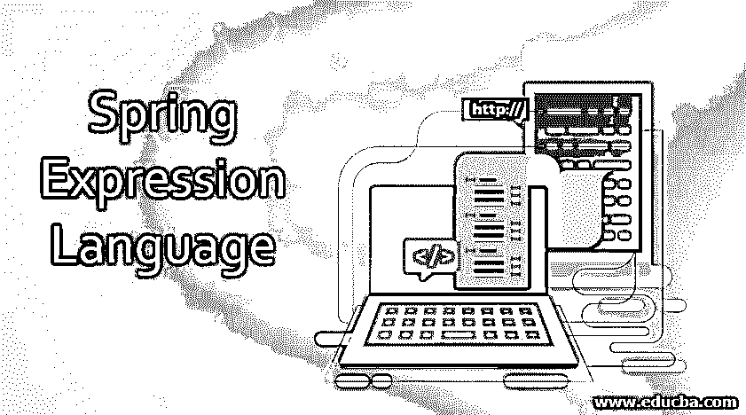
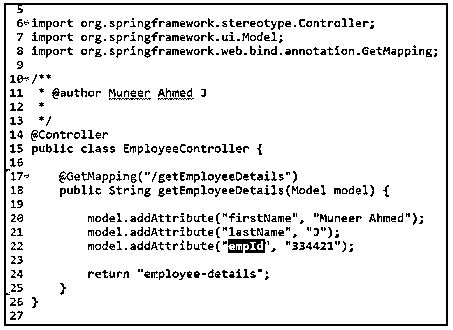
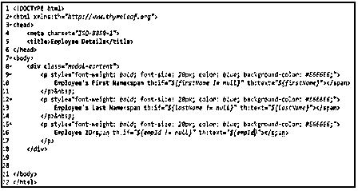
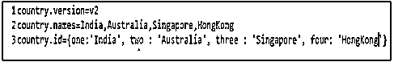
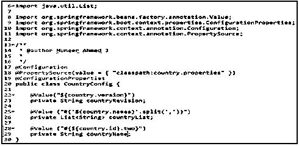
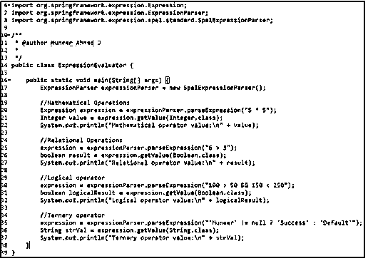

# Spring 表达式语言

> 原文：<https://www.educba.com/spring-expression-language/>

## Spring 表达式语言(SpEL)简介

Spring Expression Language，通常被称为 SpEL，是 Spring 核心模块下可用的模块之一。顾名思义，它是一种功能强大的表达式语言，主要用在 Spring Framework 中，用于计算数学、关系&逻辑运算、条件&正则表达式等表达式。，在运行时。

它可以通过 XML 配置以及基于注释的配置来使用。

<small>网页开发、编程语言、软件测试&其他</small>

值得注意的是，有许多表达式语言可用于 Java，如 JBoss EL(表达式语言)、OGNL(对象图导航语言)和 MVEL (MVFLEX 表达式语言)等。，Spring Expression Language 是为了满足 Spring 社区中的开发人员而创建的，可以很容易地与其他 Spring 产品结合使用，比如 Thymeleaf (Spring 的模板引擎)

SpEL 与 Spring 产品结合得很好，但是它与 Spring 的结合并不紧密，也就是说，它也可以独立使用。这可以通过利用表达式解析器库创建一些引导基础结构类来实现。

### 春天表达语言的需要

正如我们所看到的，Spring Expression Language (SpEL)在提供运行时修改对象值的支持方面非常强大。

虽然 SpEL 提供了对表达式求值的支持，但它在使用 JSP (Java Server Pages)或百里香模板引擎呈现视图层以及在 Spring Boot 框架中查询各种属性文件(如 application.properties)的值时提供了巨大的支持。

### Spring 表达式语言示例

让我们看一个使用百里香叶在视图层使用 SpEL 的实际例子。

**employee-details.html**

从上面的代码片段中，当请求/getEmployeeDetails 时，我们在模型对象中分配雇员详细信息的值&将 employee-details.html 返回给浏览器。

在 employee-details.html，通过使用 Spring Expression Language (SpEL ),我们正在执行雇员属性的空检查。因此，只有当属性不为空时，我们才允许浏览器呈现和打印值。

在第 10 行，th:if="${firstName！= null } "–这样，我们将对名字属性执行 null 检查。如果 firstName 属性不为 null，那么我们将使用 th:text="${firstName} "打印雇员名字的值。

**注**:此处 th:指百里香模板引擎。

让我们看看另一个在 Spring Boot 应用程序中使用 SpEL 查询和操作值的实时例子。

**country.properties**

从上面的代码片段中，我们可以看到，在 CountryConfig 类中，通过使用@Value 注释，我们从 country.properties 文件中获取属性值。

在第 25 行，@Value ("#{'${country.names} '。split('，')} ")我们可以看到，我们正在使用 SpEL 来查询 country.properties 中的值&根据逗号(，)对其进行分割，并将其分配给 countryList 变量。

国家/地区列表的输出:[印度、澳大利亚、新加坡、香港]

同样，在第 28 行，@Value ("#{${country.id})。two}”)，我们使用 SpEL 从 country.properties 文件中的 Map 查询值，并取出与键值匹配的值 two。

**国家名称的输出:**

**澳大利亚**

### Spring Expression 语言是如何工作的？

SpEL 作为一种表达式语言在运行时评估给定的表达式&这些结果被注入到浏览器中进行呈现或者注入到其他 beans 中。

在内部，SpEL 是 Spring 用来解析和评估给定表达式的类的集合。主要是，SpELExpressionParser 上的 parseExpression()方法接受输入表达式并返回一个 SpELExpression 对象。这个返回的对象最终用于通过调用 getValue()来计算表达式。

SpEL 为基于 XML 和注释的配置提供支持。在高级版本中，比如在 Spring Boot，@value 被用来计算表达式的值。

SpEL 中可用的一些接口和类是，

*   表达式(接口)
*   SpelExpression(类)
*   ExpressionParser(接口)
*   SpelExpressionParser(类)
*   评估上下文(接口)
*   StandardEvaluationContext(类)

### Spring 表达式语言的特点

用于评估表达式的功能，例如:

*   **数学运算:**SpEL 支持加、减、乘、除&模数等数学运算。

*   **关系运算:**等于(==)、不等于(！=)、大于(>)、大于或等于(> =)、小于(<)、小于或等于在 SpEL 中都支持。

*   **逻辑运算:**逻辑运算如 AND ( & &)，OR (||) & NOT(！)在 SpEL 中受支持。

*   **三元运算:**SpEL 中支持用于计算 if-else-then 条件的三元运算。

*   **正则表达式:**SpEL 支持正则表达式，用于检查给定的字符串是否匹配给定的正则表达式。

*   **文字表达式:**文字表达式，用于操作字符串操作，如 concat、trim 等。，由 SpEL 支持。

让我们看几个上述操作的实时例子。

**输出:**

| **Mathematical operator value**: 25**关系运算符值**:真**逻辑运算符值**:真**三元运算符值**:成功 |

从代码片段中，我们可以看出，通过实例化 SpELExpressionParser，SpEL 可用于计算表达式，并为数学、逻辑、关系和三元运算提供结果。

### Spring 表达式语言的优势

一些优点如下。

*   SpEL 支持在运行时查询和操作对象值。
*   SpEL 既支持 XML 配置，也支持基于注释的配置
*   SpEL 在视图层提供了强大的支持，比如 Thymeleaf (Spring 的模板引擎)和 JSP，用于评估和操作要在浏览器中呈现的对象和值。
*   使用 SpEL，我们可以执行各种操作，如数学、逻辑、关系、条件和三元运算，以及执行文字和正则表达式。
*   虽然它是 Spring Core 中的一个模块，但它并不与 Spring 绑定在一起。SpEL 也可以通过使用引导基础设施类(如 Parser)来独立使用。
*   视图层中使用的语法非常简单&易于开发人员掌握。

### 结论

从这篇文章中，我们已经介绍了 Spring 表达式语言的基础知识，并用实时例子证明了视图和服务层对 Spring 表达式语言的需求。此外，我们还通过实时示例和代码片段了解了 SpEL 的工作原理及其 API、SpEL 的核心特性和优势。

### 推荐文章

这是一个 Spring 表达式语言的指南。在这里，我们讨论 Spring 表达式语言的基础知识和例子。您也可以看看以下文章，了解更多信息–

1.  [Spring Boot 建筑](https://www.educba.com/spring-boot-architecture/)
2.  [春天的建筑](https://www.educba.com/spring-architecture/)
3.  [什么是 Spring 框架？](https://www.educba.com/what-is-spring-framework/)
4.  [春云组件](https://www.educba.com/spring-cloud-components/)

