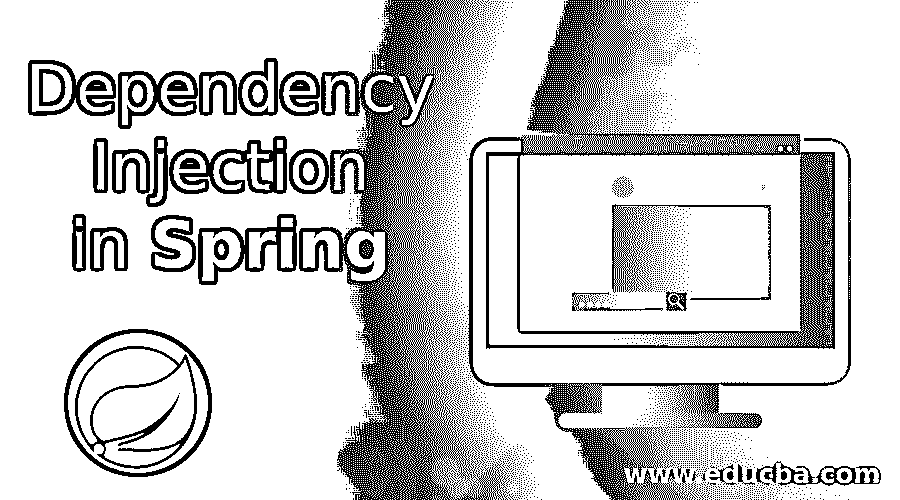
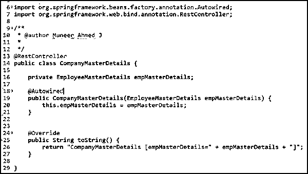
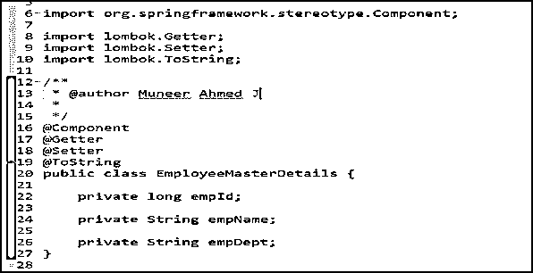
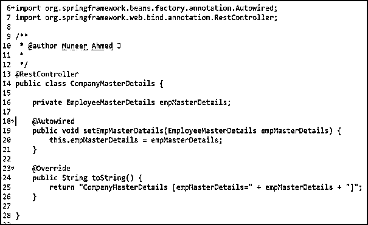
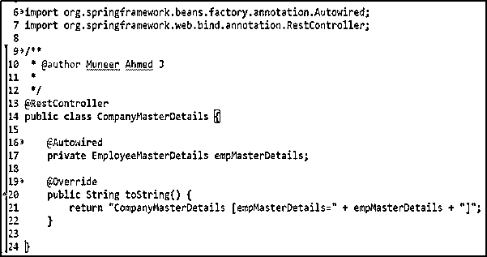

# Spring 中的依赖注入

> 原文：<https://www.educba.com/dependency-injection-in-spring/>

## Spring 中的依赖注入介绍

依赖注入(DI)是一种实现控制反转的设计模式，用于在运行时解决依赖关系，即，将依赖对象注入到依赖对象以在运行时使用它。Spring 框架中最重要的[模块是核心容器&依赖注入(DI)作为 Spring 核心容器的心脏。](https://www.educba.com/what-is-spring-framework/)

按照传统的方式，开发人员将控制创建对象的代码&在运行时注入它们。在这里，Spring 框架在运行时控制执行上述活动，这就是为什么这个术语被称为“控制反转”(IoC)，即控制被反转！

<small>网页开发、编程语言、软件测试&其他</small>

### 如何在 Spring 中执行依赖注入？

在我们研究执行依赖注入的方法之前，了解不同类型的依赖注入配置是很重要的。依赖注入配置有两种不同的方式。

*   基于 XML 的配置
*   基于 Java 注释的配置

在本文中，我们将关注基于 Java 注释的配置，这是最先进的、易于实现的，并且在软件行业中广泛使用。此外，在深入实现依赖注入之前，了解下面的定义是很重要的。

*   豆子
*   自动布线

在 Spring 术语中，充当应用程序主干并由 IoC 容器管理(即实例化、配置和组装)的对象被称为 Beans。

Spring Framework 帮助我们提供了一种方法，通过读取 XML 配置文件或者在启动应用程序时扫描 Java 注释来检测 beans 之间的关系。这项任务由 IoC 容器 Bean 工厂承担，它将创建对象并连接依赖项。因为 Spring Framework 会自动完成这个过程，所以它被称为 Autowiring，即自动连接！

使用 Java 注释配置，beans 通过使用 **@** 自动连接注释进行连接。

### 依赖注入的不同方式

根据 Java 注释配置，可以通过三种不同的方式执行依赖注入。它们如下。

*   基于构造函数的依赖注入
*   基于 Setter 的依赖注入
*   基于字段或属性的依赖注入

让我们用实时示例和代码片段逐一详细查看。

#### 1.基于构造函数的依赖注入

当注释 **@** Autowired 被用在类构造函数之上时，它被称为基于构造函数的依赖注入。让我们通过一个实时例子来见证基于构造函数的依赖注入的用法。

**POJO 类:** EmployeeMasterDetails 类

**控制器:** CompanyMasterDetails 类

EmployeeMasterDetails 类已经使用@Component 创建为一个组件(第 16 行)。Spring 将在应用程序初始化/启动期间自动识别这一点，并将使用 EmployeeMasterDetails 类的 bean Factory 创建一个 Bean 对象。

在此之后，当 Spring 检测到 EmployeeMasterDetails bean 对象已经自动连接(使用@Autowired)到 CompanyMasterDetails 类构造函数(第 18 行)时，为 EmployeeMasterDetails 创建的 bean 对象将通过构造函数注入 CompanyMasterDetails 类。

这样，Spring 框架将自动执行依赖注入。因此，如果您注意到这里，开发人员没有通过使用 CompanyMasterDetails 类中的“new”关键字创建对象，从而消除了 CompanyMasterDetails 类和 EmployeeMasterDetails 对象之间的紧密耦合。

#### 2.基于 Setter 的依赖注入

当注释 **@** Autowired 被用在类的 setter 方法之上时，它被称为基于 Setter 的依赖注入。让我们通过一个实时例子来见证基于 Setter 的依赖注入的使用。

**POJO 类:** EmployeeMasterDetails 类

**控制器:** CompanyMasterDetails 类

类似于基于构造函数的依赖注入，这里自动连接通过第 18 行的 setter 方法进行。为 EmployeeMasterDetails 类创建的 bean 对象将通过 CompanyMasterDetails 类中的 setter 方法自动连接和注入。

#### 3.基于字段或属性的依赖注入

当注释@Autowired 用于类中的字段或属性之上时，它被称为基于字段的依赖注入。让我们通过一个实时例子来见证基于字段的依赖注入的使用。

**POJO 类:** EmployeeMasterDetails 类

**控制器:** CompanyMasterDetails 类

类似于基于构造函数的依赖注入，这里自动连接通过第 16 行的字段**'**empMasterDetails**'**进行。为 EmployeeMasterDetails 类创建的 bean 对象将通过 CompanyMasterDetails 类中的字段“empMasterDetails”自动连接&注入。

**回落或错误处理案例**

假设有不止一个相同类型的 bean，Spring 框架在注入适当的依赖项时会感到困惑。此时，我们将遇到 nouniquebeandidefinitionexception。

这应该通过使用@Primary 或@Qualifier 注释以及@Autowired 注释来处理。

*   **@主标注:**优先考虑同类型的其他 beans。
*   **@Qualifier 注释:**通过提供唯一的限定符名称来区分其他 beans。

### 依赖注入的优势

一些优点如下。

*   依赖注入主要通过消除类及其依赖项之间的紧密耦合/依赖来帮助实现松散耦合的体系结构。
*   由于对象之间的依赖是松散耦合的，所以通过注入依赖的模拟对象(例如，利用 Spring Mockito)来帮助开发人员测试模块。
*   依赖注入移除了类之间不必要的依赖。
*   由于模块是相互独立的&可以被注入，使得组件可重用的范围非常大。
*   系统的维护变得容易。

### 依赖注入的缺点

一些缺点如下。

*   依赖注入使得跟踪代码变得困难，因为开发人员需要引用更多的文件(比如 XML 配置)来理解系统的行为。
*   由于 Spring 框架负责控件而不是开发人员，开发人员很难理解后台的工作方式&也很难进行定制。
*   由于依赖注入允许松散耦合，它最终增加了接口和类的数量。

### 结论

因此，简而言之，依赖注入帮助开发人员实现类之间的松散耦合。从这篇文章中，我们已经深入讨论了依赖注入，它的优点和缺点，以及用实时例子和代码片段执行依赖注入的不同方法。

### 推荐文章

这是 Spring 中依赖注入的指南。在这里，我们讨论介绍，如何在 spring 中执行依赖注入以及优缺点。您也可以浏览我们推荐的其他文章，了解更多信息——

1.  [Spring Boot 版本](https://www.educba.com/spring-boot-versions/)
2.  [Spring Boot 申请](https://www.educba.com/spring-boot-application/)
3.  [春云组件](https://www.educba.com/spring-cloud-components/)
4.  [春天的建筑](https://www.educba.com/spring-architecture/)

