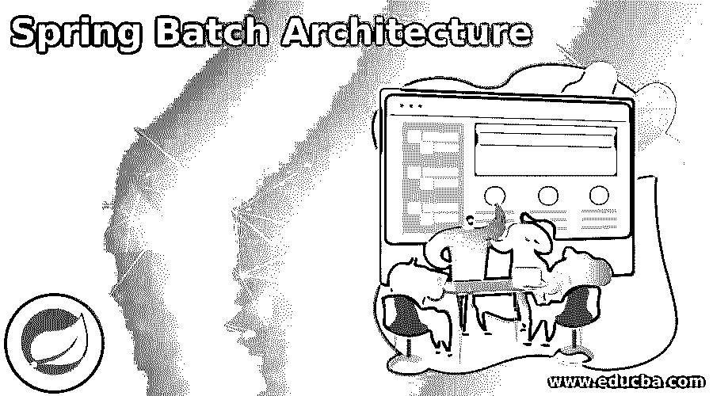
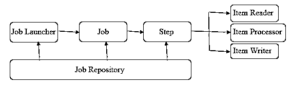
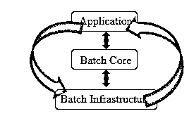

# Spring 批处理架构

> 原文：<https://www.educba.com/spring-batch-architecture/>

## Spring 批处理架构的定义

Spring 批处理架构被定义为一组方法和/或规则，这些方法和/或规则定义了计算机系统将如何运行、组织和/或实现，以便在 Spring 应用框架上完成处理批处理的特定任务。并且在定义架构时，对功能和建模进行了描述，以使用户理解其可用性。在当前世界中，企业需要应用程序包含批量处理的能力，以便在关键时间内完成业务操作，这就是 Spring Batch 中的处理发挥作用的地方。这是一个轻量级的综合框架，允许应用程序为企业进行批处理。该架构构建在 Spring 框架上，包括基于 POJO 的应用程序开发方法，易于使用，提高了生产率，因此将相同的好处扩展到了 spring batch 中。

### Spring 批处理架构

了解一下 Spring Batch 架构的历史。随着基于 API 的框架的出现，构建基于 web 和/或微服务的框架的企业越来越受欢迎。由于同样的原因，在开发基于 Java 的应用程序的处理需求方面存在明显的不足。因此，开发了许多内部解决方案。那时，SpringSource 和 Accenture 合作制定了 Spring Batch 架构，该架构不仅研究了前面讨论的缺点，还研究了软件、框架和工具中的标准化处理方法，以便企业可以利用这些来创建支持批处理的应用程序。

<small>网页开发、编程语言、软件测试&其他</small>

至此，我们来到了 Spring 批处理的使用场景，它们是:

●用于从数据库、文件或队列中读取数据。
●根据要求进行数据处理，以便最终结果是易于理解的格式。
●架构的能力还在于确保应用程序能够在处理后按照修改后的形式写回数据。

现在，在我们进入架构层次之前，让我们先理解 Spring 批处理的组件。示意图如下:

现在让我们分别理解这些组件中的每一个，因为这些组件落入 Spring Batch 架构的有限块中以最终完成循环。

**作业存储库:**这就像是一个元素的存储库，这些元素被发送到作业启动器、作业和步骤实施，以执行创建、接收、更新、删除(缩写为 CRUD)。作业存储库的声明在 XML 文件中完成。XML 还提供了一些额外的选项(除了 id 之外都是可选的)，这样用户就可以根据应用程序的需要修改参数和创建存储库。如果应用程序不需要持久化 Spring 批处理的域对象，那么可以配置 in0 内存版本。

**作业启动器:**根据作业存储库给定的运行作业的参数集，作业启动器负责启动 Spring 作业。这是通过 JobLauncher 接口的实现实现的。作业启动器管理按时间顺序排列的下两个元素的状态，即作业和步骤。它在 XML 中也被称为:

`<bean id = "jobLauncher">
</bean>`

**Job:** 这是最重要的元素，也是整个 Spring Batch 架构的中心焦点。一个执行单元中的一系列步骤，在应用程序中被发送去执行。它是由企业执行的批处理过程。为了成功地执行作业，它需要从头到尾没有任何中断或错误地运行。它在 XML 中被引用为:

`<job id = " Job_ID">
…
</job>`

在标记中，我们定义了相应的步骤和定义，以便成功地运行作业。广泛使用的一个非常重要的组件是可重启组件，当希望应用程序在人工干预下不重启时，该组件为假；当应用程序需要重启时，该组件为真。

**步骤:**这是一个任务中的独立部分，包含要执行的各个命令并共享结果。在一个作业中，有“N”个步骤，每个步骤在 XML 中都与另一个步骤相连接，从而定义了整个执行过程。步骤的示例如下:

`<job id = "Job_ID">
<step id = "stepA" next = "stepB"/>
<step id = "stepB"/>
</job>`

为了成功完成作业，每个作业由多个项目读取器、项目处理器和项目写入器组件组成。

*   物品阅读器:物品阅读器的任务是从特定的来源读取数据，并使数据对物品处理者可用。
*   物品处理器:物品处理器的任务是处理来自物品阅读器的准备好的数据。这包含处理代码，支持数据处理。
*   项目写入器:在项目被读取和处理之后，数据的修改版本需要被写回到特定的目的地，这是由项目写入器实现的。

将这些元素放在一起，Spring Batch 架构就构建好了，主要包含 3 个组件。

该应用程序由与作业相关的所有组件和为了在 Spring Batch Framework 中执行代码而编写的代码组成。批处理核心包含存储 API 元素的类，以便在需要控制或启动批处理作业时可以使用它们。最后但并非最不重要的是批处理基础结构，它包含负责使用处理所需的代码进行读取、写入和处理的组件。

### 结论

在本文中，我们试图理解各个组件，以及它们如何堆叠在一起，从而拥有我们今天所知的 Spring Batch 架构，这种架构在批处理类型的许多场景中使用。

### 推荐文章

这是 Spring 批处理架构的指南。这里我们讨论定义、例子和代码实现。您也可以看看以下文章，了解更多信息–

1.  [Spring Boot RestTemplate](https://www.educba.com/spring-boot-resttemplate/)
2.  [Spring Boot 2](https://www.educba.com/spring-boot-oauth2/)
3.  Spring Boot·HTTPS
4.  [Spring Boot 换港](https://www.educba.com/spring-boot-change-port/)

