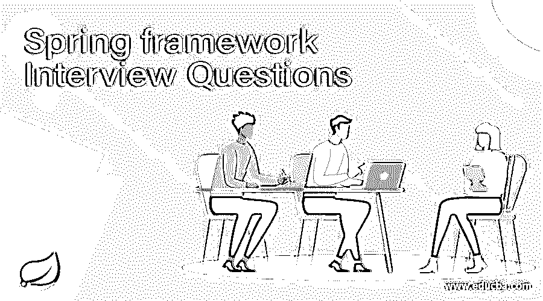

# 春季框架面试问题

> 原文：<https://www.educba.com/spring-framework-interview-questions/>

## Spring 框架面试问答介绍

Spring 框架是应用最广泛的 Java 框架之一。Spring 框架核心思想是“依赖注入”和“面向方面编程”。在传统的 [java 应用](https://www.educba.com/applications-of-java/)中经常使用 Spring 框架，另外通过实现依赖注入来获得完全不同的元素之间的松散耦合，我们将执行跨领域的任务，比如工作和使用 spring 支持面向方面的编程。因为它是一个开源框架，拥有大量在线资源和活跃的社区成员，这使得它既简单又有趣。

现在，如果你要找一份和 Spring 框架相关的工作，那么你需要准备 2022 年的 Spring 框架面试问题。的确，每个面试都会因职位不同而有所不同，但是，为了顺利通过面试，您需要对 Spring Framework 有一个清晰的了解。在这里，我们准备了重要的 Spring 框架面试问题和答案，将帮助你在面试中取得成功。

<small>网页开发、编程语言、软件测试&其他</small>

下面是 2022 春季框架面试问答综合列表。这份问题清单分为以下两部分:

*   [第一部分 Spring 框架面试问题(基础)](#1)
*   [第二部分 Spring 框架面试问题(高级)](#2)

### 第 1 部分 Spring 框架面试问题(基础)

第一部分涵盖了基本的 Spring 框架面试问题和答案

#### Q1。Spring 框架有哪些重要的特性和优势？

**回答:**
Spring 框架是建立在两种风格思想之上的——依赖注入和面向方面编程。
使用 Spring 框架的一些好处是:

*   减少设备完全不同的元素之间的直接依赖，通常 Spring IoC 工具负责初始化资源或 beans，并将它们作为依赖注入。
*   在 Spring 框架中编写单元用例很简单；因此，我们的业务逻辑并不直接依赖于实际的资源实现类别。我们能够简单地编写看看配置，并注入我们的模拟 beans 来测试功能。
*   减少样板代码的数量，如初始化对象，打开/关闭资源。我喜欢 JdbcTemplate 类别堆，因为它可以帮助我们去除 JDBC 编程中的所有繁琐代码。
*   Spring 框架被拆分成许多模块；这有助于我们保持应用程序的轻量级。
*   Spring framework 支持大多数 Java EE 选项，甚至更多。它一直处于新技术的前沿。举个例子，有一个针对 Android 的 Spring 项目可以帮助我们为原生 Android 应用编写更高级的代码。这使得 spring 框架成为了一个完整的包，我们不必被迫为各种各样的需求去照顾一个完全不同的框架。

#### Q2。你所理解的依赖注入是什么？

**答:**
依赖注入模式允许我们摆脱硬编码的依赖，创建松耦合、可扩展和可修复的应用程序。我们能够实现依赖注入模式，将依赖解析从编译时转移到运行时。使用依赖注入的一些优点是问题分离、样板代码减少、可配置元素和简单的单元测试。

让我们转到下一个春季框架面试问题。

#### Q3。使用 Spring 工具套件有什么好处？

**回答:**
我们可以在 Eclipse 中安装插件来使用 Spring 工具套件的所有选项。它带有必要的东西，如熟练的支持；制作不同类型 Spring 的模板为 Spring 应用程序带来了更高的性能。
我喜欢 STS，因为它突出了 Spring 元素，如果你使用 AOP 切入点和 advice，那么它清楚地表明了方法可以在精确的切入点之下返回。因此，我喜欢用 STS 开发基于 Spring 的应用程序，而不是把所有东西都放在我们自己的系统中。

#### Q4。列举一些重要的 Spring 模块？

**答案:**
这是面试中常见的 Spring framework 面试问题。一些必要的 Spring 框架模块是:

*   spring Context——用于依赖注入。
*   spring AOP——面向方面编程。
*   Spring DAO 用于使用 DAO 模式的信息操作
*   spring JDBC——用于 JDBC 和数据源支持。
*   spring ORM——支持像 Hibernate 这样的 ORM 工具
*   Spring net 模块-用于制作网络应用程序。
*   spring MVC——模型-视图-控制器实现，用于制作网络应用程序、网络服务等。

#### Q5。AOP 中的方面、建议、切入点、连接点和建议参数是什么？

**答案:**

*   **Aspect** : Aspect 是一个实现跨领域问题的类别，就像组动作管理一样。方面通常是在 Spring Bean 配置文件中组织的标准类别，或者我们能够使用 Spring AspectJ 支持，通过@Aspect 注释将类别声明为方面。
*   **建议**:建议是采取行动是为了某个特定目的的一部分。从编程的角度来说，一旦在应用程序中达到了某个特定的目的的一部分，这些方法就会失效。
*   **切入点**:切入点是正则表达式，它与作为点的一部分相匹配，以确定一个推荐是否必须是死的。切入点使用完全不同形式的表达式来匹配 be a part of points。Spring framework 使用 AspectJ 切入点表达式语言，无论在哪里应用推荐方法，它都是要点的一部分。
*   **连接点:** A be 目的的一部分是应用程序的特定目的，如技术执行、异常处理、不断变化的对象变量值等。在 Spring AOP 中，成为点的一部分通常是一项技术的执行。
*   **建议参数:**我们能够在推荐方式中传递参数。我们能够在切入点中使用 args()表达式来应用于任何匹配参数模式的技术。如果我们倾向于使用这个，那么我们希望在设置了参数种类的推荐技术中使用常量名称。

### 第 2 部分 Spring 框架面试问题(高级)

现在让我们来看看高级 Spring 框架面试问题。

#### Q6。Spring AOP 和 AspectJ AOP 有什么区别？

**答:**
AspectJ 是面向方面编程的行业标准实现，而 Spring 只在少数情况下实现 AOP。Spring AOP 和 AspectJ 之间的主要差异是:

*   Spring AOP 比 AspectJ 更容易使用，因为我们不必担心编织方法。
*   Spring AOP 支持 AspectJ 注释；因此，如果你精通 AspectJ，那么操作 Spring AOP 就不那么复杂了。
*   Spring AOP 只支持基于代理的 AOP；因此，它通常只适用于技术执行，是分的一部分。AspectJ 支持所有类型的切入点。
*   Spring AOP 的一个缺陷是，它通常只应用于通过 Spring Context 创建的 beans。

#### Q7。什么是春豆？

**答案:**
任何被 Spring IoC 初始化的传统 java 类都被命名为 Spring Bean。我们倾向于使用 Spring ApplicationContext 来推动 Spring Bean 实例。
Spring IoC 管理 Spring bean 的生命周期、Bean 作用域以及在 Bean 中注入任何需要的依赖项。

让我们转到下一个春季框架面试问题。

#### Q8。春豆有哪些不同的范围？

**答案:**
春豆大概有 5 个范围。

1.  **singleton** :只为每个工具创建一个 bean 实例。这可以是 spring beans 的默认范围。而使用这个作用域，确保 spring bean 没有共享的实例变量，否则，由于它不是线程安全的，会导致信息不一致的问题。
2.  **prototype** :每次请求 bean 时都会创建一个替换实例。
3.  **request** :这可以和范型作用域相同，但是它意味着用于网络应用程序。为每个 HTTP 请求创建一个替换的 bean 实例。
4.  **会话**:工具为每个 HTTP 会话创建一个替换 bean。
5.  **国际-会话:**这可以习惯为 Portlet 应用产生全局会话 beans。

Spring 框架是可扩展的，我们也将产生我们自己的作用域，但是大多数时候，我们倾向于使用框架提供的作用域。

要设置 Spring bean 作用域，我们可以在 bean 部件中使用“scope”属性，或者使用@Scope 注释进行基于注释的 mostly 配置。

要设置 Spring bean 作用域，我们可以在 bean 元素中使用“scope”属性，或者在基于注释的配置中使用@Scope 注释。

#### Q9。春豆的生命周期是怎样的？

**答案:**
这是面试中经常被问到的春季框架面试问题。Spring Beans 由 Spring 工具初始化，每个依赖项都被注入。一旦上下文被销毁，它还会销毁所有已初始化的 beans。这在大多数情况下工作良好；然而，通常情况下，我们希望在创建可以使用的 beans 之前初始化替代资源或进行一些验证。Spring 框架在 spring beans 中提供了对后初始化和预销毁方式的支持。
我们可以通过两种方式做到这一点——通过实现 InitializingBean 和 DisposableBean 接口，或者在 spring bean 配置中使用 init-method 和 destroy-method 属性。

#### Q10。Spring Bean 提供线程安全吗？

**答案:**
春豆默认范围是单例；因此，每个上下文只有一个实例。这意味着每一个线程都会更新的类别级变量都会导致信息不一致。因此在默认模式下，spring beans 似乎不是线程安全的。
然而，我们能够将 spring bean 的作用域修改为 request、paradigm 或 session，从而以性能为代价实现线程安全。这是一个设计决策，支持项目的必要性。

### 推荐文章

这是一个 Spring 框架面试问答列表的指南。这里我们列出了 10 个最佳面试问题，这样求职者就可以轻松地通过面试。您也可以阅读以下文章，了解更多信息——

1.  [Spring Boot 面试问题](https://www.educba.com/spring-boot-interview-questions/)
2.  [J2EE 面试问题](https://www.educba.com/j2ee-interview-questions/)
3.  [PHP OOP 面试问题](https://www.educba.com/php-oop-interview-questions/)
4.  [弹簧 vs 支柱:特点](https://www.educba.com/spring-vs-struts/)

