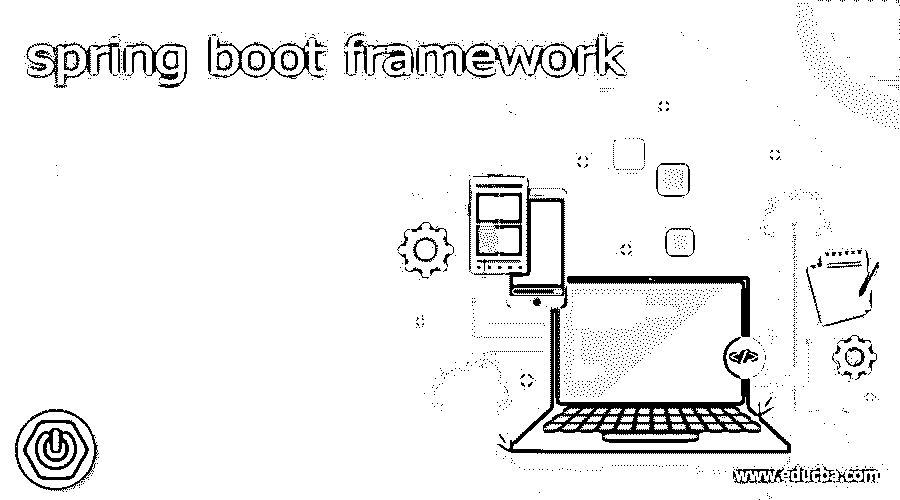
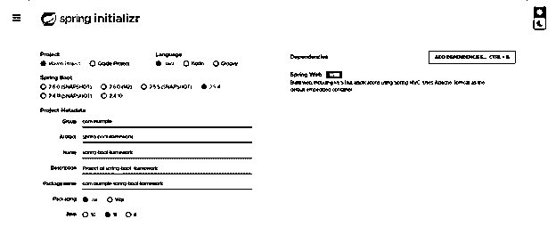
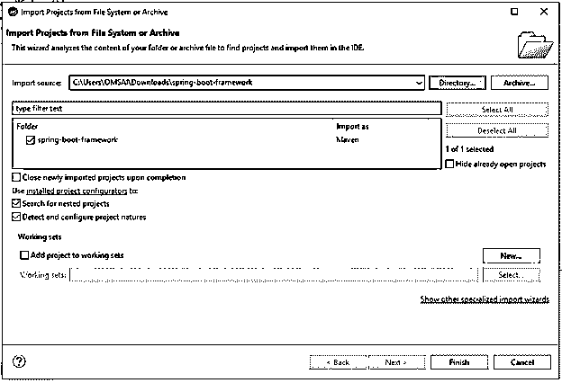
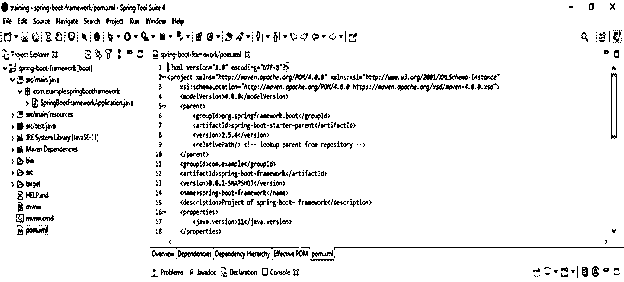
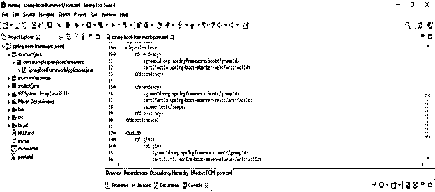
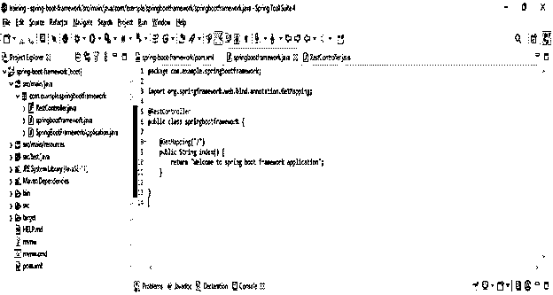
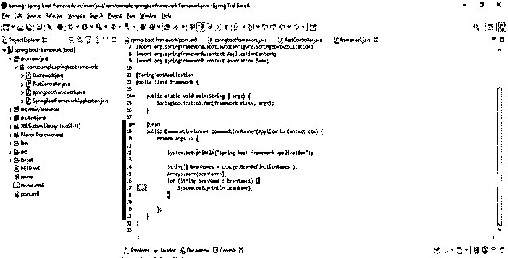
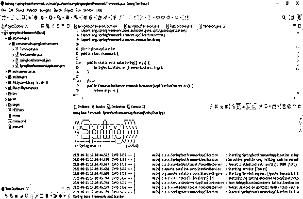

# 弹簧靴框架

> 原文：<https://www.educba.com/spring-boot-framework/>

## spring boot 框架的定义

Spring boot 框架是一种用于创建微服务的开源技术，该框架用于创建独立的生产应用程序。该框架为 java 开发人员开发基于 web 的独立应用程序提供了一个非常好的平台，该框架易于理解，我们可以轻松地开发应用程序。使用框架，我们可以提高代码的生产率，同时减少开发时间。所有框架应用程序都需要最低配置来实现应用程序。

### 什么是 spring boot 框架？

*   Spring boot 是一家 pivotal 公司维护的开源框架。使用该框架，可以自动配置基于生产的应用程序。
*   我们不需要使用框架手动配置应用程序的依赖性。
*   java 中的 Spring boot framework 提供了一种更快、更简单的方式来设置和配置基于 web 的独立应用程序。
*   它就是 spring boot 模块，提供了 spring 框架的快速应用开发(RAD)特性。
*   为了使用框架创建应用程序，我们可以使用 spring 工具套件(STS)、Eclipse IDE 或 java 中的 spring analyzer。
*   该框架为 java 开发人员开发独立或基于网络的应用程序提供了一个完美的平台。
*   该框架自动配置我们的应用程序的依赖性，因此它将使用软件范例的配置来减少开发人员的开销。
*   在框架中，使用注释名 EnableAutoConfiguration 添加自动依赖。
*   sprint boot 框架在内存中自动配置数据库连接。假设我们在数据库类路径中引用 PostgreSQL 数据库。尽管如此，我们还没有配置数据库连接；框架将自动配置数据库连接。
*   使用框架事务管理很容易；我们可以快速开发事务管理。
*   使用框架，很容易将我们的应用程序集成到其他框架中，如 java 或其他语言。
*   与其他框架相比，成本和时间管理框架是有益的，因为它将自动解决应用程序代码的依赖性。
*   使用该框架，我们可以实现简单而强大的 java 应用批处理。
*   使用该框架，我们可以轻松访问 SQL 和 NoSQL 数据库中的数据。
*   框架也为我们的应用提供了强大的安全性。通过使用框架，我们可以快速地为我们的应用程序提供完全的安全性。

使用 spring initializer 创建一个项目模板，并给项目元数据命名如下。

<small>网页开发、编程语言、软件测试&其他</small>

`Group – com.example
Artifact name – spring-boot-framework
Name – spring-boot- framework
Description - Project of spring-boot- framework
Package name - com.example.spring-boot- framework
Packaging – Jar
Java – 11
Dependencies – spring web.`

*   **生成项目后，提取文件，使用 spring 工具套件打开该项目—**

*   **使用 spring 工具套件打开项目后，检查项目及其文件—**

**弹簧靴框架示例**

下面的例子和步骤显示框架如下。

*   **添加依赖关系—**

**代码—**

`<dependency>   -- Start of dependency tag.
<groupId>org.springframework.boot</groupId>   -- Start and end of groupId tag.
<artifactId>spring-boot-starter-web</artifactId>  -- Start and end of artifactId tag.
</dependency>    -- End of dependency tag.`

*   **为应用程序创建 web 控制器—**

**代码—**

`@RestController
public class springbootframework
{
@GetMapping ("/")
public String index() {
}
}`

*   **创建应用程序类—**

**代码—**

`@SpringBootApplication
public class framework {
public static void main /* main method */ (String[] args) {
SpringApplication.run (framework.class, args);
}
@Bean  -- Bean annotation
public CommandLineRunner commandLineRunner(ApplicationContext ctx) {
return args -> {
System.out.println ("Spring boot framework application");
String[] beanNames = ctx.getBeanDefinitionNames();
Arrays.sort (beanNames);
for (String beanName : beanNames) {
System.out.println (beanName);
}
}; }  }`

*   **运行应用程序—**

### 结论

Spring boot 框架用于在 java 中创建微服务应用。使用该框架，我们正在创建独立的和基于网络的应用程序。我们不需要使用框架手动配置应用程序的依赖性。该框架对于开发基于 web 的应用程序至关重要。

### 推荐文章

这是一个关于 spring boot 框架的指南。这里我们讨论一下为什么 Spring boot 框架如此受欢迎，以及如何使用该框架。您也可以看看以下文章，了解更多信息–

1.  Spring Boot 赛道
2.  Spring Boot·HTTPS
3.  [Spring Boot JPA](https://www.educba.com/spring-boot-jpa/)
4.  [Spring Boot 微服务](https://www.educba.com/spring-boot-microservices/)

