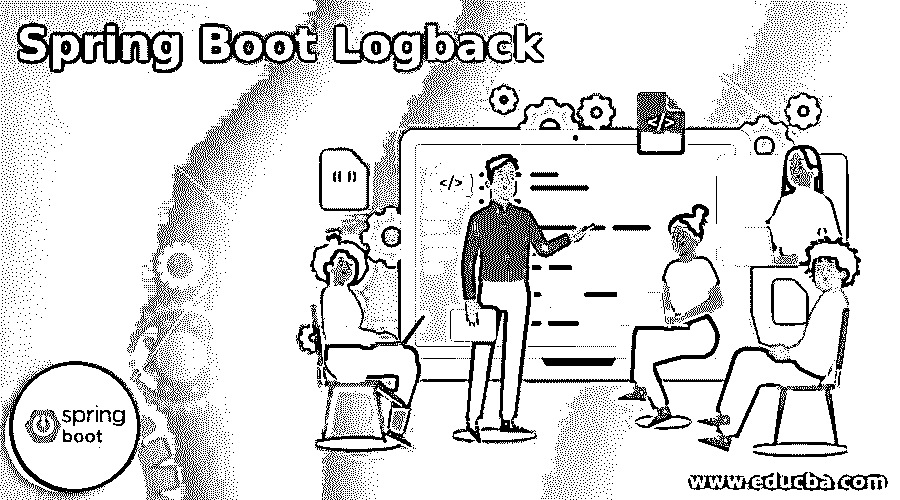
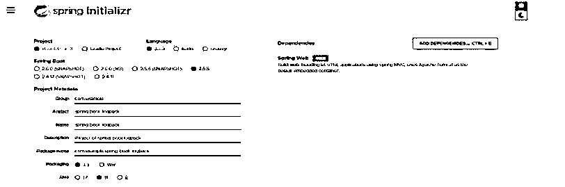
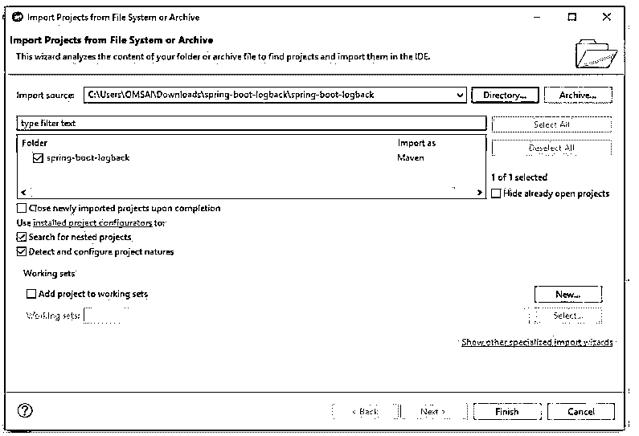
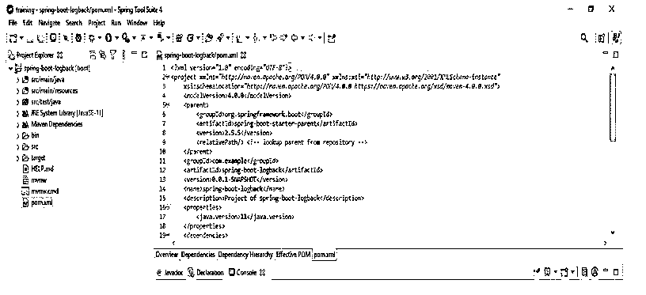
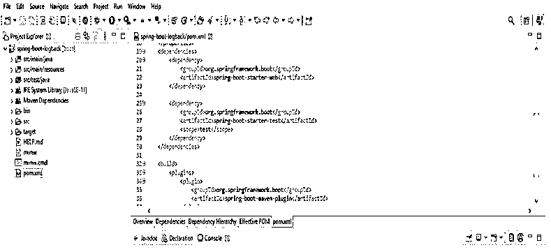
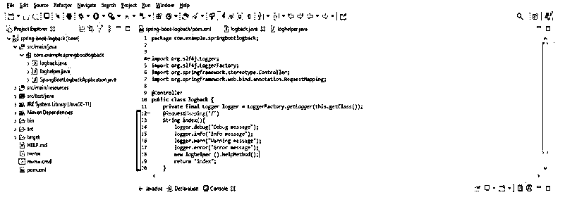
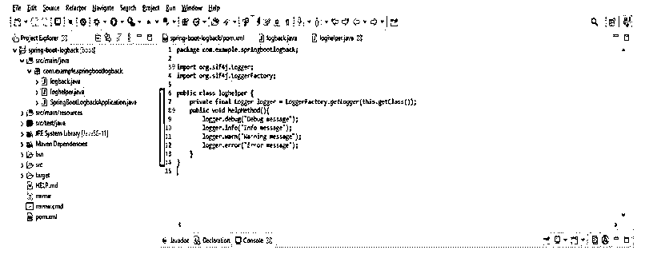
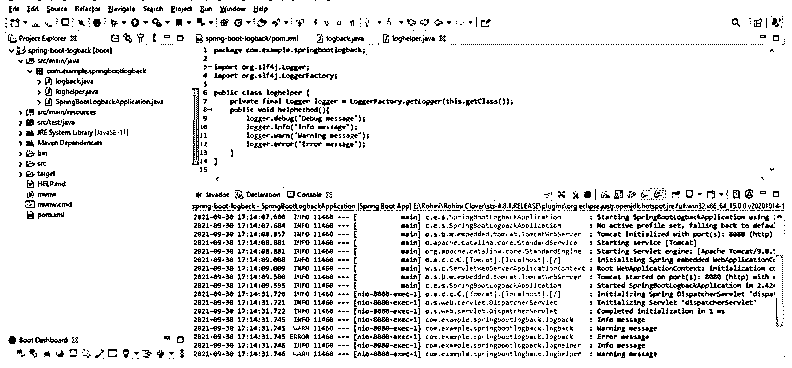

# Spring Boot 后勤基地

> 原文：<https://www.educba.com/spring-boot-logback/>

## Spring Boot 后勤基地简介

Spring boot logback 是 Spring boot 提供的功能；当使用 spring boot starter 依赖项时，它将自动包括 spring boot starter 日志记录，提供没有任何配置的登录。它有两种方式给出配置；如果我们只需要简单的修改，可以在 application.properties 文件中添加相同的内容。为了提供配置，spring boot 还使用 groovy 或 XML 来指定我们的设置。为了在我们的项目中开发 logback，我们必须使用 spring boot starter 日志记录和 starter 依赖。

### 什么是 Spring Boot 回馈？

Logback 是用于 java 应用程序的日志框架。 我们可以将回退项目分为以下三个模块:

<small>网页开发、编程语言、软件测试&其他</small>

*   Logback Classic
*   回退访问
*   日志备份核心

使用经典模型，我们可以轻松地在 log back 和其他框架(如 java.util 或 log4j)之间来回切换。回溯访问模型与 servlet 容器集成在一起，比如 jetty 或 tomcat。使用 servlet 容器，我们可以提供 http 访问的日志功能。回溯核心模型包含日志功能。本模块用于为另外两个模块做基础工作。

Spring boot logback 架构有如下三类:

*   追加器
*   布局
*   记录器

Logback appender 类用于将日志消息放入最终目的地。一个记录器在 spring boot log back 中有多个 appender。Logger 类用于记录上下文消息。该类用于在应用程序交互后创建日志消息。布局类正在准备输出消息。它还支持自定义类创建和消息格式化，并将支持现有应用程序的健壮配置。Logback 在 spring boot 中提供了非常好的功能。使用 spring boot starter 依赖项时，logback 会自动包含 spring boot 日志记录依赖项。有两种方法可以在 logback 应用程序中提供我们的配置。假设我们在项目中需要简单的修改，那么我们在 application.properties 文件中提供配置。假设我们的项目需要复杂的变更；然后我们提供 groovy 或 XML 格式的配置。与 log4j 相比，它的执行速度更快。它还将支持存档和压缩文件。

### 为什么要 Logback？

*   它是 log4j 的继任者；这是一个非常重要和流行的 java 日志框架。
*   与 log4j 相比，logback 有更多的改进，比如更小的内存占用和更快的性能。
*   它实现了 SLF4J，允许开发者从另一个日志框架中移植它。
*   Logback 是 spring boot 中使用的默认日志框架。
*   Logback 拥有 slf4j 的原生支持。Logback 还包含条件处理的已定义配置。
*   它包含高级过滤功能。它还将支持最大存档文件数。
*   支持 http 访问的日志记录。要使用 logback，我们需要在类路径中包含 spring-jcl。
*   我们可以在项目中通过定义启动日志依赖来实现日志回溯。
*   为了使用 logback 实现 web 应用程序，我们只需要 starter web dependency，这取决于日志启动器。
*   在使用 maven 项目时，我们的项目会自动添加 starter web 依赖。在使用 maven 项目时，我们不需要再次添加。

### 使用 Spring Boot 回退

对于基于 web 的应用程序和企业应用程序来说，Logback 是一个非常好的框架。它包含简单而强大的配置选项，并且占地面积小。要在项目中实现 logback，首先，我们需要实现记录器。此外，我们需要使用控制器创建一个日志记录器，我们正在将它添加到索引控制器中。在创建日志记录器之后，下一步是将日志记录助手类添加到我们的项目中。该类用于发出日志记录语句。

我们需要以下软件来开发一个使用 logback 的应用程序，如下所示:

*   JDK 1.8 或更高版本
*   胃 3.2 +
*   弹簧靴 2.4 或更高版本
*   Spring 工具套件或 eclipse

我们还可以通过配置应用程序属性文件来配置项目中的回退。

### Spring Boot 回退的例子

以下示例显示了如下逐步实施回退:

1。使用 spring 初始化器创建一个项目模板，并为项目元数据指定以下名称。

在下面的步骤中，我们将提供项目组名为 com。例如，工件名称为 spring-boot- logback，项目名称为 spring-boot-logback，包为 jar 文件，java 版本为 11。

**代码:**

`Group – com.example
Artifact name – spring-boot- logback
Name – spring-boot- logback
Description - Project of spring-boot-logback
Package name - com.example.spring-boot- logback
Packaging – Jar
Java – 11
Dependencies – spring web.`

**输出:**

2.生成项目后，提取文件并使用 spring 工具套件打开该项目。

3.使用 spring 工具套件打开项目后，检查项目及其文件。

4.添加依赖项。

**代码:**

`<dependency> -- Start of dependency tag.
<groupId>org.springframework.boot</groupId> -- Start and end of groupId tag.
<artifactId>spring-boot-starter-web</artifactId> -- Start and end of artifactId tag.
</dependency> -- End of dependency tag.`

5.创建记录器类。

**代码:**

`public class logback {
@RequestMapping ("/")
String index (){
logger.debug("Debug message");
logger.info("Info message");
logger.warn("Warning message");
logger.error(Error message");
new loghelper ().helpMethod();
return "index";
}`

**输出:**

6.正在创建记录器助手类。

**代码:**

`public class loghelper {
private final Logger logger = LoggerFactory.getLogger(this.getClass());
public void helpMethod(){
logger.debug("Debug message");
logger.info("Info message");
logger.warn("Warning message");
logger.error("Error message");
}
}`

7.运行应用程序。

### 结论

Spring boot logback 有两种方式提供配置，如果我们只需要简单的修改，同样可以添加到 application.properties 文件中。它是 log4j 的继任者，这是一个非常重要和流行的 java 日志框架。

### 推荐文章

这是 Spring Boot 住宿指南。这里我们分别使用 spring boot logback 和 example 来讨论介绍。您也可以看看以下文章，了解更多信息–

1.  [Maven 资源库 Spring](https://www.educba.com/maven-repository-spring/)
2.  [Spring Boot 开发工具](https://www.educba.com/spring-boot-devtools/)
3.  [春季 AOP](https://www.educba.com/spring-aop/)
4.  [春云组件](https://www.educba.com/spring-cloud-components/)

