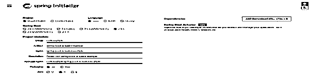
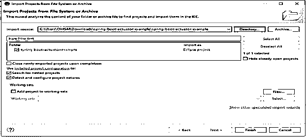
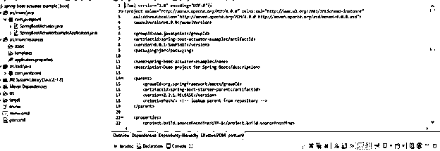
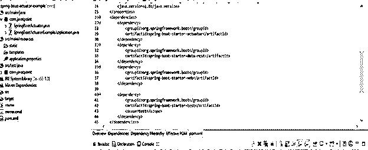
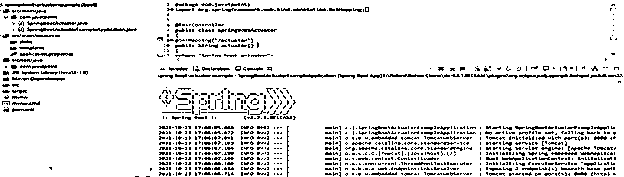
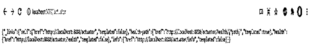

# 弹簧靴致动器端点

> 原文：<https://www.educba.com/spring-boot-actuator-endpoints/>

## 弹簧靴致动器端点介绍

Spring boot actuator 端点为管理和监控 Spring boot 应用程序提供了安全的端点。因为我们知道所有的弹簧引导致动器端点都是安全的，所以我们需要添加弹簧引导的致动器依赖项，以便在我们的应用程序中启用弹簧引导致动器端点。Spring boot actuator 端点只不过是 Spring boot 框架子项目；它将包括用于监控和管理 spring boot 应用程序的一些特性。此外，它将包含致动器的端点；我们可以在 spring boot 应用程序中使用 HTTP 和 JMX 端点。

### 弹簧靴致动器端点概述

*   弹簧靴促动器端点具有一些附加特征，还包括内置端点的数量。内置端点的一个例子是 spring boot health actuator 端点提供关于健康的信息。
*   使用 spring boot actuator 端点，我们可以通过使用 JMX 或 HTTP 端点来监控我们的 spring boot 应用程序。
*   我们可以在 spring boot 应用程序中启用、禁用和公开每个 spring boot actuator 端点。

### 弹簧靴致动器端点技术

*   spring boot 提供多个内置端点；我们还可以在 spring boot 应用程序中添加自定义端点。
*   下面是在我们的 spring boot 应用程序中广泛使用的端点。
*   actuator–此端点向其他端点提供发现页面。
*   audit events–此端点是审计事件的公开信息。
*   trace–此端点用于显示跟踪的信息。
*   shut down 这个端点用于强制关闭我们的应用程序。
*   映射–该端点用于显示涂层列表的路径。
*   指标–此端点用于显示指标的信息。
*   loggers–该端点用于修改和显示记录器的配置。
*   info–该端点用于显示关于应用程序的信息。
*   health–此端点用于显示有关健康的信息。
*   fly way——这个端点用于显示数据库迁移。
*   转储–此端点用于执行转储。
*   config props–此端点用于显示已整理的列表。
*   bean——这个端点用于显示所有的 bean。
*   auto config–此端点用于显示自动配置。
*   docs——这个端点用于显示文档。
*   弹簧靴致动器端点具有以下特性，我们可以在弹簧靴生产就绪应用中使用。
*   记录
*   监视
*   描摹
*   审计
*   韵律学

### 例子

下面是端点的例子如下。

<small>网页开发、编程语言、软件测试&其他</small>

*   使用 spring 初始化器创建一个项目模板，并给这个项目命名如下。

在下面的步骤中，我们将项目组名设置为 com.example，将工件名设置为 spring-boot-actuator-example，将项目名设置为 spring-boot-actuator-example，将包设置为 jar 文件，并选择 java 版本为 11。

`Group – com.example
Artifact name – spring-boot-actuator-example
Name – spring-boot-actuator
Description - Project for spring-boot-actuator-example
Package name - com.example.spring-boot-actuator-example
Packaging – Jar
Java – 11
Dependencies – spring boot actuator`

**生成项目后，提取文件，使用 spring 工具套件打开该项目—**

*   **使用 spring 工具套件打开项目后，检查项目及其文件—**

*   **添加依赖关系—**

**代码—**

`<dependency>   -- Start of dependency tag.
<groupId>org.springframework.boot</groupId>   -- Start and end of groupId tag.
<artifactId>spring-boot-starter-actuator</artifactId> -- Start and end of artifactId tag.
</dependency>    -- End of dependency tag.`

*   **创建控制器类—**

**代码—**

`@RestController
public class SpringBootActuator
{
@GetMapping ("/actuator")
public String actuator()
{
return "Spring boot actuator";
}
}`

*   **编辑 application.properties 文件—**

**代码—**

`management.security.enabled = false`

`

` 

*   **运行应用程序—**

**

** 

*   **运行应用程序后，在浏览器中打开以下 URL—**

**代码—**

`http://localhost:8080/actuator`

### 端点公开

*   默认情况下，我们可以公开或启用所有可用的执行器端点。但是我们不能默认启用关闭端点。
*   我们可以通过使用 spring boot 应用程序的属性文件来启用 spring boot actuator 端点中的所有端点。
*   为了在 spring boot actuator 应用程序中启用端点，我们需要在 spring boot application . properties 文件中将属性管理的端点设置为 enabled。
*   我们也可以用 id；需要用应用程序的实际端点名称替换 id。

### 属性端点

*   Spring boot 端点只不过是设备、操作系统和应用程序代理，它们有助于保护配置的安全。
*   我们可以通过使用模板运行来查看所选端点的当前状态。端点有两个属性如下。

1.  描述性属性
2.  可配置属性

*   描述性属性包含有关管理执行器端点的软件版本和代理的信息。
*   可配置属性包含关于变更的细节，比如端点的重要性。

### HTTP 端点–安全

*   我们可以通过在 get、put、delete 和 post 方法上设置特权来保护 spring boot actuator 中的 HTTP 端点。
*   我们还可以通过向用户提供指定的访问来保护 http 端点；不是每个用户都需要访问每项服务。
*   设置基于特权的授权意味着只有授权用户才能从文件中删除指定的内容。
*   我们还可以使用 HTTP 方法将用户 IP 地址列入白名单；它将适用于所有用户。

### 端点-HTTP 方法

*   使用端点 HTTP 方法的监控特性，我们可以检查 spring boot 应用程序的健康状况。
*   使用端点 HTTP 方法的日志记录特性，我们正在编写关于运行时发生的事件的日志消息。
*   使用端点 HTTP 方法的跟踪特性，我们跟踪 spring boot 应用程序的所有 HTTP 请求。
*   使用端点 HTTP 方法的度量特性，我们正在测量我们的 spring boot 应用程序的性能。
*   使用端点 HTTP 方法的日志记录特性，我们将记录来自 spring boot 应用程序的所有授权事件。

### 结论

Spring boot actuator 端点只不过是 Spring boot 框架的一个子项目。Spring boot actuator 端点支持我们在项目中使用的所有端点的安全性。使用 spring boot actuator 端点，我们可以通过使用 JMX 或 HTTP 端点来监控我们的 spring boot 应用程序。

### 推荐文章

这是弹簧靴致动器端点的指南。在这里，我们讨论弹簧靴致动器端点概述以及示例和代码。您也可以看看以下文章，了解更多信息–

1.  [Spring Boot 测井](https://www.educba.com/spring-boot-logging/)
2.  [Spring Boot RestTemplate](https://www.educba.com/spring-boot-resttemplate/)
3.  [Spring Boot 2](https://www.educba.com/spring-boot-oauth2/)
4.  [Spring Boot 横幅](https://www.educba.com/spring-boot-banner/)

