# Spring Boot JDBC 模板示例

> 原文：<https://www.educba.com/spring-boot-jdbctemplate-example/>

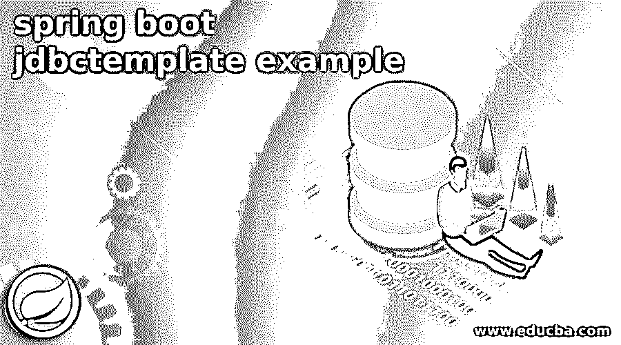

## Spring Boot JDBC 模板示例简介

Spring boot jdbctemplate 示例用于创建应用程序 API 和数据库服务器之间的连接。Spring boot jdbc 模板是一种用于连接数据库服务器并在数据库服务器上执行查询的机制。Spring boot template 内部使用 JDBC 的 API，但是使用 JDBC API 有问题。因此，使用 spring boot 模板，我们不需要处理事务。

### 逐步 Spring Boot JDBC 模板示例

下面是创建 spring boot JDBC 模板的示例的一步一步的过程如下。

<small>网页开发、编程语言、软件测试&其他</small>

*   **在 PostgreSQL 数据库服务器中创建数据库—**

在这一步中，我们将在 PostgreSQL 数据库服务器中创建名为 spring_boot_jdbctemplate 的数据库。

**代码—**

`# create database spring_boot_jdbctemplate;
# \l+ spring_boot_jdbctemplate`

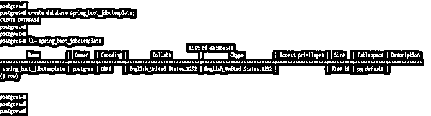

*   **将表创建到 spring_boot_jdbctemplate 数据库中—**

在这一步中，我们在数据库名称 spring_boot_jdbctemplate 中将表名创建为一个 stud。

**代码—**

`# create table stud (id int, f_name varchar(10));`

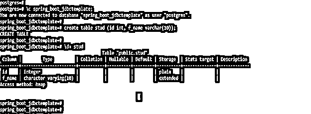

*   **使用 spring 初始化器创建项目模板，并给项目命名为—**

在下面的步骤中，我们已经提供了项目组名为 com.example，工件名为 springbootjdbctemplate，项目名为 springbootjdbctemplate，选择的 java 版本为 8。

**Group–com . example 工件名称–springbootdbctemplate**

 **名称-springbootdbctemplate 描述-springbootdbctemplate 的项目

spring boot–2 . 6 . 0 项目–Maven 项目

Java–8 依赖项–spring web、PostgreSQL 驱动程序

包名–com . example . spring boot JDBC template

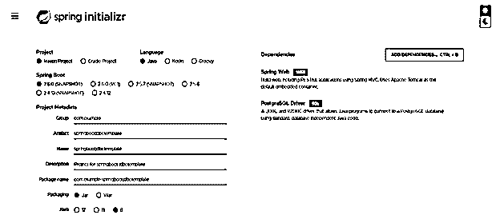

*   **生成项目后，提取文件，使用 spring 工具套件打开该项目—**

在这一步使用 spring 初始化器生成项目之后，我们正在提取 jar 文件；提取 jar 文件后，我们使用 spring 工具套件打开项目模板。

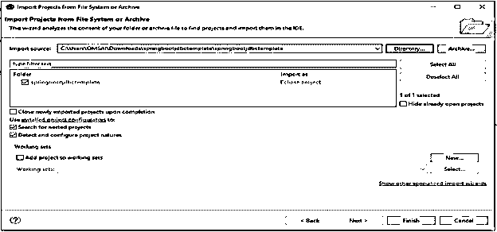

*   **使用 spring 工具套件打开项目后，检查项目及其文件—**

在这一步中，我们检查所有的项目模板文件。我们还需要检查 maven 依赖项和系统库。

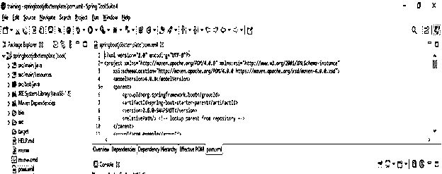

*   **添加依赖包—**

在这一步中，我们将在项目中添加所需的依赖项。在本例中，我们将在 spring boot jdbc 模板示例项目中添加 spring boot starter web、spring boot starter test 和 PostgreSQL 依赖项。**T3】**

**代码—**

`<dependency>   -- Start of dependency tag.
<groupId>org.springframework.boot</groupId>   -- Start and end of groupId tag.
<artifactId>spring-boot-maven-plugin</artifactId>  -- Start and end of artifactId tag.
</dependency>    -- End of dependency tag.
<dependency>   -- Start of dependency tag.
<groupId>org.springframework.boot</groupId>   -- Start and end of groupId tag.
<artifactId>spring-boot-starter-test</artifactId>  -- Start and end of artifactId tag.
</dependency>    -- End of dependency tag.
<dependency>   -- Start of dependency tag.
<groupId>org.springframework.boot</groupId>   -- Start and end of groupId tag.
<artifactId>spring-boot-starter-web</artifactId>  -- Start and end of artifactId tag.
</dependency>    -- End of dependency tag.
<dependency>   -- Start of dependency tag.
<groupId>org.postgresql</groupId>   -- Start and end of groupId tag.
<artifactId>postgresql</artifactId>  -- Start and end of artifactId tag.
</dependency>    -- End of dependency tag.`

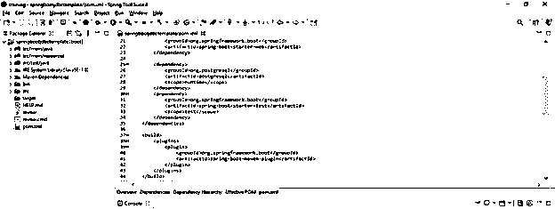

*   **创建梭哈等级—**

添加完所需的依赖项后，下一步是创建我们项目的一个类。在这个类中，我们用 getter 和 setter 方法定义了两个属性。

**代码—**

`public class stud
{
private int id;
private String f_name;
public stud() {}
public int getId () {
return id;
}
public void setId(int id) {
this.id = id;
}
public String getF_name () {
return f_name;
}
public void setF_name (String f_name) {
this.f_name = f_name;
}
public stud(int id, String f_name) {
super();
this.id = id;
this.f_name = f_name;
}
}`

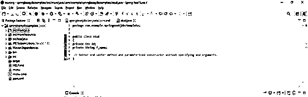

*   **创建 studDao.java 类—**

在创建了 stud 类之后，我们为 spring boot jdbctemplate 示例项目创建了 studDao.java 类。

该类包含 jdbc 模板属性和三个方法名 saveStud()、updateStud()和 deleteStud()。

**代码—**

`public class studDao {
private JdbcTemplate jdbcTemplate;
public void setJdbcTemplate (JdbcTemplate jdbcTemplate) {
this.jdbcTemplate = jdbcTemplate;
}
public int saveStud (stud s) {
String dbquery = "insert into stud values ('" + s.getId () + "','" + s.getF_name () + "')";
return jdbcTemplate.update(dbquery);
}
public int updateStud (stud s) {
String dbquery = "update stud set f_name='" + s.getF_name () + "' where id='" + s.getId () + "' ";
return jdbcTemplate.update(dbquery);
}
public int deleteStud (stud s) {
String dbquery = "delete from stud where id='" + s.getId () + "' ";
return jdbcTemplate.update(dbquery);
}
}`

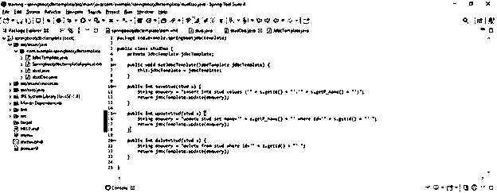

*   **创建 applicationContext.xml 文件—**

创建 stud 和 studDao 类后，下一步是为 spring boot jdbc 模板示例项目创建 applicationContext.xml 文件。

**代码—**

`<bean id="ds" class="org.springframework.jdbc.datasource.DriverManagerDataSource">
<property name="driverClassName" value="postgresql.jdbc.driver.postgresqlDriver" />
<property name="url" value="jdbc:postgresql:@localhost:5432:spring_boot_jdbctemplate" />
<property name="username" value="postgres" />
<property name="password" value="postgres" />
</bean>`

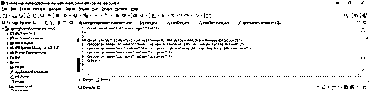

*   **通过运行 saveStud()方法测试应用程序—**

在下面的例子中，我们使用 saveStud 方法测试了我们的 spring boot jdbc 模板示例项目。

**代码—**

`public class jdbctemplateTest {
public static void main(String[] args) {
ApplicationContext ctx = new ClassPathXmlApplicationContext ("applicationContext.xml");
studDao sd = (studDao)ctx.getBean("springbootjdbctemplate");
int status = sd.saveStud (new stud(101,"ABC"));
System.out.println (status);
}
}`

*   我们还可以通过使用下面的代码来检查 updateStud()和 deleteStud()方法，如下所示。

1)update stud()–

`int status = sd.updateStud (new stud(101,"PQR"));
System.out.println (status);`

2)delete stud()–

`stud s = new stud();
s.setId (101);
int status = sd.deleteStud (s);
System.out.println (status);`

*   **运行应用程序—**

在这一步中，我们使用 spring 工具套件运行我们的 spring boot jdbc 模板示例项目。

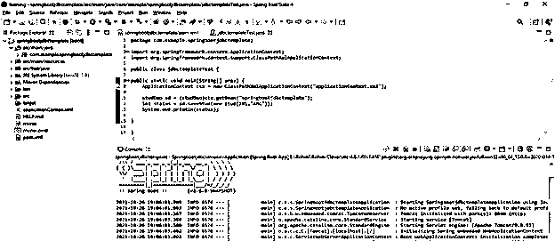

*   **运行应用程序后，支票数据被插入到数据库表中—**

在这一步中，我们检查数据是否被插入到数据库表中。我们可以看到数据被插入到螺柱表中。

**代码—**

`# select * from stud;`

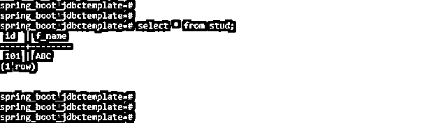

### 推荐文章

这是 Spring Boot JdbcTemplate 示例的指南。在这里，我们讨论创建 Spring Boot JdbcTemplate 示例的逐步过程。您也可以看看以下文章，了解更多信息–

1.  [Spring Boot 测井](https://www.educba.com/spring-boot-logging/)
2.  Spring Boot 赛道
3.  Spring Boot·HTTPS
4.  [Spring Boot 横幅](https://www.educba.com/spring-boot-banner/)

**