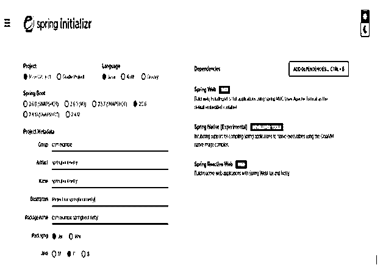
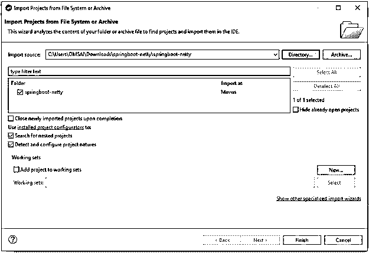

# Spring Boot·内蒂

> 原文：<https://www.educba.com/spring-boot-netty/>

## Spring Boot·内蒂的定义

它是一个用于网络的事件驱动的应用框架，它将提供 HTTP、UDP 和非阻塞的服务器和客户端。正如 spring boot 的名字一样，netty 基于 netty 框架，它也被称为非阻塞输入输出(NIO)框架。我们可以使用高度可扩展的框架，使用 netty 构建底层服务器非常简单。Spring boot netty developer 也在 socket 级别上工作，这是一个创建通信协议的例子。

### 什么是春靴 netty？

*   它支持非阻塞和阻塞 API，也支持 SSL 和 TLS。
*   我们可以在每个线程上同步运行所有请求。为了同步运行每个线程，它使用了阻塞服务器模型。
*   它基本上是为了使定制网络协议的实现变得容易而设计的。我们可以自己写协议。

### 如何使用弹簧靴 netty？

要在我们的 spring boot 应用程序中使用 netty，我们需要遵循以下步骤。

<small>网页开发、编程语言、软件测试&其他</small>

*   我们需要在 pom.xml 文件中添加 spring boot starter webflux 依赖项。
*   在添加了 spring boot starter webflux 依赖项之后，它会自动在我们的项目中添加 spring boot starter reactor 依赖项。
*   在应用程序 pom.xml 文件中添加了依赖项之后，下一步是配置服务器。我们可以使用两种方法来配置服务器。
*   配置服务器的第一种方法是使用属性文件。Spring boot 通过使用应用程序属性文件来公开通用配置。我们需要在属性文件中定义服务器端口。
*   我们也可以通过使用 application.yml 文件进行相同的配置。除了服务器端口，spring boot 还包含了服务器配置的其他选项。
*   从覆盖默认服务器配置的服务器前缀开始的应用程序属性。
*   我们还可以使用编程配置来配置服务器。
*   为了通过代码配置服务器，spring boot 使用 NettyServerCustomizer 和 WebServerFactoryCustomizer 类。
*   为了使用编程配置来配置服务器，spring boot 在启动时使用工厂定制器的组件。
*   Spring boot 在 pom.xml 文件中添加 starter 依赖项时会自动配置服务器的配置，因此我们需要通过定义 NettyReactiveWebServerFactory 的 bean 来跳过自动配置。
*   为了跳过服务器的自动配置，我们需要在我们的配置类中定义 bean，并且需要添加定制器。
*   配置服务器后，下一步是配置 SSL。为了在 spring boot netty 项目中配置 SSL，我们需要在项目中使用 SslServerCustomizer 类。
*   在我们的应用程序中配置 SSL 之后，下一步是访问日志信息。在项目中，我们不能通过使用 logback 来访问日志记录。
*   Spring boot 通过使用 tomcat 和 jetty 服务器的应用程序属性文件来配置访问日志记录。
*   要启用日志记录，我们需要在运行应用程序时将 netty http server access log enables 参数值设置为 true。

### 自定义方法弹簧靴 netty

*   我们可以通过使用自定义方法来配置应用程序。我们需要使用 spring 初始化器创建一个项目模板。
*   我们还可以通过使用 eclipse 或 spring 工具套件创建一个新项目来创建项目。
*   使用 spring initializer 创建项目后，下一步是在 pom.xml 文件中添加依赖包。
*   添加完依赖包后，我们将使用自定义方法创建一个服务器。
*   自定义方法使用 netty 来发送和接收 java 的对象。自定义方法对于创建应用程序非常有用。
*   自定义方法用于 spring boot 的基于属性的配置。我们可以以细粒度的方式配置服务器。
*   使用自定义方法，我们可以通过使用代码来配置 netty 服务器。我们需要在应用程序中添加一些类。

### 服务器配置

下面的例子显示了创建服务器的配置如下。

#### 1)使用 spring 初始化器创建项目模板，并给项目命名

在下面的步骤中，我们将项目组名称设置为 com。例如，工件名为 springboot-netty，项目名为 springboot-netty，包名为 jar 文件。

`Group – com.example
Artifact name – springboot-netty
Name – springboot-netty
Description - Project for springboot-netty
Spring boot – 2.5.5
Project – Maven project
Package name - com.example.springboot-netty
Packaging – Jar
Java – 11
Dependencies – spring native, spring web, spring reactive web.`

#### 2)生成项目后，提取文件并使用 spring 工具套件打开该项目

#### 3)使用 spring 工具套件打开项目后，检查项目及其文件

#### 4)添加依赖包–

**代码:**

`<dependency> -- Start of dependency tag.
<groupId>org.springframework.boot</groupId> -- Start and end of groupId tag.
<artifactId>spring-boot-starter-webflux</artifactId> -- Start and end of artifactId tag.
</dependency> -- End of dependency tag.`

#### 5)使用 application.properties 文件配置服务器。

**代码:**

`Server.port = 8080`

#### 6)配置 SSL–

**代码:**

`@Component
public class NettyWebServerFactorySslCustomizer
implements WebServerFactoryCustomizer<NettyReactiveWebServerFactory> {
@Override
public void customize(NettyReactiveWebServerFactory serverFactory) {
Ssl ssl = new Ssl();
ssl.setEnabled (true);
ssl.setKeyStore ("classpath:sample.jks");
ssl.setKeyAlias ("netty");
ssl.setKeyPassword ("pass");
ssl.setKeyStorePassword ("pass");
}
}`

#### 7)使用 spring boot netty 运行应用程序

### 结论

这个框架支持非阻塞和阻塞 API，也支持 SSL 和 TLS。它基本上是为了使定制网络协议的实现变得容易而设计的。我们可以自己写协议。

### 推荐文章

这是 Spring Boot·内蒂指南。这里我们讨论定义，什么是 spring boot netty，如何使用 spring boot netty，有代码的例子。您也可以看看以下文章，了解更多信息–

1.  [Spring Boot 调度器](https://www.educba.com/spring-boot-scheduler/)
2.  [Spring Boot 的名字缩写](https://www.educba.com/spring-boot-initializr/)
3.  [Spring Boot·梅文](https://www.educba.com/spring-boot-maven/)
4.  [Spring Boot 缓存](https://www.educba.com/spring-boot-cache/)

