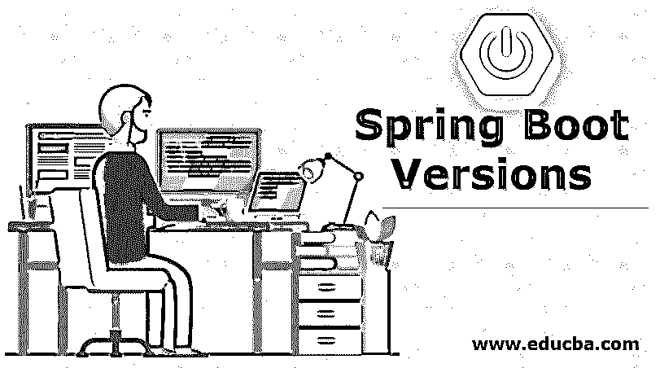
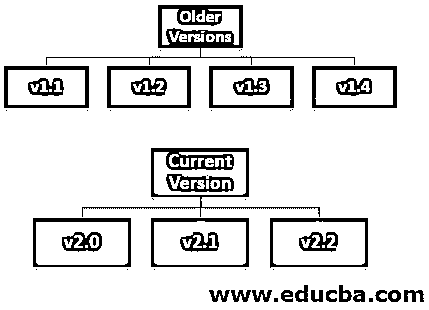

# Spring Boot 版本

> 原文：<https://www.educba.com/spring-boot-versions/>

## Spring Boot 版本介绍

Spring boot 发布了各种版本，但最新的 spring boot 版本是 v2.2，具有许多新功能。众所周知，它是一个开源框架。它用于创建生产就绪的应用程序和微服务。

### Spring Boot 的版本

以下是 Spring Boot 的不同版本:

<small>网页开发、编程语言、软件测试&其他</small>

**旧版本:**

*   v1.1
*   v1.2
*   v1.3
*   v1.4

**当前版本:**

*   v2.0
*   v2.1
*   v2.2

#### 1.v1.1

在此版本测试中，POM(即 spring-boot-starter-test)不会自动添加到父类(即 spring-boot-starter-parent)中。他们已经将默认测试依赖项添加到父 POM 中，但是我们不能轻易删除或更改它们。

*   多部分配置:这里他们重命名了一些类，比如 MultipartConfigFactory 被重命名为 MultiPartConfigFactory。
*   **错误控制器**:在这里，他们已经将一些与错误处理相关的接口和类移动到了 spring-boot-autoconfigure，就像在 spring-boot-actuator 中可用之前，错误控制器相关的类和接口类移动到了 spring-boot-auto configure。这些变化对最终用户来说是显而易见的，他们也重命名了一些包。
*   **Spring 数据自动配置包**:自动配置文件移动到子包。如果我们想使用 annotation @ enable auto configuration 及其 exclude 属性来引用它们，则不能直接使用它们，在这种情况下，我们可能需要更改导入。
*   **使用 maven 运行我们的 spring boot 应用程序** : Spring boot 现在提供了一个 spring-boot run 来从命令行运行我们的应用程序，我们不需要提到命令行参数。

#### 2.v1.2

*   **服务器:**在这个版本中， [spring boot 使用了](https://www.educba.com/spring-boot-annotations/)一些嵌入式服务器，它们是:Tomcat 8，Jetty 9。如果你愿意，你也可以使用 Tomcat 7 和 Jetty 8。
*   **Loggers:** 在 spring 1.2 中，他们已经更新了日志记录的默认配置，我们不需要编写日志文件。但是我们仍然可以通过添加 logback.xml 来自定义我们的日志程序
*   **配置属性:**重命名一些属性，如 spring . data . MongoDB . repositories . enabled..那是在 spring . data . mongo . repositories . enabled 之前
*   **@SpringBootApplication** :他们增加了一个新的注释，即@SpringBootApplication，它是@ components can+@ configuration+@ enable auto configuration 等一些注释的组合。现在我们只需要使用这一个注释，而不是这三个。
*   电子邮件:他们增加了一个新的 POM 来支持电子邮件，即 spring-boot-starter-mail。我们可以通过将“JavaMailSender”注入到我们的服务中来使用它，我们还可以使用 spring.mail.*的属性来定制诸如 SMTP 之类的项目。
*   **under flow:**除了 tomcat 和 jetty 之外，还增加了一个嵌入式服务器，即 under flow。

#### 3.v1.3

*   **开发者工具**:在这个 spring boot 版本中，他们必须包含一个开发工具，即 spring-boot-dev 工具，它将改善开发时间体验。

本模块为我们提供:

1.  应用程序的自动启动。
2.  禁用模板缓存。
3.  支持远程开发。
4.  它还会在重新启动时保持 HTTP 会话。
5.  缓存的自动配置:他们提供了不同点的自动配置

下面给出了各个点的自动配置:

1.  雷迪斯
2.  无限跨度
3.  EhCache
4.  番石榴
5.  JSR 107
6.  黑泽尔卡斯特

*   除此之外，它还支持基于内存映射。当我们使用@configuration 和@EnableCaching 时，缓存将在我们的应用程序中自动配置。
*   卡珊德拉:他们也为卡珊德拉提供了[支持。](https://www.educba.com/what-is-cassandra/)

#### 4. **v1.4**

第三方库升级:

1.  雄猫
2.  码头
3.  杰克逊
4.  春季会议
5.  弹簧集成
6.  冬眠
7.  毛线衫
8.  春假文件
9.  Ehcache
10.  黑泽尔卡斯特
11.  弹性搜索等。

*   **Couchbase 支持**:他们提供了 Couchbase 的自动配置。
*   **Neo4J 支持:**他们还提供了 Neo4J 的自动配置。我们现在可以连接到远程服务器，也可以运行 Neo4J 服务器。
*   **Redis Spring 数据仓库:**我们现在可以将 Redis 与 Spring 数据仓库一起使用。
*   **启动失败分析:** spring 现在为我们提供了启动失败的分析，也为我们提供了有用的诊断信息。

#### 5.v2.0

*   春开机 v2.0 需要 java 8.0 作为 java 的最低版本。因此，java 8 遇到了许多新特性，如 lambda 表达式、函数接口、流 API、时间 API、接口中的默认方法等。所以许多现有的应用程序都在更新自己以使用这些 java8 特性。

第三方库更新:

1.  冬眠
2.  雄猫
3.  百里香叶
4.  候鸟迁徙所经的路径

*   **属性绑定配置:**该流程用于将我们的环境流程绑定到@ConfigurationProperties。
*   **Netty 服务器:**提供 Netty 作为嵌入式服务器的支持。对于他的 spring-boot-starter-webflux，POM 将为我们拉 netty。
*   在这个版本中，Spring boot 也提供了对 Kotlin 的支持。
*   **促动器改进:**他们为促动器提供了所有 HHTP 端点，JSON paylods 也得到了改进。在这个版本中，他们在执行器端点上也有很多改进。
*   **超媒体**:现在 link formate 中提供了执行器端点。
*   **执行器端点:**现在我们可以使用@Endpoint 注释和@DeleteOperation、@ReadOperation 和@WriteOperation 来开发我们的端点。

#### 6.v2.1

第三方库:

1.  千分尺
2.  雄猫
3.  冬眠
4.  逆流
5.  朱尼特

*   **数据大小支持:**在这个版本中，他们支持元数据和简单格式。如果一个属性想要声明它的大小，那么它可以使用 org . spring framework . util . unit . data size。
*   **日志记录:**他们一次性配置了日志记录器。就像我们可以配置 tomcat 组，它可以一次完成 Catalina、coyote 和 tomcat logger。
*   **任务调度:**我们可以使用 spring.task.scheduling 自定义任务调度器，Spring boot 在我们的应用中使用@EnableScheduling 注释时配置任务调度。现在默认为 TaskSchedulerBuilder。
*   **任务执行:**我们可以通过使用 TaskExecutorBuilder 来创建自定义的 ThreadPoolTaskExecutor。在这个版本的 spring 中，它为任务执行器提供了自动配置。
*   Kafka Streams 支持:他们现在通过声明 org.apache.Kafka:Kafka-streams 依赖关系来为 Kafka 支持提供自动配置。
*   Spring JDBC 支持:现在，当我们在类路径上提供必要的依赖项时，spring boot 会自动配置 JDBC。或者我们也可以通过使用单一依赖 spring-boot-starter-data-jdbc 来包含它们。

#### 7. **v2.2**

*   **性能改进:**在这个版本中，通过将 proxyBeanMethods 添加到包含@configuration 注释的类中，实现了性能改进。我们需要将这个属性设置为 false，比如:proxyBeanMethods=false 它是@configuration 批注的新属性。
*   默认情况下，他们禁用了 tomcat 注册表。此外，他们还将 tomcat 的内存减少了 2MB。
*   他们减少了@configuration property 花费的时间。
*   现在，只有当给定的端点被公开和启用时，才会创建与执行器端点相关的 beans。
*   他们还改进了自动配置的条件，现在代码不再被配置，如果它不在使用中。
*   Kubernetes: 现在他们可以检测应用程序是否在 Kubernetes 上运行。
*   **惰性初始化:**现在我们也可以启用全局惰性初始化，为此我们需要使用一些属性，如 spring . main . Lazy-initial ization。

### 结论

因此，spring boot 运行在最新版本的 v2.2 上，具有所有新功能，我们可以将我们的应用程序作为小型服务，微服务说。

### 推荐文章

这是 Spring Boot 版本的指南。在这里我们详细讨论 Spring Boot 的介绍和不同版本。您也可以看看以下文章，了解更多信息–

1.  [什么是 Spring 框架？](https://www.educba.com/what-is-spring-framework/)
2.  [春云组件](https://www.educba.com/spring-cloud-components/)
3.  [Spring Boot 开发工具](https://www.educba.com/spring-boot-devtools/)
4.  [Spring Boot 执行器](https://www.educba.com/spring-boot-actuator/)

