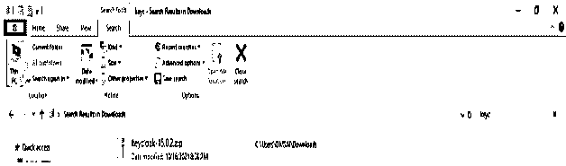
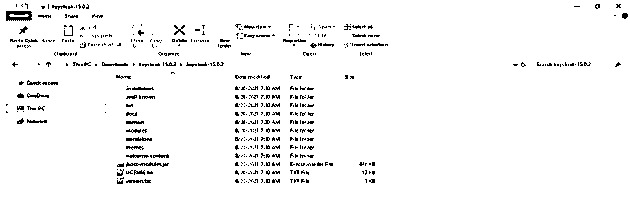
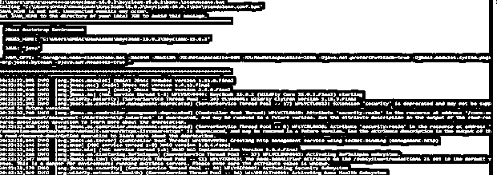
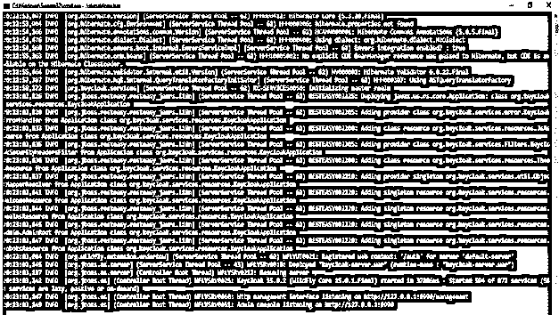
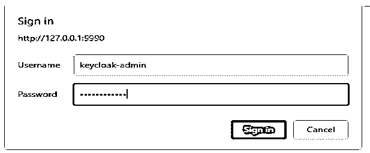
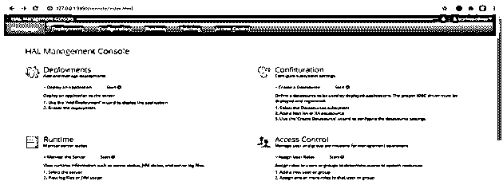
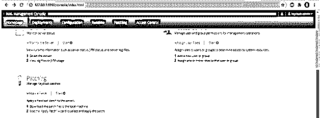
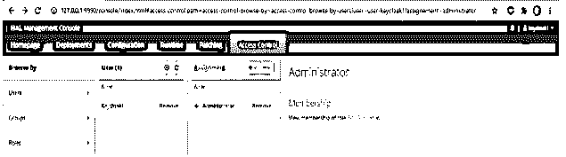
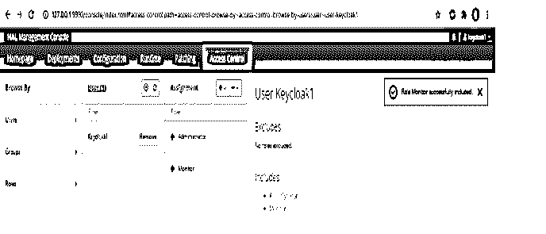
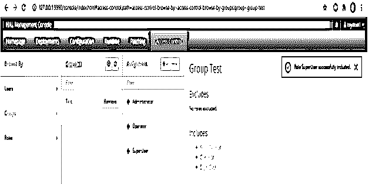

# Spring Boot·奇克洛

> 原文：<https://www.educba.com/spring-boot-keycloak/>


## Spring Boot·基克洛的定义

Spring Boot 奇洛克是现代应用的开源访问和身份管理解决方案；它将提供更多的访问和身份管理功能。它提供单点登录、管理控制台、帐户管理控制台、客户端适配器、用户联盟、社交登录和身份代理。它是由 RedHat 管理的、用 java 语言开发的访问管理和身份管理解决方案。它将支持 SAML 和 OpenID 连接；我们需要决定在保护客户端时使用哪个键盘锁。

### 什么是 Spring Boot·奇克洛？

*   在 Spring Boot Keycloak 中，还可以使用服务提供商的 OpenID Connect 和 SAML 库。
*   下面是与 Spring Boot 钥匙槽相关的术语。

1)用户
2)角色
3)组
4)管理控制台
5)领域
6)客户端
7)身份令牌
8)访问令牌

<small>网页开发、编程语言、软件测试&其他</small>

*   用户是用于登录受保护系统的相关实体；这包含几个编辑过的属性。
*   角色是与 Spring Boot 键盘锁相关的实体，键盘锁是用户的类别或类型；Spring Boot 应用程序基于角色来限制资源。
*   组是管理 Spring Boot Keycloak 中的用户和角色的实体。组是可编辑的实体，我们也可以给组分配角色。曾经是组成员的用户正在继承指定组的所有属性。
*   管理控制台是与 Spring Boot 键盘锁相关的实体，在其中我们可以看到我们需要工作的所有实例的配置。
*   该领域用于使用 Spring Boot Keycloak 应用程序管理用户的角色、组和凭证。用户登录并属于该领域实体。领域是相互关联的，用于管理用户。

### 使用 Spring Boot 奇洛克

*   正如我们所知，安全性在每个应用程序中都非常重要，并且它的实现也略有难度。
*   应用服务器的安全性非常重要；它伴随着授权和认证方面的委托。
*   它为应用程序提供了适配器，应用程序需要与 Keycloak 的实例进行交互。
*   设置 Spring Boot Keycloak 服务器有多种选择，但最简单的方法是解压发行版。解压缩文件后，在终端上打开它并运行。bat 档。
*   我们可以通过使用 Keycloak 来保护我们的 Spring Boot 应用程序。下面的步骤展示了我们如何将 Spring Boot 应用程序与 Keycloak 集成在一起。

1)创建一个 Spring Boot 应用程序。2)创建应用程序后，将其与 Keycloak 集成。
3)将应用程序与 Keycloak 集成后，下一步是配置安全性，将 Keycloak 用作身份验证提供者。
4)实现安全后，实现应用程序的逻辑。
5)添加逻辑后，下一步是向用户添加访问策略。

### 安装钥匙锁

*   以下步骤显示了如何在 windows 环境下安装和配置 Keycloak。
*   为了安装 Keycloak，java 需要安装在我们的本地环境中。

1)在我们的 windows 服务器上安装 java。如果假设它已经安装，使用下面的命令检查。

```
# java -version
```


2)检查 java 是否已安装后，下载适用于 windows 环境的 keycloak zip 文件。




3)解压缩 zip 文件。




4)解压文件夹后，到终端运行 standalone.bat 文件。

```
# .\standalone.bat
```







5)运行 standalone.bat 文件后，它将创建访问 Keycloak 图形用户界面的 URL。

*   把上面的网址放在下面之后，它会要求输入用户名和密码来打开 Keycloak 的 GUI。
*   我们已经使用 Keycloak-admin 用户登录到 Keycloak GUI。

```
http://127.0.0.1:9990
```




6)通过 URL 成功登录后，会打开如下 Keycloak 的图形用户界面。







### 创建角色和用户

下面是创建用户和角色的步骤。

**创建用户—**

*   要在 Keycloak 中创建一个用户，我们需要遵循下面的步骤。

1)从命令行运行 add-user.bat 文件。然后选择我们需要添加的用户类型。

```
> .\add-user.bat
```


2)选择用户组后，输入用户的用户名和密码。选择用户名和密码后，用户需要选择组名；在我们的示例中，我们没有选择任何组名。

用户名–密钥锁 1
密码–
组名–


3)检查用户的所有配置。


4)检查在 Keycloak 的图形用户界面中创建的用户。




### 创建角色

*   在下面的示例中，我们已经为已经创建的用户和组分配了角色。

1)将监控角色分配给 keycloak1 用户–




2)为测试组分配一个超级用户角色




### 弹簧安全和钥匙锁

*   这是最有前途的开源和灵活的技术，很容易适应和部署在我们的基础设施上。
*   它比认证服务器有更多的功能；它像 LDAP 服务器一样提供用户身份管理。
*   虽然使用它的客户端适配器非常简单，但它比其他库需要的代码更少。
*   客户端是 Spring Boot Keycloak 应用程序的实体，用于用户身份验证。客户端只不过是用来验证自身身份的应用程序。
*   身份令牌是用来提供用户信息身份的实体。

### 结论

身份令牌是 Spring Boot 密钥锁的实体，用于提供 HTTP 请求。它提供单点登录、管理控制台、帐户管理控制台、客户端适配器、用户联盟、社交登录和身份代理。它是开源的访问管理工具。

### 推荐文章

这是 Spring Boot 奇洛克的指南。在这里我们讨论定义，什么是 Spring Boot 奇洛克，并举例说明。您也可以看看以下文章，了解更多信息–

1.  [Spring Boot 首发母公司](https://www.educba.com/spring-boot-starter-parent/)
2.  [Spring Boot 验证](https://www.educba.com/spring-boot-validation/)
3.  [Spring Boot 属性](https://www.educba.com/spring-boot-properties/)
4.  [Spring Boot 异常处理](https://www.educba.com/spring-boot-exception-handling/)


