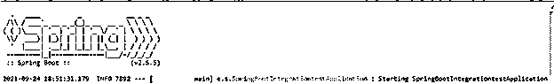
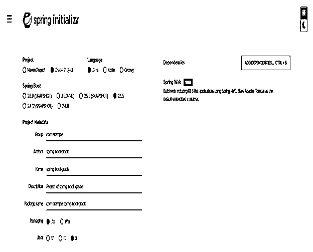
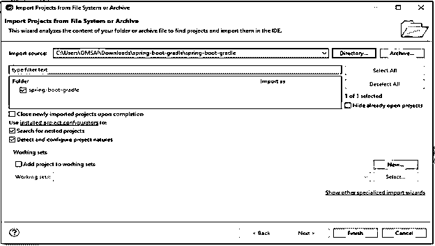
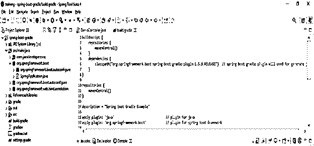
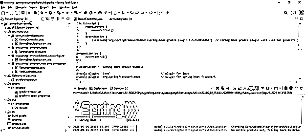
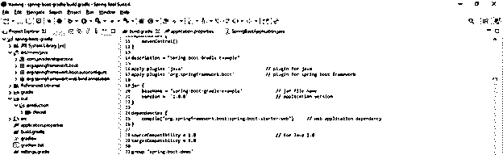
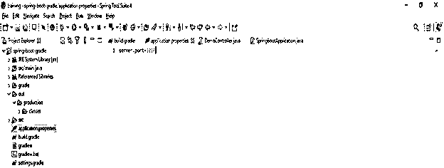
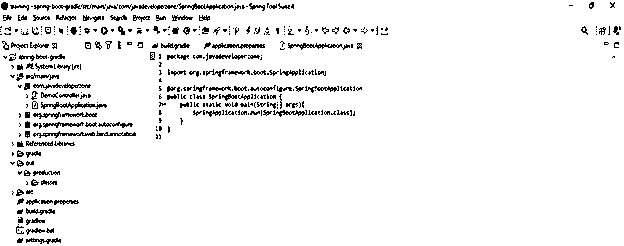
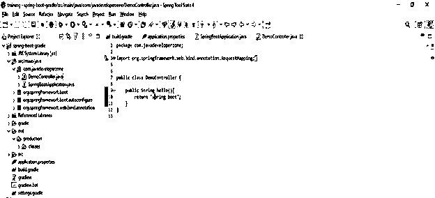
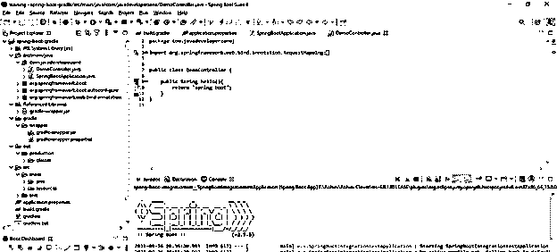

# spring boot gradle

> 原文：<https://www.educba.com/spring-boot-gradle/>

## 弹簧靴简介

它是用于在 gradle 中提供支持的插件，这允许我们打包 war 档案或可执行 jar 文件。使用 gradle 运行 spring boot 应用程序，我们还可以使用 spring boot 依赖项提供的依赖项管理。Gradle 插件要求 gradle 版本为 7。x、6.9 和 6.8。Spring boot 将自动应用依赖管理插件，并且它还将配置 spring boot starter 父依赖，gradle 提供了与 maven 相同的体验。

### 什么是弹簧靴？

*   spring boot 将在启动或创建项目时自动应用。我们必须在 spring boot 应用程序中声明的 gradle 插件版本决定了 spring boot starter 父版本。
*   我们需要用 spring boot 的实际版本来设置 gradle spring-boot 插件的版本。一旦我们将 spring-boot 插件应用到我们的项目中，这个插件就会被自动存档，并生成可执行的 jar 文件。
*   我们可以配置我们的项目来构建 jar 或 war 文件。我们加载的主类必须在配置选项中指定，或者我们可以将主类的属性添加到清单中。
*   我假设我们没有指定包含主类的插件，那么插件将在我们项目的主类中搜索。
*   gradle 插件用来自 spring boot 插件的 spring boot 设置的元素扩展了我们的构建脚本的 DSL。
*   设置 spring boot 插件的适当属性非常重要。我们可以设置 spring boot 插件的备份源属性是真还是假。
*   将开发工具添加到我们的项目后，它将自动监控我们在项目中所做的应用程序更改。此外，我们也可以运行应用程序来重新加载应用程序的类路径。
*   加载我们的应用程序的类路径是非常重要的，它会在开发的时候有所帮助。
*   为了使用容器构建可执行和可部署的 war 文件，我们需要标记嵌入容器的依赖项。
*   Gradle 用于管理或帮助 spring boot 依赖项。我们还可以管理这个包，并通过 gradle 的构建工具来运行我们的应用程序。Gradle 用于管理 spring boot 的依赖项。

### 如何使用 Gradle 运行 spring boot？

*   正如我们所知，gradle 用于编译和打包应用程序时的依赖管理。
*   我们也可以在开发时使用 gradle 工具运行我们的应用程序。要运行 gradle 项目，我们需要遵循以下步骤如下。
*   首先，我们需要转到构建 gradle 应用程序的根位置。格拉德在场。
*   然后执行下面的命令来运行 gradle 如下。

`# gradle bootRun`

<small>网页开发、编程语言、软件测试&其他</small>

### 插件

*   Spring boot 插件发布在 gradle portal。众所周知，gradle 是一个用于构建应用程序的流行工具。
*   我们使用 windows 中的 gradlew.bat 文件来运行 gradle 应用程序。
*   我们还可以使用 Linux 中的 gradlew 来运行 gradle 应用程序，它是在创建 gradle 应用程序的 IDE 时自动创建的。
*   我们还需要在构建中添加 gradle 依赖项。格拉德文件。这个文件存在于我们项目的根目录中。
*   要使用 gradle 插件开发应用程序，首先我们需要将这个插件添加到构建中。格拉德文件。
*   spring boot 任务用于创建可执行的 JAR 文件。当我们必须应用 java 插件时，这个文件是自动创建的。
*   当我们应用 gradle java 插件时，它将采取多个动作，比如，首先创建用于生成 jar 文件的 boot jar 任务。
*   第二个任务是创建用于直接运行我们的应用程序的 boot run 任务。
*   第三个任务是创建禁用 jar 的任务。
*   同时创建用于为我们的应用程序生成 War 文件的 bootWar 任务插件。
*   在创建 gradle war 插件时，我们必须禁用 war 任务。

### 使用 Gradle 运行应用程序

*   **使用 spring 初始化器创建项目模板—**

在下面的例子中，我们必须为 gradle 创建项目模板。我们必须将项目名称创建为 spring-boot-gradle。

`Group – com.example
Artifact name – spring-boot-gradle
Name – spring-boot- gradle
Description - Project of spring-boot- gradle
Package name - com.example.spring-boot- gradle
Packaging – Jar
Java – 8
Dependencies – spring web.`

*   **生成项目后，提取文件并使用 spring 工具套件打开该项目—**

我们提取项目，并使用 spring 工具套件打开它，如下所示。

*   **使用 spring 工具套件打开项目后，检查项目及其文件—**

*   **运行应用程序—**

**春季开机应用程序 grade**

下面的步骤显示了如何创建一个 gradle 应用程序。

*   **配置构建。gradle 文件-**

**代码—**

`dependencies {   // starting of dependency tab.
compile("org.springframework.boot: spring-boot-starter-web")
dependency   // End of dependency tab.
}`

*   **配置应用程序。属性文件—**

**代码—**

`Server.port = 8080`

*   **创建主类文件-**

**代码—**

`public class SpringBootApplication {
public static void main /* main method */ (String[] args){
SpringApplication.run (SpringBootApplication.class);
} }`

*   **创建控制器文件-**

**代码—**

`public class DemoController {
public String hello(){
return "spring boot";
}  }`

*   **构建并运行项目—**

**

** 

### 结论

我们需要用 spring boot 的实际版本来设置 gradle 插件的版本。Gradle 是用于在 gradle 中提供支持的插件。Gradle 插件需要 gradle 7 版本。x、6.9 和 6.8。

### 推荐文章

这是一份弹簧靴指南。在这里，我们将详细讨论如何使用& Gradle 运行 spring boot 以及相关代码。您也可以看看以下文章，了解更多信息–

1.  [Spring Boot 测井](https://www.educba.com/spring-boot-logging/)
2.  Spring Boot 赛道
3.  [Spring Boot 异常处理](https://www.educba.com/spring-boot-exception-handling/)
4.  Spring Boot·HTTPS

