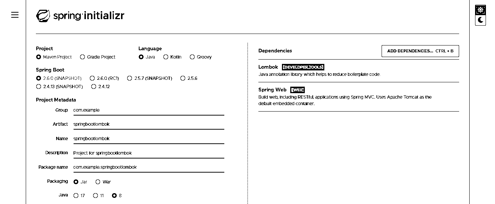
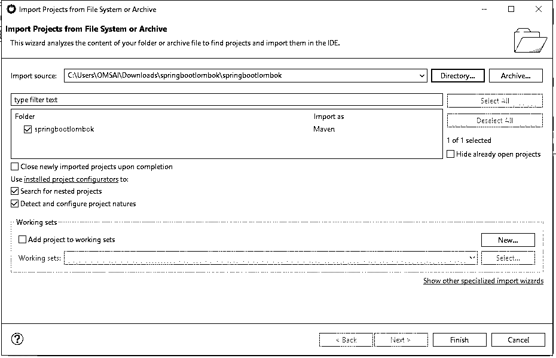
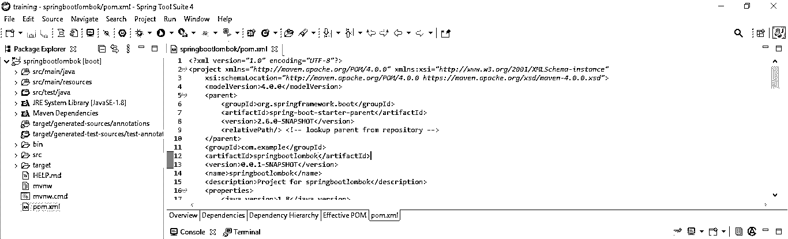
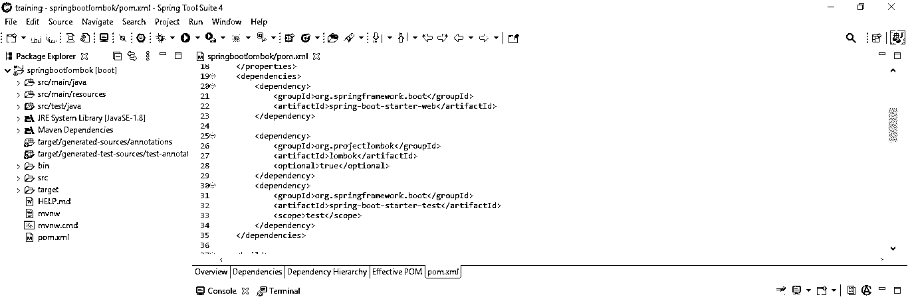
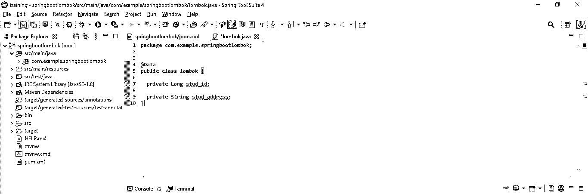
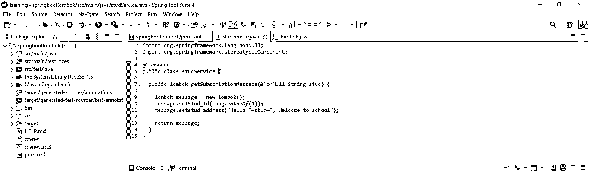
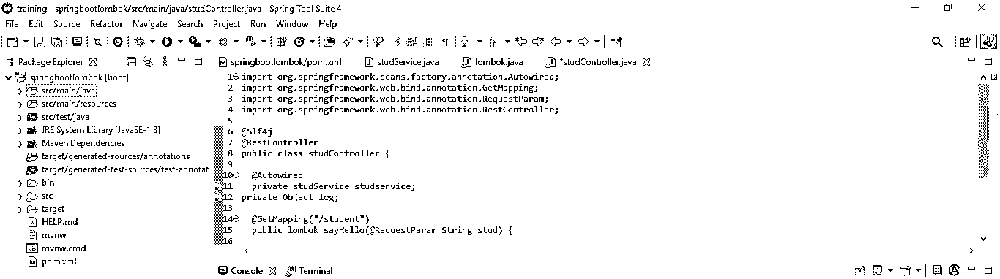
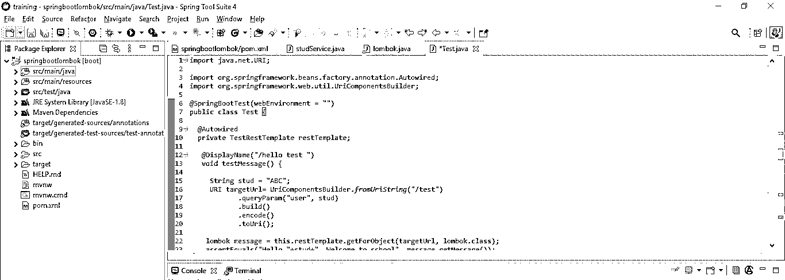
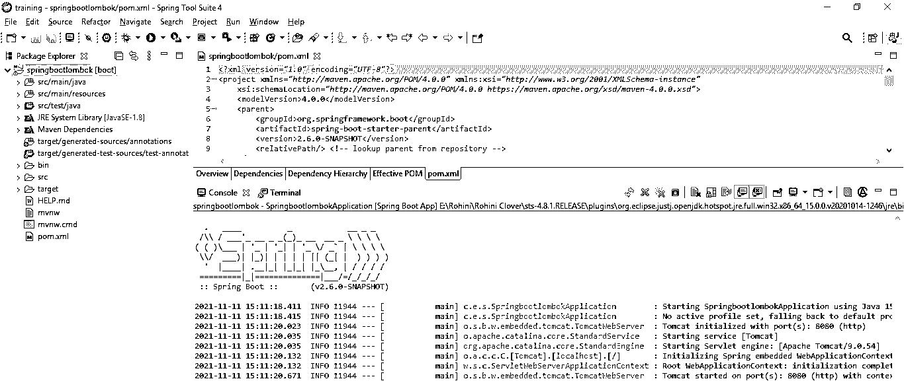

# Spring Boot 龙目岛

> 原文：<https://www.educba.com/spring-boot-lombok/>

## Spring Boot 龙目岛简介

Spring boot Lombok 是 java 库的工具，用于生成代码以最大限度地减少未使用的代码。本库正在使用注释替换未使用的代码。它将取代许多注释，如 setter 和 getter 方法、equals、hashcode、constructor 等。要使用它开发项目，我们需要在应用程序的 pom.xml 文件中添加 Lombok 依赖项。

### 什么是 Spring Boot 龙目岛？

*   Spring boot Lombok 只不过是一个小库，用来减少 java 应用程序中未使用的代码。
*   它通过使用 Lombok 注释为类对象自动生成 getter 和 setter 方法。
*   使用它，我们可以通过使用注释处理器的 API 来挂钩。在 java 编译器继续运行之前，我们可以将原始源代码传递给它，以便生成新的代码。
*   我们可以在 target/classes 文件夹中查看项目的已编译类文件。我们可以在 Maven 和 Gradle IDE 中使用这个。

### 龙目岛是如何运作的？

*   基本上，它是一个注释处理器，在代码编译时工作；它将向我们的项目类中添加代码。
*   我们知道，Java 5 版本增加了注释处理。当使用任何类型的注释处理器时，程序编译器将在编译类时达到特定的级别。它将把控制权交给特定的处理器来处理指定类中要做的事情。
*   例如，如果我们通过使用 Lombok 在一个类中添加了 getter 和 setter 注释，那么在编译代码时，编译器会给 Lombok 处理器添加我们项目所需的注释。
*   下面的例子显示了它是如何在项目中工作的。创建一个 java 文件后，它会将代码转换成如下的类文件。

**示例—**

<small>网页开发、编程语言、软件测试&其他</small>

**Studreq.java**

`@Getter
@Setter
Public class studreq
{
Private string studname;
Private string address;
}`

*   编译完上面的代码后，它会创建如下的类文件。

**示例—**

**Studreq.class**

`Public class studreq
{
Private string studname;
Private string address;
Public studreq () {
}
Public string getStudname () {
Return this.studname;
}
Public string getAddress () {
Return this.address;
}
Public void setStudname (final string studname) {
This.studname = studname;
}
Public void setAddress (final string address) {
This.address = address;
}
}`

根据上面的例子，我们已经看到了 spring boot Lombok 注释处理器如何在编译时更改代码。

### spring boot Lombok–项目结构

*   下面的例子显示了该应用程序的项目结构如下。
*   在下面的项目结构中，我们将 bean 定义为 per，将 type 定义为 stud。
*   我们使用应用程序名 Springbootlombok 来定义项目结构。

**Springbootlombok**

|

|— src

|

主类

|

|—Java

|—- com.springboot.lombok

|—控制器

defaultstudioloader

|—配置

bean 配置

|—型号

种马

|—-仓库

学生知识库

|—服务

种马服务

|——资源

|——测试

Java 语言（一种计算机语言，尤用于创建网站）

类路径

项目

Pom.xml 文件

*   我们正在利用它的依赖性来开发使用 Lombok 的应用程序。

### 创建 Spring Boot 龙目岛应用程序

以下是创建弹簧靴的示例；Lombok 应用程序如下。

*   **使用 spring initializer 创建该应用程序的项目模板，并将项目命名为—**

在下面的步骤中，我们已经提供了项目组名为 com.example，工件名为 springbootlombok，项目名为 springbootlombok，选择的 java 版本为 8。

`Group – com.example
Artifact name – springbootlombok
Name – springbootlombok
Spring boot – 2.6.0
Project – Maven
Project Description - Project for springbootlombok
Java – 8
Dependencies – lombok, spring web
Package name - com.example.springbootlombok`

*   **生成项目后，提取文件，使用 spring 工具套件打开该项目—**

在这一步中使用 spring 初始化器生成项目之后，我们提取 jar 文件并使用 spring 工具套件打开项目。

*   **使用 spring 工具套件打开项目后，检查项目及其文件—**

在这一步中，我们检查所有的项目模板文件。我们还需要检查 maven 依赖项和系统库。

*   **添加依赖包—**

在这一步中，我们将所需的依赖项添加到项目中。

**代码—**

`<dependency>   -- Start of dependency tag.
<groupId>org.springframework.boot</groupId>   -- Start and end of groupId tag.
<artifactId>spring-boot-starter-web</artifactId>  -- Start and end of artifactId tag.
</dependency>    -- End of dependency tag.
<dependency>   -- Start of dependency tag.
<groupId>org.projectlombok</groupId>   -- Start and end of groupId tag.
<artifactId>lombok</artifactId>  -- Start and end of artifactId tag.
</dependency>    -- End of dependency tag.`

### Spring Boot 龙目岛的例子

下面的步骤显示的例子如下。我们使用的是 spring boot Lombok 应用程序的项目模板。

*   **为应用程序创建一个类—**

**代码—**

`@Data
public class lombok {
private Long stud_id;
private String stud_address;
}`

*   **为该应用程序创建一个服务类—**

**代码—**

`@Component
public class studService {
public lombok getSubscriptionMessage (@NonNull String stud) {
lombok message = new lombok();
message.setStud_Id (Long.valueOf (1));
message.setstud_address ("Hello "+stud+", Welcome to school");
return message;
}
}`

*   **为该应用程序创建控制器类—**

**代码—**

`@Slf4j
@RestController
public class studController {
@Autowired
private studService studservice;
private Object log;
@GetMapping("/student")
public lombok sayHello (@RequestParam String stud) {
log.info("test log: "+ stud);
lombok lom =  studService.getSubscriptionMessage (stud);
((Object) log).debug("test debug log : "+lom.toString());
return lom;
}
}`

*   **为应用程序创建一个测试控制器—**

**代码—**

`@SpringBootTest(webEnvironment = "")
public class Test {
@Autowired
private TestRestTemplate restTemplate;
@DisplayName ("/hello test ")
void testMessage () {
String stud = "ABC";
URI targetUrl= UriComponentsBuilder.fromUriString ("/test")
.queryParam ("user", stud)
.build()
.encode()
.toUri ();
lombok message = this.restTemplate.getForObject(targetUrl, lombok.class);
assertEquals ("Hello "+stud+", Welcome to school", message.getMessage());
}
}`

*   **运行应用程序并检查日志消息**

### 结论

Spring boot Lombok 会在 java 编译器之前传递原始源代码，所以它会使用 java 编译器生成正确编译的 java 代码。它是 java 库的工具，用于生成代码以最小化未使用的代码。

### 推荐文章

这是 Spring Boot 龙目岛的指南。这里我们讨论什么是 spring boot Lombok 和项目结构，以及示例和代码。您也可以看看以下文章，了解更多信息–

1.  [Spring Boot 属性](https://www.educba.com/spring-boot-properties/)
2.  [Spring Boot 测井](https://www.educba.com/spring-boot-logging/)
3.  [Spring Boot 验证](https://www.educba.com/spring-boot-validation/)
4.  Spring Boot·HTTPS

