# 弹簧靴自动布线

> 原文：<https://www.educba.com/spring-boot-autowired/>

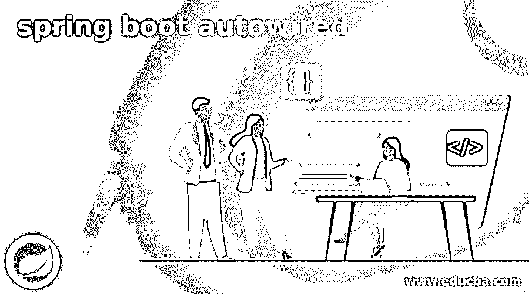

## 弹簧靴自动布线介绍

Spring boot autowired 是 Spring boot 框架的特性，它用于使我们能够隐式地注入依赖对象；它在 setter 或构造函数内部注入中使用。自动连线不用于字符串值或原始注入；spring boot autowired 需要的代码更少，因为我们不需要在显式注入依赖项时编写代码。此外，Autowired is 允许 spring 解析我们的 bean 中的协作 bean。Spring boot framework 将通过在 xml 配置文件中声明所有依赖项来启用自动注入依赖项。

### 弹簧靴自动布线概述

*   自动连线提供了对自动连线的细粒度控制，这已经完成。Autowired 注释用于 autowired bean 和 setter 方法中。
*   我们可以在 setter 方法上使用 autowired 注释来去掉 XML 配置文件中元素的属性。
*   当 spring boot 找到带有自动连接注释的 setter 方法时，它将尝试使用 byType 自动连接。
*   下面是自动连线的注释模式如下。
*   绰号
*   不
*   构造器
*   byType
*   自动检测
*   autowired annotation byName 模式用于根据 bean 名称注入依赖对象。在这种情况下，我们的 bean 名称和属性名称应该是相同的。该模式将在内部调用 setter 方法。
*   自动布线注释 no 模式是自动布线的默认模式。因此，在我们的项目中使用 autowired 注释时，我们不需要明确定义此模式。
*   自动连线批注构造函数模式将在调用类中的构造函数后注入依赖关系。这种模式通过使用更多的数字参数来调用构造函数。
*   自动连接的注释 byType 模式将根据类型注入依赖关系。
*   在我们的应用程序中使用 byType 模式时，bean 名称和属性名称是不同的。这个方法也在内部调用 setter 方法。
*   自动连线注释自动检测模式将从 spring boot 版本 3 中删除。
*   bean 属性 setter 方法只是配置方法的一个特例。自动连线参数是通过使用构造函数参数或在单个方法中声明的。

### 使用@Autowired

启用注释注入时，我们可以在 setter、constructor 和 properties 上使用自动连接。

<small>网页开发、编程语言、软件测试&其他</small>

我们可以通过以下方法使用自动布线。

*   在属性上自动连线
*   在 setter 上自动连线
*   在构造函数上自动连线

我们可以对每种方法的自动布线进行注释如下。

*   **@在属性上自动连线—**

我们可以使用@Autowired 注释来注释属性。这种方法将消除对 getter 和 setter 方法的需要。

为了首先使用这个方法，我们需要定义，然后我们需要将 bean 注入到服务中。

**定义 bean—**

`@Component ("autoproj")
public class autoproj {
public String format() {
return "aprj";
}
}`

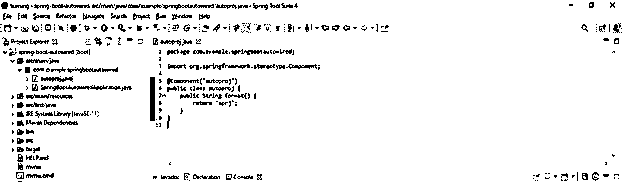

**将 bean 注入服务-**

``           @Component
public class autoprjser {
@Autowired
private autoproj autoproj;
}`

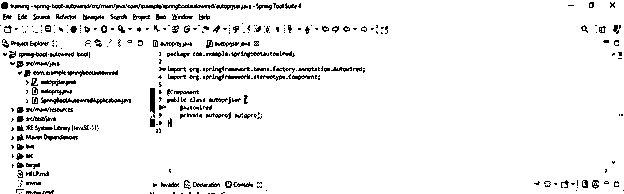

*   **@在 setter 上自动连线—**

在下面的例子中，我们在 setter 方法中添加了自动连接的注释。在下面的例子中，我们将 setter 方法称为 autosetter。

`public class autoset {
private autosetter autosetter;
@Autowired
public void setautosetter (autosetter autosetter) {
this.autosetter = autosetter;
}
}`

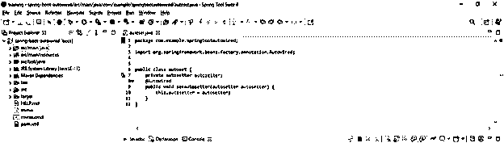

*   **@在构造函数上自动连线—**

在下面的例子中，我们在构造函数方法中添加了自动连接的注释。此外，在下面的例子中，我们用 autocon 构造函数注入了 spring 参数。

`public class autocon {
private autosetter autosetter;
@Autowired
public autocon(autosetter autosetter) {
this.autosetter = autosetter;
}
}`

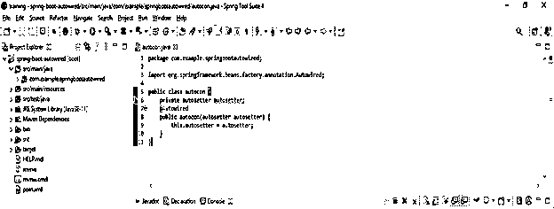

### 自动连线的示例

下面的例子显示了自动连线的一步一步的实现如下。

*   **使用 spring 初始化器创建一个项目模板，并给项目元数据命名如下。**

在下面的步骤中，我们提供项目组名为 com。例子包括工件名为 spring-boot-autowired，项目名为 spring-boot-autowired，打包为 jar 文件，选择 java 版本为 11。

`Group – com.example
Artifact name – spring-boot-autowired
Name – spring-boot-autowired
Description - Project of spring-boot- autowired
Package name - com.example.spring-boot- autowired
Packaging – Jar
Java – 11
Dependencies – spring web.`

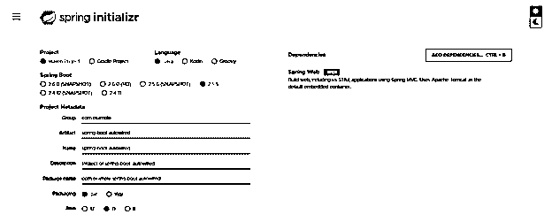

*   **生成项目后，提取文件，使用 spring 工具套件打开该项目—**

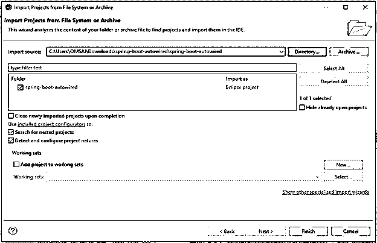

*   **使用 spring 工具套件打开项目后，检查项目及其文件—**

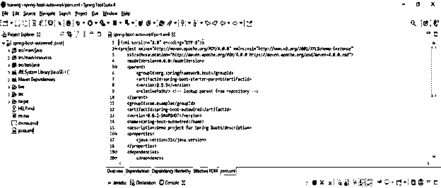

*   **添加依赖关系—**

**代码—**

`<dependency>   -- Start of dependency tag.
<groupId>org.springframework.boot</groupId>   -- Start and end of groupId tag.
<artifactId>spring-boot-starter-web</artifactId>  -- Start and end of artifactId tag.
</dependency>    -- End of dependency tag.`

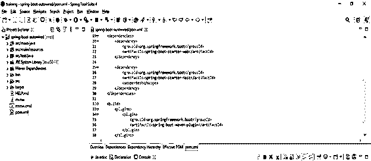

*   **创建自动连接的 java 文件-**

**代码—**

`public class springbootautowired {
private springauto springauto;
@Autowired
public void setSpellChecker ( springauto springauto ){
this.springauto = springauto;
}
public springauto getspringauto ( ) {
return springauto;
}
public void springauto() {
springauto.checkspringauto ();
}
}`

*   **创建另一个依赖类—**

**代码—**

`public class SpringAutoWired {
public SpringAutoWired(){
System.out.println ("Spring boot AutoWired" );
}
public void checkspringauto (){
System.out.println("Spring boot AutoWired" );
}        }`

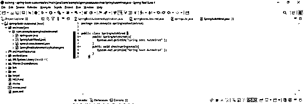

*   **创建主应用程序 java 文件—**

**代码—**

`public class SpringBootAutowiredApplication {
ApplicationContext context = new ClassPathXmlApplicationContext ("Autowired.xml");
autowired te = (autowired) context.getBean ("autowired");
te.springauto ();
}`

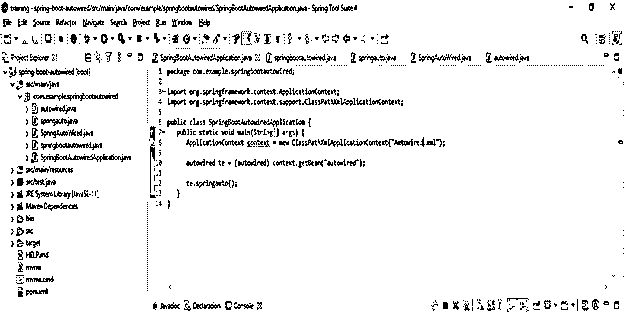

*   **创建 xml 文件-**

**代码—**

`<!-- Definition for autowired bean -->
<bean id = "autowired" class = "com.springbootautowired.autowired">
</bean>  -- End of bin tag.
<!-- Definition for springauto bean -->
<bean id = "springauto" class = "com.springbootautowired.springauto">`

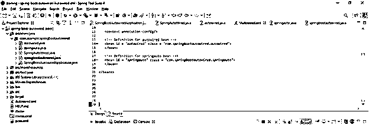

*   **使用 spring boot 应用运行 autowired 应用—**

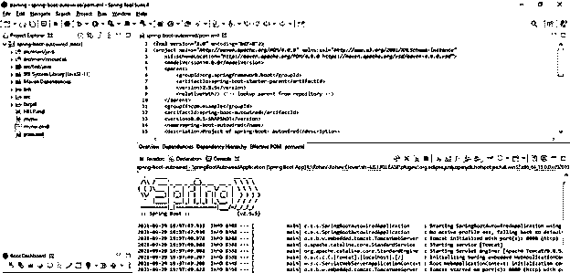

### 结论

Autowired 提供了对自动布线的细粒度控制，这已经完成。Spring boot autowired 注释用于 autowired bean 和 setter 方法中。Autowired 是 spring boot 框架的特性，它用于使我们能够隐式地注入依赖对象。

### 推荐文章

这是一个弹簧引导自动布线的指南。在这里，我们讨论了 autowired 的概述和示例以及代码。您也可以看看以下文章，了解更多信息–

1.  [Spring Boot 测井](https://www.educba.com/spring-boot-logging/)
2.  [春批架构](https://www.educba.com/spring-batch-architecture/)
3.  Spring Boot·HTTPS
4.  [Spring Boot 应用程序.属性](https://www.educba.com/spring-boot-application-properties/)

