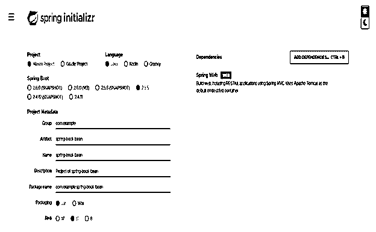
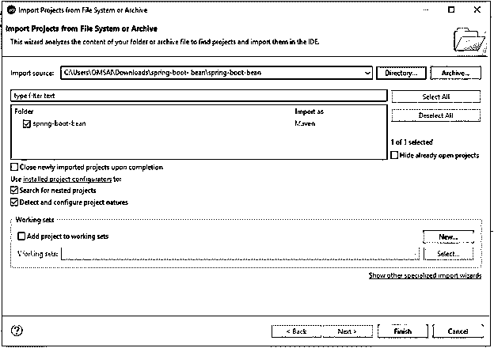
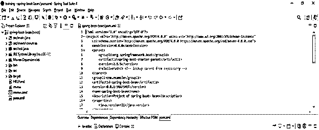
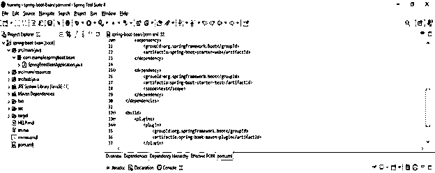
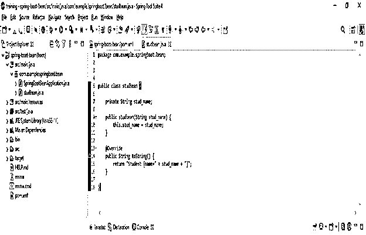
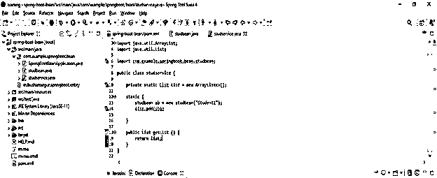
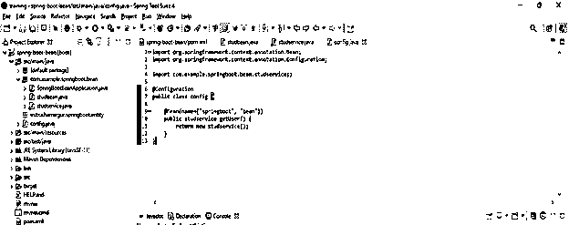
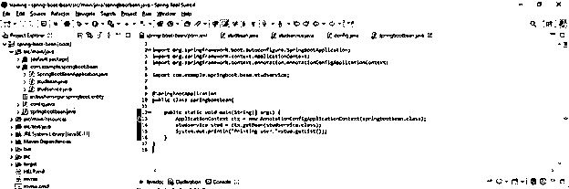
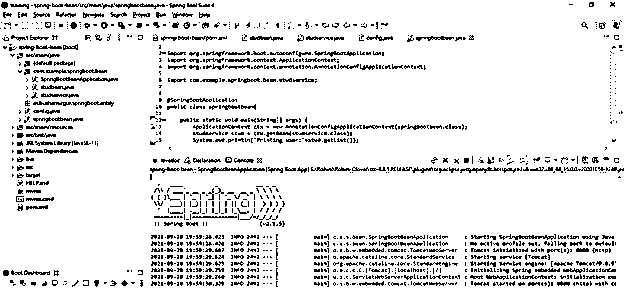

# 春靴豆

> 原文：<https://www.educba.com/spring-boot-bean/>

## spring boot bean 简介

Spring boot bean 是 Spring boot 框架的主干；此外，bean 是 spring 框架的关键概念。Spring bean 只不过是生命周期由 IoC spring 管理的对象；换句话说，我们可以说 spring boot bean 是 spring 应用程序的构建块。bean 是使用 spring IoC 容器组装、实例化和管理的对象。Spring boot bean 在我们的应用程序中有许多对象；bean 及其依赖包将反映在元数据配置中。

### Spring boot bean 概述

*   基本上，bean 是 spring boot 框架的关键概念，因此在我们的应用程序中使用 bean 非常重要和有用。
*   当在我们的应用程序中使用 bean 时，我们已经在我们的应用程序中使用了反转控制方法。
*   控制反转只不过是在我们的项目中用来定义对象依赖而没有创建相同对象的过程。反转控制对象将从另一个对象委托依赖性。
*   bean 注释将把 bean 的声明从类中分离出来，并创建我们选择的配置 bean。
*   bean 注释也称为方法级注释。我们已经在 java 代码中使用了这个注释。如果我们在项目中没有使用任何 xml 配置，我们将从应用程序上下文 get bean 方法中调用它。
*   核心 spring 容器在 spring boot 应用程序上创建和管理 bean。因此 spring boot @Bean 注释将告诉方法产生 Bean，并且它将使用 spring 容器进行管理。
*   在 java 配置时，bean 方法正在执行，它将返回注册到 bean 工厂中的值。
*   我们可以使用 spring boot 框架来定义 spring boot 应用程序中的依赖注入和 beans。
*   如果我们遵循 spring boot 应用程序的典型布局，我们不需要将参数的名称指定为@ComponentScan。

### 创建和使用 bean

*   下面的方法显示了如何使用 bean 创建 bean。
*   使用 XML 配置文件声明 bean。
*   通过使用组件注释。
*   通过使用配置注释
*   Bean 只是一个简单的 java 类，它包含属性以及 getter 和 setter 方法。
*   bean 的所有属性都依赖于 bean 的实例变量。
*   在 spring boot 应用程序中创建和使用 bean 的方法有很多。所有创建 bean 的方法都需要创建 bean 类；这个班被认为是最优秀的。
*   第一种方法是使用 xml 配置文件声明 bean 这种方法在创建 bean 时非常重要。使用这种方法，我们必须在 xml 配置文件中声明 bean。
*   第二种方法是使用组件注释，这是一个指示组件的类，它会自动检测到。
*   第三种方法是使用配置符号，这种方法需要一个 xml 文件，它用于创建 bean。

### 典型的域类

*   当使用 bean 开发应用程序时，我们已经在项目中创建了典型的域类。
*   Spring boot beans 域类表示列，而 table 列允许我们处理 java 对象的列值。
*   在 beans 中，域类由包含在数据类型中的所有值组成。
*   Bean 域类只是用于映射列的用户定义的类。
*   在开发 bean 应用程序时，bean 类的使用非常重要。spring boot 应用程序中的每个域类要么是外部的，要么是内部的。
*   内部域类通过使用元素名@Domain 进行注释。外部域类通过使用元素名@ExternamDomain 进行注释。

**以下选项为 bean 配置**

<small>网页开发、编程语言、软件测试&其他</small>

*   我们需要按照下面的步骤来配置 bean 配置如下。
*   首先，我们需要创建一个具有 bean 依赖性的 spring boot 项目。
*   创建项目后，我们需要添加 maven 依赖项。我们可以在项目创建的时候和之后添加 maven 依赖。
*   更新完依赖关系后，我们需要创建实体。
*   创建实体后，我们需要创建一个服务类。创建服务类后，我们正在配置该类。
*   配置完类之后，我们需要创建 bean 应用程序的主类。

### Bean 创建示例–

下面是 bean 创建的示例:

*   **使用 spring 初始化器创建项目模板—**

`Group – com.example
Artifact name – spring-boot-bean
Name – spring-boot- bean
Description - Project of spring-boot- bean
Package name - com.example.spring-boot- bean
Packaging – Jar
Java – 11
Dependencies – spring web.`

*   **生成项目后，提取文件，使用 spring 工具套件打开该项目—**

*   **使用 spring 工具套件打开项目后，检查项目及其文件—**

*   **添加 maven 依赖项—**

**代码—**

`<dependency>   -- Start of dependency tag.
<groupId>org.springframework.boot</groupId>   -- Start and end of groupId tag.
<artifactId>spring-boot-starter-web</artifactId>  -- Start and end of artifactId tag.
</dependency>    -- End of dependency tag.`

*   **创建实体—**

**代码—**

`public class studbean {
private String stud_name;
public studbean (String stud_name) {
this.stud_name = stud_name;
}
@Override
public String toString() {
return "Student [name=" + stud_name + "]";
}
}`

*   **创建服务—**

**代码—**

`public class studservice {
private static List list = new ArrayList<>();
static {
studbean sb = new studbean("Student1");
list.add (sb);
}
public List getList () {
return list;
}
}`

*   **创建配置类—**

**代码—**

`@Configuration
public class config {
@Bean(name={"springboot", "bean"})
public studservice getUser () {
return new studservice();
}
}`

*   **创建主类—**

**代码—**

`@SpringBootApplication
public class springbootbean {
public static void main /* main method */(String[] args) {
ApplicationContext ctx = new AnnotationConfigApplicationContext (springbootbean.class);
studservice stud = ctx.getBean (studservice.class);
System.out.println("Printing user:"+stud.getList());
}
}`

*   **运行应用程序—**

### 结论-弹簧靴豆

在 bean @bean 中，注释用于显式声明单个 Bean，而不是自动声明。我们在 spring boot 应用程序中使用多个注释来使用 bean。ComponentScan annotation 用于查找相应的注释和 beans 它也与@Autowired 注释一起使用。

### 推荐文章

这是一个关于春靴豆的指南。这里我们讨论 spring boot bean 的概述和示例以及代码。您也可以看看以下文章，了解更多信息–

1.  [春批架构](https://www.educba.com/spring-batch-architecture/)
2.  Spring Boot·HTTPS
3.  [春云相依](https://www.educba.com/spring-cloud-dependencies/)
4.  [Spring Boot 测井](https://www.educba.com/spring-boot-logging/)

