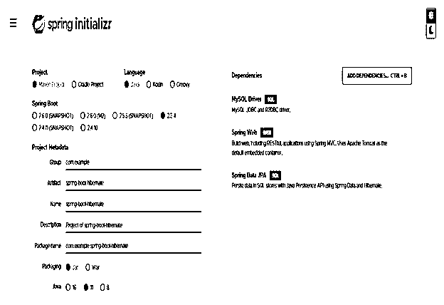
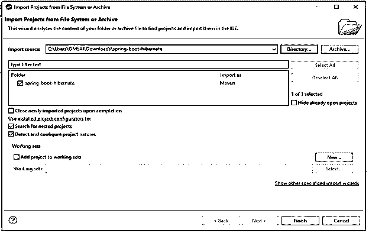
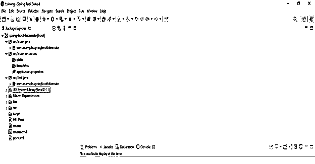
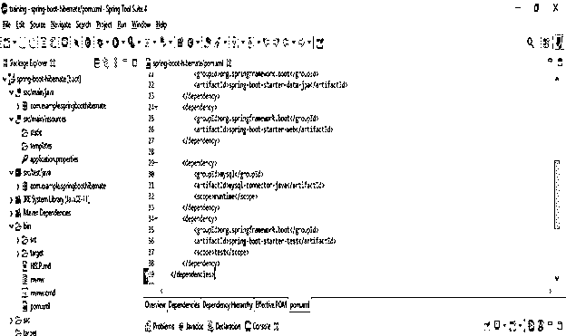
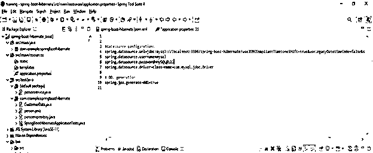
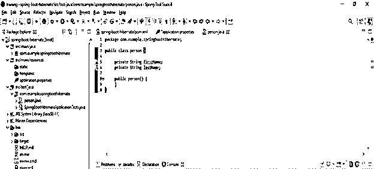
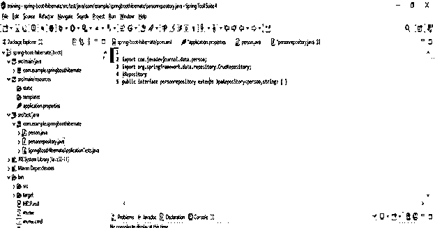
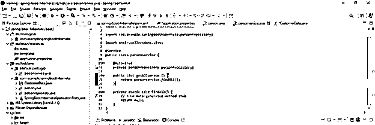
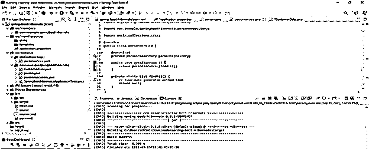
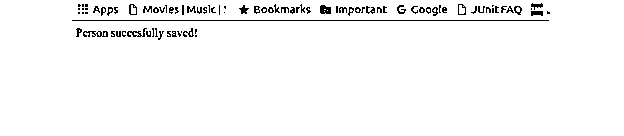

# 春季开机休眠

> 原文：<https://www.educba.com/spring-boot-hibernate/>

## spring boot 休眠简介

Spring boot hibernate 是对象关系映射解决方案，用于将对象关系数据库映射到 string boot hibernate 应用程序；这在 java 环境中使用。ORM 或对象关系映射是一种编程技术，用于将应用领域的模型对象映射到关系数据库表，如 MySQL、PostgreSQL 和 Oracle。Hibernate 是 java 环境对象关系映射工具，用于将关系数据库表映射到对象域。因此，我们也可以使用 spring boot hibernate 将对象域映射到数据库表。

### 什么是春开机冬眠？

*   Spring boot hibernate 为 java 的持久化 API 提供了实现参考；使用 hibernate，很容易进行对象关系映射。
*   Hibernate 是一个在与数据库交互时简化 java 应用程序开发的框架。
*   Spring boot hibernate 是一个用于开发 java 应用程序的开源框架。
*   Spring boot hibernate 正在为持久性数据实现 java 持久性 API 规范。
*   与其他框架相比，hibernate 的性能更快，因为 hibernate 在内部使用其缓存。
*   hibernate 中有两种类型的缓存可用，即一级缓存和二级缓存。
*   我们不需要启用一级缓存；默认情况下，它是由休眠框架启用的。但是，我们需要启用二级缓存，因为默认情况下，它是禁用的。
*   众所周知，hibernate 查询语言是面向对象编程 SQL 版本。在实施项目的时候，我们已经在 hibernate 中使用了 HQL。
*   Hibernate 查询语言正在生成数据库查询；我们不需要在使用 hibernate 时手动生成它。
*   使用 hibernate，我们不需要编写特定于数据库的查询；如果我们已经更改了数据库，我们就不需要编写特定的查询。
*   Spring boot hibernates 具有自动创建项目表的功能，因此我们不需要手动创建这些表。
*   通过使用 hibernate，我们可以很容易地从多个表中获取数据。
*   Hibernate 将支持查询缓存，并提供数据库和查询状态或统计数据。
*   Hibernate 将在内部处理项目实现。项目的实现包括数据库 CRUD 操作，也包括与数据库的连接。

### 弹簧引导休眠应用程序

*   Hibernate 应用程序通过使用 XML 文件来处理 java 类与数据库表的映射。为了进行数据库映射，我们不需要编写任何代码。
*   在使用 hibernate 应用程序时，如果我们必须在数据库级别进行任何更改，我们只需要更改 xml 文件的属性。
*   Spring boot hibernate 应用程序将从不熟悉的 SQL 中抽象出来，它为使用 java 对象提供了变通方法。
*   使用 hibernate 应用程序，我们不需要应用服务器来运行我们的项目。
*   Hibernate 应用程序处理数据库对象的复杂关联。
*   Hibernate 应用程序使用一个简单的查询来提供数据，这样我们就可以提高应用程序的性能。
*   Hibernate 应用程序支持以下数据库。

1.  一种数据库系统
2.  关系型数据库
3.  神谕
4.  DB2
5.  HSQL
6.  赛贝斯
7.  Informix
8.  FrontBase
9.  MSSQL
10.  MariaDB

*   我们可以使用上面的数据库服务器来开发 hibernate 应用程序。它将支持所有 RDBMS 数据库引擎。

### 创建春季启动休眠

下面的例子展示了如何创建一个 hibernate 项目。我们已经使用 spring 初始化器创建了一个新的 hibernate 项目。

<small>网页开发、编程语言、软件测试&其他</small>

*   使用 spring 初始化器创建一个项目模板，并为项目元数据指定以下名称。

`Group – com. example
Artifact name – spring-boot-hibernate
Name – spring-boot-hibernate
Description - Project of spring-boot-hibernate
Package name - com.example.spring-boot-hibernate
Packaging – Jar
Java – 11
Dependencies – MySQL driver, Spring web, Spring Data JPA.`

*   生成项目后，提取文件并使用 spring 工具套件打开该项目。

\

*   使用 spring 工具套件打开项目后，检查项目及其文件。

### Spring Boot 冬眠的例子

下面的例子显示了弹簧靴休眠。下面是 hibernate 示例中使用的步骤。

*   **在项目中添加依赖关系—**

下面，我们在 pom.xml 文件中添加了 maven 和数据库依赖项。

**代码—**

`<dependency>   -- Start of dependency tag.
<groupId>org.springframework.boot</groupId>   -- Start and end of groupId tag.
<artifactId>spring-boot-starter-web</artifactId>   -- Start and end of artifactId tag.
</dependency>   -- End of dependency tag.
<dependency>  -- Start of dependency tag.
<groupId>mysql</groupId>  -- Start and end of groupId tag.
<artifactId>mysql-connector-java</artifactId>  -- Start and end of artifactId tag.
<scope>runtime</scope>    -- Start and end of scope tag.
</dependency>   -- End of dependency tag.`

*   **配置数据库—**

在这一步中，我们必须在 application.properties 文件中将数据库名称配置为 MySQL。

**代码—**

`spring.datasource.url=jdbc:mysql://localhost:3306/spring-boot-hibernate?useJDBCCompliantTimezoneShift=true&useLegacyDatetimeCode=false&serverTimezone=UTC – MySQL database connection data source.
spring.datasource.username=mysql    -- Username to connect the database server.
spring.datasource.password=MySQL@123   -- Password to connect the database server.
spring.datasource.driver-class-name = com.mysql.jdbc.Driver  -- MySQL data source.
spring.jpa.generate-ddl=true`

*   **创建我们项目的 JPA 实体类—**

**代码—**

`public class person {   -- class name as person
private String firstName;   -- Person firstname
private String lastName;   -- Person lastname
public person() {
}
}`

*   **创建存储库—**

下面我们必须创建我们项目的存储库。

**代码—**

`@Repository
public interface person repository extends JpaRepository <person, string> { }`

*   **创建服务—**

下面我们要创建我们项目的服务。

**代码—**

`public class personservice {
@Autowired
private personrepository personRepository;
public List getAllperson () {
return personservice.findAll();
}`

*   **构建并运行项目—**

*   **访问应用程序并插入数据—**

我们必须使用下面的 URL 访问我们的应用程序并插入数据。

**代码—**

`http://localhost:8080/person/save?firstname=ABC&lastname=PQR`

### 结论

Hibernate 是一个对象关系映射解决方案，用于映射对象关系数据库。它提供了直接从数据库服务器检索 java 对象的简单 API。此外，hibernate 应用程序将通过使用数据提取策略来最小化对数据库的访问。

### 推荐文章

这是一个关于春开机休眠的指南。这里我们讨论如何创建 spring boot hibernate 和应用程序以及代码。您也可以看看以下文章，了解更多信息–

1.  [Spring Boot 批次](https://www.educba.com/spring-boot-batch/)
2.  [Spring Boot RestTemplate](https://www.educba.com/spring-boot-resttemplate/)
3.  Spring Boot 赛道
4.  [Spring Boot 简介](https://www.educba.com/spring-boot-profiles/)

