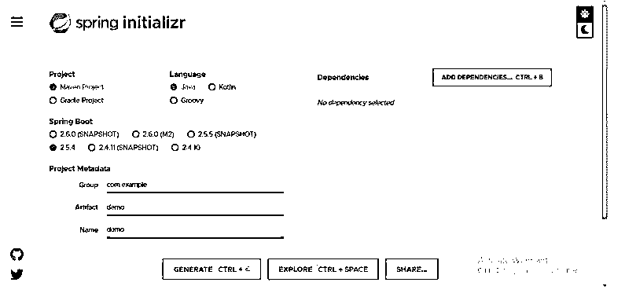
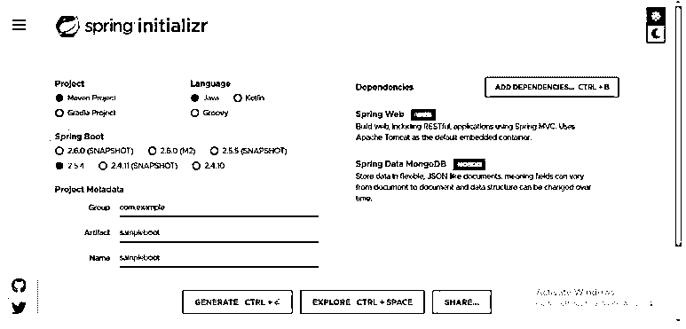
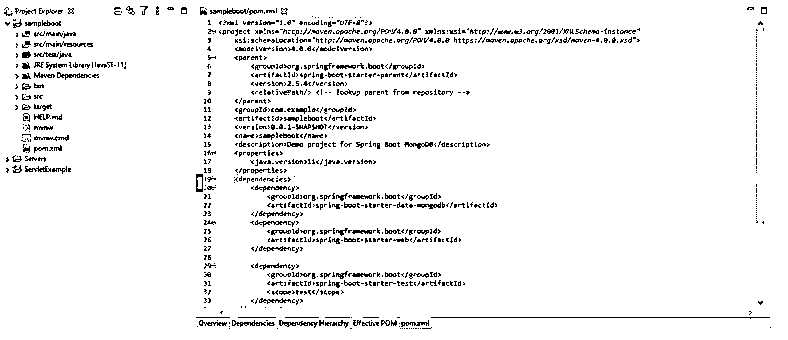

# Spring Boot·蒙戈 b

> 原文：<https://www.educba.com/spring-boot-mongodb/>

## Spring Boot MongoDB 简介

Spring Boot MongoDB 是伞形 Spring 数据项目的一部分，旨在为新的数据存储提供一个熟悉和一致的基于 spring 的模型。众所周知，spring boot 是一个自动配置的基于微服务的 web 框架，内置了用于数据库访问和安全目的的功能。在 spring boot 的帮助下，用户可以快速创建独立的应用程序，而无需任何配置更改。此外，MongoDB 是最受欢迎的 NoSQL 数据库，因为数据可以方便地存储和检索。因此，将 MongoDB 与 Spring boot 结合起来将会产生快速、安全、可靠的应用程序，只需要最少的开发时间。

### 从 Spring Boot·蒙戈开始

Spring boot 是一个快速的生产就绪应用程序，它使用 MongoTemplate 类和 MongoRepository 接口与 MongoDB 进行交互。MongoTemplate 类实现了一组现成的 API，是更新和聚合等操作的好选择。此外，它提供了对定制查询的良好控制。另一方面，mongoRepository 接口用于涉及文档领域的基本查询，如数据创建、文档查看等。

<small>网页开发、编程语言、软件测试&其他</small>

要定义依赖关系，请在 pom.xml 文件中:

`<dependency>
<groupId>org.springframework.data</groupId>
<artifactId>spring-data-mongodb</artifactId>
<version>3.2.5</version>
</dependency>`

Spring boot 是基于 Java 的 web 应用程序的应用程序框架，它基于 MVC 框架。它构建在 spring 框架上，通常用于 REST APIs，需要的配置更少。

它有 4 层:

*   **表示层:**查看 MVC 中处理前端 UI 的部分。
*   **业务层:**控制器，在这里进行业务逻辑和验证。
*   **持久层:**它将业务对象翻译成数据库对象。
*   **数据库层:** CRUD(创建、读取、更新、删除)操作在这里完成。

MongoDB 处理大量的结构化和非结构化数据，使得数据库成为 web 应用程序的选择。此外，MongoDB 中的数据存储为 BSON 对象，使数据检索更容易。

这里我们将利用 spring initializr 来快速设置项目；如上所述，我们将使用两个依赖项，MongoTemplate 和 MongoRepository。

步骤 1: 创建一个 Spring boot MongoDB 项目，使用 URL https://start.spring.io/.

**第二步:**选择项目为“Maven 项目”，语言为“Java”，以及所需的 spring boot 版本。提供项目所需的组值、工件值、名称和描述。包名将根据工件值自动生成。

**第三步:**将“Spring Web”和“Spring Data MongoDB”依赖项添加到项目中，点击 generate。

**步骤 4:** 点击 generate 按钮，一个新的项目被自动创建并下载到一个 zip 文件中。

**步骤 5:** 解压缩项目，并将其作为项目导入 Eclipse IDE 或任何其他可以工作的 IDE。

**步骤 6:** 由于 Maven 依赖项已经设置好了，如果需要的话，用户可以手动添加它们。

下面是已经生成的 pom.xml 文件。确保有一个稳定版本的 Spring Boot Maven 文件。

让我们看看如何创建 Spring Boot MongoDB REST API。

**步骤 1:** 通过使用 Spring Data MongoDB 存储库，我们将可以访问数据。首先定义存储库接口。

**步骤 2:** 使用下面的语法连接到 MongoDB 的本地实例。值会根据用户数据库凭据而变化。

`#Local MongoDB config
spring.data.mongodb.authentication-database=sampleadmin
spring.data.mongodb.username=sample123
spring.data.mongodb.password=sample@123
spring.data.mongodb.database=sample_userDB
spring.data.mongodb.port=202107
spring.data.mongodb.host=localhost`

`# App
config server.port=8080
spring.application.name=SpringBootMongoDB
server.context-path=/user`

该应用程序运行在 8080 端口上。

**第三步:**定义 API。

从 MongoDB 获取所有用户。

`@RequestMapping(value = "", method = RequestMethod.GET)
public List<User_sample> getUsers() {
LOG.info("To get all users: ");
return userRepository.findAll();
}`

**第四步:**添加用户。

`@RequestMapping(value = "/createUser", method = RequestMethod.POST)
public User_sample addUsers(@RequestBody User_sample user)
{
LOG.info("Adding a user."); return userRepository.save(user);
}`

**步骤 5:** 同样，我们可以删除用户，获取特定用户的详细信息等。

### Spring Boot MongoDB 模型类

*   它是一个以 POJO 为中心的模型，用于与 MongoDB 集合进行交互，并拥有一个存储库风格的数据访问层。
*   Spring config 支持副本集和 Mongo 驱动程序实例的基于 Java 的@Configuration 类或 XML 名称空间。
*   MongoTemplate 是一个助手类，它通过执行常见的 Mongo 操作来提高生产率，这些操作包括 POJOs 和文档之间的集成对象映射。
*   元数据的基于注释的映射，但在支持其他元数据格式方面也是可扩展的。
*   为存储库提供了 Map Reduce 集成和 CDI 支持。
*   MongoReader/ MongoWriter 实例的低级映射。

### 结论

至此，我们将结束“Spring Boot·蒙哥 DB”这个话题我们已经看到了 Spring Boot MongoDB 是什么以及 MongoDB 的用途。我们还看到了 Spring boot 在构建 Java 应用程序以及与 MongoDB 数据库集成时如何表现得像一个简单的框架。我们已经看到了如何将依赖性添加到 pom.xml 文件中。使用 spring initializr，我们已经创建了一个 spring 应用程序，并在 initializr 本身中集成了所需的 MongoDB 依赖项。我们还看到了用 Spring boot 应用程序实现 REST API 方法的步骤。

### 推荐文章

这是 Spring Boot MongoDB 的指南。这里我们讨论入门，先从 spring boot MongoDB 和 model class 开始。您也可以看看以下文章，了解更多信息–

1.  [Maven 资源库 Spring](https://www.educba.com/maven-repository-spring/)
2.  [Spring Boot 开发工具](https://www.educba.com/spring-boot-devtools/)
3.  [春季 AOP](https://www.educba.com/spring-aop/)
4.  [春云组件](https://www.educba.com/spring-cloud-components/)

