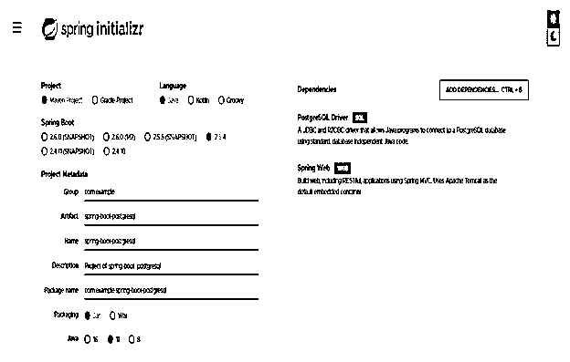
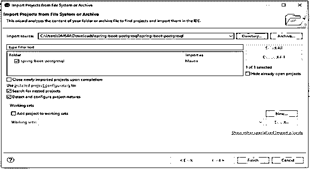
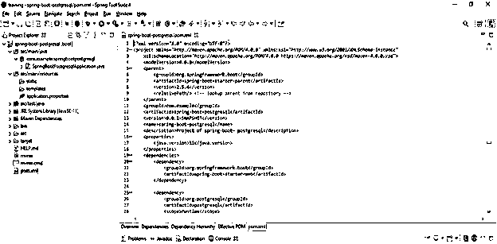
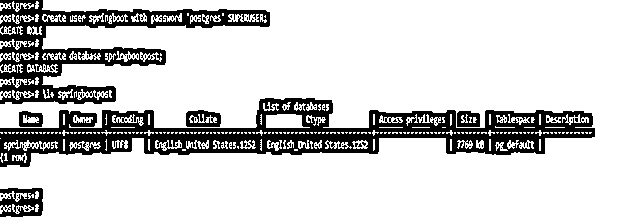
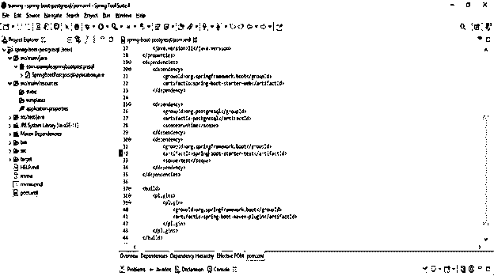
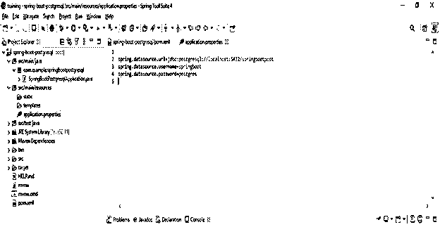
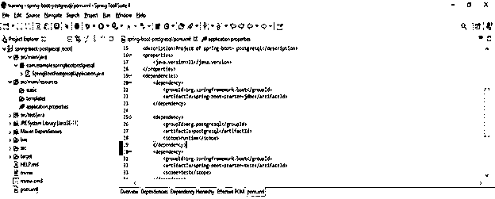
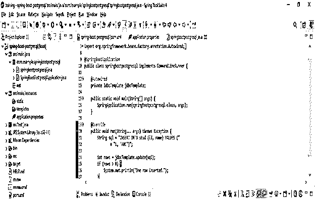
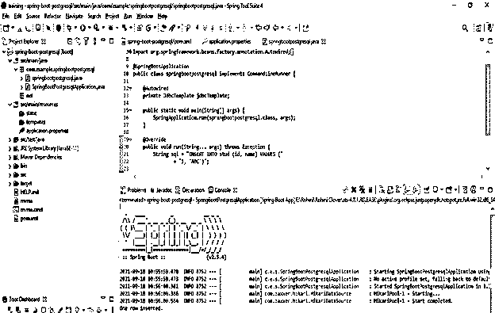

# 春季开机 postgresql

> 原文：<https://www.educba.com/spring-boot-postgresql/>

## spring boot postgresql 简介

Spring boot postgresql 展示了如何在 Spring boot 中使用 postgresql 数据库和应用程序，因为我们知道 spring boot 是一个非常流行的用于开发企业应用程序的 Java 框架。我们还可以使用 spring boot 和 PostgreSQL 数据库开发企业应用程序；我们还可以使用 PostgreSQL 开发独立的以及基于 web 的应用程序。要在数据库中使用 PostgreSQL，我们需要首先将其安装在同一台或另一台服务器上。我们已经使用 JDBC 模板通过 spring boot 连接了 PostgreSQL 数据库。

### 什么是 spring boot postgresql？

*   使用 spring boot，我们可以很容易地连接到数据库服务器。不幸的是，PostgreSQL 默认运行在端口 5432 上。我想我们要换一个港口。我们需要在配置文件中更改它。
*   我们可以使用 PostgreSQL 开发 web 应用程序，PostgreSQL 在 PostgreSQL 数据库上执行 CRUD 操作。
*   要使用我们数据库中的数据库和表，我们需要首先在数据库服务器上创建它；在 PostgreSQL 数据库服务器上创建它之后，我们可以在 PostgreSQL 应用程序中使用它。
*   为了在我们的应用程序中使用 PostgreSQL 数据库，我们需要在数据库服务器上做如下事情。

1.  创建数据库用户，以便从 spring boot 应用程序访问数据库。
2.  为创建的用户设置一个密码，我们用它来访问应用程序。
3.  为 spring boot 应用程序创建数据库。
4.  授予用户在我们创建的数据库上访问应用程序的权限。

*   我们需要使用一个 spring boot starter 来在我们的应用程序中使用 PostgreSQL 数据库。首先，spring boot starter 父节点将包含应用程序的配置。然后，使用起始网站来构建网页。
*   PostgreSQL 应用程序在开发应用程序时使用 tomcat 作为默认容器。因此，在使用 PostgreSQL 数据库开发应用程序时，我们需要在 pom.xml 文件中添加依赖关系。
*   此外，我们需要在配置文件中编写与 postgresql 项目相关的多个配置。最后，我们在应用程序中添加了 postgresql 依赖项，以便在应用程序中使用 PostgreSQL 数据库。

### 在 Spring Boot 使用 PostgreSQL

*   要使用 PostgreSQL 数据库开发应用程序，我们需要满足以下先决条件。

1.  弹簧靴 2.5.0
2.  Java 14
3.  PostgreSQL 12

*   有多个 PostgreSQL 版本可用；我们可以在开发应用程序时使用任何版本。
*   我们使用 spring JDBC 和 JDBC 模板来连接 PostgreSQL 数据库服务器。另外，我们可以使用 spring data 的 JPA 来连接 PostgreSQL 的数据库。
*   此外，我们需要添加 PostgreSQL 数据库的 JDBC 驱动程序依赖项，以允许 spring boot 应用程序与 PostgreSQL 数据库服务器连接或对话。
*   添加 PostgreSQL JDBC 依赖项后，我们需要添加数据源的属性，以使用数据库的连接信息。
*   我们必须在 PostgreSQL 应用程序的项目中的 pom.xml 文件中添加 PostgreSQL 依赖项。
*   我们还可以在项目中使用 spring 数据 JPA 进行高级使用。
*   要使用 PostgreSQL 开发应用程序，我们首先需要在项目中添加依赖项。然后，在添加了依赖项之后，我们需要配置数据源的属性。

### 春季启动 PostgreSQL 设置

下面的例子显示了如何设置 PostgreSQL 应用程序。下面的步骤显示了设置应用程序的示例如下。

<small>网页开发、编程语言、软件测试&其他</small>

*   **使用 spring 初始化器创建一个项目模板，并给项目元数据命名如下。**

`Group – com.example
Artifact name – spring-boot-postgresql
Name – spring-boot- postgresql
Description - Project of spring-boot- postgresql
Package name - com.example.spring-boot- postgresql
Packaging – Jar
Java – 11
Dependencies – spring web, PostgreSQL driver.`

*   **生成项目后提取文件，使用 spring 工具套件打开该项目**

在这一步，我们必须提取我们的 PostgreSQL 项目并在 spring 工具套件中打开。

*   使用 spring 工具套件打开项目后，检查项目及其文件。

在这一步中，我们将检查 postgresql 项目及其文件。但是，首先，我们必须检查项目的所有结构。

*   **检查项目后，创建数据库和用户**

在这一步中，我们创建用户名 spring-boot 和数据库名 springbootpost 来连接数据库服务器。

`# Create user springboot with password 'postgres' SUPERUSER;
# create database springbootpost;`

### Spring Boot PostgreSQL 示例

下面的步骤展示了 PostgreSQL 的例子如下。

*   **添加依赖关系**

创建示例的第一步是在 pom.xml 文件中添加 PostgreSQL 依赖项。

**代码**

`<dependency>   -- Start of dependency tag.
<groupId>org.postgresql</groupId>   -- Start and end of groupId tag.
<artifactId>postgresql</artifactId>  -- Start and end of artifactId tag.
</dependency>    -- End of dependency tag.`

*   **配置数据源属性**

**代码**

`spring.datasource.url=jdbc:postgresql://localhost:5432/springbootpost
spring.datasource.username=springboot
spring.datasource.password=postgres`

*   **使用 spring boot 连接 PostgreSQL 数据库**

**代码**

`<dependency>   -- Start of dependency tag.
<groupId>org.springframework.boot</groupId>   -- Start and end of groupId tag.
<artifactId>spring-boot-starter-jdbc</artifactId>  -- Start and end of artifactId tag.
</dependency>    -- End of dependency tag.`

*   **开发代码在 PostgreSQL 表中插入一行**

**代码**

`public class springbootpostgresql implements CommandLineRunner {
@Autowired
private JdbcTemplate jdbcTemplate;
public static void main /* main method */ (String[] args) {
SpringApplication.run (springbootpostgresql.class, args);
}
@Override
public void run(String... args) throws Exception {
String sql = "INSERT INTO stud (id, name) VALUES ("
+ "1, 'ABC')";
int rows = jdbcTemplate.update (sql);
if (rows > 0) {
System.out.println ("One row inserted.");    }`

*   **运行 postgresql 应用程序**

*   检查 postgresql 应用程序中插入的行

**代码**

`# select * from stud;`

### 结论

Spring boot PostgreSQL 是一个非常流行的 Java 框架，用于开发企业应用程序。Postgresql 展示了我们如何在应用程序中使用 PostgreSQL 数据库。例如，我们可以通过使用 PostgreSQL 开发一个 web 应用程序，它执行 CRUD 操作。

### 推荐文章

这是一个 spring boot PostgreSQL 的指南。这里我们讨论如何在 spring boot 中使用 PostgreSQL 数据库和应用程序。您也可以看看以下文章，了解更多信息–

1.  [PostgreSQL 重命名数据库](https://www.educba.com/postgresql-rename-database/)
2.  [PostgreSQL 编码](https://www.educba.com/postgresql-encode/)
3.  [PostgreSQL 列表数据库](https://www.educba.com/postgresql-list-databases/)
4.  [PostgreSQL 合并](https://www.educba.com/postgresql-merge/)

