# 弹簧靴托

> 原文：<https://www.educba.com/spring-boot-rest/>

## 弹簧靴托介绍

Spring boot rest 应用程序遵循 rest 的架构方法；我们使用 spring boot rest 来开发网络应用程序。Spring boot rest 会生成 HTTP 请求；此 http 请求正在对数据执行数据库 CRUD 操作；通常，Rest 返回 XML 或 JSON 格式的数据。Spring boot rest 被称为代表性状态转移；rest 的主要用途是使 web 服务更加有用和有效。Rest services 试图定义 HTTP 中已经存在的服务。

### 什么是弹簧靴托？

*   Spring boot rest API 是应用程序的中间编程接口，它使我们能够在两个应用程序之间进行通信。
*   Spring boot rest 是构建 web 服务更常见的方法，因为使用 rest 开发 web 服务太容易了。
*   使用 spring boot rest，可以开发向后兼容的 API 如果假设我们在 java 版本 14 中开发了 API，通过使用 spring boot rest，我们可以在 java 13 中运行这个 API。
*   Web 服务符合被称为 rest web 服务的架构风格。
*   Rest 服务允许请求系统通过使用预定义的统一操作集来操作和访问 web 资源的文本表示。
*   使用 spring boot rest，我们可以实现一个广泛使用且可伸缩的应用程序。我们可以通过 spring boot 使用 rest 服务来开发可伸缩的应用程序。
*   要使用 spring boot rest 创建项目，首先，我们需要在项目代码中添加依赖项。

### 带弹簧的休息服务

*   spring 中的 Rest 很快成为事实上的标准，因为 spring rest web 服务易于构建和使用，所以它被用来在 internet 或 web 上开发 web 服务。
*   用 spring 开发 rest 服务非常容易，一步一步来；我们可以用 spring 创建 rest 服务。开发 rest 服务非常简单，我们可以在 spring 3.0 及更高版本中实现 rest 服务。
*   下面是 rest 服务与 spring 的特点如下。
*   spring 中 rest 服务的第一个也是最重要的特征是无状态的。
*   通过 spring 使用 rest 服务，我们可以在任何合适的时候在资源上应用缓存。
*   通过 spring 使用 rest 服务，我们可以开发一个统一的 API 接口。
*   通过在 spring 中使用 rest 服务，我们可以将客户端应用程序和服务器应用程序分开。
*   spring 的 Rest 服务允许我们使用分层系统的架构。
*   我们已经使用 XML 和 JSON 用 spring 开发了 rest 服务。JSON 是使用 spring 开发 rest 服务的一种非常流行的格式。
*   关键抽象是我们在 spring web 服务中使用的资源。我们可以使用任何资源，通过 spring 使用 rest 服务来开发 API。
*   通过使用统一资源标识符来访问 spring 的 Rest 服务。

### 弹簧靴支架入门

*   我们可以使用 spring 初始化器来实现这个项目，并在开始其他工作时添加下面的依赖项。

1.  网
2.  作业的装配区（JobPackArea）
3.  氘

*   在选择了所有的依赖项之后，我们需要生成项目。在 zip 文件中生成项目后，我们需要解压缩它，并需要使用 spring 工具套件打开它。
*   我们可以使用任何 IDE 工具，如 spring tool suite、Net beans 和 eclipse 来打开项目。
*   我们需要以下软件来开发使用 spring 工具套件的应用程序。

1.  JDK 1.8 或更高版本
2.  Maven 3.2 +版本
3.  Spring boot 2.4 或更高版本
4.  Spring 工具套件或 Eclipse

*   为了使用 spring boot 测试开发应用程序，我们需要使用 spring boot 并使用 maven 开发一个项目。

### Restful web 服务注释

*   下面是 restful web 服务的注释。

1.  @Get
2.  @生产
3.  @路径
4.  @PathParam
5.  @QueryParam
6.  @帖子
7.  @消费
8.  @FormParam
9.  @放
10.  @删除
11.  @Head
12.  @CokieParam
13.  @选项
14.  @HeaderParam

*   Get annotation 方法将识别 URI 路径。PathParam 批注表示 URI 路径。
*   Get、put、head、delete 选项，post 将响应指定的请求。消费注释将定义媒体类型。

**代码**

<small>网页开发、编程语言、软件测试&其他</small>

下面的示例代码展示了 rest 的例子如下。

*   **使用 spring 初始化器创建项目模板—**

`Group – com.example
Artifact name – spring-boot-rest
Name – spring-boot- rest
Description - Project of spring-boot- rest
Package name - com.example.spring-boot- rest
Packaging – Jar
Java – 11
Dependencies – spring web.`

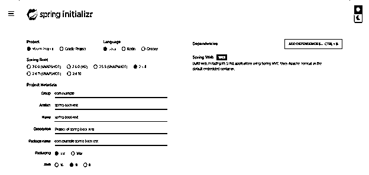

*   生成项目后，提取文件并使用 spring 工具套件打开该项目

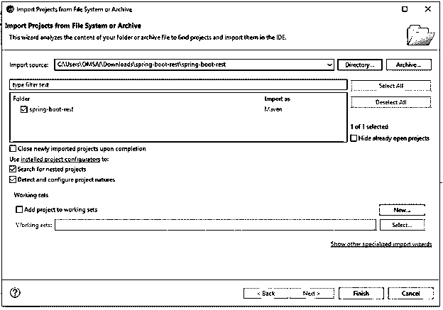

*   使用 spring 工具套件打开项目后，检查项目及其文件

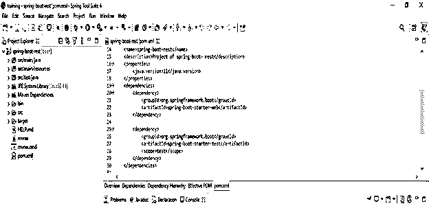

*   **添加依赖关系**

**代码**

`<dependency>   -- Start of dependency tag.
<groupId>org.springframework.boot</groupId>   -- Start and end of groupId tag.
<artifactId>spring-boot-starter-web</artifactId>  -- Start and end of artifactId tag.
</dependency>    -- End of dependency tag.`

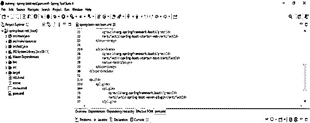

*   **创建模型类**

**代码**

`public class Product
{
private int product_id;
public Product()
{
}
public Product(int product_id)
{
super();
this.product_id = product_id;
}
public int getId ()
{
return product_id;
}
public void setId (int product_id)
{
this.product_id = product_id;
}
}`

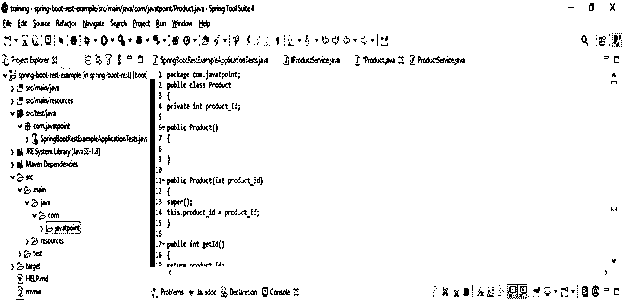

*   **创建控制器**

**代码**

`@RestController
public class ProductController
{
@Autowired
private IProductService productService;
@GetMapping(value = "/product")
public List<Product> getProduct ()
{
List<Product> products = productService.findAll ();
return products;
}
}`

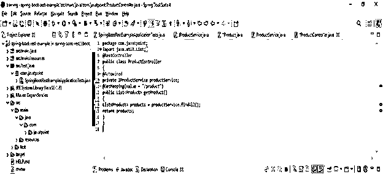

*   **创建界面**

**代码**

`public interface IProductService
{
List<Product> findAll();
}`

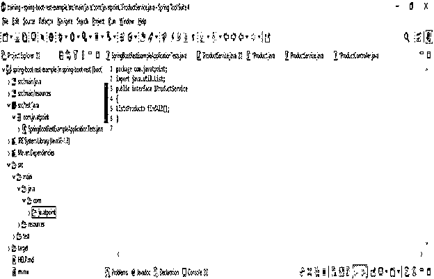

*   **创建服务类别**

**代码**

`public class ProductService implements IProductService
{
@Override
public List<Product> findAll()
{
ArrayList<Product> products = new ArrayList<Product>();
products.add (new Product(100));
products.add (new Product(101));
products.add (new Product(102));
return products;
}
}`

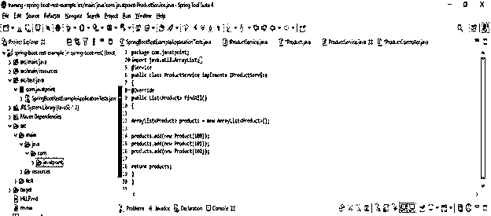

*   **创建 HTML 文件**

**代码**

`<head>
<title>Home page</title>
<meta charset="UTF-8">
<meta name="viewport" content="width=device-width, initial-scale=1.0">
</head>`

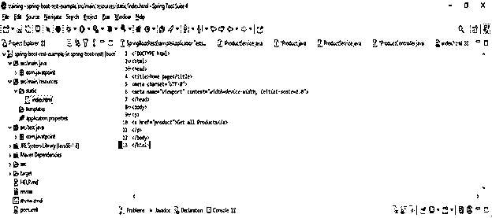

*   **运行应用程序—**

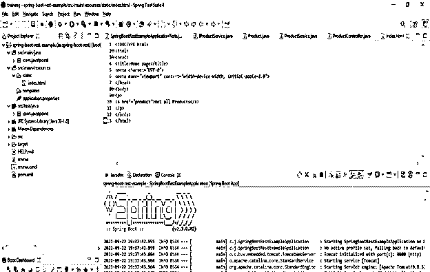

*   **在浏览器上检查输出-**

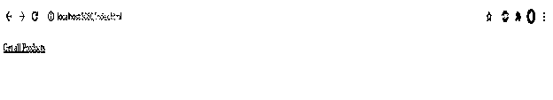

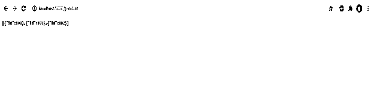

### 结论

Rest 只不过是用来开发基于网络的应用程序的基于网络的架构风格。Rest 定义了我们的应用程序如何在互联网上通信。例如，在 rest 中，客户端应用程序在客户端发出请求后被请求到服务器。

### 推荐文章

这是弹簧靴托的指南。在这里，我们讨论我们的应用程序是如何在互联网上与代码进行通信的。您也可以看看以下文章，了解更多信息–

1.  [Spring Boot 测井](https://www.educba.com/spring-boot-logging/)
2.  [Spring Boot 2](https://www.educba.com/spring-boot-oauth2/)
3.  [Spring Boot 运行命令](https://www.educba.com/spring-boot-run-command/)
4.  [Spring Boot 开发工具](https://www.educba.com/spring-boot-devtools/)

