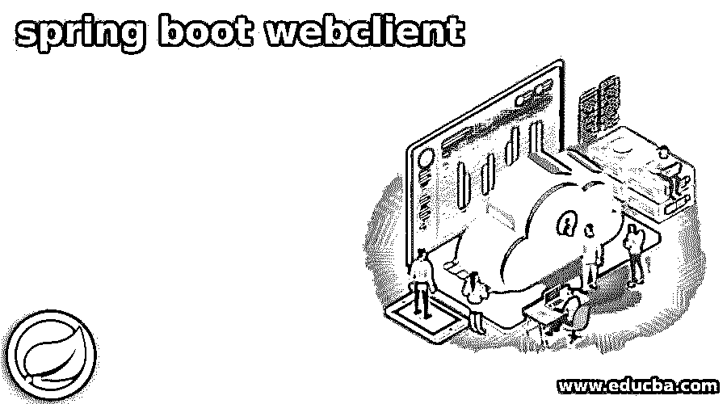
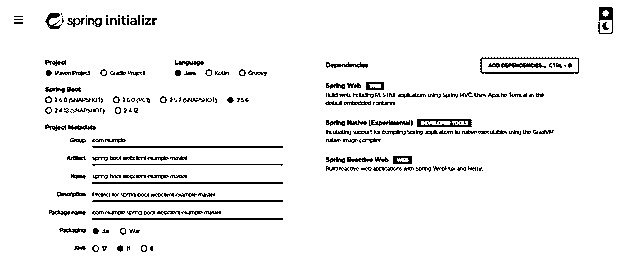
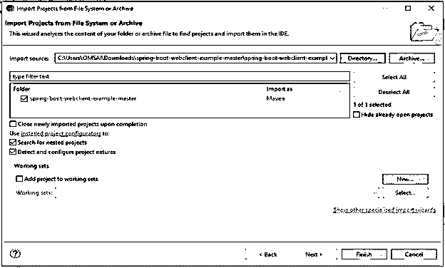
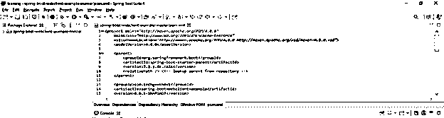
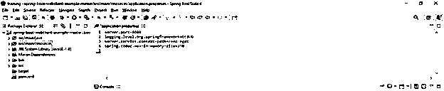
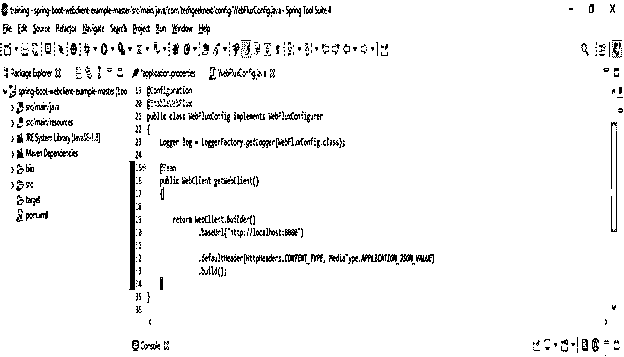
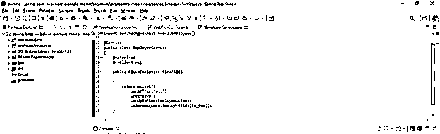
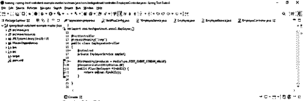
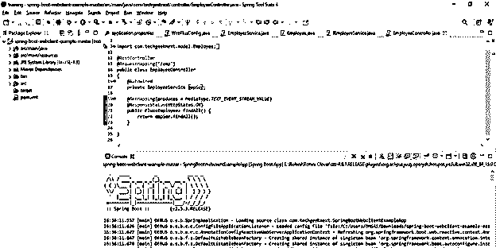

# Spring Boot 网络客户端

> 原文：<https://www.educba.com/spring-boot-webclient/>

## Spring Boot 网络客户端简介

Spring boot WebClient 基本上是反应式框架的一部分，用于构建非阻塞和反应式的基于 web 的应用程序。WebClient 是 spring MVC 项目的一部分，它将允许与 http 服务器通信；发布 spring 5 后，web 客户端是最好的，推荐用于客户端通信。此外，WebClient 是一个用于调用其他服务的组件。

### 什么是 Spring Boot 网络客户端？

*   WebClient 用于构建基于 web 的反应式应用程序。WebClient 支持非阻塞的 web 请求。
*   从 spring 5 开始，spring boot 使用的是 spring web 框架，也就是 spring webflux。
*   Spring boot WebClient 是用 spring boot MVC 的 API 设计的，但也是用来添加对非阻塞设计的支持。
*   使用 spring boot webflux，我们可以通过使用功能 API 和反应流来设计异步类型的 web 应用程序，以更好地支持伸缩性和并发性。
*   Spring boot WebClient 支持同步和异步类型的 web 应用程序。
*   此外，它将支持通过使用 functional fluent 的 API 进行同步和异步 http 请求，该 API 直接与我们现有的 spring 配置进行交互。
*   使用 WebClient，我们可以向 WebClient 的 API 发送 get 和 post 请求。
*   要使用 WebClient 发出请求，我们需要在应用程序的 pom.xml 文件中添加依赖关系。
*   我们需要在 pom.xml 文件上添加 spring boot starter webflux 依赖项。
*   添加了 spring boot starter webflux 依赖之后，我们就不需要添加 webflux 和 reactor-netty 依赖了；它将在我们的项目中添加 webflux 依赖项时自动配置。
*   Spring boot WebClient API 在现有的 http 客户端库之上使用。WebClient 主要使用 reactor netty，但我们也可以使用 apache reactive 组件和 http 客户端，或者我们也可以集成其他自定义连接器。
*   配置 WebClient 后，我们可以向 WebClient 发送 get 请求。

### Spring Boot 网络客户端依赖性

*   要使用 spring boot 开发 WebClient 的应用，我们需要在 pom.xml 文件中添加 spring boot starter webflux 依赖项。
*   在使用 spring boot maven 开发项目时，我们需要在 pom.xml 文件中添加以下依赖项。

**用 maven 构建 Spring Boot WebClient 项目—**

<small>网页开发、编程语言、软件测试&其他</small>

`<dependency>   -- Start of dependency tag.
<groupId>org.springframework.boot</groupId>   -- Start and end of groupId tag.
<artifactId>spring-boot-starter-webflux</artifactId>  -- Start and end of artifactId tag.
</dependency>    -- End of dependency tag.
<dependency>   -- Start of dependency tag.
<groupId>io.projectreactor</groupId>  -- Start and end of groupId tag.
<artifactId>reactor-test</artifactId>   -- Start and end of artifactId tag.
<scope>test</scope>
</dependency>   -- End of dependency tag.
<dependency>    -- Start of dependency tag.
<groupId>org.springframework.boot</groupId>   -- Start and end of groupId tag.
<artifactId>spring-boot-starter-web</artifactId>    -- Start and end of artifactId tag.
</dependency>    -- End of dependency tag.
<dependency>   -- Start of dependency tag.
<groupId>org.springframework.experimental</groupId>  -- Start and end of groupId tag.
<artifactId>spring-native</artifactId>    -- Start and end of artifactId tag.
<version>${spring-native.version}</version>
</dependency>    -- End of dependency tag.
<dependency>   -- Start of dependency tag.
<groupId>io.projectreactor</groupId>    -- Start and end of groupId tag.
<artifactId>reactor-test</artifactId>     -- Start and end of artifactId tag.
<scope>test</scope>
</dependency>   -- End of dependency tag.`

*   添加了 spring boot 的 webflux 依赖项后，其他依赖项会自动添加。在添加 webflux 依赖项之后，我们不需要单独添加另一个依赖项。
*   在使用 spring boot gradle 开发项目时，我们需要在 build.gradle 文件中添加以下依赖项。

**使用 gradle 构建 WebClient 项目—**

`dependencies
{
compile 'org.springframework.boot: spring-boot-starter-webflux'
}`

### 工作 Spring Boot 网络客户端

*   使用 WebClient 时，我们需要遵循以下步骤。
*   首先，我们需要创建一个 WebClient 实例。要创建 WebClient 实例，首先，我们需要创建一个 WebClient 对象。创建对象后，我们需要启动 WebClient 实例。最后，在初始化实例之后，我们需要使用 builder 类来构建客户机。
*   创建实例后，定义准备请求的方法；定义方法后，下一步是定义准备请求的 URL。
*   定义 URL 后，下一步是定义准备请求的主体。定义了主体之后，下一步是为准备请求定义头部。
*   创建所有设置后，最后一步是发送请求并从 WebClient 获得响应。

### 创建和配置 WebClient

以下示例显示了如何创建和配置 WebClient，如下所示。

*   **使用 spring initializer 创建一个项目模板，并给项目命名为—**

在下面的步骤中，我们已经提供了项目组名称、工件名称、包和描述。

`Group – com.example
Artifact name – spring-boot-webclient-example-master
Name – spring-boot-webclient-example-master
Description - Project for spring-boot-webclient-example-master
Spring boot – 2.5.5
Project – Maven project
Package name - com.example. spring-boot-webclient-example-master
Packaging – Jar
Java – 11
Dependencies – spring native, spring web, spring reactive web.`

*   **生成项目后，提取文件，使用 spring 工具套件打开该项目—**

*   **使用 spring 工具套件打开项目后，检查项目及其文件—**

*   **添加依赖包—**

*   **配置 application.properties 文件—**

**代码—**

`server.port=8080
logging.level.org.springframework = DEBUG
server.servlet.context-path = /emp_mgmt
spring.codec.max-in-memory-size = 2MB`

*   **配置 webflux 客户端—**

**代码—**

`@Configuration
@EnableWebFlux
public class WebFluxConfig implements WebFluxConfigurer
{
Logger log = LoggerFactory.getLogger (WebFluxConfig. Class);
@Bean
public WebClient getWebClient ()
{
return WebClient.builder ()
.baseUrl ("http://localhost:8080")
.defaultHeader (HttpHeaders.CONTENT_TYPE, MediaType.APPLICATION_JSON_VALUE)
.build ();
}
}`

### Spring Boot 网络客户端示例

下面是 WebClient 的例子。

*   **从网络客户端检索和交换数据—**

**代码—**

`@Service
public class EmployeeService
{
@Autowired
WebClient wc;
public Flux<Employee> findAll()
{
return wc.get()
.uri ("/get/all")
.retrieve ()
.bodyToFlux (Employee.class)
.timeout (Duration.ofMillis (10_000));
}
}`

*   **创建休息控制器-**

**代码—**

`@RestController
@RequestMapping("/emp")
public class EmployeeController
{
@Autowired
private EmployeeService empSer;
@GetMapping(produces = MediaType.TEXT_EVENT_STREAM_VALUE)
@ResponseStatus (HttpStatus.OK)
public Flux<Employee> findAll() {
return empSer.findAll ();
}
}`

*   **运行并测试应用程序—**

### 结论

WebClient 用于构建基于 web 的反应式应用程序。WebClient 支持非阻塞的 web 请求。WebClient 基本上是一个反应式框架的一部分，用于构建非阻塞和反应式的基于 web 的应用程序。

### 推荐文章

这是一个 Spring Boot 网络客户端的指南。这里我们讨论创建和配置 Spring Boot 网络客户端的例子以及代码。您也可以看看以下文章，了解更多信息–

1.  [Spring Boot·梅文](https://www.educba.com/spring-boot-maven/)
2.  [Spring Boot 的名字缩写](https://www.educba.com/spring-boot-initializr/)
3.  [Spring Boot 批次](https://www.educba.com/spring-boot-batch/)
4.  [Spring Boot 换港](https://www.educba.com/spring-boot-change-port/)

