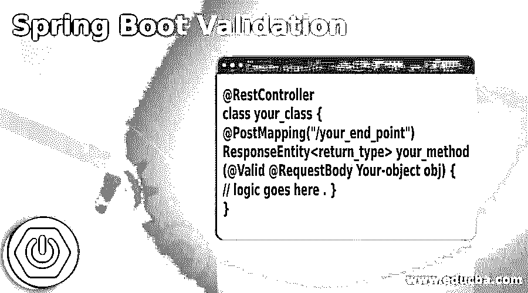

# Spring Boot 验证

> 原文：<https://www.educba.com/spring-boot-validation/>

## Spring Boot 验证简介

在 Spring boot 中，我们可以轻松地应用验证；比 spring 框架简单多了。我们在 spring boot 中有一个验证器，使用起来也很简单。为了使用它，我们不需要实现或配置任何复杂的逻辑；我们可以通过给对象添加有效的注释来开始使用验证，它会在内部为我们做这些事情。在 spring boot 中，它会自动为我们做这个验证部分，而不需要实现任何东西。在这里，我们将看到它在内部是如何工作的，以及我们如何开始在我们的应用程序中使用它来在我们的代码中应用服务器端验证。

**Spring Boot 验证的语法**

<small>网页开发、编程语言、软件测试&其他</small>

我们可以在 spring boot 控制器类上使用有效的注释。要使用它，我们需要遵循 spring boot 框架给出的基本标准。

`@RestController
class your_class {
@PostMapping("/your_end_point")
ResponseEntity<return_type> your_method(@Valid @RequestBody Your-object obj) {
// logic goes here . }
}`

正如您在上面的语法行中看到的，我们正在尝试使用@Valid 注释来验证我们的对象传递。这很容易使用和处理。在这里，我们将更详细地了解需要进行的其他配置。

**举例:**

`@RestController
class Demo {
@PostMapping("/test")
void test(@Valid @RequestBody Emp emp) {
// logic goes here.
}
}`

从上面这段语法可以清楚地看出，我们只需要用 spring boot 的@Valid 注释来注释方法和对象。

### 在 Spring Boot，验证是如何进行的？

正如我们已经知道的，我们不需要在 spring boot 中做很多配置来在我们的控制器级别验证对象；这也称为服务器端验证。为此，我们可以使用 spring boot 中的@Valid 注释，它在内部为我们做了所有的事情来验证控制器本身中的对象。

在这里，我们将看到如何在 spring boot 应用程序中使用它来验证控制器的请求对象。

1.将依赖项添加到 pom.xml 或 build.gradle 中。

`<dependency>
<groupId>org.springframework.boot</groupId>
<artifactId>spring-boot-starter-validation</artifactId>
</dependency>`

为了在应用程序中使用这个注释，我们必须有这种依赖性。添加之后，我们可以访问实体类中的各种验证约束来验证它们。

2.成功添加依赖项后，我们现在可以在实体类中添加验证约束，以使用@Valid 注释验证请求中的对象。

在这里，我们将看到一段示例代码，展示如何在我们的实体中使用各种验证约束。

**举例:**

`@Entity
@Table(name = "EMP")
public class Employee implements Serializable {
@Id
@GeneratedValue(strategy = GenerationType.IDENTITY)
@Column(name = "ID")
private Long id;
@Column(name = "NAME")
@NotBlank(message = "Employee Name is mandatory to fill !!")
private String name;
@Enumerated
@Column(name = "STATE_ID")
private State state;
@Column(name = "CITY")
@NotBlank(message = "employee city is mandatory to fill !!")
private String city;
@Column(name = "DEPARTMENT_NAME")
@NotBlank(message = "employee department Name is mandatory to fill !!")
private String departmentName;
@Column(name = "SALARY")
@NotBlank(message = "employee salary is mandatory to fill !!")
private Double salary;
}`

正如您在上面的代码中看到的，我们已经创建了一个带有验证约束的实体，这个类的名称是 Employee，现在我们可以使用 spring boot 提供的验证器来验证这个对象。

3.现在，在这之后，我们应该有一个 rest 控制器，它负责为我们处理 HTTP 请求。现在，我们必须为它提供一个名称和一个方法，该方法将处理请求并仅在方法级别验证对象。

在这里，我们将看到如何使用 spring boot 框架中的@Valid 注释来实现这一点。

**举例:**

`@RestController
public class EmployeeController {
@PostMapping("/validate")
ResponseEntity<String> addEmp(@Valid @RequestBody Employee emp) {
// your logic will go here ..//
}
}`

正如您在上面这段代码中看到的，我们首先创建了一个用@RestController 注释的类，它将告诉 spring 它将为我们处理请求。之后，我们创建了一个名为 addEmp 的方法，负责将雇员添加到数据库中。但是在这个方法中，我们有两个东西@Valid 和@RequestBody，它们会将 json 转换成相应的 spring 对象。@Valid here 首先也根据我们创建的实体验证对象；我们已经提供了它们的验证约束；如果它工作正常，那么它将进入下一步保存对象；否则，它会抛出一个异常。

4.现在，最后一步是创建 Spring main 类来启动应用程序；这个类只有相同的结构；我们可以给它起任何我们想要的名字，不受限制。

`@SpringBootApplication
public class DemoApplication {
public static void main(String[] args) {
SpringApplication.run(DemoApplication.class, args);
}
}`

这是应用程序初始化开始的主类。没有这一点，应用程序将无法工作；这里，我们必须使用@SpringBootApplication 注释和这个类内部的 main 方法。

### 结论

非常需要服务器端验证来验证对象是否包含有效值。它还将确保对象是有效的，并且可以用于进一步的过程或操作。它非常容易使用和处理；为了在 Spring Boot 框架中使用这种验证，我们只需要注意已经添加的依赖关系。

### 推荐文章

这是一个 Spring Boot 验证指南。这里我们讨论一下 spring boot 中的介绍和验证是如何工作的？分别是。您也可以看看以下文章，了解更多信息–

1.  [Maven 资源库 Spring](https://www.educba.com/maven-repository-spring/)
2.  [Spring Boot 开发工具](https://www.educba.com/spring-boot-devtools/)
3.  [春季 AOP](https://www.educba.com/spring-aop/)
4.  [春云组件](https://www.educba.com/spring-cloud-components/)

