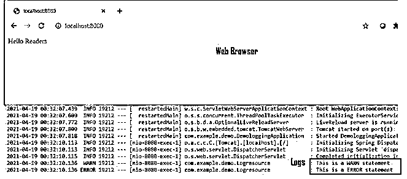
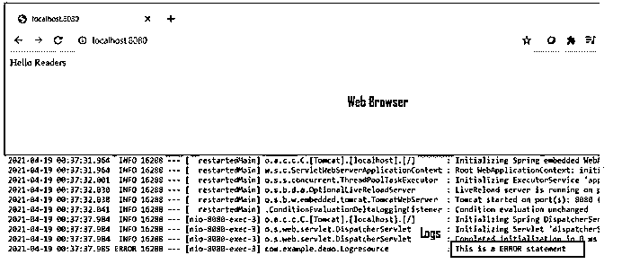
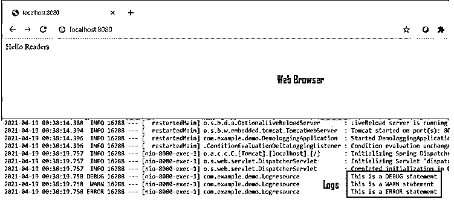

# Spring Boot 伐木公司

> 原文：<https://www.educba.com/spring-boot-logging/>

## Spring Boot 测井简介

Spring boot logging 被定义为一个框架，它使开发人员能够跟踪应用程序运行中可能出现的错误。spring boot 中的日志记录基本上是一个 API，它提供了对信息的跟踪，以及对应用程序运行期间可能发生的任何严重故障的记录。Spring boot 使用一个通用的日志框架来实现所有的内部日志，并保持日志实现的开放性。Commons logging 的 USP 是一个瘦适配器，它允许可配置地桥接其他日志记录系统。spring boot logging 提供的默认配置是 Java Util logging、Log4J2、Logback。默认配置中的记录器是为使用控制台输出而预先配置的。

### Spring Boot 测井的语法

如上所述，Spring boot logging 是一个日志框架，它提供了日志实现的灵活性。例如，如果开发人员使用“Starters”，logback 用于日志记录。框架中包含了回退路由，以确保所有使用 Java Util 日志记录、Log4J2、Commons 日志记录等的依赖库。，共振工作。这里我们将从语法的角度来看 spring boot 日志记录。

<small>网页开发、编程语言、软件测试&其他</small>

1.实例化根的日志级别。

`logging.level.root = <log level>`

<log level="">可根据应用要求，由以下任何日志级别代替。</log>

**可用的日志级别有:**“跟踪”、“调试”、“信息”、“警告”、“错误”、“致命”、“关闭”。

2.指定日志文件路径。

`logging.path = /<path of the file>`

3.指定日志文件名。

`logging.file = /<path of the file>/<log file name>.log`

4.导入记录器类。

`import org.slf4j.Logger;
import org.slf4j.LoggerFactory;`

5.定义 logging.xml 模式。

`<pattern> define the pattern here </pattern>`

6.定义 logging.xml 模式。

`logging.pattern.console = <logging pattern goes here>`

### Spring Boot 的伐木业是如何运作的？

使用它时，理解日志的打印格式是很重要的。

默认的 spring 引导日志文件包含以下项目:

*   **日期和时间:**提供日志项发生的日期和时间。
*   **日志级别:**这提供了日志的信息级别的信息。这将是我们现在看到的 7 个选项之一，即跟踪、调试、信息、警告、错误、致命或关闭。
*   **进程 ID:** 这提供了运行 spring boot 应用的进程 ID 的信息。
*   **分隔符:** —这是表示日志下一部分的分隔符。
*   **线程名称:**这包含在方括号([ ])中，主要包含日志记录线程或元素所在的线程。
*   **Logger Name:** 这是包含源类名的倒数第二个元素。
*   **日志消息:**最后，这个元素包含日志消息，它解释了应用程序中遵循的方法，并帮助我们在应用程序中出现错误时追溯到根本原因。

7 选项的严重程度按以下顺序排列(从低到高)。

*   找到；查出
*   调试
*   信息
*   警告
*   错误
*   致命的
*   离开

应用程序中提到的日志级别决定了日志消息的细节。用最佳方面配置日志级别可以节省大量时间。例如，当级别显示为致命时，应用程序实际上应该遇到了一些严重的故障。一旦开发了应用程序的架构，就应该仔细设置日志，以便更容易追溯到根点。我们不希望每次都看到日志中提到一些关于进程的信息。在由于不适当的架构而将该信息分类为致命的情况下，这是可能的。

在每个分类选项可用的情况下，当应用程序中的代码执行时，相对于为应用程序声明的级别来验证相应的选项；如果为应用程序声明的级别的严重性低于代码执行点，它将被放入日志消息中。人们可以通过使用代码 logging.level.com 来声明等级。 <application name="">= <logging level="">。现在让我们假设在代码执行期间，由于一些我们没有考虑到的极端情况，代码中断并失败。代码的位置被放入具有适当级别的日志消息中。但是，如果代码执行产生的级别没有声明的应用程序级别严重，则跳过日志记录。</logging></application>

一旦判断出应该放什么，应用程序就会寻找 xml 或 java 代码中声明的模式，并提取和记录相应的元素。开发人员也可以选择将日志输出到中，按照提到的路径和文件，日志会输出到文件中。另一个要素是，如果终端支持 ANSI，用户可以选择在控制台中使用彩色编码的日志输出。

### Spring Boot 测井示例

下面是 Spring Boot 测井的例子:

不同情况下的 Spring Boot 伐木。

**语法:**

**Logresource.java:**

`package com.example.demo;
import org.springframework.web.bind.annotation.RequestMapping;
import org.springframework.web.bind.annotation.RestController;
import org.slf4j.Logger;
import org.slf4j.LoggerFactory;
@RestController
public class Logresource {
Logger logger = LoggerFactory.getLogger(Logresource.class);
@RequestMapping("/")
public String home() {
logger.debug("This is a DEBUG statement");
logger.warn("This is a WARN statement");
logger.error("This is a ERROR statement");
return "Hello Readers";
}
}`

**demologgingapplication . Java:**

`package com.example.demo;
import org.springframework.boot.SpringApplication;
import org.springframework.boot.autoconfigure.SpringBootApplication;
@SpringBootApplication
public class DemologgingApplication {
public static void main(String[] args) {
SpringApplication.run(DemologgingApplication.class, args);
}
}`

**输出:**

**logging . level . com . example . demo = WARN 是一个 application.properties 文件:**

**logging . level . com . example . demo = ERROR 是一个 application.properties 文件:**

**logging . level . com . example . demo = TRACE 是一个 application.properties 文件:**

在本例中，我们看到日志严重性高于 application.properties 中初始化的严重性，只有该消息被记录，其他消息被忽略。

### 结论

总之，在本文中，我们看到了 spring boot 日志记录，以及 spring boot 为开发人员提供的灵活性。接下来是一小段试图复制日志概念的代码。

### 推荐文章

这是 Spring Boot 伐木指南。这里我们讨论一下入门，日志在 spring boot 中是如何工作的？和示例。您也可以看看以下文章，了解更多信息–

1.  [Maven 资源库 Spring](https://www.educba.com/maven-repository-spring/)
2.  [Spring Boot 开发工具](https://www.educba.com/spring-boot-devtools/)
3.  [春季 AOP](https://www.educba.com/spring-aop/)
4.  [春云组件](https://www.educba.com/spring-cloud-components/)

