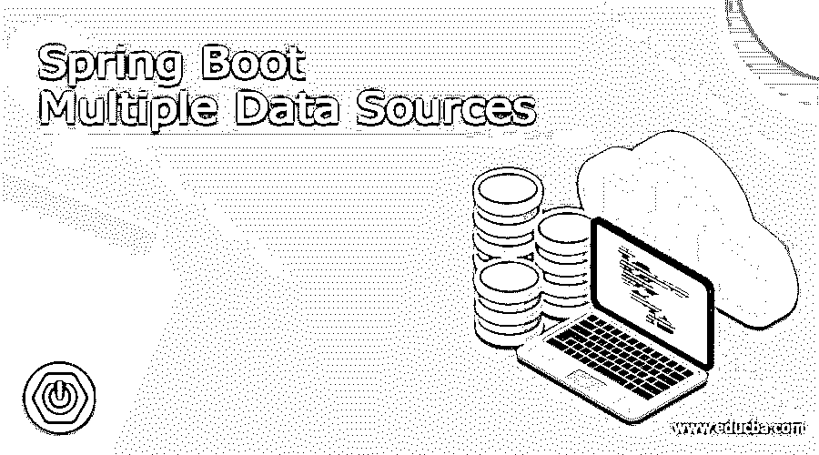

# Spring Boot 多数据源

> 原文：<https://www.educba.com/spring-boot-multiple-data-sources/>

## Spring Boot 多数据源的定义

在 spring boot 中，我们可以配置多个数据源，帮助我们与不同的数据库进行交互。通过使用这个，我们可以根据需求使用不同的数据源。但是要在 spring boot 中实现这一点，我们必须在我们的应用程序中进行大量配置，我们将看到两个数据源，我们可以在应用程序中配置它们并用于不同的目的，我们可以将这两个不同实体的对象存储到不同的类中。在这一节中，我们将介绍如何实现这一点，我们需要哪些不同的配置，以及初学者如何理解它的内部工作原理。

**语法:**

<small>网页开发、编程语言、软件测试&其他</small>

正如我们已经知道和讨论过的，这需要大量的配置来实现，但是这里我们将看到一些在应用程序中使用它时需要的主要注释

让我们从基本语法开始。

`@Configuration
@EnableJpaRepositories(
entityManagerFactoryRef = "db2EntityMgrFactory",
transactionManagerRef = "db2TransactionMgr",
basePackages = { "yor_base_package_name" })
@EnableTransactionManagement`

正如您在上面的语法行中看到的，我们在这里使用了不同的注释，来配置应用程序的多个数据源。在基础包中，我们可以为包含 JPA 的存储库编写自己的基础包，以便与持久层进行交互。让我们来看看简单的练习语法，以便更好地理解。

**例如:**

`@Configuration
@EnableJpaRepositories(
entityManagerFactoryRef = "db2EntityMgrFactory",
transactionManagerRef = "db2TransactionMgr",
basePackages = { "com.example.datasources.student.repository" })
@EnableTransactionManagement`

如您所见，我们现在已经为包含存储库的学生实体指定了基础包。在接下来的部分中，我们将看到其他所需配置的内部工作，这是实现这一工作所必需的。

### 如何在 Spring boot 中使用多个数据源？

在这一节中，我们将了解实现这一点需要哪些不同的配置。此外，我们还将了解其内部工作原理，让我们开始吧。

首先，我们将会看到在这个例子中我们将要使用的不同的注释。

**1)@ EnableJpaRepositories:**这个注释告诉 spring boot 将要使用的存储库的数据源。在这个注释中，我们有一个不同的属性，我们需要在使用它的时候提到它。其中一个主要属性是“basePackages ”,它将让我们为存储库定义基础包，这个包是必须提及的，否则我们可能会在初始化 bean 时运行应用程序时收到许多错误。

**2) db1EntityMgrFactory():** 这是@EnableJpaRepositories 的主要属性之一，在配置它时，我们还需要提到该属性，该属性负责创建数据源将需要的 localcontainereentitymanagerfactorybean 的实例。

**3) db1TransactionMgr():** 这是@EnableJpaRepositories 的另一个属性，在使用或配置应用程序的数据源时也需要它。

该属性负责为数据源创建 PlatformTransactionManager 内部，该数据源是处理事务管理或事务相关部分所需要的。

dataSource(): 我们还有一个方法，这也是非常重要的一个。该方法将总是用@ConfigurationProperties 进行注释，该注释还包含一个前缀属性或特性，我们可以说它将帮助或告诉数据源关于前缀属性的信息，并且在创建数据源的实例时将是有帮助的。

### 例子

现在我们将看到一个例子，说明在为我们的 spring boot 应用程序使用多个数据源时需要配置什么。让我们开始吧。

1)我们需要做的第一步是使用 spring 初始化器创建 spring boot 应用程序。转到下面的 URL，填写所有必需的细节，生成
项目，并将其导入到您选择的任何编辑器中。

**网址:**

`https://start.spring.io/`

2)第二步是添加一个更多的依赖项，即 spring-data，这将帮助我们与应用程序的持久层进行交互，请参见下面要添加的所需依赖项；

**例如:**

`<dependency>
<groupId>org.springframework.boot</groupId>
<artifactId>spring-boot-starter-data-jpa</artifactId>
</dependency>`

3)第三步是添加配置依赖关系，以便在应用程序中使用@ConfigurationProperties 注释，这一点也很重要，否则我们将无法正确配置数据源(见下文)。

**例如:**

`<dependency>
<groupId>org.springframework.boot</groupId>
<artifactId>spring-boot-configuration-processor</artifactId>
</dependency>`

4)现在我们需要添加 h2 数据库依赖项，出于演示的目的，对于多个数据源见下文；

**例如:**

`<dependency>
<groupId>com.h2database</groupId>
<artifactId>h2</artifactId>
<scope>runtime</scope>
</dependency>`

5)现在我们将为数据源创建一个不同的配置文件，它将为我们配置数据源。此外，在这个类中，我们将使用我们在上面讨论过的所有必需的
注释，让；看看下面的代码。

**例如:**

`@Configuration
@EnableJpaRepositories(
entityManagerFactoryRef = "db1EntityMgrFactory",
transactionManagerRef = "db1TransactionMgr",
basePackages = {
"com.exmaple.datasource.student.repo"
})
@EnableTransactionManagement
public class StudentConfig {
@Bean(name = "db1EntityMgrFactory")
@Primary
public LocalContainerEntityManagerFactoryBean db1EntityMgrFactory(
final EntityManagerFactoryBuilder builder,
@Qualifier("datasource1") final DataSource dataSource) {
final Map<String, String> properties = new HashMap<>();
properties.put("hibernate.hbm2ddl.auto", "create-drop");
properties.put("hibernate.dialect", "org.hibernate.dialect.H2Dialect");
return builder
.dataSource(dataSource)
.properties(properties)
.packages("com.springboot.multiple.datasources.model")
.persistenceUnit("student")
.build();
}
@Bean(name = "datasource1")
@ConfigurationProperties(prefix = "spring.db1.datasource")
@Primary
public DataSource dataSource() {
return DataSourceBuilder.create().build();
}
@Bean(name = "db1TransactionMgr")
@Primary
public PlatformTransactionManager db1TransactionMgr(
@Qualifier("db1EntityMgrFactory") final EntityManagerFactory entityManagerFactory) {
return new JpaTransactionManager(entityManagerFactory);
}
}`

这是我们配置 datasouce 路径所需的配置。在这里，你可以看到我们还使用了模型名，最重要的是@Primary 注释，它告诉 spring 它是应用程序的主要数据源。此外，这个类将为我们初始化所有需要的 beans，因为我们也用
@Configuration 对它们进行了注释。

6)现在，在这一步中，我们将创建与上面相同的类，但是基础包和模型名称将有所不同。现在我们将实体配置为'雇员'
实体。这将为雇员存储库提供数据源。让我们看看下面的配置。

**例如:**

`@Configuration
@EnableJpaRepositories(
entityManagerFactoryRef = "db2EntityMgrFactory",
transactionManagerRef = "db2TransactionMgr",
basePackages = {
"com.example.datasource.employee.repo"
})
@EnableTransactionManagement
public class EmployeeConfig {
@Bean(name = "db2EntityMgrFactory")
public LocalContainerEntityManagerFactoryBean db2EntityMgrFactory(
final EntityManagerFactoryBuilder builder,
@Qualifier("datasource2") final DataSource dataSource) {
final Map<String, String> properties = new HashMap<>();
properties.put("hibernate.hbm2ddl.auto", "create-drop");
properties.put("hibernate.dialect", "org.hibernate.dialect.H2Dialect");
return builder
.dataSource(dataSource)
.properties(properties)
.packages("com.springboot.multiple.datasources.model")
.persistenceUnit("employee")
.build();
}
@Bean(name = "datasource2")
@ConfigurationProperties(prefix = "spring.db2.datasource")
public DataSource dataSource() {
return DataSourceBuilder.create().build();
}
@Bean(name = "db2TransactionMgr")
public PlatformTransactionManager db2EntityMgrFactory(
@Qualifier("db2EntityMgrFactory") final EntityManagerFactory entityManagerFactory) {
return new JpaTransactionManager(entityManagerFactory);
}
}`

这是“employee”类的配置，我们还更改了此数据源的存储库路径。如果您不提及 basepackage，它将无法工作，并且在运行应用程序时会出现错误。运行应用程序，您将看到下面的输出没有错误；

### 结论

这很容易配置，但我们只需要为所有数据源维护不同的配置文件，还需要定义主数据源。但是需要较少的时间，易于操作，并且对开发者来说是稳定的。

### 推荐文章

这是一个 Spring Boot 多数据源指南。这里我们讨论定义，语法，如何在 Spring boot 中处理多个数据源？代码实现示例。您也可以看看以下文章，了解更多信息–

1.  [春天表情语](https://www.educba.com/spring-expression-language/)
2.  [Maven 资源库 Spring](https://www.educba.com/maven-repository-spring/)
3.  [Spring Boot 首发网](https://www.educba.com/spring-boot-starter-web/)
4.  [Spring Boot 属地](https://www.educba.com/spring-boot-dependencies/)

