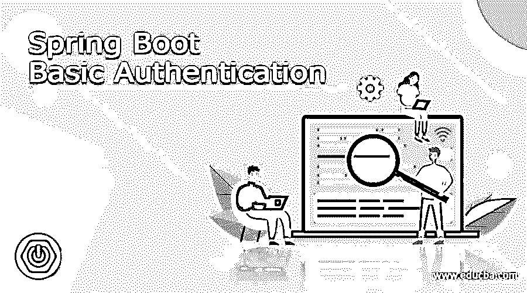
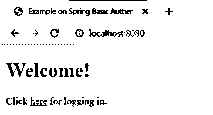
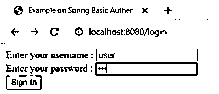
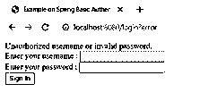
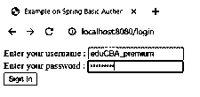
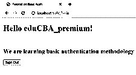
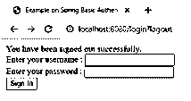

# Spring Boot 基本身份验证

> 原文：<https://www.educba.com/spring-boot-basic-authentication/>

## Spring Boot 基本认证的定义

Spring boot 基本认证被定义为一种方法，通过这种方法以最基本的形式实现对 web 服务的认证。在 web 服务中，Spring Boot REST API 可能有不同的客户端从不同的位置访问相同的 API，其中一些 API 需要提供敏感和机密的信息，在这种情况下，保护 API 并仅向授权的客户端组共享信息变得同等重要，并使其成为最高优先级。在本文中，我们将重点介绍基本的身份验证，但是必须注意其他高级身份验证方法，如摘要式身份验证、OAuth 和 OAuth2 身份验证。

**语法:**

<small>网页开发、编程语言、软件测试&其他</small>

spring boot 基本身份验证指的是保护 API 空间免受任何欺诈性攻击的方法，这种方法要求将用户登录凭据作为 HTTP 请求头进行传递，这使得它非常适合 REST 客户端的身份验证。在本节中，我们将从语法的角度了解 spring boot 基本身份验证，这样，当我们了解基本身份验证是如何执行的以及它的工作方法时，映射回语法将允许读者在本文的讨论中查看该主题的完整和更大的图片。

**使用 Maven 构建 JAR 文件:**

`mvn clean install`

**通过命令行运行 JAR 文件:**

`java -jar <Name of the JAR file>`

### 如何在 Spring boot 中进行基本认证？

到目前为止，我们知道基本身份验证是一种标准化的方法，它是一种标准的 HTTP 头，其中用户和密码以 base64 格式编码，编码格式为用户名:密码。之所以称之为基本身份验证，是因为用户名和密码仅使用 base64 编码，但既不加密也不哈希。虽然这使得应用程序更容易并且更容易受到损害，但是只有编码为许多不需要复杂的高级身份验证的用例让路，因为没有太多的敏感数据被共享，这使得应用程序更容易构建和维护，并且显然是可伸缩的！

现在，为了理解如何在 spring 中执行基本身份验证，需要一些先决条件来完成手头的任务。BasicAuthenticationFilter 是我们使用的类，通过将凭据呈现到 HTTP 头中，并将身份验证后的结果返回到 SecurityContextHolder 中，来完成处理基本身份验证所需的任务。为了执行基本身份验证，我们应该注意以下几点:

JDK
、Spring Boot
、IDE(最好是 eclipse，但也可以根据方便程度选择)
Maven

现在我们需要合并 maven 依赖项，没有这些依赖项，构建 HTTP 认证是没有根据的。第一个是 spring-boot-starter-parent，它负责提供有用的 maven 默认值。提供了依赖关系管理部分，以便开发人员可以省略现有依赖关系的任何版本标记。另一个是 spring-boot-starter-web，它负责构建 web 应用程序所需的依赖关系，最后是 spring-boot-starter-security，它负责安全部分，换句话说就是基本的身份验证(出于本文的目的)。一旦加载了依赖项，就需要配置 bean，之后需要定义 spring 安全性的主要配置。@EnableWebSecurity 是启用安全服务的装饰器，开发人员可以扩展适配器来覆盖一些 spring 特性。接下来，我们需要定义身份验证入口点。该类确保在凭据不再有效时发送响应。如果由于 HTTP 报头不包含支持的请求类型而导致授权成功或未尝试，流程将继续。

既然设置身份验证层的后端部分已经完成；我们需要定义暴露 API 的控制器类。通过 API 的暴露，人们可以很容易地看到工作中的基本认证！但是这个故事还不完整，因为如果没有注销实现，包含凭证、角色、原则等的身份验证对象就有被破坏的风险。因此，清除这个上下文是一个不可避免的步骤，这个 spring 提供了一个 SecurityContextLogoutHandler 来处理注销任务，这是通过修改 SecurityContextHandler 来实现的。

一旦遵循了上面的指示来执行基本的身份验证，我们就需要将应用程序作为 java 应用程序运行，并让编写的代码完成它的工作。为了进行测试，我们可以使用 postman 来执行一些 GET 或 POST 请求，以便查看应用程序是否正在执行所需的任务！在下一节中，我们将看一个实现基本认证的简单例子。

### 例子

定义 java 文件:

**语法:**

`BasicauthConfig .java
package com.demo.educba.basicauth;
import org.springframework.context.annotation.Bean;
import org.springframework.context.annotation.Configuration;
import org.springframework.security.config.annotation.web.builders.HttpSecurity;
import org.springframework.security.config.annotation.web.configuration.EnableWebSecurity;
import org.springframework.security.config.annotation.web.configuration.WebSecurityConfigurerAdapter;
import org.springframework.security.core.userdetails.User;
import org.springframework.security.core.userdetails.UserDetails;
import org.springframework.security.core.userdetails.UserDetailsService;
import org.springframework.security.provisioning.InMemoryUserDetailsManager;
@Configuration
@EnableWebSecurity
public class BasicauthConfig extends WebSecurityConfigurerAdapter {
@Override
protected void configure(HttpSecurity http) throws Exception {
http
.authorizeRequests()
.antMatchers("/", "/home").permitAll()
.anyRequest().authenticated()
.and()
.formLogin()
.loginPage("/login")
.permitAll()
.and()
.logout()
.permitAll();
}
@Bean
@Override
public UserDetailsService userDetailsService() {
UserDetails user =
User.withDefaultPasswordEncoder()
.username("eduCBA_premium")
.password("pa55word@")
.roles("USER")
.build();
return new InMemoryUserDetailsManager(user);
}
}
WebConfigCustom.java
package com.demo.educba.basicauth;
import org.springframework.context.annotation.Configuration;
import org.springframework.web.servlet.config.annotation.ViewControllerRegistry;
import org.springframework.web.servlet.config.annotation.WebMvcConfigurer;
@Configuration
public class WebConfigCustom implements WebMvcConfigurer {
public void addViewControllers(ViewControllerRegistry registry) {
registry.addViewController("/home").setViewName("home");
registry.addViewController("/").setViewName("home");
registry.addViewController("/hello").setViewName("hello");
registry.addViewController("/login").setViewName("login");
}
}
SecuringWebApplication.java
package com.demo.educba.basicauth;
import org.springframework.boot.SpringApplication;
import org.springframework.boot.autoconfigure.SpringBootApplication;
@SpringBootApplication
public class SecuringWebApplication {
public static void main(String[] args) throws Throwable {
SpringApplication.run(SecuringWebApplication.class, args);
}
}`

**输出:**

使用 maven 构建 JAR 文件并运行它:

**首页**

**输入错误的用户名和密码**

**输入正确的用户名(eduCBA_premium)和密码(pa55word@)**

**签出**

### 结论

总之，在本文中，我们已经学习了使用 spring boot 和手动执行的基本身份验证的用法。接下来，我们鼓励读者动手尝试更多的示例，并通过高级身份验证向前迈进一步。

### 推荐文章

这是 Spring Boot 基本认证指南。在这里，我们讨论定义，语法，如何执行 Spring Boot 基本认证？代码实现示例。您也可以看看以下文章，了解更多信息–

1.  [Spring Boot 执行器](https://www.educba.com/spring-boot-actuator/)
2.  [Spring Boot 路径变量](https://www.educba.com/spring-boot-path-variable/)
3.  [Spring Boot 属地](https://www.educba.com/spring-boot-dependencies/)
4.  [Spring Boot 知识库](https://www.educba.com/spring-boot-repository/)

