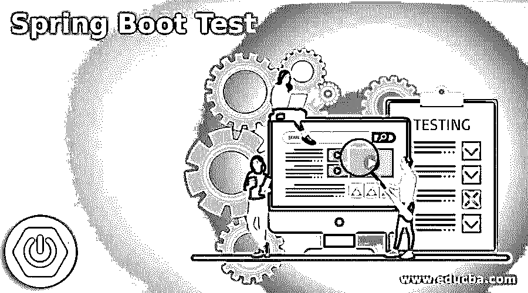
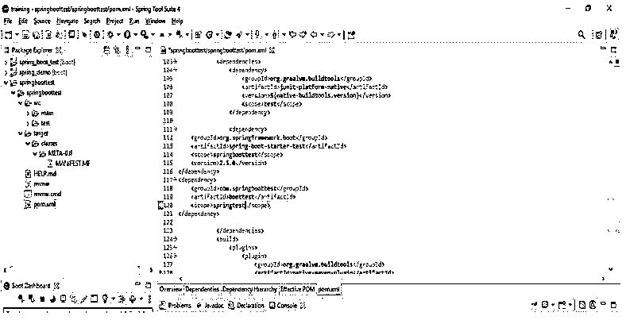
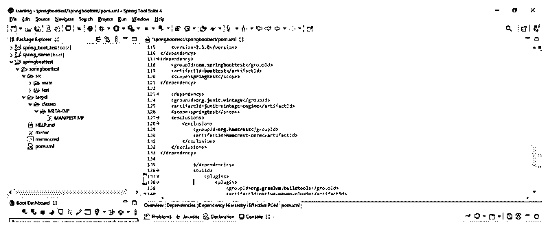
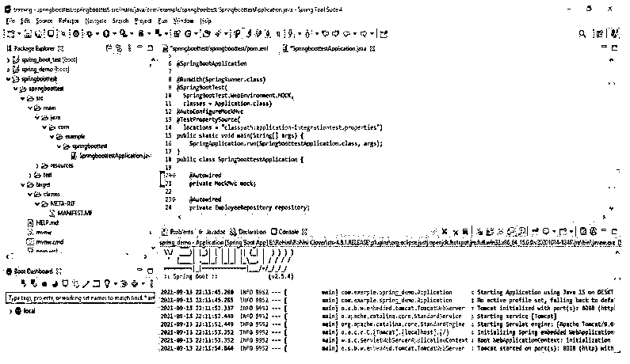
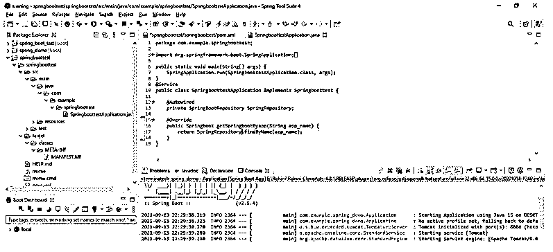

# Spring Boot 试验

> 原文：<https://www.educba.com/spring-boot-test/>

## Spring Boot 测试简介

Spring boot test 将为我们提供许多注释和实用程序来测试我们的应用程序。基本上，它将通过使用两种方法来提供，第一种是自动配置(spring-boot-test-autoconfigure)，第二种是 spring boot 测试(spring-boo-test)。Spring boot test (spring-boo-test)方法包含核心项目，而 auto-configure(spring-boot-test-auto configure)方法支持自动配置的测试，而使用 spring boot test-auto configure(spring-boot-test-auto configure)方法将导入这两个模块。基本上，应用程序上下文被定义为 spring boot 应用程序，它提供了 spring boot test (@SpringBootTest)注释。

### 什么是 Spring Boot 测试？

我们可以通过使用注释名@SpringBootTest 来测试我们的 spring boot 应用程序，基本上，它提供了一种非常有效的方式来启动我们在项目中使用的应用程序上下文。使用 spring boot 的单元测试将覆盖单个单元，其中该单元只是一个类，它还是一个内聚类簇。集成测试包括以下几点。集成测试测试多个单元。它将在集群的两个或多个内聚类之间进行交互。

<small>网页开发、编程语言、软件测试&其他</small>

覆盖更多层的集成测试。我们可以说这可能是第一个案例专门化，它涵盖了持久层和业务层之间的交互。集成测试使用它将覆盖应用程序的整个路径。使用这个测试，我们向应用程序发送一个请求，在发送请求之后，我们检查正确的响应。我们使用@SpringBootTest 注释来创建应用程序上下文。

我们将以下库用于 spring boot starter 测试(spring-boot-starter-test)。

*   **JsonPath:** 这无非就是 JSON 的 Xpath。
*   **JSONassert:** 这就是 JSON 使用的断言库。
*   **Mockito:** 这是一个 java 嘲讽框架。
*   JUnit: 这是一个事实上的标准，用于 java 应用程序中的单元测试。
*   **弹簧启动测试和弹簧测试:**这是在弹簧启动应用中使用的实用程序。
*   这只是一个在 spring boot 应用程序中使用的断言流畅库。
*   这只是一个匹配对象的库，在 spring boot 应用程序中使用过。

我们可以使用单元测试来测试我们的应用程序，一个单元一个单元地测试，或者我们可以一次性测试整个应用程序。注释用于加载 spring 的所有应用程序上下文。相比之下，测试切片注释将只加载特定层所需的 beans。

我们可以对项目使用如下注释:

*   跳趾试验
*   WebMvcTest
*   WebFluxTest
*   DataJpaTest
*   数据 JDBC 测试

Web MVC 上下文注释用于使用指定的组件来设置我们的应用程序上下文。Web 流量测试注释用于测试 web 流量控制器，该注释类似于 web MVC 测试。两种注释的区别仅在于配置和注释。数据 JPA 测试注释用于测试持久层。该注释用于配置存储库，建立嵌入式数据库。JDBC 的春天数据是它的另一个注解。如果我们使用 java 项目并同时测试持久层，我们可以使用 DataJdbcTest 注释。

下面是用于在 java 中测试 spring boot 应用程序的依赖项，如下所示:

*   **Spring boot starter test:** 这是用于测试 java 应用程序的方法。
*   Junit 版本:这是一个库，它的版本用于测试 java 应用程序。

### 项目设置

下面给出了用于设置 java 项目的步骤。

#### 1.添加 maven 依赖项

第一步是在当前项目中添加对 maven 的依赖。

**代码:**

`<dependency> -- start of dependency section.
<groupId>org.springframework.boot</groupId> -- Start and end of groupid section.
<artifactId>spring-boot-starter-test</artifactId> -- Start and end of artifactid section.
<scope>springboottest</scope> -- -- Start and end of scope section.
<version>2.5.0</version> -- -- Start and end of version section.
</dependency> -- end of dependency section.
<dependency> -- start of dependency section.
<groupId>com.springboottest</groupId> -- -- Start and end of groupid section.
<artifactId>boottest</artifactId> -- -- Start and end of artifactid section.
<scope>springtest</scope> -- -- Start and end of scope section.
</dependency> -- end of dependency section.`

**输出:**

#### 2.添加 JUnit 库

添加 maven 依赖项后，我们将在项目中添加 JUnit 库。

**代码:**

`<dependency> -- start of dependency section.
<groupId>org.junit.vintage</groupId> -- -- Start and end of groupId section.
<artifactId>junit-vintage-engine</artifactId> -- -- Start and end of artifactid section.
<scope>springtest</scope> -- -- Start and end of scope section.
<exclusion>
<groupId>org.hamcrest</groupId> -- -- Start and end of groupId section.
<artifactId>hamcrest-core</artifactId> -- -- Start and end of artifactid section.
</exclusion>
</dependency> -- end of dependency section.`

**输出:**

#### 3.带有@SpringBootTest 注释的集成测试

在下面的例子中，我们正在检查如何使用@SpringBootTest 注释测试应用程序。

**代码:**

`@SpringBootApplication -- Spring boot application annotation.
@RunWith(SpringRunner.class) -- Run with annotation.
@SpringBootTest(
SpringBootTest.WebEnvironment.MOCK,
classes = Application.class)
@AutoConfigureMockMvc – Auto configure mockmvc annotation.
@TestPropertySource ( -- test property service annotation.
locations = "classpath:application-integrationtest.properties") -- Class path location.
public static void main /* Main method used with string arguments*/ (String[] args) {
SpringApplication.run (SpringboottestApplication.class, args);
}
public class SpringboottestApplication { -- class name as SpringboottestApplication
@Autowired -- Auto wired annotation
private MockMvc mock; -- Object creation of MockMvc method.
@Autowired -- Auto wired annotation
private EmployeeRepository repository; -- Object creation of EmployeeRepository.
}`

**输出:**

#### 4.使用@MockBean 注释的应用程序测试

在下面的例子中，我们正在检查如何使用@MockBean 注释测试应用程序。

**代码:**

`public class SpringboottestApplication implements Springboottest { /* class name as SpringboottestApplication */
@Autowired -- Auto wired annotation
private SpringBootRepository SpringRepository;
@Override -- override annotation
public Springboot getSpringbootByapp(String app_name) {
return SpringRepository.findByName (app_name);
}
}`

**输出:**

### 推荐文章

这是 Spring Boot 测试指南。为了更好地理解，我们在这里讨论介绍和项目设置 spring boot 测试。您也可以看看以下文章，了解更多信息–

1.  [Maven 资源库 Spring](https://www.educba.com/maven-repository-spring/)
2.  [Spring Boot 开发工具](https://www.educba.com/spring-boot-devtools/)
3.  [春季 AOP](https://www.educba.com/spring-aop/)
4.  [春云组件](https://www.educba.com/spring-cloud-components/)

