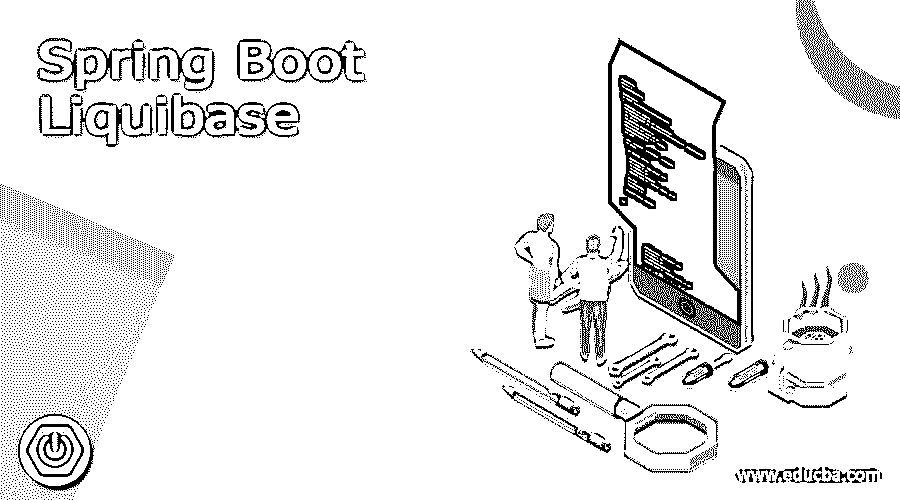
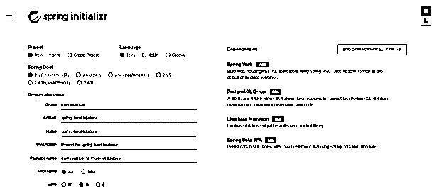
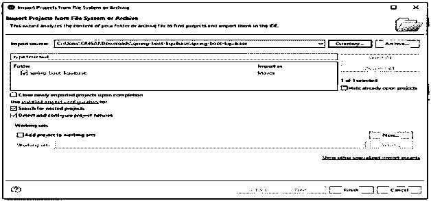
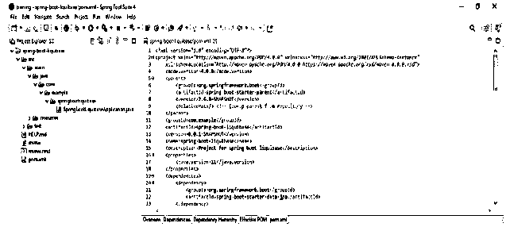
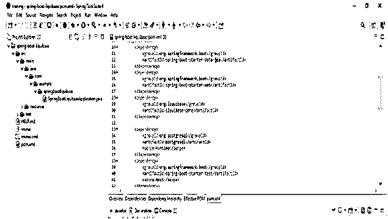
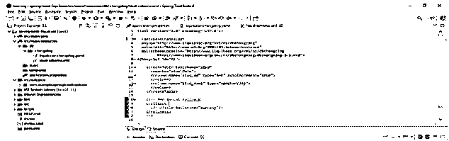
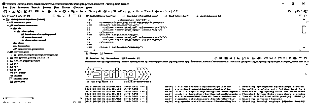

# Spring Boot 液基

> 原文：<https://www.educba.com/spring-boot-liquibase/>

## Spring Boot 液基的定义

它是一个开源工具，用于数据库的版本控制，也用于数据库模式迁移。该工具在许多 RDBMS 数据库中受支持，如 MySQL、PostgreSQL、Oracle 和 MSSQL，它还支持不同类型的格式，如 SQL、XML、JSON 和 YAML。它还是一个独立于供应商的数据库，这意味着它不依赖于任何特定于数据库的语法，它还会生成数据库的更改文档。使用这个工具，我们可以创建一个表，还可以在数据库服务器上执行所有操作。

### 什么是 Spring Boot 液基？

*   它用于跟踪数据库模式的脚本修订。它在许多数据库上工作，并接受多种文件格式来定义数据库的结构。
*   使用它，我们可以回滚数据库中的更改，也可以将其转发到给定的点。此外，我们可以从数据库中删除更改，以记住我们在数据库实例上执行了哪个脚本。
*   当需要从数据库服务器恢复或更新更改时，会使用它。
*   此外，我们可以使用将数据库模式更改从一个版本迁移到另一个版本。这类似于 spring boot flyway，两种工具都用于数据库模式迁移。
*   使用此工具可以管理各种文件中的更改，并在仪表板上使用监控和报告功能。

### 使用弹簧靴 liquibase

*   我们可以使用来开发通过使用 jar 文件启动的 java 应用程序。
*   我们可以从数据库服务器进行模式变更的迁移。
*   此外，spring boot 特性还包括日志记录、配置文件、安全性、集成、测试等等。
*   以下是我们在开发项目时要求的先决条件。

### 先决条件

1)项目–Maven 项目
2) Spring boot 版本–2 . 6 . 0
3)打包–Jar
4)Java–11
5)依赖项–PostgreSQL 驱动、Spring 数据 JPA、liquibase 迁移
6) Spring 工具套件

<small>网页开发、编程语言、软件测试&其他</small>

它有一些我们在 application.properties 文件中定义的重要属性。

**1)spring . liqui base . change-log-**

这是更改日志配置路径。

2)spring . liqui base . URL-

这是数据库迁移 URL。

3)spring . liqui base . user-

这是数据库迁移用户。

4)spring . liqui base . password-

这是数据库迁移密码。

5)spring . liqui base . liqui base-表空间-

这是 liquibase 对象表空间。

6)spring . liqui base . default-schema-

它是数据库默认模式。

7)spring . liqui base . database-change-log-table-

这是更改历史的表名。

8)spring . liqui base . context-

它是逗号分隔列表的运行时上下文。

**9)spring . liqui base . database-change-log-lock-table-**

这是用于跟踪 liquibase 活动的表名。

**10)spring . liqui base . labels-**

它是运行时标签的逗号分隔列表。

### 创建项目

下面是创建 spring boot liquibase 项目的例子如下。

#### 1)使用 spring initializer 创建一个项目模板，并给项目命名如下。

在下面的步骤中，我们将项目组名称设置为 com。例如，工件名称为 spring-boot-liquibase，项目名称为 spring-boot-liquibase，打包为 jar 文件，选择 java 版本为 11。

`Group – com. example
Artifact name – spring-boot-liquibase
Name – spring-boot-liquibase
Description - Project for spring-boot-liquibase
Package name - com.example.spring-boot-liquibase
Packaging – Jar
Java – 11
Dependencies – spring web, PostgreSQL driver, spring data JPA and liquibase migration`

#### 2)生成项目后，提取文件并使用 spring 工具套件打开该项目

#### 3)使用 spring 工具套件打开项目后，检查项目及其文件

### 例子

下面是弹簧靴 liquibase 的例子如下。

#### 1)添加依赖包–

**代码:**

`<dependency> -- Start of dependency tag.
<groupId>org.springframework.boot</groupId> -- Start and end of groupId tag.
<artifactId>spring-boot-starter-web</artifactId> -- Start and end of artifactId tag.
</dependency> -- End of dependency tag.
<dependency> -- Start of dependency tag.
<groupId>org.liquibase</groupId> -- Start and end of groupId tag.
<artifactId>liquibase-core</artifactId> -- Start and end of artifactId tag.
</dependency> -- End of dependency tag.
<dependency> -- Start of dependency tag.
<groupId>org.postgresql</groupId> -- Start and end of groupId tag.
<artifactId>postgresql </artifactId> -- Start and end of artifactId tag.
</dependency> -- End of dependency tag.`

#### 2)配置应用程序.属性文件–

**代码:**

`spring.datasource.url = jdbc:postgresql://localhost/spring_boot_liquibase
spring.datasource.username = postgresql
spring.datasource.password = postgresql
spring.datasource.platform = postgresql
spring.jpa.hibernate.ddl-auto=update`

#### 3)创建 liquibase 更改日志文件–

**代码:**

`databaseChangeLog:
- include:
file: db/changelog/stud-schema.xml
- include:
file: db/changelog/stud-data.xml`

#### 4)创建 stud-schema.xml 文件–

**代码:**

`<createTable tableName="stud" --- Create table name as stud.
Remarks ="stud Data">
<column name="stud_id" type="int" autoIncrement="true">
</column> -- End of column tag
<column name="stud_name" type="varchar (10)"> -- Start of column name tag.
</column> -- End of column tag
</createTable>`

#### 5)创建 stud-data.xml 文件–

**代码:**

`<comment> Inserting stud records</comment> -- Start and end of comment tag.
<insert tableName="stud">
<column name="stud_id" valueNumeric="1"/>
<column name="stud_name" value="ABC"/>
</insert> -- End of insert tag.
<insert tableName="stud">
<column name="stud_id" valueNumeric="2"/>
<column name="stud_name" value="PQR"/>
</insert> -- End of insert tag.
<insert tableName="company">
<column name="stud_id" valueNumeric="3"/>
<column name="stud_name" value="XYZ"/>
</insert> -- End of insert tag.`

#### 6)运行应用程序–

#### 7)检查表格是否已创建，数据是否已插入螺柱表格中——

**代码:**

`Select * from stud;`

### 重要弹簧靴 liquibase

*   这是一个非常重要的迁移工具，用于帮助我们创建数据库模式，在创建模式后，它将运行数据库服务器的部署，还会进行一些健全性检查，以确保我们所做的所有更改都正常工作。
*   它为管理数据库模式变更的团队提供了一个很好的起点。
*   它有能力回滚和转发我们的数据库更改到一个特定的点。为了在我们的项目中使用 spring boot liquibase，我们需要添加 liquibase 依赖项。

### 结论

Spring boot liquibase 能够管理和修改我们的数据库模式脚本。Spring boot liquibase 是一个用于数据库版本控制的开源工具。我们可以通过使用 liquibase spring bean 在 spring boot 环境上运行 liquibase。

### 推荐文章

这是一个 Spring Boot 液基指南。在这里，我们讨论的定义，什么是 Spring Boot 液基，先决条件，例子。您也可以看看以下文章，了解更多信息–

1.  [Spring Boot 验证](https://www.educba.com/spring-boot-validation/)
2.  [Spring Boot 属性](https://www.educba.com/spring-boot-properties/)
3.  [Spring Boot 异常处理](https://www.educba.com/spring-boot-exception-handling/)
4.  [Spring Boot 测井](https://www.educba.com/spring-boot-logging/)

