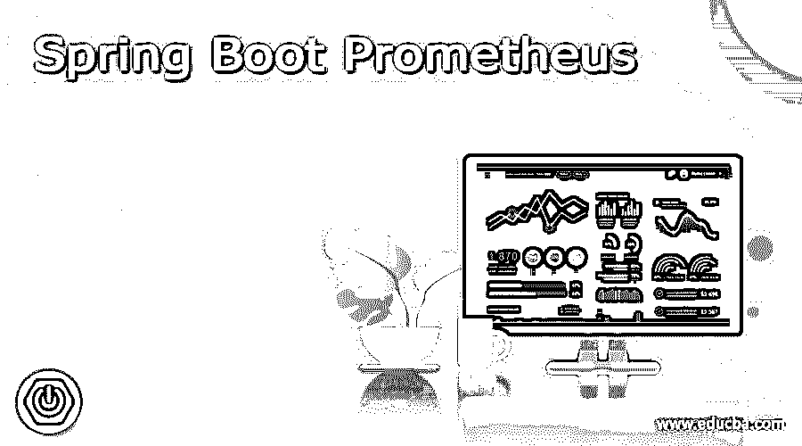
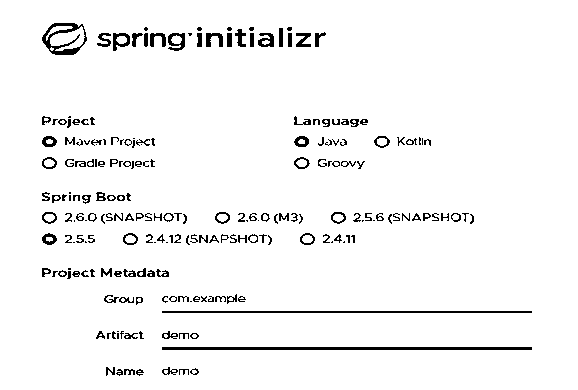
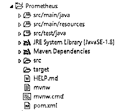
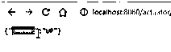

# Spring Boot·普罗米修斯

> 原文：<https://www.educba.com/spring-boot-prometheus/>

## Spring Boot·普罗米修斯的定义

Spring boot 为用户提供了不同类型的内置端点，其中 Prometheus 是 spring boot 提供的端点之一。基本上，spring boot 执行一些不同类型的 API 来根据需求检查和监控应用程序的性能，或者我们可以说是根据文档。通常，Prometheus 是一个开源系统，用于在执行器的帮助下监控系统。它由不同的参数组成，如数据刮刀、tome 系列和用户界面。在所有这些参数的帮助下，我们可以很容易地根据用户需求实现 spring Prometheus。

### 什么是春靴普罗米修斯？

Prometheus 是一个免费的编程应用程序，用于事件观察和报警。它在利用 HTTP 拉模型构建的周期序列数据集(考虑到高维数)中记录恒定的测量值，具有可适应的查询和持续的警告。

<small>网页开发、编程语言、软件测试&其他</small>

现在我们来看看普罗米修斯的一些重要要点如下。

*   #### Data storage:

普罗米修斯信息以度量的形式存放起来，每个度量都有一个名称，用于引用和质疑它。每一个度量都可以围绕一个自我主张的键=值集(名称)的数量。标记可以记住信息源的数据(信息来自哪个服务器)和其他应用程序明确的细分数据，例如，HTTP 状态代码(用于通过 HTTP 反应识别的测量)、提问技术(GET 与 POST)、端点等确定名称的自我断言缩减和持续查询的能力是 Prometheus 的信息模型被称为多维的原因

*   #### Data collection:

普罗米修斯收集时间序列信息。时间序列是通过一个力模型工作的:普罗米修斯服务器在一个特定的调查周期查询一个信息来源(现在和那时被称为出口商)的概要。每一个信息源都为普罗米修斯所质疑的端点处的该信息源的当前测量值提供服务。此时，Prometheus 服务器会汇总所有信息源的信息。普罗米修斯有各种工具来自然地找到它应该用作信息源的资产。

*   #### Monitoring:

在 Prometheus 中可以指示注意事项的安排，该安排确定了在特定范围内触发警报所应遵循的条件。当警报触发时，它们被发送到 Alertmanager 管理。Alertmanager 可以将基本原理整合到安静警告中，并进一步将它们推进到电子邮件、Slack 或通知管理中，如 PagerDuty。像微软团队这样的其他信息框架可以利用 Alertmanager Webhook 接收器作为外部混合的工具来设计。同样，Prometheus Alerts 可以用于直接获得 android 小工具的警告，甚至不需要在警报管理器中进行任何客观的安排。

*   #### Interoperability

普罗米修斯喜欢白盒检查。敦促应用程序分发(发出)由 Prometheus 间歇收集的内部测量值。一些出口商和不同应用的专家可以进行测量。Prometheus 支持一些检查和组织约定，以允许进展的互操作性:Graphite、StatsD、SNMP、JMX 和 CollectD。

普罗米修斯关注舞台和基本任务的可达性。测量结果通常会存放很长时间。对于长期储存，测量值可能会溢出到遥远的产能安排。

Prometheus 是一个开源观测框架，最初由 SoundCloud 开发。它由附带的中心部件组成

*   一个信息洗涤器，偶尔在设计的跨度上通过 HTTP 提取测量信息。
*   周期序列信息库，用于存储每一个测量信息。
*   一个基本的用户界面，你可以想象，质疑，筛选每一个测量。

现在，让我们将 micrometer Prometheus 注册表添加到应用程序中，如下所示。

Spring Boot 利用千分尺(一种外部测量应用)来协调外部检查框架的致动器测量。

它支持一些检查框架，如网飞 Atlas、AWS Cloudwatch、Datadog、InfluxData、SignalFx、Graphite、Wavefront、Prometheus 等等

要将致动器与 Prometheus 合并，您需要添加微米拱顶 Prometheus 相关性，如下所示。

`<!-- Micrometer Prometheus registry -->
<dependency>
<groupId>io.micrometer</groupId>
<artifactId>micrometer-registry-prometheus</artifactId>
</dependency>`

当您添加上述依赖项时，Spring Boot 将因此设计一个 PrometheusMeterRegistry 和一个 CollectorRegistry，以一种 Prometheus 服务器可以抓取的方式收集和生成测量信息。所有的应用测量信息都可以在名为/Prometheus 的执行器端点上访问。Prometheus 服务器可以抓取此端点，以间歇性地获取测量信息。

### 如何使用弹簧靴普罗米修斯？

现在让我们看看如何在 spring boot 应用程序中使用 Prometheus，如下所示。

首先，我们需要使用 maven 的在线模式创建 spring boot 项目，如下图所示。

在这个在线工具中，我们需要选择所需的参数，即编程语言、项目模式、spring boot 版本和 java 版本。还有，我们需要提到项目名称和组等，

完成上述设置后，我们在 zip 文件中获得了 spring boot 项目，因此我们需要提取该文件夹，并将其导入到任何编程 IDE 中，如下图所示。

现在我们有了 spring boot 项目的完整结构，所以将所需的依赖项添加到 POM 中。XML 文件。在这个项目中，我们需要如下两个依赖项。

`<dependency>
<groupId>org.springframework.boot</groupId>
<artifactId>spring-boot-starter-actuator</artifactId>
</dependency>
<dependency>
<groupId>io.micrometer</groupId>
<artifactId>micrometer-registry-prometheus</artifactId>
</dependency>`

**解释**

第一个相关性用于致动器，第二个相关性用于千分尺。

现在在资源包下创建一个 java 类文件，并编写如下代码。

`package resources;
import resources.GetMapping;
@RestController
public class hello {
@GetMapping("/Welcome")
public String Hello() {
return "Hello Welcome";
}
}`

现在清理项目并运行 java 应用程序类。java 应用程序的最终输出如下面的屏幕截图所示。

现在让我们在浏览器中看看我们到底得到了什么，如下图所示。

在这里，我们可以看到我们想要的所有端点。

### 结论

我们希望通过这篇文章，你能更多地了解 Spring Boot·普罗米修斯。从上面的文章中，我们吸收了 Spring Boot 普罗米修斯的基本思想，我们也看到了 Spring Boot 普罗米修斯的代表和榜样。从这篇文章中，我们了解了如何以及何时使用 Spring Boot 普罗米修斯。

### 推荐文章

这是 Spring Boot·普罗米修斯指南。这里我们讨论定义，什么是弹簧靴普罗米修斯，普罗米修斯的重要要点。您也可以看看以下文章，了解更多信息–

1.  Spring Boot 赛道
2.  [Spring Boot 属性](https://www.educba.com/spring-boot-properties/)
3.  [Spring Boot 测井](https://www.educba.com/spring-boot-logging/)
4.  [Spring Boot RestTemplate](https://www.educba.com/spring-boot-resttemplate/)

