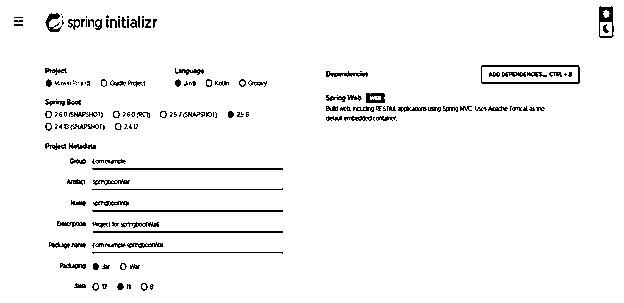
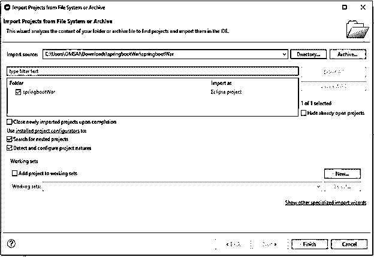
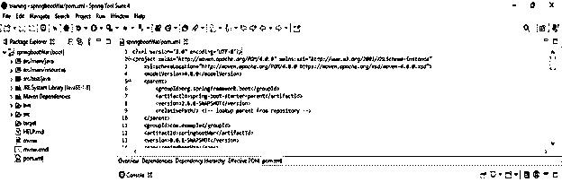
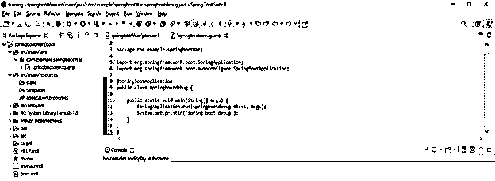
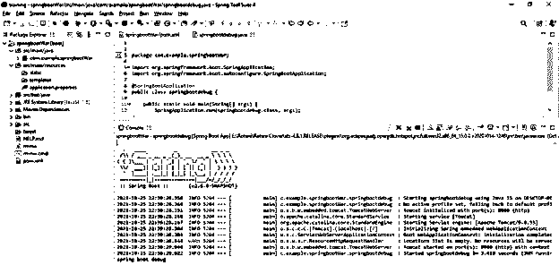

# 弹簧启动调试

> 原文：<https://www.educba.com/spring-boot-debug/>

## spring boot 调试简介

Spring boot debug 是用来编写软件的最重要的工具。我们可以使用 eclipse 和 spring 工具套件来调试我们的应用程序。由于 java 虚拟机(JVM)的原因，java 虚拟机默认情况下不启用调试。这将在 java 虚拟机内部产生额外的开销。对于可公开访问应用程序来说，这也是一个安全问题。

### 什么是春季开机调试？

*   基本上，应用程序调试是在开发时进行的；它不是在生产环境中执行的。
*   在应用环境上运行调试之前，首先，我们需要在应用服务器上配置 java 虚拟机来运行调试。
*   我们还可以通过命令行工具或使用 IDE 来启用调试。例如，为 java 虚拟机设置命令行参数的命令如下。

`-agentlib:jdwp (java debug wire protocol) = transport = dt_socket, server=y, suspend = n, address = 8000`

<small>网页开发、编程语言、软件测试&其他</small>

*   Agentlib jdwp 用于使 java 能够调试 java 虚拟机内部的有线协议。这只是用于启用调试的主命令行参数。
*   Transport dt_socket 在网络套接字中用于调试连接。Unix 套接字和共享内存的其他选项包含其他应用程序选项。
*   服务器包含 Y 形式的值，该值用于侦听调试器连接。将服务器调试器连接值设置为 N 时，此进程将尝试连接到调试器，而不是传入的连接。
*   Suspend 包含 N 形式的值；该参数不会在启动时等待调试连接。相反，应用程序将在我们连接调试器时正常启动。
*   当设置地址为 8000 时，当设置网络端口时，java 虚拟机从调试连接中监听。
*   来自标准的值，它将在操作系统中使用的大多数情况下工作。
*   众所周知，spring boot 应用程序以不同的类型启动。我们还可以使用–jar 选项启动 spring boot 应用程序。

### 如何弹簧开机调试？

*   下面是如何调试 spring boot 应用程序的步骤。

1.  使用调试模式构建应用程序服务。
2.  修改应用程序 docker 文件，将调试端口公开到 docker 的映像中。修改 docker 的映像后，在调试模式下运行我们的应用程序。
3.  修改 docker 映像后，下一步是部署 docker 容器，同时使用暴露的调试容器。
4.  部署 docker 容器后，下一步是使用 spring 工具套件或 eclipse 调试会话。

*   在调试 spring boot 应用程序时，我们需要在运行时启用调试后使用附加信息来编译服务。
*   我们可以通过使用 javac 参数添加相同的内容来实现，-g 是我们的 spring boot 应用程序的构建脚本。
*   我们还可以通过启用相同的来启用调试日志记录。启用调试日志记录这并不意味着在调试级别显示所有日志。
*   启用调试日志后，它将显示与容器初始化相关的有用信息，因此我们需要检查需要使用配置创建哪些 beans。

### Spring Boot 应用程序调试

下面的例子显示了创建 war 文件的 spring boot 项目如下。

*   **使用 spring 初始化器创建项目模板，并给项目命名为—**

在下面的步骤中，我们提供了项目组名 com.example，工件名 springbootWar，项目名 springbootWar，并选择 java 版本为 11。

`Group – com.example
Artifact name – springbootWar
Name – springbootWar
Description - Project for springbootWar
Spring boot – 2.5.5
Project – Maven project
Java – 11
Package name - com.example.springbootWar
Dependencies – spring web.`

*   **生成项目后，提取文件，使用 spring 工具套件打开该项目—**

*   **使用 spring 工具套件打开项目后，检查项目及其文件—**

*   **创建主类—**

**代码—**

`@SpringBootApplication
public class springbootdebug
{
public static void main(String[] args)
{
SpringApplication.run (springbootdebug.class, args);
System.out.println ("spring boot debug");
}
}`

*   **调试应用程序—**

### Spring Boot 调试服务器

*   Spring boot 调试服务器提供了停止和启动应用程序的脚本。
*   下面是 spring boot 调试服务器如下。

1.  雄猫
2.  野猫队
3.  服务器
4.  玻璃鱼
5.  码头

*   我们可以使用执行文件名 Catalina.sh 来启动 tomcat 服务器。例如，要使用 tomcat 服务器来启动调试服务器，我们可以使用下面的命令。

`# catalina.sh jpda start`

*   tomcat 服务器的默认参数是使用网络套接字，该套接字使用 8000 监听端口，挂起参数为 n。
*   我们可以使用执行文件名 stand-alone.sh 来启动 wildfly 服务器，要使用 debug enables 来启动 wildfly 服务器，我们需要添加 debug。
*   我们可以使用执行文件名 startWeblogic.sh 来启动 web logic server，要使用 debug enables 来启动 web logic server，我们需要将环境变量 debug flag 设置为 true。
*   我们可以使用 asadmin 作为执行文件名来启动 glassfish 服务器。要使用 debug enabled 启动 glassfish 服务器，我们需要使用 debug。
*   jetty 应用服务器没有启动脚本。但是，我们可以使用 java 命令启动 jetty 服务器。

### 弹簧引导调试类型

*   我们可以通过配置 application.properties 文件来配置 spring boot 以调试应用程序。
*   我们还可以调试托管在 docker 容器上的 spring boot 微服务。
*   我们可以通过启用 spring boot 应用程序的调试模式来启动本地应用程序。
*   通过使用 debug mode enables，我们可以调试驻留在远程服务器上的 spring boot 应用程序。
*   下面是远程调试的类型如下。
*   使用调试模式在本地启动应用程序。
*   在调试模式下启动 uberjar。
*   在调试模式下启动应用程序。
*   将调试器附加到应用程序。

### 结论

Spring boot debug 是用来编写软件的最重要的工具。我们可以使用 eclipse 和 spring 工具套件来调试我们的应用程序。在应用环境上运行调试之前，首先，我们需要在应用服务器上配置 java 虚拟机来运行调试。

### 推荐文章

这是一个春季启动调试指南。在这里，我们将讨论展示如何调试 spring boot 应用程序的步骤和示例。您也可以看看以下文章，了解更多信息–

1.  [Spring Boot 测井](https://www.educba.com/spring-boot-logging/)
2.  Spring Boot 赛道
3.  Spring Boot·HTTPS
4.  [Spring Boot 横幅](https://www.educba.com/spring-boot-banner/)

