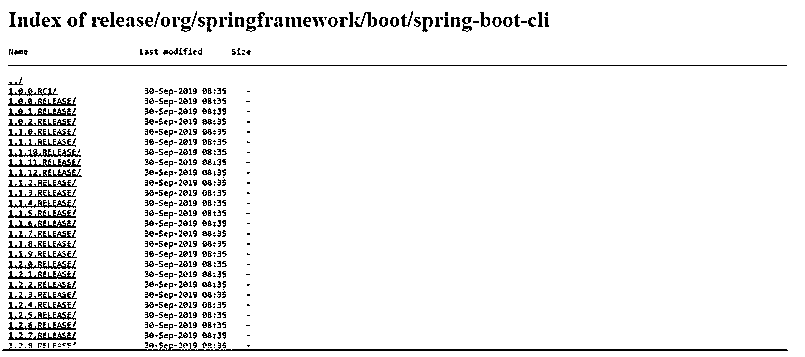
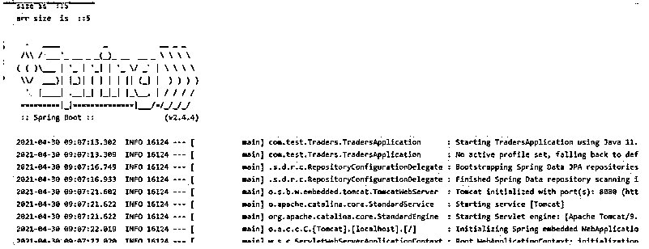

# Spring Boot CLI

> 原文：<https://www.educba.com/spring-boot-cli/>

## Spring Boot CLI 简介

在 Spring boot 中，我们有 spring boot CLI，它主要代表命令行界面。这个工具允许我们执行相同的命令集，这有助于我们通过命令行加速项目执行。在其他框架中，他们也提出了一个命令行，通过使用它，我们可以很容易地创建、运行和添加我们的项目所需的依赖。它以同样的方式工作。通过使用它，我们可以轻松快速地创建 spring boot 应用程序，这使得我们的过程更快。此外，这个 CLI 可以运行用 groovy 编写的脚本，这意味着开发人员不必担心样板代码，样板代码只允许我们专注于为应用程序编写业务逻辑。

### Spring Boot CLI 的安装和设置

到目前为止，我们已经知道 spring CLI 是一个命令行界面，它需要在命令提示符下执行一些命令来使用它并使应用程序更快。

<small>网页开发、编程语言、软件测试&其他</small>

我们将首先看看如何在机器上设置它的环境，以及在开发时使用的一些有用的命令。

1.我们需要做的第一步是在我们的机器上设置 spring boot CLI 为此，我们需要首先在我们的机器上设置 JDK。我们可以从甲骨文官网下载这个。

下载之后，我们必须在环境属性中设置 Java 的路径；作为参考，遵循下面的路径，并用您的路径替换它。

**举例:**

**set PATH = PATH _ to _ bin**
T3】set JAVA _ HOME = PATH _ to _ JDK

2.现在，我们可以从下面提到的链接下载最新版本的 spring boot 命令行界面，即 CLI。在那里你会发现这么多的版本，选择你需要的版本并下载压缩文件。

3.下载 zip 解压文件后，在环境变量中设置 path，就像我们在上面的步骤中为 JDK 设置的一样，以便全局使用它。

4.完成所有这些之后，我们可以使用下面的命令来验证 spring boot CLI 是否正确安装。

**举例:**

**春季版**

执行此操作后，可能会有一些日志为您打印版本。

### Spring Boot CLI 命令及示例

在这里，我们将看到一些有用的命令，在开始使用它们之前，我们需要了解这些命令，我们可以直接在 CLI 上编写这些命令，并执行我们想要的操作。

**1。Spring-Version:**如果你想知道 Spring boot CLI 的版本，只需进入 CLI 并输入以下命令；按 enter 后，您将看到系统上安装了正确版本的 CLI。该命令也可用于验证或检查 spring boot CLI 是否正确安装并正常工作。

2.现在，我们可以运行我们创建的应用程序了。为此，我们可以首先转到您已经创建的项目文件夹，并在该路径上打开命令提示符。否则，您可以打开命令提示符，键入您的项目路径。

现在运行你的应用程序，输入下面的命令。

**举例:**

`spring run your_file_name;`

如您所见，我们使用了 run 命令来运行它。在文件的地方，名字提供了你的项目文件名如下，并按回车键。

**举例:**

`spring run TradersApplication.groovy`

**输出:**

3.这个命令将简单地为我们返回帮助屏幕。这不需要任何争论。它也可以是安装后 spring boot CLI 的检查命令。

4.s**spring help run:**该命令将打开关于我们在 spring boot CLI 中可用的命令的更多细节，只需将其写入您的命令提示符下，然后按 enter 键。

5.我们还可以使用 spring boot CLI 为我们的应用程序指定端口号；run 命令该命令使用'–'运算符作为参数。

下面您可以找到此命令更改端口的参考。

**语法:**

`Spring run file_name -- --server.port= port_number`

使用 run 命令，我们可以使用 server.port 参数来指定应用程序的端口。

**语法:**

`spring run demo.groovy -- --server.port=8081`

6.我们也可以从 spring boot CLI 设置 JAVA_OPTS 变量；我们可以找到下面的命令。

**举例:**

`JAVA_OPTS=-Xmx1024m spring run demo.groovy`

7.如果我们想要运行测试用例，我们可以使用下面的测试命令从应用程序中运行测试用例。

**语法:**

`spring test project_fiel_name test_file_aname`

这样，我们就可以定义命令了。

**语法:**

`spring test demo.groovy demotest.groovy`

8.要使用 spring boot CLI 创建一个新项目，我们应该使用下面的命令；

**语法:**

`spring init --dependencies=dep projectn_name`

从上面的代码行，我们现在能够从头开始初始化新项目。

**语法:**

`spring init --dependencies=web,data-jpa demo-project`

### 结论

利用这一点，我们可以轻松快速地构建或启动应用程序。我们只需要记住它的一些重要命令，我们通过使用一些编辑器来做所有的事情，所以在学习了这些之后，我们可以很容易地只用命令来做所有的事情，这非常快。

### 推荐文章

这是 Spring Boot CLI 指南。在这里，我们通过示例讨论介绍、安装、设置和 spring boot CLI 命令。您也可以看看以下文章，了解更多信息–

1.  [Maven 资源库 Spring](https://www.educba.com/maven-repository-spring/)
2.  [Spring Boot 开发工具](https://www.educba.com/spring-boot-devtools/)
3.  [春季 AOP](https://www.educba.com/spring-aop/)
4.  [春云组件](https://www.educba.com/spring-cloud-components/)

