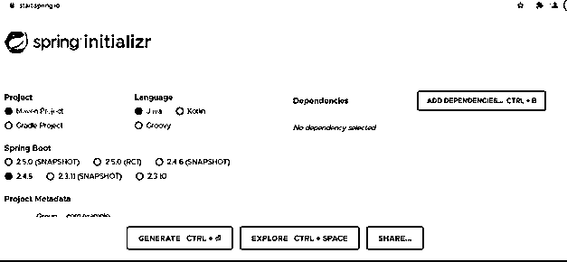
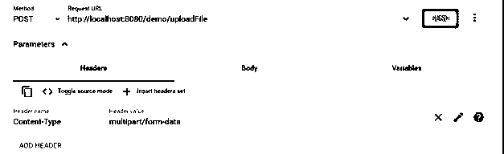
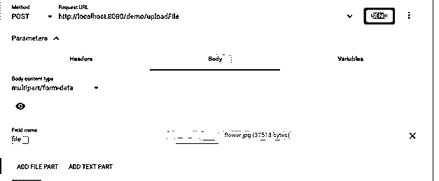
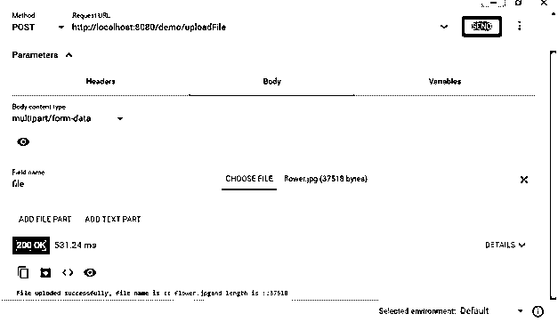

# 春季启动文件上传

> 原文：<https://www.educba.com/spring-boot-file-upload/>

## Spring boot 文件上传简介

在 Spring boot 中，我们可以通过将 HTTP 请求分成多个部分来上传文件到服务器。这种类型的请求用于向服务器发送二进制文件和文本文件；因此，我们需要为此使用多部分请求。在 spring boot 中，我们必须进行必要的更改和配置，以使其工作。这需要在我们的应用程序中进行一些配置；请求解析方法将与我们到目前为止看到的其他方法略有不同。有时我们可能需要上传一些文件到服务器上，因为我们可以使用里面的大数据来存储；同样，我们可以通过使用这种类型的请求来上传视频；它们基本上是为在 web 应用程序中处理这种请求而设计的。在教程的下一节，我们将看到如何在 spring boot 应用程序中上传文件，以及为初学者提供的详细实现。在本主题中，我们将学习 Spring boot 文件上传。

**语法**

<small>网页开发、编程语言、软件测试&其他</small>

我们知道，文件上传是一种将文本文件或任何其他类型的文件存储到服务器的机制；为了处理，服务器应该准备好处理这样的请求。我们先来看看 spring boot 中实现文件上传的语法来看看下面；

`@PostMapping("/your_rurl")
public retutn_type method_name(@RequestParam("name") MultipartFile obj) {
// logic goes here ..//
}`

正如您在上面的语法中看到的，我们使用 MultipartFile 对象来处理 spring boot 应用程序中的文件上传；在其中，我们可以为我们的方法定义逻辑，这个对象将包含我们从客户端上传的文件。让我们来看看文件上传的练习语法；更好的想法，请看下文；

**举例:**

`@PostMapping("/upload")
public void upload(@RequestParam("fileobj") MultipartFile fileobj) {
// logic goes here ..//
}`

如您所见，我们可以在 spring boot 应用程序中定义处理文件上传的方法；它应该在控制器类中，并且将是一个 post 映射。在下一节中，我们将看到在应用程序中实现它所需的步骤。

### 春开机文件上传功能是如何工作的？

在 spring boot 中，我们已经知道，我们必须使用多部分请求来支持服务器端的二进制和文本文件处理。为此，我们必须利用 Multipart 类，这也需要在 application.properties 中进行配置。我们也可以同时上传多个文件，但在控制器上处理时要小心。多部分对象将包含我们的文件列表，我们可以在应用程序中进一步处理它。在本节中，我们将首先看到在 spring boot 应用程序中实现这一点所需的步骤；下面我们开始看；

1)首先，我们将进入 spring initializer，通过在信息中输入所有细节来设置 spring boot 项目，我们将添加必要的依赖项。点击生成一个项目，它会给你压缩，提取并导入到最喜欢的编辑器。

**网址:**

https://start.spring.io/

**输出:**

2)一旦你下载了这个项目，不要忘记在其中添加 web 依赖，否则它将无法从 rest-client 工具中测试它。作为参考，请参见下面的“查找网站所需的依赖项”部分。

**举例:**

`<dependency>
<groupId>org.springframework.boot</groupId>
<artifactId>spring-boot-starter-web</artifactId>
</dependency>`

3)现在，我们还需要一个依赖项，即百里香叶，将这个依赖项添加到您的构建文件中；供参考，请找到下面的依赖关系；

**举例:**

`<dependency>
<groupId>org.springframework.boot</groupId>
<artifactId>spring-boot-starter-thymeleaf</artifactId>
<version>2.4.3</version>
</dependency>`

4)添加完所有这些东西后，我们现在可以在控制器内部创建方法，这些方法将在我们的 spring boot 应用程序中处理文件上传；让我们看看控制器级别我们必须做哪些更改，见下文；

**举例:**

`import org.apache.coyote.Response;
import org.springframework.http.HttpStatus;
import org.springframework.http.ResponseEntity;
import org.springframework.web.bind.annotation.*;
import org.springframework.web.multipart.MultipartFile;
import java.security.Principal;
@RestController
@RequestMapping("/demo")
public class DemoController {
@PostMapping("/uploadFile")
public String uploadFile(@RequestParam("file") MultipartFile file) {
String fileName  = file.getOriginalFilename();
int filelenth = file.getBytes().length;
return "File uploded successfully, " + "file name is :: "+ fileName + "and length is ::" + filelenth;
}
@GetMapping("/gettest/{test}")
public ResponseEntity<String> get(@PathVariable String test) {
return new ResponseEntity<>("I am get method " + test, HttpStatus.OK);
}
@PostMapping("/postMethod")
public ResponseEntity<String> post() {
return new ResponseEntity<>("I am post method " , HttpStatus.OK);
}
@DeleteMapping("/deleteMethod")
public ResponseEntity<String> delete() {
return new ResponseEntity<>("I am deleteMethod method " , HttpStatus.OK);
}
}`

正如您在上面的代码行中看到的，我们使用了来自 spring web 依赖项的 Multipart 对象。为了使它在类中可用，我们必须在控制器的顶部导入所需的包；我们需要在控制器中的多部分如下包见下文；

**举例:**

`import org.springframework.web.multipart.MultipartFile;`

这些包应该在适当的位置；否则，我们将在控制器中得到编译时错误，为了使它可见，我们应该有 web 依赖，这在第二步中已经讨论过了。

现在，我们必须在服务级别编写一些代码，将文件存储在服务器中，创建一个服务类并编写保存文件的逻辑。

5)现在，我们必须对应用程序文件进行一些更改，我们将在其中设置上传和请求的多部分数据的限制；我们在 spring boot 中定义了一个属性，我们可以用它来设置这个设置以供参考；见下文；

**举例:**

`spring.servlet.multipart.max-file-size=500KB
spring.servlet.multipart.max-request-size=500KB`

6)现在应该有我们的主类了，应该是如下图；

**举例:**

`import org.springframework.boot.SpringApplication;
import org.springframework.boot.autoconfigure.SpringBootApplication;
import java.util.*;
@SpringBootApplication
public class TradersApplication {
public static void main(String[] args)
{
SpringApplication.run(TradersApplication.class, args);
System.out.println("Application running in the dev mode !!");
}
}`

6)转到高级 rest-client，尝试通过更改内容类型来访问如下所示的端点:

**输出:**

7)进入 body 部分按照下图，给变量取名字，上传你要上传的文件像下面这样；

**输出:**

8)发送请求后，您将得到以下输出作为回报；

**输出:**

### 结论

要在 spring boot 应用程序中上传文件，我们必须使用我们在上面讨论过的 multipart，按照上面的步骤让它工作，并查看输出。然而，正如我们所看到的，它很容易使用，也需要一点 o 配置。

### 推荐文章

这是一个春季引导文件上传指南。在这里，我们讨论如何在 spring boot 应用程序中上传文件，并为初学者详细介绍实现方法。您也可以看看以下文章，了解更多信息–

1.  [Spring Boot 执行器](https://www.educba.com/spring-boot-actuator/)
2.  [Spring Boot 专题](https://www.educba.com/spring-boot-feature/)
3.  [Spring Boot 注解](https://www.educba.com/spring-boot-annotations/)
4.  [Spring Boot 开发工具](https://www.educba.com/spring-boot-devtools/)

