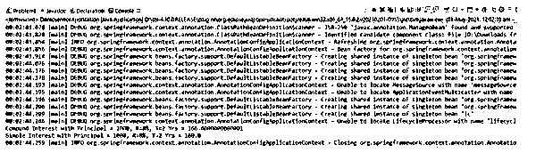

# Spring Boot 服务

> 原文：<https://www.educba.com/spring-boot-service/>

## Spring Boot 服务介绍

Spring boot 服务组件被定义为一个包含@Service 注释的类文件，它允许开发人员添加业务功能。注释与提供这些业务功能的类一起使用。当基于注释的配置与类路径扫描一起使用时，这些类由 spring 上下文自动检测，因为它提供了@Component 注释的专门化。由带注释的组件执行的操作作为一个接口提供，并且独立于模型之外，没有封装状态。这个注释是一个通用的原型，开发人员可以选择缩小语义的范围，并在适当的时候使用相同的语义。

**Spring Boot 服务的语法**

<small>网页开发、编程语言、软件测试&其他</small>

如上所述，spring-boot 服务组件是一个类文件，用于添加业务功能的指定区域。在这里，我们将从语法的角度来看 spring boot 服务组件，这样当我们看到 spring boot 服务组件的工作及其特性时，映射回语法将能够看到完整的画面。

1.在 Spring Boot 应用程序中使用服务组件需要装饰器。

`@Service`

2.导入服务组件工作所需的功能。

`import org.springframework.stereotype.Service;`

### 服务组件在 Spring Boot 是如何工作的？

*   这里我们将看到服务组件在 Spring Boot 的工作，但是在此之前，我们不仅需要知道服务组件的重要性，还需要知道放置@Spring 组件的重要性。对我们来说，了解典型的应用程序包含不同的层是非常重要的，例如，数据访问、呈现数据、服务和业务，并且在这些单独的层的每一层中，都有各种 beans 来实现层的自动检测。@Service annotation 有助于在服务层对类进行注释。正如我们前面提到的,@Service 组件提供了@Component 的专门化。现在，这让我们更有兴趣理解@Component 注释跨应用程序使用，因此 bean 被标记为 Spring 的托管组件，而标记有@Service 的 bean 恰好包含业务逻辑的一部分，因此只在服务层使用，因为没有额外的特性。
*   服务组件确保将业务逻辑合并到不同层中的类文件，并将其与@RestController 类文件分开。对于@Service 注释的功能，我们需要添加 spring 核心依赖。在 Spring 的早期版本中，所有的 beans 都是在 XML 文件中声明的，但是考虑到可伸缩性，这变成了一项艰巨的任务，因此@Component 注释提供了基于注释的注入，配置是基于 Java 的。因此，基于注释的注入减少了 bean 作为<bean>标签的声明。除了主要用于服务层的@Service 之外，@Controller 主要用于表示层，而@Repository 主要用于数据访问层或 DAO 或持久层。</bean>
*   现在我们将通过一个例子来看看服务组件的工作。我们将声明一个计算银行存款利息的服务。首先，我们将构建服务层，它将包含包含所需功能的服务类。这些函数可以是单利和/或复利函数。该类将被注释为@Service，以便 spring 上下文能够自动检测它，并且可以从上下文实例化该实例。现在我们将定义一个包含服务类实例的新类。应用程序上下文被实例化。现在 contaxt.scan()函数将寻找所有的注释，并且所需的注释将被注册。现在，按照@Service 注释，我们形成了服务类的 Bean。这个 bean 将是一个实例，用于调用类中的任何函数。一旦执行了所需的操作，应用程序上下文就会关闭。bean 的实例化也可以通过显式转换来实现。

### Spring Boot 服务的例子

以下是 Spring Boot 服务的示例:

理解请求流。

**语法:**

**InterestCalculator.java:**

`package com.educba.demo;
import org.springframework.stereotype.Service;
import java.lang.Math;
@Service("ic")
public class InterestCalculator {
public double CI(double P, double R, double T) {
double rate = 1+(R/100);
return P*Math.pow(rate,T)-P;
}
public double SI(double P, double R, double T) {
return P*R*T/100;
}
}`

**demoserviceapplication . Java:**

`package com.educba.demo;
import org.springframework.context.annotation.AnnotationConfigApplicationContext;
public class DemoserviceApplication {
public static void main(String[] args) {
AnnotationConfigApplicationContext context = new AnnotationConfigApplicationContext();
context.scan("com.educba.demo");
context.refresh();
InterestCalculator ic = context.getBean(InterestCalculator.class);
double ci = ic.CI(1000, 8, 2);
System.out.println("Compound Interest with Principal = 1000, R=8%, T=2 Yrs = " + ci);
double si = ic.SI(1000, 8, 2);
System.out.println("Simple Interest with Principal = 1000, R=8%, T=2 Yrs = " + si);
// Always close the Spring context in order to avoid leakage
context.close();
}
}`

**Pom.xml(将下面的依赖项添加到现有的 Pom.xml 中):**

`<dependency>
<groupId>org.springframework</groupId>
<artifactId>spring-context</artifactId>
<version>5.0.6.RELEASE</version>
</dependency>`

**输出:**

### 结论

总之，本文提供了关于服务组件如何工作的无数见解，以及它与@Component 注释的不同之处。此外，我们还通过一个实际操作的例子来更清楚地了解这个概念。开发人员要记住的一点是，为了避免任何泄漏，要始终关闭应用程序上下文。

### 推荐文章

这是 Spring Boot 服务指南。这里我们讨论一下入门，服务组件在 spring boot 中是如何工作的？还有例子。您也可以看看以下文章，了解更多信息–

1.  [Maven 资源库 Spring](https://www.educba.com/maven-repository-spring/)
2.  [Spring Boot 开发工具](https://www.educba.com/spring-boot-devtools/)
3.  [春季 AOP](https://www.educba.com/spring-aop/)
4.  [春云组件](https://www.educba.com/spring-cloud-components/)

