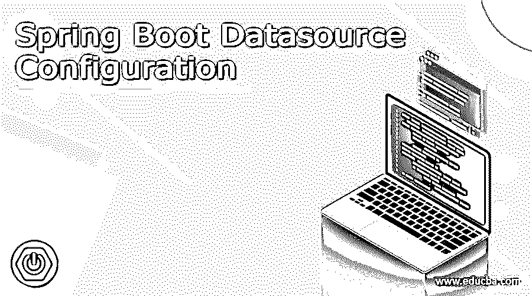
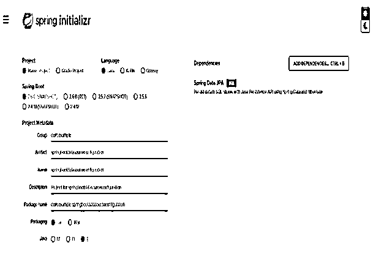
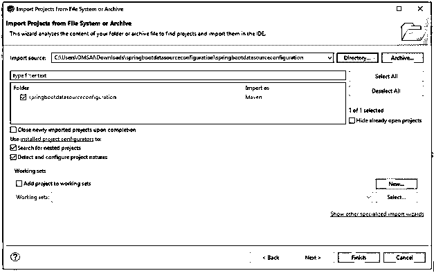
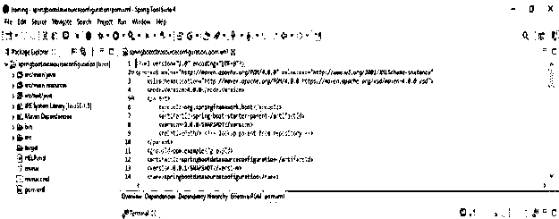
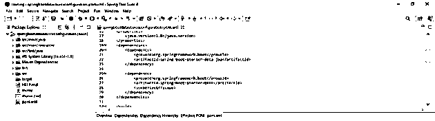
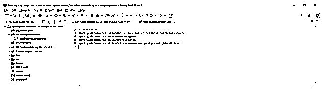
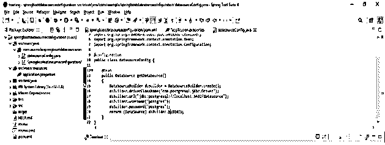
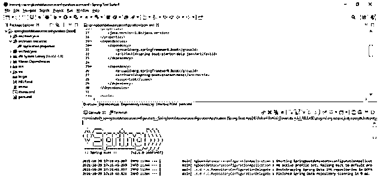
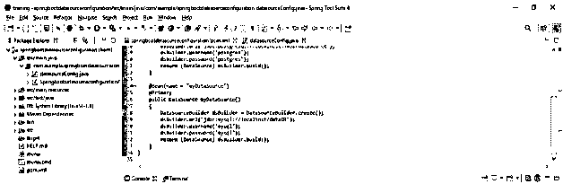
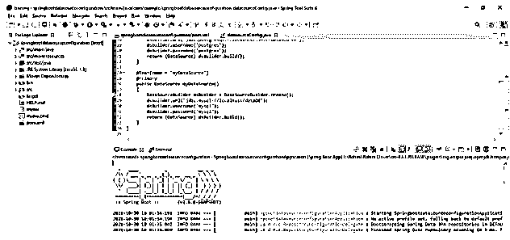

# Spring Boot 数据源配置

> 原文：<https://www.educba.com/spring-boot-datasource-configuration/>

## Spring Boot 数据源配置的定义

Spring boot 数据源配置只不过是物理数据源中使用的连接工厂。Spring boot datasource 使用数据库凭证来建立数据库服务器之间的连接，它是驱动程序管理器的替代工具。基本上，驱动程序管理器用于获取连接字符串中使用的标准连接对象。我们也可以在连接池中使用 spring boot datasource 连接。

### Spring Boot 数据源配置概览

*   Spring boot 会通过使用 apache tomcat，HikariCP，或者通过使用通用 DBCP 来自动配置连接池，我们可以通过使用类路径来选择。
*   我们可以在标准的连接对象中使用 spring boot 数据源。我们还可以在分布式事务中使用的连接池中使用 spring boot datasource 连接。

我们可以用如下两种方式来定义。

<small>网页开发、编程语言、软件测试&其他</small>

1.  属性配置
2.  Java 配置

*   数据源自动配置正在检查由数据源 bean 配置的数据源类或类路径。
*   我们需要添加 spring boot starter data JPA(spring-boot-starter-data-JPA)依赖关系，通过使用 spring boot datasource 配置来开发项目。
*   当添加 spring boot starter data JPA 依赖项(spring-boot-starter-data-jpa)时，它将添加所有依赖项，包括所有数据库 jdbc 驱动程序。例如，我们需要添加 MySQL-connector-java 依赖项来连接 MySQL 数据库服务器，添加 spring boot starter 数据 JPA 依赖项后，它会自动添加一个 mysql-connector-java 依赖项，我们无需单独添加。
*   我们已经通过使用 application.properties 文件提供了外部配置。
*   属性文件用于将配置从应用程序代码中分离出来。使用应用程序。属性文件，我们可以通过使用系统配置提供程序来导入数据源配置。
*   在项目中，我们可以通过使用 DataSourceBuilder 类创建一个 datasource bean，该类由@configuration 进行了注释。
*   除了 spring boot datasource 之外，还使用了连接池。我们也可以通过在 spring boot datasource 项目中创建 JNDI 来实现。
*   要使用数据源配置定义连接池，spring boot 首先要验证可用的驱动程序类。

### 数据源配置

下面是如下的例子。

*   #### Create a project template with spring initializer and name the project

在下面的步骤中，我们将项目组名称设置为 com。例如，工件名称为 springbootdatasourceconfiguration，项目名称为 springbootdasourceconfiguration，选择的 java 版本为 8。

`Group – com. example
Artifact name – springbootdatasourceconfiguration
Name – springbootdatasourceconfiguration
Spring boot – 2.6.0
Project – Maven
Project Description - Project for springbootdatasourceconfiguration
Java – 8
Dependencies – spring data JPA
Package name - com.example.springbootdatasourceconfiguration`

*   #### After the project is generated, extract the file and open the project with spring tool suite

在这一步中使用 spring 初始化器生成项目之后，我们提取 jar 文件并使用 spring 工具套件打开项目。

*   #### After opening the project with spring tool suite, check the project and its files

在这一步，我们检查所有的项目模板文件。我们还需要检查 maven 依赖项和系统库。

*   #### Add dependency package–

在这一步中，我们将所需的依赖项添加到我们的项目中。

**代码:**

`<dependency> -- Start of dependency tag.
<groupId>org.springframework.boot</groupId> -- Start and end of groupId tag.
<artifactId>spring-boot-starter-data-jpa</artifactId>-- Start and end of artifactId tag.
</dependency>-- End of dependency tag.`

*   #### Configure the application. Attribute file–

**代码:**

`# PostgreSQL
spring.datasource.url = jdbc:postgresql://localhost:5432/datasource
spring.datasource.username = postgres
spring.datasource.password = postgres
spring.datasource.driver-class-name = com.postgresql.jdbc.Driver`

*   #### Create a data source bean–

在这一步中，我们已经创建了 spring boot datasource 配置项目的 datasource bean。我们已经将类名创建为 datasourceConfig。

**代码—**

`@Configuration
public class datasourceConfig {
@Bean
public DataSource getDataSource ()
{
DataSourceBuilder dsBuilder = DataSourceBuilder.create ();
dsBuilder.driverClassName ("com.postgresql.jdbc.Driver");
dsBuilder.url ("jdbc:postgresql://localhost:5432/datasource");
dsBuilder.username ("postgres");
dsBuilder.password ("postgres");
return (DataSource) dsBuilder.build ();
}
}`

*   #### Define JNDI for data source-

在下面的步骤中，我们已经为我们的项目定义了 JNDI 名称。

**代码—**

`spring.datasource.jndi-name = java:jboss/datasources/datasource`

*   #### Configure connection pool for spring boot data source configuration–

在这一步中，我们已经为项目配置了连接池。

**代码—**

`spring.datasource.dbcp2.initial-size = 100
spring.datasource.dbcp2.max-idle = 100
spring.datasource.dbcp2.default-query-timeout = 1000
spring.datasource.dbcp2.default-auto-commit = true`

*   #### Run the spring boot data source configuration application–

在这一步中，我们已经使用 spring boot 应用程序运行了项目。

### 附加的两个测试配置

*   为了测试额外的配置，我们在一个类中配置了两个数据源。
*   当使用自动连线的 spring boot 将使用主数据源来使用辅助数据源时，我们需要使用@Qualifier 注释。
*   以下示例显示了如下两种测试配置。

1.  #### Configuration of two additional tests-

**代码:**

`@Bean(name = "myDataSource")
@Primary
public DataSource myDataSource()
{
DataSourceBuilder dsBuilder = DataSourceBuilder.create();
dsBuilder.url("jdbc:mysql://localhost/dataDB");
dsBuilder.username("mysql");
dsBuilder.password("mysql");
return (DataSource) dsBuilder.build();
}`

*   #### Run the application–

### 数据源配置文件

*   为了配置 spring boot 数据源配置，我们使用 data source configuration _ R3 _ roles _ db . XML，这是唯一可用于配置数据源的配置选项。
*   我们不能将此配置文件更改为任何其他配置文件。升级系统时，我们需要旧的配置文件。
*   下面是应用服务器的其他配置文件。
*   XML–该文件包含有关在 ABAP 系统中创建、修改和读取用户的用户信息。
*   XML–该文件仅包含来自 AS ABAP 系统的 UME 用户。使用这个文件，我们只能在本地 java 数据库中创建和修改新用户。
*   XML–该文件包含有关在 ABAP 系统中创建、修改和读取用户的用户信息。
*   data source configuration _ R3 _ roles _ db . XML 文件等效于 data source configuration _ R3 _ roles _ db . XML 文件。该文件仅在升级兼容性方面有所不同。

### 结论–Spring Boot 数据源配置

Spring boot 将使用算法名来配置和欺骗 spring boot 的数据源配置。固执己见的算法允许我们很容易地得到一个缺省情况下完全配置的数据源配置。

### 推荐文章

这是 Spring Boot 数据源配置指南。这里我们讨论定义、概述、两个测试配置和代码实现的附加示例。您也可以看看以下文章，了解更多信息–

1.  [Spring Boot 调度器](https://www.educba.com/spring-boot-scheduler/)
2.  [Spring Boot 的名字缩写](https://www.educba.com/spring-boot-initializr/)
3.  [Spring Boot·梅文](https://www.educba.com/spring-boot-maven/)
4.  [Spring Boot 缓存](https://www.educba.com/spring-boot-cache/)

