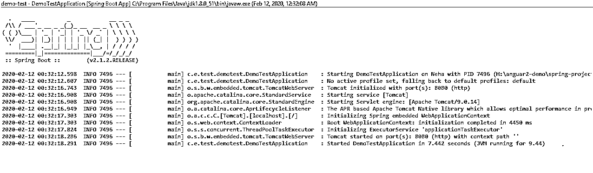

# Spring Boot DevTools

> 原文：<https://www.educba.com/spring-boot-devtools/>

## Spring Boot 开发工具的定义

Spring devtool 只不过是开发人员的工具，它帮助开发人员改进我们使用 spring boot 应用程序的时间，它是 spring 1.3 版本附带的，它基本上接受我们对应用程序所做的当前更改，并重新启动服务器，这有助于改进开发过程，并为开发人员提供更好的开发环境。为了使用它，我们需要在我们的项目中添加 spring-boot-devtools。

**语法:**

<small>网页开发、编程语言、软件测试&其他</small>

`For Gradel :
configurations {
developmentOnly
runtimeClasspath {
extendsFrom developmentOnly
}
}
dependencies {
developmentOnly("org.springframework.boot:spring-boot-devtools")
}
For Maven :
<dependencies>
<dependency>
<groupId>org.springframework.boot</groupId>
<artifactId>spring-boot-devtools</artifactId>
<optional>true</optional>
</dependency>
</dependencies>`

### Spring Boot 开发工具的功能

它为我们提供了许多不同的功能，比如他们可以通过所有必要的更改重新启动我们的应用程序，部署到云上，以及提供嵌入式服务器等。这使得开发变得容易而不耗时。

如果我们将 spring boot dev 工具依赖项包含到我们的项目中，那么开始工作并为我们配置这么多活动，这有助于我们减少运行应用程序所需的时间。当我们开发应用程序时，这些事情非常重要，因此为我们提供了改进的时间。就像我们不需要通过自动重启来构建 war 和 jar 一样，它可以完成它的工作，我们也可以调试和更新我们在云上的应用程序，从而使管理和维护变得容易。为了使开发工具能够应用到我们的应用中，我们在以下方面进行了更改:

*   在属性文件中
*   pom.xml
*   用创建一个新文件。前缀。

### Spring Boot 开发工具的例子

要在 spring boot 中构建一个示例，请遵循以下步骤:我们需要在创建项目时将开发工具的依赖项添加到 pom.xml 中，或者可以进一步添加:

**代码:**

`<dependencies>
<dependency>
<groupId>org.springframework.boot</groupId>
<artifactId>spring-boot-devtools</artifactId>
<optional>true</optional>
</dependency>
</dependencies>`

现在打开 spring initializer 并创建一个项目。转到主 java 类并运行项目。它将显示类似下面的输出。

**Java 类:**

`package com.example.test.demotest;
import org.springframework.boot.SpringApplication;
import org.springframework.boot.autoconfigure.SpringBootApplication;
import org.springframework.boot.web.servlet.FilterRegistrationBean;
import org.springframework.boot.web.servlet.support.SpringBootServletInitializer;
import org.springframework.context.annotation.Bean;
import com.example.test.config.JwtFilter;
@SpringBootApplication
public class DemoTestApplication extends SpringBootServletInitializer{
public static void main(String[] args) {
SpringApplication.run(DemoTestApplication.class, args);
}
}`

**输出:**

### 特征

spring boot 为我们调试、构建和启动应用程序提供了许多功能。它还支持在我们的应用程序中禁用和启用这些开发人员的工具，只需在属性文件中将属性值设置为 true 或 false 即可。开发人员工具的功能详述如下:

#### 1.远程应用

这个功能包括一个远程更改，可以通过网络有效地完成。使用 HTTP，我们可以调试我们的代码，如果有任何更改，我们也可以更新文件。在远程应用程序中，我们有两种类型。

*   远程调试
*   远程更新

##### 远程调试

在远程调试中，我们可以通过使用 HTTP 在网络上调试我们的远程应用程序。为了使用它，我们还需要在 spring boot 应用程序中启用一个开发工具。

*   **启用调试端口:** Xdebug -Xrunjdwp:server=y，transport=dt_socket，suspend=n
*   **覆盖默认端口:**spring . dev tools . remote . debug . local-Port = 8010

##### 远程更新

如果我们对我们的应用程序做了任何更改，那么这个特性只是重新启动应用程序。如果类路径中发生任何变化，它会持续监视我们的应用程序。所以它只是更新远程资源并重启服务器。但是对于这一点，我们不需要停止服务器，所有的更改都是在远程服务器运行时完成的。它还为我们提供了日志声明。

#### 2.自动重启

因此，spring boot 的这一特性提供了在文件中检测到任何更改时自动重启服务器的功能。因此，我们不需要手动构建我们的代码和部署 war 文件，所有这些事情都由 spring boot 本身管理，但为此，我们需要在我们的项目中使用这个开发工具包。这个特性可以很好地用于实时重载，我们将在下一点讨论。我们将 gradel 和 maven 作为插件的默认构建。

我们可以通过使用现有的 maven 和 gradel 支持来重启我们的应用程序。

进行如下配置:

*   pring application . setregistershutdownhook(false)
*   我们还可以在属性文件中禁用重启。或者我们也可以将它设置到我们的 main() java 类中，如下所示:

**语法:**

`package com.demo;
import org.springframework.boot.SpringApplication;
import org.springframework.boot.autoconfigure.SpringBootApplication;
import org.springframework.boot.context.properties.EnableConfigurationProperties;
import org.springframework.context.annotation.Bean;
import org.springframework.data.jpa.repository.config.EnableJpaRepositories;
import springfox.documentation.builders.RequestHandlerSelectors;
import springfox.documentation.spi.DocumentationType;
import springfox.documentation.spring.web.plugins.Docket;
import springfox.documentation.swagger2.annotations.EnableSwagger2;
@SpringBootApplication
public class TvvApplication {
public static void main(String[] args) {
System.setProperty("spring.devtools.restart.enabled", "false");
SpringApplication.run(TvvApplication.class, args);
}
}`

#### 3.属性默认值

据说 spring boot 应用程序使用缓存来提供更好的性能。但是在生产中，spring boot dev 工具禁用了这种缓存特性。要将缓存配置到 spring boot 应用程序中，我们需要在 application.property 文件中创建一个条目。但是这个开发工具特性会自动应用一些配置。这样，我们就不需要一次又一次地重新加载模板文件。

#### 4.全局设置

为了在我们的项目中启用这个全局设置，我们需要在我们的主文件夹路径中添加一个文件。该文件名将始终以点(.).

文件名是。因此，通过全局添加这个文件，我们将这个特性应用到我们的匹配项目中启用了开发工具包的所有应用程序。spring . dev tools . reload . trigger-file =。重载触发器

#### 5.肝负荷

这个春季启动功能包括一个嵌入式服务器，每当我们做出任何更改时，它都可以帮助我们刷新浏览器。因此，每当我们进行更改并进入浏览器时，我们总是会刷新数据，就像我们在 angular 中一样。但是有时我们不希望这个特性启用我们的应用程序，所以我们可以在一个属性文件中将它设置为:ing . dev tools . livere load . enabled = false。

### 推荐文章

这是 Spring Boot 开发工具的指南。这里我们讨论简介和 spring boot devtools 特性，以及一个例子和它的代码实现。您也可以看看以下文章，了解更多信息–

1.  [Spring Boot 注解](https://www.educba.com/spring-boot-annotations/)
2.  [Spring Boot 版本](https://www.educba.com/spring-boot-versions/)
3.  [Spring Boot 专题](https://www.educba.com/spring-boot-feature/)
4.  [Spring Boot 申请](https://www.educba.com/spring-boot-application/)

