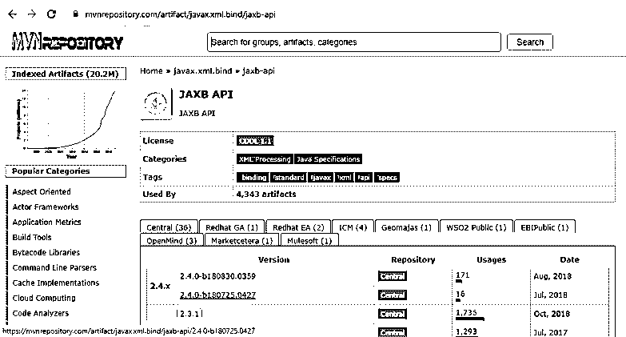

# Spring Boot 属地

> 原文：<https://www.educba.com/spring-boot-dependencies/>

## Spring Boot 从属关系介绍

Spring boot 中的依赖管理非常简单，因为它的自动配置，它为我们管理每一个配置，我们不需要担心依赖的版本。依赖关系不过是一个为应用程序运行和实现提供特定支持的库。我们可以在名为 pom.xml 或 build.gradle 等的应用程序中的一个地方管理这些依赖关系。文件。这完全取决于我们在应用程序中使用的构建工具。spring boot 的每个版本都有新的依赖项，如果我们想要更新 spring boot 版本，spring boot 还会管理依赖项的更新，这是我们不需要管理的。在接下来的部分，我们将更详细地介绍它的内部工作用法和实现，以便初学者更好地理解它。

### Spring Boot 依赖的语法

正如我们所知，spring boot 依赖项用于为应用程序提供支持，我们有一个基本的语法，可以根据构建工具来遵循。我们在这里使用一个 maven pom.xml 文件。我们如何为初学者定义依赖关系，见下文；

<small>网页开发、编程语言、软件测试&其他</small>

`<groupId>dependency grou id</groupId>
<artifactId>depenedncy artifactId</artifactId>
<version>version</version>`

正如您在上面的语法中看到的，在 pom.xml 文件中定义依赖关系时，我们有这些主要的东西，让我们看一下实践语法，以便更好地了解它。见下文；

**举例:**

`<groupId>org.springframework.boot</groupId>
<artifactId>spring-boot-starter-parent</artifactId>
<version>2.2.2.BUILD-SNAPSHOT</version>`

这里，spring boot starter 的依赖项看起来像所有声明之后的样子，所以现在它将从 maven central for local 下载这个依赖项，它将为我们下载到. m2 文件夹中。在接下来的部分中，我们将看到在创建 spring boot 项目时自动添加的不同类型的依赖项。

### 在 Spring Boot，从属关系是如何运作的？

到目前为止，我们已经知道 spring boot 依赖于顾名思义的依赖项，因为如果没有它，这个项目本身就是一个 spring boot 应用程序。在使用 spring boot 应用程序时，我们有一些基本的依赖关系。此外，spring boot 是一个强大的内部管理依赖关系的框架，我们不需要担心与它自己管理的 spring boot 版本相匹配的版本。此外，每当 spring boot 的新版本出现时，它总是会在现有版本中出现新的依赖项或适应项。

在本节中，我们将了解 spring boot 如何需要以及需要哪些常见的依赖项，见下文；

1)自动出现:如果您可以在下面的依赖项中看到，当我们从头开始创建 spring boot 应用程序时，它是默认出现的父依赖项，您可以验证到相应的。xml 文件。对于我们来说，这个依赖项包括更多的其他依赖项。

**代码:**

`<parent>
<groupId>org.springframework.boot</groupId>
<artifactId>spring-boot-starter-parent</artifactId>
<version>2.2.2.BUILD-SNAPSHOT</version>
</parent>`

2)在 spring boot 中，我们不需要管理我们的依赖项的版本，它将由 spring boot 应用程序本身处理。

3)如果您想要添加或更改 java 版本，我们可以使用<properties>来指定我们想要在应用程序中使用的 java 版本，见下文以更好地理解；</properties>

**代码:**

`<properties>
<java.version>your java version </java.version>
</properties>`

4)让我们仔细看看 spring boot 中构建文件的语法，以了解依赖关系，见下文；

要在其中定义插件:

**代码:**

`plugins {
id 'org.springframework.boot' version '2.2.9.RELEASE'
id 'io.spring.dependency-management' version '1.0.9.RELEASE'
id 'java'
id 'org.liquibase.gradle' version '2.0.1'
}`

如果我们想在 spring boot 应用程序中定义插件，那么我们必须编写类似上面的代码。插件标签用来定义它；在里面我们可以定义我们的插件名称。

5)为了定义依赖关系的存储库，我们可以使用下面的构建格式。Gradle 文件来管理和下载我们的依赖项，

我们必须在其中使用 repositories 标记，我们可以定义它应该是像 maven URL、用户名和密码等属性。看看下面的语法，以便更好地理解下面的 se；

**代码:**

`repositories {
mavenLocal()
mavenCentral()
maven {
url "your registery url"
credentials {
username "${username}"
password "${password}"
}
}
maven {
url "your registery url"
credentials {
username "${username}"
password "${password}"
}
}
}`

6)我们可以从 maven 中央存储库中下载或添加所有这些依赖项。如果您想在现有的 spring boot 应用程序中添加任何新的依赖项，只需在浏览器中键入依赖项名称，您就会得到结果，

网址:[https://mvnrepository.com/](https://mvnrepository.com/)

这是 maven central 的 Url，在这里您可以通过名称搜索任何依赖项，并且可以选择任何您想要的适合您的应用程序的版本(见下文);

7)现在我们将看到一个示例语法来定义 Gradle 文件中的所有内容，见下文；

`plugins {
// your plugins will go here ex:
id 'org.springframework.boot' version '2.2.9.RELEASE'
id 'io.spring.dependency-management' version '1.0.9.RELEASE'
id 'java'
// etc
}
group = 'your base package name '
sourceCompatibility = 'version of java'
repositories {
mavenLocal()
mavenCentral()
maven {
url "maven url local"
credentials {
username "${usename}"
password "${password}"
}
}
maven {
url "maven url for prod"
credentials {
username "${username}"
password "${password}"
}
}
}
configurations {
// if any
}
dependencies {
// here you can add all your dependencies like below;
implementation 'org.springframework.boot:spring-boot-starter-data-jpa'
implementation 'org.springframework.boot:spring-boot-starter-web'
// your test case goes here ..
testImplementation('org.springframework.boot:spring-boot-starter-test') {
exclude group: 'org.junit.vintage', module: 'junit-vintage-engine'
}
// you can also add them like below;
compile group: 'org.json', name: 'json', version: '20190722'
compile group: 'io.springfox', name: 'springfox-swagger2', version: '2.7.0'
}
test {
//For junit .
}`

### 结论

依赖不过是一个包或捆绑包，为我们需要的应用程序提供支持。所有与 spring 相关的注释和所有东西都存在于这些依赖项中，如果任何依赖项丢失或不匹配，那么我们可能会在运行应用程序时收到一个错误，所以它应该非常准确。Else spring boot 通过将许多事情自动化，使得开发人员很容易使用和操作。

### 推荐文章

这是 Spring Boot 属地指南。在这里，我们通过示例和代码实现来讨论 Spring Boot 中的简介、语法以及依赖项是如何工作的。您也可以浏览我们推荐的其他文章，了解更多信息——

1.  [Spring Boot 开发工具](https://www.educba.com/spring-boot-devtools/)
2.  [Spring Boot 执行器](https://www.educba.com/spring-boot-actuator/)
3.  [Spring Boot 起动机网](https://www.educba.com/spring-boot-starter-web/)
4.  [春天表情语](https://www.educba.com/spring-expression-language/)

