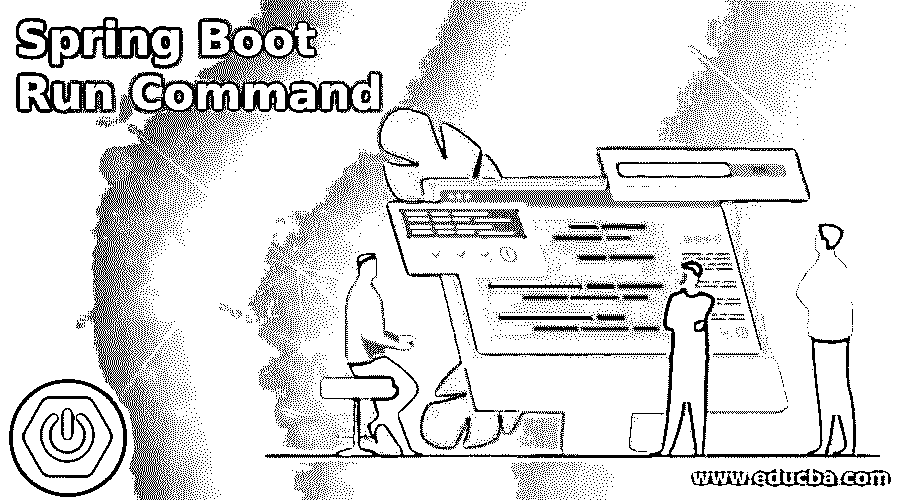
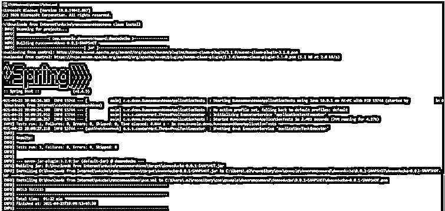
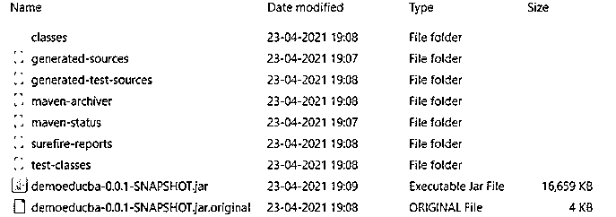
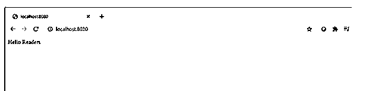
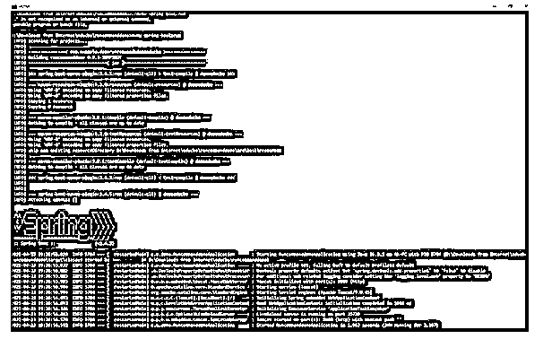

# Spring Boot 运行命令

> 原文：<https://www.educba.com/spring-boot-run-command/>

## Spring Boot 运行命令的定义

Spring boot run 命令被定义为通过使用命令行界面来运行 Spring boot 应用程序的方法。一般来说，在 spring boot 应用程序的开发过程中，我们尝试使用集成开发环境或 IDE 来运行应用程序，但是当我们尝试在生产环境中启动 spring boot 应用程序时，不可避免地要使用命令行界面来运行 spring boot 应用程序，因为生产环境可能并不总是支持 IDE。Spring boot 作为一个应用程序开发工具，确实通过提供大量的启动包和初始化器加速了开发过程。捆绑不同的元素并在环境中运行它们是我们将在本文中详细讨论的内容。

### Spring Boot 运行命令的语法

如上所述，spring boot run 命令是一种主要在生产环境中运行 spring boot 应用程序的方法。有许多方法可以实现这种能力，但是根据本文的长度，我们将讨论专业领域中最常见的方法。

<small>网页开发、编程语言、软件测试&其他</small>

从 Spring Boot 应用程序生成 Maven 工件:

`mvnclean install`

这个方法需要运行 FAT JAR，它是在运行 install 命令之后构建的。

运行已创建的 jar 文件(读为 FAT JAR):

`java -jar <jar file name>`

使用安装的 Maven 运行 Spring Boot 而不构建 FAT JAR:

`mvnspring-boot:run`

如果系统中没有安装 maven，请运行 maven:

`mvnw install`

mvnw 和 mvnw.cmd 是我们从 Spring Initializer(即 https://spring.io)下载 Spring Boot 项目时得到的两个包装器。该方法需要运行 FAT JAR，它在运行 install 命令后得到 build。

从源目录运行 Spring boot 应用程序，而不构建 FAT JAR:

`mvnwspring-boot:run`

在 pom.xml 中创建依赖项列表时，确保 spring-boot 插件是 pom.xml 的一部分。这里没有构建 FAT JAR，因此不需要运行 java -jar 命令，即使没有它，spring boot 应用程序也会启动。

### 运行命令在 Spring Boot 是如何工作的？

*   在本文中，我们将集中精力理解两个方面，其中一个是在系统中安装了 maven 的情况下运行 Spring Boot 应用程序，另一个是在系统中没有安装 maven 的情况下运行 Spring Boot 应用程序。此外，在运行 Spring Boot 应用程序时，在上面提到的每种情况下都会出现两种不同的变体。在一种方法中，我们可以构建一个 FAT JAR，然后运行该 FAT JAR，而另一种方法是绕过 FAT JAR 的构建，运行没有它的 Spring Boot 应用程序。
*   让我们首先从在系统中安装了 maven 的情况下运行 spring boot run 命令的概念开始。首先，我们必须在系统中安装 Apache Maven。用户可以下载 apache maven 的 zip 文件，提取该 zip 文件，并使用 mvn 命令将 bin 文件夹添加到环境变量的路径中。一旦 maven 就位，如果开发人员运行 mvn install，Spring Boot 项目将被编译、测试，然后打包，最后构建。jar 文件复制到本地 maven 存储库中。在构建 jar 文件时，它负责依赖项管理，其中第三方依赖项包含在项目中。JAR 文件是按照惯例构建的，因为 maven 希望编译时有特定的目录结构，而 mvn 全新安装会完成编译和打包工作。它还在执行测试用例的同时运行一些代码质量检查。不仅如此，应用程序还可以通过插件部署到远程服务器上。一旦构建了 JAR 文件，我们就可以运行 java -jar 命令，在将要部署应用程序的环境中运行应用程序。
*   运行 spring boot 而不构建 JAR 文件的替代方法是运行命令 mvn string-boot:run。这个命令确保 POM.xml 有一个插件，这个插件表示我们想要使用 Tomcat 来运行我们的代码。当代码在项目根文件夹中运行时，插件读取 POM.xml 并理解需要一个 web 应用程序容器，从而触发 Apache tomcat 的下载。下载完所有内容后，spring boot 服务器会自动运行，并将应用程序作为 spring boot 应用程序启动。
*   的。/mvnw 命令与 maven clean install 没有什么不同，只是允许开发人员在系统中不安装对 maven 的依赖。这个包装文件是在我们从 spring 初始化器下载 spring boot 项目时获得的。这与完全安装的 maven 非常相似，只是 maven 实际上并没有安装。除此之外，其他命令，如全新安装和 spring-boot: run 的工作方式与 mvn 的情况相同。

### Spring Boot 跑步司令部的例子

对于示例，我们将使用相同的 spring 引导代码并演示这两种情况！

**Pom.xml:(确保存在以下依赖关系):**

`<dependency>
<groupId>org.springframework.boot</groupId>
<artifactId>spring-boot-starter-web</artifactId>
</dependency>
startWeb.java
package com.example.demo;
import org.springframework.web.bind.annotation.RequestMapping;
import org.springframework.web.bind.annotation.RestController;
@RestController
public class startWeb {
@RequestMapping("/")
public String home() {
return "Hello Readers";
}
}
RuncommanddemoApplication.java
package com.example.demo;
import org.springframework.boot.SpringApplication;
import org.springframework.boot.autoconfigure.SpringBootApplication;
@SpringBootApplication
public class RuncommanddemoApplication {
public static void main(String[] args) {
SpringApplication.run(RuncommanddemoApplication.class, args);
}
}`

#### 示例#1

使用 mvn 和 FAT JAR 运行:

**语法:**

`mvn clean install
cd target
java -jar <jar file name>`

**输出:**

#### 实施例 2

使用 mvnwspring-boot 运行:run:

**语法:**

`mvnwspring-boot:run`

**输出:**

### 结论

总之，在本文中，我们了解了 spring boot run 命令的工作方式，以及 spring boot 为开发人员提供的各种选择和操作的灵活性。剩下的 2 个案例“mvn 和 spring-boot: run”和“mvnw 和 FAT JAR”留给读者动手体验！

### 推荐文章

这是 Spring Boot 运行命令的指南。在这里，我们还将讨论 spring boot 中的介绍以及 run 命令是如何工作的？以及不同的示例及其代码实现。您也可以看看以下文章，了解更多信息–

1.  [Spring Boot 开发工具](https://www.educba.com/spring-boot-devtools/)
2.  [Spring Boot 首发网](https://www.educba.com/spring-boot-starter-web/)
3.  [Spring Boot 注解](https://www.educba.com/spring-boot-annotations/)
4.  [Spring Boot 版本](https://www.educba.com/spring-boot-versions/)

