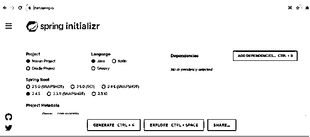
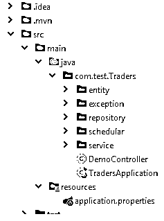
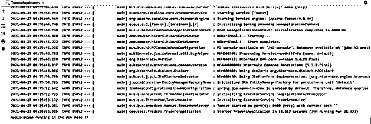

# Spring Boot 应用程序.属性

> 原文：<https://www.educba.com/spring-boot-application-properties/>

## Spring Boot 应用程序属性的定义

在 Spring boot 应用程序中，我们有一个应用程序属性文件，用于将应用程序相关的属性写入该文件。该文件包含在不同环境中运行应用程序所需的不同配置，并且每个环境将具有由其定义的不同属性。在应用程序属性文件中，我们定义了每种类型的属性，如数据库、toke、不同的 URL(如果我们在应用程序中使用任何询问)等等。如果我们想使用 spring boot 提供的注释，我们也可以在程序中使用这个值。在本教程的下一节中，我们将详细了解内部工作及其实现，以便在设计我们的应用程序时使用它。

**语法:**

<small>网页开发、编程语言、软件测试&其他</small>

正如我们已经讨论的，这个文件包含不同配置的不同属性，让我们仔细看看如何在文件中编写这些属性的语法，以便初学者更好地理解它，见下文；

`spring.application.name = name_applcation`

这样，我们可以定义应用程序的名称，在这里，它将属性表示为键-值对，每个键也与一个值相关联。让我们更仔细地看看这个练习的语法，以便更好地理解它(见下文);

**例如:**

春天。application.name = demoservice

正如你在上面的属性中看到的，我们已经通过这个属性定义了我们的应用程序的名称，即 spring。申请。我们已经切断的名称，或者我们可以说，利用财产的数量。在下一节中，我们将看到如何在程序中创建这个文件，并为我们的应用程序配置所需的更改。

### Spring boot application . properties 如何工作？

到目前为止，我们已经知道 application.properties 文件包含应用程序的属性，这有助于应用程序在不同的环境(如果有的话)中运行。Spring boot 为我们提供了为不同的环境创建应用程序文件的标准，在这里我们可以为每个环境提供不同的属性。该文件包含键值对形式的值，其中我们为应用程序的每个配置都提供了一个键。这个文件中这些属性没有限制，我们可以在文件中提到“N”个配置。你可以看到，当我们从任何 web 工具从头开始创建 spring boot 项目时，这个文件会自动添加到类路径中，如果你手动设置项目，那么你必须只在类路径中创建一个 application.properties 文件，并使用相同的名称。在这一节中，我们将看到如何创建它，在这个文件中我们需要提到哪些不同的属性，让我们开始吧；

1)第一步，我们需要为我们拥有的每个环境创建应用程序文件。在 spring boot 中，我们必须遵循它给出的一些标准，我们可以创建以下格式的应用程序文件；

应用程序-{profile}。性能

正如您所看到的，您可以像上面一样创建应用程序文件，在概要文件部分，您可以提到您想要的概要文件的名称。

2)在应用程序文件中，我们可以通过使用由 spring boot 应用程序定义的键和属性来为概要文件命名。下面看看语法我们如何在我们的应用程序中做到这一点，见下文；

**例如:**

春季:
申请:
名称:DemoProfiles
简介:本地

3)对于应用程序属性文件的名称部分，我们可以这样做，见下文；

a)应用程序-本地。属性:这个属性文件将负责为本地添加环境集。b) application-dev.properties:这个属性文件将负责添加开发环境的集合。c) application-prod.properties:该属性文件将负责为生产添加设置的环境。
d)application-test . properties:这个属性文件将负责添加测试环境的集合。
这样，我们可以为不同的环境创建应用程序属性。
现在让我们来看看一些属性；

a) server.port = 8080

这个属性用于为我们的应用程序设置端口，这里我们已经将 8080 设置为我们的应用程序将运行的端口，我们可以指定任何端口，但是如果我们有多个端口，它应该在每个服务中是不同的。

b) spring.application.name =演示应用程序

此属性用于为应用程序指定任何有意义的名称，我们可以指定任何名称，如果我们的项目中有多个服务，它应该是唯一的。

c) spring.config.name:这将告诉配置名称

d)春天。config.location:这将告诉配置文件的位置

e) spring.info.build.location:将告诉构建文件的位置

f) spring.info.build.encoding:告诉构建编码

g) spring.info.git.encoding:文件编码

h) spring.jmx.default-domain:将告诉 jmx 默认域

i) spring.jmx.server: JMX 服务器名称

j)春天。main.banner-model:告诉模式显示横幅

现在到了我们想在程序的类中访问这个值的时候了，让我们来看看；为了访问它，我们可以使用 spring boot 框架中的@Value 注释，它将为我们提供属性文件中的键值。让我们来看看它的语法，见下文；

**例如:**

@ Value(" $ { property _ key _ name:default _ Value } ")

这样，我们可以从 spring boot framework 中的应用程序属性文件中访问该值。此外，我们可以在程序内部使用这个值来访问资源。让我们从执行此操作所需的步骤开始；

1)首先，我们必须创建一个项目，如果您还没有，请按照下面的 URL 获取该项目的 zip 文件，并在填写完所有必填字段后将其提取到编辑器中。

**网址:**

`https://start.spring.io/`

2)我们在类路径中检查 application.properties 文件，如果找不到，则在类路径中创建一个同名的文件。作为参考，我附上一张截图，如果没有找到，在哪里创建它。

**输出:**

3)如果您已经找到它，那么它必须是空白的，不包含任何配置，现在进行一些更改，使其工作见；

**例如:**

server.port = 8081
spring。application.name =演示应用程序

现在，我们的应用程序将在 8081 端口上运行，而不是在默认端口上运行。

4)检查应用程序的主类，它应该包含以下代码来运行应用程序。检查一次。

**例如:**

`package com.test.Traders;
import com.test.Traders.entity.Student;
import org.springframework.boot.SpringApplication;
import org.springframework.boot.autoconfigure.SpringBootApplication;
import java.util.*;
@SpringBootApplication
public class TradersApplication {
public static void main(String[] args)
{
SpringApplication.run(TradersApplication.class, args);
}
}`

5)现在，如果您运行该应用程序，您将在屏幕上看到以下输出；

**输出:**

### 结论

通过使用它，我们可以进行所需的配置，使我们的应用程序开发和生产就绪。所有的变化，我们已经使它易于实施，并不需要任何沉重的改变之前使用它，这是很容易使用和处理，以及由开发人员。

### 推荐文章

这是 Spring Boot 应用程序的指南。属性。这里我们讨论定义、语法、Spring boot application . properties 如何工作？代码实现示例。您也可以看看以下文章，了解更多信息–

1.  [Spring Boot 开发工具](https://www.educba.com/spring-boot-devtools/)
2.  [春季 AOP](https://www.educba.com/spring-aop/)
3.  [Spring Hibernate 集成](https://www.educba.com/spring-hibernate-integration/)
4.  [春天的建筑](https://www.educba.com/spring-architecture/)

