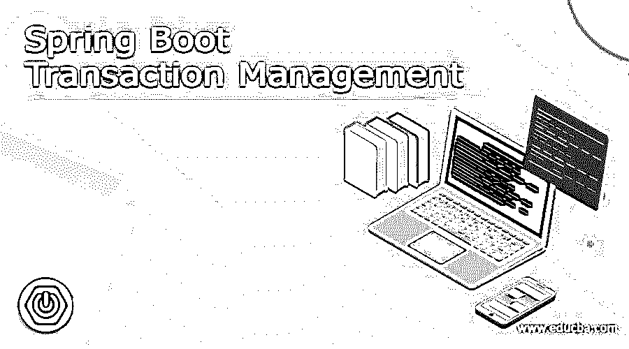
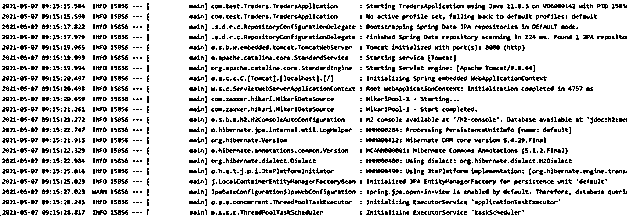

# Spring Boot 交易管理

> 原文：<https://www.educba.com/spring-boot-transaction-management/>

## Spring Boot 事务管理的定义

在 spring boot 或任何其他应用程序中，事务管理是非常重要的方面，因为它与 RDBMS 部分相关，RDBMS 部分通常负责数据的完整性和一致性。我们可以将事务定义为单个工作单元，它定义了数据库中与事务相关的一些任务，可以是任何事情，如对象的获取、更新、创建、删除等等。所以为了保证数据的完整性，我们在 spring boot 中使用了事务管理，这样就不会有数据丢失。Spring 为我们提供了处理事务的注释，在本教程的下一节中，我们将看到它的内部工作和用法，以便更好地理解和让用户更可靠地使用应用程序。

**语法:**

<small>网页开发、编程语言、软件测试&其他</small>

正如我们所讨论的，它是一种在应用程序中处理数据库事务的机制，如果在运行代码时出现任何错误，它可以确保我们的数据一致性。让我们仔细看看语法，以便更好地理解，见下文；

`@Transactional
public return_type method_name() {
// logic goes here ..//
}
In the above syntax we are trying to use @Transactional annotation which will help us to provide the data integrity. let's taken an closer look at the practice syntax for better understating see below;
e.g. :
@Transactional
public void test() {
// logic goes here ..//
}`

### 春开机如何进行事务管理？

正如我们已经讨论过的，当我们希望确保数据完整性和用户数据的一致性时，事务管理是应用程序中需要的非常重要的机制。借助于此，我们可以在运行代码时处理错误和故障。@Transactional 总是用在方法之上，以确保这段代码在运行它的过程中，当发生任何类型的错误或异常时，恢复所有的更改。在 spring boot 应用程序中，我们编写并使用这个@Transactional 注释和业务逻辑，这对我们来说是数据关键。在本节中，我们将看到一个没有@Transactional 注释的实践示例，它将解释数据是如何失败的。让我们开始吧；

一般来说，事务管理可以由如下的 ACID 属性来定义:

1)原子性:该属性定义事务应该成功或者什么都不做。这意味着如果期望发生在执行代码时，它也应该回滚以前的更改。如果代码成功，那就没什么好担心的。

2)一致性:该属性定义了数据一致性，这意味着我们应该以这样一种方式维护数据库中的约束，即数据库应该处于一致的状态，而不是在事务之前或之后。

3)隔离:这个属性定义了事务的独立性，这意味着一个事务的执行不应该影响另一个事务。他们应该是独立的。

4)持久性:该属性定义，一旦事务完成，其改变应该被存储并应该被写入磁盘，即使在系统故障的情况下也是如此。

现在我们将看到一个示例事务流程图，它将定义它是如何工作的，它还将解释在为我们执行业务关键逻辑时的步骤，见下文；

1)在第一步中，事务正在进行，它将开始执行业务逻辑。

2)假设我们想在数据库中添加一个新的雇员条目，在创建雇员时，我们在这些表中输入他们的信息。

3)因此，在这一步中，应该在所有三个表中创建条目，或者在失败的情况下创建任何条目。

4)最终交易会结束。

5)注意:如果事务成功，那么我们应该在所有的表中输入条目，但是如果失败或者发生任何异常，那么应该从表中回滚。

为了更好地理解，请参见下面的参考流程图；

### 例子

在 spring boot 应用程序中使用事务管理时应采取的步骤如下:

1)首先，我们需要准备好 spring boot 应用程序，使用 spring initializer 创建它，将所有细节放入其中，并在提取后将其导入编辑器，在下面找到参考 URL:

**网址:**

`https://start.spring.io/`

2)要运行这个程序，我们需要实体，以便在数据库中创建学生对象，下面是学生类的代码；

**例如:**

`import javax.persistence.Column;
import javax.persistence.GeneratedValue;
import javax.persistence.GenerationType;
import javax.persistence.Id;
import java.time.LocalDateTime;
public class Student {
@Id
@GeneratedValue(strategy = GenerationType.IDENTITY)
@Column(name = "ID")
private Long id;
@Column(name = "STUDENT_NAME")
private String name;
@Column(name = "ROLL_NO")
private int rollno;
@Column(name = "CITY")
private String city;
@Column(name = "DEP")
private String dep;
}`

3)在这一步中，我们将把一个学生的对象存储到数据库中。为此，我们将创建一个包含创建方法的服务。请参考下面的代码；

**例如:**

`@Service
public class StudentService {
@Autowired
private StudentRepository studentRepository;
@Transactional
public void create(Student student){
studentRepository.save(student);
System. out.println("Transaction successfull.");
}
}`

用@Transactional 注释注释 cerate student 方法，它为我们处理后续过程。

4)在这个方法中，我们将创建新的存储库接口，它将为我们处理数据库操作，就像任何事务一样，请参考下面的代码。

**例如:**

`import org.springframework.data.jpa.repository.JpaRepository;
import org.springframework.data.jpa.repository.Modifying;
import org.springframework.data.jpa.repository.Query;
import org.springframework.data.repository.query.Param;
import org.springframework.stereotype.Repository;
import java.time.LocalDateTime;
import java.util.List;
@Repository
public interface StudentRepository extends JpaRepository<Student, String> {
}`

5)运行上面的应用程序，它应该没有任何错误，并为我们打印下面的输出，尝试使用任何 rest 工具调用该方法，

**输出:**

### 结论

正如我们在教程中看到的，使用负责为我们执行业务关键逻辑的@Transactional 注释来注释我们的方法非常重要，这将有助于防止我们以后出现数据不一致问题，在 spring boot 中使用句柄非常容易。

### 推荐文章

这是 Spring Boot 交易管理指南。这里我们讨论定义，参数，语法，如何在 Spring boot 中执行事务管理？代码实现示例。您也可以看看以下文章，了解更多信息–

1.  [Spring Boot 属地](https://www.educba.com/spring-boot-dependencies/)
2.  [Spring Boot 知识库](https://www.educba.com/spring-boot-repository/)
3.  [Spring Boot 开发工具](https://www.educba.com/spring-boot-devtools/)
4.  [Spring Boot 执行器](https://www.educba.com/spring-boot-actuator/)

