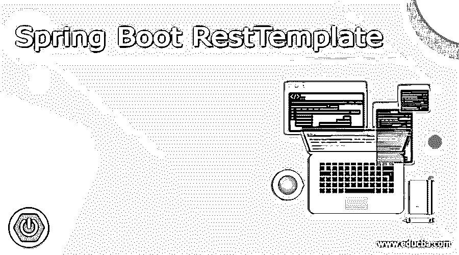
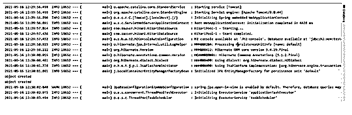

# Spring Boot RestTemplate

> 原文：<https://www.educba.com/spring-boot-resttemplate/>

## Spring Boot rest 模板的定义

在 Spring boot 中，我们可以利用 RestTemplate 来帮助我们从应用程序本身调用 PAI，我们可以编写方法来从应用程序调用 API 来消费数据并进行进一步处理。RestTemplate 存在于 spring boot 的 started-web 依赖项中。如果我们想使用它，我们可以简单地自动连接它的对象，并使用它的不同方法从应用程序发出任何类型的请求。通过使用它，我们可以执行获取、发布、上传、删除任何请求。但是从 spring boot 开始，较新的版本很快就会被弃用，他们已经提出用 webclient 来替代它。但在本教程中，我们将看到如何实现 RestTemplate 并利用它来调用 API，以便初学者更好地理解实现。

**语法:**

<small>网页开发、编程语言、软件测试&其他</small>

正如我们所知，这是一种机制，我们可以说，通过一些小的配置和几行代码，使用 RestTemplate 调用 HTTP 端点。让我们仔细看看语法，以便更好地理解它的用法，见下文；

`@Autowired
private RestTemplate name_of_variable;`

正如你在上面的语法中看到的，我们让这行代码在程序中使用 RestTemplate 来调用任何 URL。让我们仔细看看练习语法，以便更好地理解，见下文；

**举例:**

`public class Test{
@Autowired
private RestTemplate restTemplate;
}`

通过这种方式，我们可以在 spring boot 类中使用 RestTemplate，在本教程的下一节中，我们将看到实现这一点所需的更多详细配置，以及如何在我们的应用程序中使用 RestTemplate 调用 API。

### Spring Boot RestTemplate 是如何工作的？

正如我们已经知道在我们的应用程序中何时使用 RestTemplate，假设我们有一个场景，我想从第三方 API 收集数据，或者我们可以说我的应用程序运行在不同的服务器上，因此为了从不同的服务器获取数据，我们需要向该服务器发出 HTTP 请求，一旦我们发出请求，它将返回我们想要的数据，我们还应该知道我们希望从我们的应用程序中访问的 URL。因此，在我们必须发出 HTTP 请求以获取或发送数据的情况下，我们可以使用 RestTemplate，我们还应该知道方法类型，因为在为 restTemplate 编写代码时，我们必须使用 appreciate 方法来调用 API，并且必须传递所有必需的参数以及部分 URL。在本节中，我们将首先看到为了运行这个应用程序我们必须进行的配置，让我们开始吧；

*   为了使用 resttemplate，我们必须使用这个 Web 依赖，因为它包含了所需的包。因此，在创建应用程序或项目时，也要添加这个依赖项。
*   **自动连接:**在这之后，我们必须在程序内部自动连接 RestTemplate 对象，在那里我们要对 URL 进行 RestTemplate 调用。这是非常正常和简单的，就像我们对其他组件和服务所做的一样，我们有应用程序。所以 spring container 现在会为我们处理所有的依赖，我们不需要显式地这样做。
*   **方法:**我们可以创建一个方法，在这个方法中我们可以编写使用 Rest 模板调用端点的逻辑。它有这么多不同的方法来进行不同类型的调用，让我们仔细看看它们中的每一个，详见下文；
*   首先，我们必须在我们想要使用 RestTemplate 的类中自动连接 RestTemplate 对象，然后我们可以使用下面的方法调用 API，

**举例:**

`final HttpEntity<String> request = new HttpEntity<>(json.toString(), your_headers);
ResponseEntity<String> response = this.restTemplate.exchange(your_URL, HttpMethod.POST, your-REQUEST, class_type.class);`

正如你在上面的代码中所看到的，我们在这里使用了交换方法，但是它需要很多参数作为输入。我们也可以在里面传递标题，在另一端验证 URL。我们先讨论一下 t 取的参数；

*   **URL:** 它指定了我们希望从应用程序中点击的 URL 或 API 端点，以便根据需求获取或发布数据。
*   **方法类型:**第二个参数在这里指定方法的类型。
*   request:第三个参数是 request，即包含 URL 或 headers 参数的 HttpEntity 对象。
*   **类类型:**最后一个参数指定它将返回的响应类型。

### Spring Boot RestTemplate 示例

在这个例子中，我们只是编写了 rest 模板方法来从我们拥有的 URL 获取数据响应。您可以用您的替换这些参数，并尝试使用 test class 或任何高级 rest 客户端来调用该方法。运行这个的一切都应该准备好了。

**代码:**

`import com.scania.coc.core.common.handler.RestTemplateResponseErrorHandler;
import org.slf4j.Logger;
import org.slf4j.LoggerFactory;
import org.springframework.stereotype.Service;
import org.springframework.web.client.RestTemplate;
@Service
public class RestTemplateDemo {
private static final Logger logger = LoggerFactory.getLogger(RestTemplateDemo.class);
@Autowired
private String postEntity(String url, JSONObject json) {
HttpHeaders headers = new HttpHeaders();
headers.setContentType(MediaType.APPLICATION_JSON);
final HttpEntity<String> request = new HttpEntity<>(json.toString(), headers);
ResponseEntity<String> response = this.restTemplate.exchange(url, HttpMethod.GET, request, String.class);
if (response.getStatusCode().equals(HttpStatus.OK)) {
System.out.println("got response succsessfully");
}
return "";
}
}`

*   主类应该如下图所示；

**代码:**

`@SpringBootApplication
@EnableScheduling
@EnableJpaRepositories
public class TestApplication{
public static void main(String[] args) throws JsonProcessingException {
SpringApplication.run(TestApplication.class, args);
}
}`

*   运行应用程序它应该运行没有任何错误；

**输出:**

### 结论

通过使用 RestTemplate，我们能够从我们的应用程序调用 API，如果我们有任何依赖，我们也可以从第三方或其他应用程序获取数据。所以基本上它是用来调用应用程序的 REST 的。这些都很容易被开发者使用和处理，并且不需要更少的配置。

### 推荐文章

这是一个 Spring Boot RestTemplate 指南。在这里，我们还将通过示例讨论 qualify 的简介和要点。您也可以看看以下文章，了解更多信息–

1.  [春云流](https://www.educba.com/spring-cloud-stream/)
2.  [Spring Boot 属地](https://www.educba.com/spring-boot-dependencies/)
3.  [Spring Boot 知识库](https://www.educba.com/spring-boot-repository/)
4.  [Spring Boot 简介](https://www.educba.com/spring-boot-profiles/)

