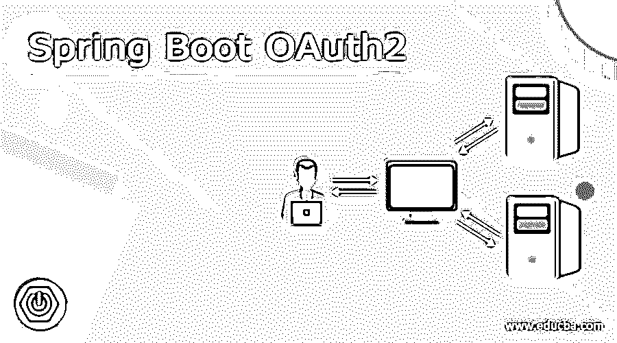

# Spring Boot·奥特 2

> 原文：<https://www.educba.com/spring-boot-oauth2/>

## Spring Boot 的定义

在 Spring boot 中，我们有一种机制帮助我们进行授权；这被称为 oauth2.0 通过使用这一点，我们可以很容易地授权两个服务之间的交互。oauth2 的主要目的是代表有权访问资源的用户授权两个服务。oauth2 不是为了认证；，它用于授权。我们有资源；说到 oauth2 的重要术语时，资源拥有 we、授权服务器、资源服务器和客户机。所有这些实体在 oauth2 中起着重要的作用；他们应该在 oauth2 流程中扮演特定的角色。对于 oauth2，我们主要有三种类型的流，但在本教程中，我们将讨论唯一一种使用最广泛、最安全的流。在本教程的下一节中，我们将看到如何在我们的应用程序中实现 oauth2 来提供授权机制，还将进一步了解在 spring boot 应用程序中实现这一点需要哪些基本步骤。

**语法:**

<small>网页开发、编程语言、软件测试&其他</small>

众所周知，oauth2 是一种需要适当配置才能工作的机制。在本节中，我们将看到基本配置，这是在 spring boot 中使用 oauth2 启动时非常需要的(见下文);

`@EnableWebSecurity
public class class_name extends WebSecurityConfigurerAdapter {
// logic goes here
}`

正如您在上面的代码行中看到的，我们正在尝试创建 security 类，并尝试启用 web 安全性来实现这一点。让我们仔细看看练习语法，以便更好地理解(见下文);

**例如:**

`@EnableWebSecurity
public class DemoConfig extends WebSecurityConfigurerAdapter {
// logic goes here
}`

在下一节中，我们将详细介绍在 spring boot 应用程序中正确实现这一点所需的步骤，以便初学者更好地理解。

### Spring boot oauth2 是如何工作的？

正如我们已经知道的，在 spring boot 中，我们可以实现 oauth2 来授权用户，它基本上意味着授权，而不是认证。此外，oauth2 的主要功能是授权用户。它的基本目的是授权两个不同的服务访问某个资源，然后代表具有访问权限的用户。在本节教程中，我们将看到一个问题陈述，并试图更好地理解它。正如我们已经知道的，oauth2 有各种术语，这些术语将使我们对流程及其内部工作方式有一个基本的了解；让我们开始吧；

1)资源:这是我们想要访问的资源，为此，我们需要授权。它也被称为受保护的资源。

**2)资源所有者:**这是可以访问受保护资源的实体，也就是说谁可以允许我们授予对我们想要访问的资源或者任何其他想要访问的服务的访问权。

**3)资源服务器:**这是具有受保护资源的服务器，并且其他服务想要访问它，但是它们具有有效的授权或访问以便使用该资源。

4)客户端:这通常是一个术语，因为客户端是指希望代表用户访问受保护资源的人。如果用户给了许可，那么它就可以访问，否则就不行。

**5)授权服务器:**这是非常重要的一个，它可以与资源服务器耦合，也可以是单独运行的单个服务器，它授权另一个服务并为它们提供资源。但是这个服务器必须提供各种各样的安全性，并且应该允许某人代表用户进行授权。
让我们理解一个问题陈述来得到这种类型的情况；在下图中，我们必须说明用户和两种不同服务的位置；他们想互相交流，让我们开始看看下面；

1)用户有一些驻留在服务二上的数据。但是用户直接用服务一拦截，而不是用此刻的服务。所以用户告诉服务 1 从服务 2 获取数据。

2)在这种情况下，服务 1 和服务 2 都不知道彼此是谁。

3)服务 1 告诉服务 2，我想从您那里获得该用户的数据，您能提供给我吗？但是服务 2 不知道，它会说没有用户同意我不能提供。

4)现在，它将询问用户服务 1 想要访问您的个人数据，这些数据位于我的服务器上，我应该允许他访问吗？或者这是一个有效的网址？

5)现在，用户会说是的，允许访问它是对真实的，允许他们访问我的数据。

6)这样，oauth2 通常允许代表用户访问资源。为了解决这个问题，我们有了 oauth2，它可以保护我们的数据免受服务器攻击，并且只有在用户允许的情况下，在用户同意的情况下，才会授权来自正确位置的数据。所以它非常安全、易读、易懂。

让我们来看一下流程图，它详细说明了在交换令牌的场景中它是如何工作的，以便从其他服务获取详细信息或数据(见下文);

1)在第一步中，用户将告诉服务 1 从服务 2 获取数据。

2)现在，在这一步中，它将向授权服务器请求访问，以便访问资源。

3)但是认证服务器不知道，因为他只信任他的用户，所以它将再次返回到用户并询问他是否想要给予对该服务的访问。

4)现在，这取决于用户是否希望允许访问。在这种情况下，它将允许并将其发送到授权服务器。

5)现在，授权服务器已经与用户进行了交叉检查，并获得了用户的许可，允许访问该服务。现在，授权服务器会给它一个 auth 令牌，以便访问服务器上的资源。

6)有了这个认证令牌，现在服务 1 必须发出一个请求来获得访问令牌。服务 1 将把这个 auth 令牌传递给授权服务，并获得访问令牌来访问服务器上的实际资源。

7)现在，授权服务器将返回一个访问令牌作为回报

8)现在，这是最后一步，服务 1 将调用 API 端点，在此访问令牌的帮助下获取用户的数据。

这就是 oauth2 在 spring boot 应用程序中的工作流程。我们已经看到这是一口非常安全的井。为了得到用户同意的资源，如果他允许，我们就不能去访问它。

### 结论

正如我们已经看到的，它很容易使用，以及它如何在内部代表用户授权外部服务。只需进行小配置，并使其正常工作。但在此之前，它的工作是很重要的，如何在春季开机。

### 推荐文章

这是 Spring Boot 的旅游指南。这里我们讨论一下 Spring boot oauth2 的定义、语法、工作原理？代码实现示例。您也可以看看以下文章，了解更多信息–

1.  [Spring Boot 申请。属性](https://www.educba.com/spring-boot-application-properties/)
2.  [Spring Boot 运行命令](https://www.educba.com/spring-boot-run-command/)
3.  [春云流](https://www.educba.com/spring-cloud-stream/)
4.  [Spring Boot 简介](https://www.educba.com/spring-boot-profiles/)

