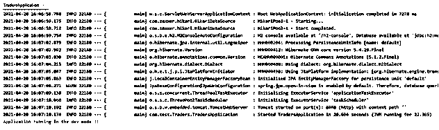

# Spring Boot 简介

> 原文：<https://www.educba.com/spring-boot-profiles/>

## Spring Boot 配置文件的定义

在 spring boot 中创建应用程序时，我们有不同的开发阶段，它们通常被视为开发、测试和生产。这有助于我们为每个环境创建不同的配置文件，我们使用@profile 注释在 spring boot 应用程序中也实现了这一点。通过设置不同的配置文件，我们可以在不影响其他环境的情况下为每个环境设置不同的座位。这是非常有用的，通过使用它，我们可以按照我们想要的方式使用本地的开发环境。在本教程的下一节中，我们将看到在 spring boot 应用程序中设置它需要哪些步骤。此外，我们将在内部看看它是如何工作的，并实现它，让初学者更好地理解它。

**语法:**

<small>网页开发、编程语言、软件测试&其他</small>

正如我们已经知道的，为了在 spring boot 中使用它，我们必须进行一些配置，这都与只进行配置有关。我们可以将属性设置到 application.properties 文件中。让我们仔细看看语法，以便初学者使用更好地理解它，见下文；

`@Profile(value=" your profile name profile")`

如您所见，我们使用了@Profile 注释，并在其中提供了配置文件的名称。让我们仔细看看初学者的语法样例，它更容易理解，见下文；

**例如:**

`@Profile(value="local")`

上面这段语法将为我们激活本地概要文件。在本教程的下一节中，我们将看到如何使用和配置它，以便在应用程序开发中使用它。

### 配置文件如何在 Spring boot 中工作？

在本节中，我们将看到如何在 spring boot 中编程时使用它，以及 spring boot 中配置文件设置的内部工作。正如我们现在所知道的，当涉及到为我们拥有的每个环境设置不同的设置时，配置文件是非常重要的，因为 spring boot 的开发包括不同的环境，如 prod、dev、test 和其他环境。这一点很重要，因为我们不能在每个环境中都有相同的数据库和更多的东西，这还可以防止我们在生产数据库上产生任何冲突。在这一节中，我们首先将看到如何在 spring 应用程序中设置概要文件(见下文);

让我们开始吧；

1)第一步，我们需要为我们拥有的每个环境创建应用程序文件。在 spring boot 中，我们必须遵循它给出的一些标准，我们可以创建以下格式的应用程序文件；

`application-{profile}.properties`

正如您所看到的，您可以像上面一样创建应用程序文件，在概要文件部分，您可以提到您想要的概要文件的名称。

2)在应用程序文件中，我们可以通过使用由 spring boot 应用程序定义的键和属性来为概要文件命名。下面是我们如何在应用程序中做到这一点的语法。

**例如:**

`spring:
application:
name: DemoProfiles
profile: local`

3)对于应用程序属性文件的名称部分，我们可以这样做，见下文；

a) application-local.properties:这个属性文件将负责为 local 添加环境集。

b) application-dev.properties:这个属性文件将负责添加开发环境集。

c) application-prod.properties:该属性文件将负责为生产添加 set 环境。

d) application-test.properties:这个属性文件将负责为测试添加一组环境。

4)现在我们将了解如何在 spring boot 中使用应用程序属性文件来激活任何配置文件。要在应用程序中激活任何概要文件，我们通常需要在属性文件中进行修改。在这里我们可以设置我们想要用于当前目的的配置文件。下面我们将看到我们如何利用这个属性，我们可以作出必要的改变；

例如:

`spring. profiles.active=your_prfile_name`

正如您在上面的语法行中所看到的，我们使用了 spring boot 的 profile active 属性来激活应用程序中的概要文件。让我们来看看示例语法，以便初学者更好地利用它(见下文);
例如:

`spring. profiles.active=dev`

让我们来看看将概要文件配置到 spring boot 名称中时需要执行的步骤，如下所示

1)首先，我们必须使用 spring 初始化器从头开始创建 spring boot 应用程序，然后我们可以将更改导入到编辑器中。

2)我们不需要为此添加任何特定的依赖，因为 spring boot 在基本结构中提供了这一点。

3)在使用为此所需的注释时，我们必须在该位置有一个 import 语句，否则我们将收到一个错误。

4)让我们仔细看看文件；

**例如:**

`@SpringBootApplication
public class DemoProfileApplication {
public static void main(String[] args) throws IOException {
SpringApplication.run(DemoProfileApplication.class, args);
}
@Configuration
public class Config {
@Bean
public RestTemplate restTemplate() {
return new RestTemplate();
}
@Bean
@Profile({"dev"})
public void configDev() throws IOException {
// logic goes hee ..///
}
@Bean
@Profile({"prod"})
public void configProd() throws IOException {
// logic goes hee ..///
}
}
}`

5)对 application.properties 文件进行如下更改；

**例如:**

`spring. profiles.active=local`

6)对 spring boot 应用程序进行必要的修改，并尝试运行它。

7)右键单击应用程序，然后当应用程序启动并运行时，您将在控制台上看到以下日志，作为参考，我附上截图；

**输出:**

### 结论

通过在 spring boot 应用程序上使用 profiler，我们可以根据需要进行不同的环境设置，并在本地运行应用程序，而不会影响对生产环境数据的任何更改。因此，在应用程序中使用概要分析是一种最佳实践。这是开发人员为了充分利用应用程序而遵循的标准。

### 推荐文章

这是一个 Spring Boot 简介指南。这里我们讨论定义、语法和参数，配置文件如何在 Spring boot 中工作？代码实现示例。您也可以看看以下文章，了解更多信息–

1.  [Spring Boot 开发工具](https://www.educba.com/spring-boot-devtools/)
2.  [Spring Boot 执行器](https://www.educba.com/spring-boot-actuator/)
3.  [Spring Boot 首发网](https://www.educba.com/spring-boot-starter-web/)
4.  [春季 AOP](https://www.educba.com/spring-aop/)

