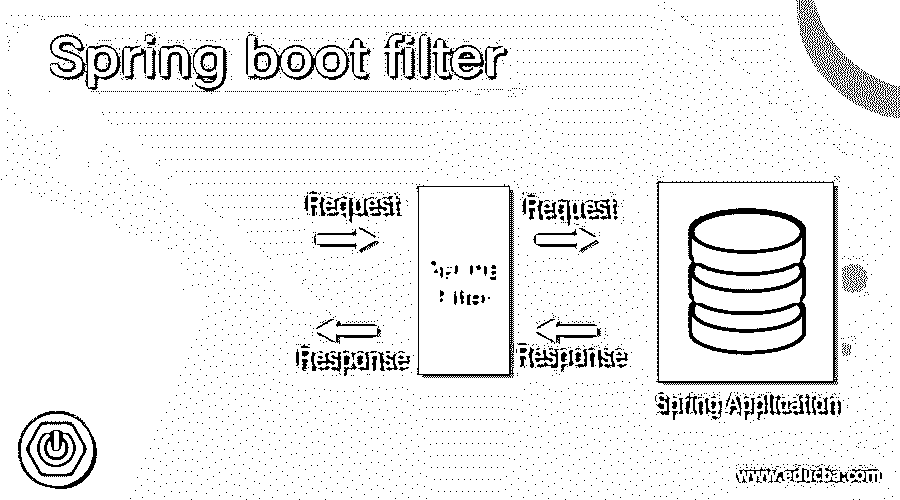

# 弹簧靴过滤器

> 原文：<https://www.educba.com/spring-boot-filter/>

## 弹簧靴过滤器简介

在 Spring boot 中，我们有过滤器来过滤 HTTP 请求；过滤器通常用于拦截请求，即 HTTP 请求和来自客户端的响应。通过使用过滤器，我们可以对响应和请求执行两种操作。当我们希望限制用户访问任何 URL 时，这非常有用，而且我们可以在 Spring boot 中对请求和响应实例做很多事情。在下一节中，我们将看到它在内部是如何工作的，以及在 spring boot、用法和实现中使用它需要哪些配置，以便更好地理解它。

**语法**

<small>网页开发、编程语言、软件测试&其他</small>

正如我们所看到的，它是一个用于过滤我们在 spring boot 应用程序上收到的请求和响应的类，但是要使用它，我们必须遵循一些标准，并且需要做一些配置以便正确地使用它，请参见下面的内容以便更好地理解；

`@Component
public class filter_name implements Filter {
// need to implement the required methods here ..
}`

正如您在上面的语法中看到的，我们在这里使用 filter 接口创建了一个简单的过滤器。在这之后，我们还需要实现它内部的方法。让我们仔细看看下面的语法练习，让初学者看得更清楚；

**举例:**

`@Component
public class MyFilter implements Filter {
// need to implement the required methods here ..
}`

在本教程的下一节中，我们将仔细查看我们用来详细定义该过滤器的所有配置和注释，以便在初学者的应用程序中没有任何错误地使用它。

### 春季开机如何应用滤镜？

到目前为止，我们已经知道 spring boot 中的 filter 或者一般来说，是用来对请求和响应实例执行操作的。利用这一点，我们可以限制网址；首先，它将到达过滤器，然后只有它将导航到相应的控制器(如果适用的话),否则，我们可以将请求发送回客户端，并提及一些原因。在这一节中，首先，我们将看到关于过滤器的两件基本事情，然后我们将开始在 spring boot 中创建一个过滤器类，包含所有需要的配置；下面我们开始看；

1.它用于拦截或过滤 HTTP 响应和请求实例。

2.它可以在将请求实例发送到控制器之前对请求实例执行操作。

3.它可以在将响应实例发送到请求的客户端之前对响应实例执行操作。

4.在 spring boot 应用程序中，我们必须在 filter 类中使用@Component 注释。

5.我们将使用 javax.servlet.Filter。因此，我们也不需要添加外部依赖项；可以直接使用。

6.我们还可以通过在 Spring boot 中提到它们的顺序来创建多个过滤器。

让我们用一段样本代码来理解过滤器的工作原理，更多细节见下文；

`@Component
@Order(1)
public class MyFilter implements Filter {
@Override
public void doFilter(ServletRequest request, ServletResponse response, FilterChain chain) throws IOException, ServletException {
HttpServletRequest r1 = (HttpServletRequest) request;
Logger.info("convert the object to this URL is ::" +r1.getRequestURI());
chain.doFilter(request, response);
Logger.info("done with request sending response URL is  ::" +r1.getRequestURI());
}
}`

正如您在上面我们创建的过滤器中看到的，这非常简单，也很容易理解我们在哪里处理对客户端的请求和响应。让我们更好地理解它；

1.首先，我们使用了@Component 注释将这个类视为过滤器，并告诉 spring 在启动时初始化这个类。

2.其次，我们已经使用了@Order 注释，它将在应用程序中首先执行这个过滤器；我们还提到该滤波器的优先级为(1)。

3.从这里，我们已经创建了一个类，它实现了 Servlet 的过滤器接口。这个接口有这个 doFilter()方法，它需要在使用 filter infract 时实现。

4.因此，我们在类内部覆盖了过滤器方法；如果我们在 spring boot 应用程序中收到来自客户端的任何请求或任何 HTTP 请求，就会触发这个方法。所以在这个方法中，我们有 ServletRequest 和 ServletResponse 对象。

5.我们现在已经尝试将 ServletRequest 对象转换为 HttpServletRequest 对象，并尝试从中获取 URI。之后，我们再次调用 doFilter，并在其中传递请求和响应对象。这个方法现在将把对象移交给控制器，所有需要的操作都将在那里执行。一旦所有的事情都完成了，最后，控制又回到了这个方法，然后，如果我们想，我们可以做。

6.我们在这里只是试图通过使用类中的记录器来记录这个流。

7.这样，一个基本的过滤器通常在 spring boot 或任何其他框架中工作，比如说 spring 框架。

8.spring boot 应用程序的其他配置和结构将是相同的；没有变化。此外，我们需要准备好所有必需的依赖项，mainspring 类，以便正确使用它并运行应用程序。

9.我们可以通过 spring 初始化器在线创建 spring boot 应用程序的基本结构；它将创建具有所有必要依赖项的应用程序。还有一件事，为了运行和测试，我们必须有一个控制器。

### 结论

使用过滤器，我们可以在它们接收和响应之前和之后做许多事情，这取决于需求。此外，我们可以限制某些 URL，在将提交的事务发送给客户端之前对其进行更改，等等。正如您所看到的，它也易于操作，可读性强，易于被开发人员理解。

### 推荐文章

这是弹簧靴过滤器的指南。在这里，我们详细讨论它在内部是如何工作的，以及在 spring boot 中使用它需要什么配置、用法和实现。您也可以看看以下文章，了解更多信息–

1.  [Spring Boot 执行器](https://www.educba.com/spring-boot-actuator/)
2.  [Spring Boot 首发网](https://www.educba.com/spring-boot-starter-web/)
3.  [春天表情语](https://www.educba.com/spring-expression-language/)
4.  什么是 Spring Boot？

