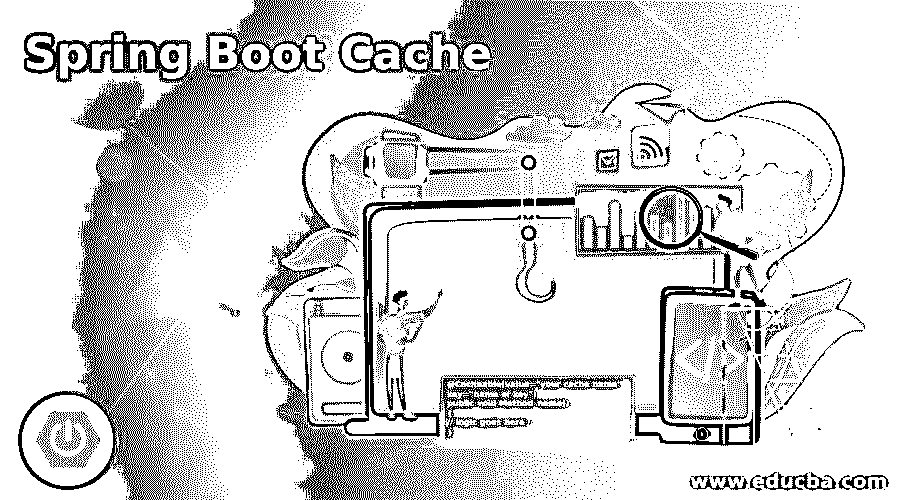

# Spring Boot 高速缓存

> 原文：<https://www.educba.com/spring-boot-cache/>

## Spring Boot 缓存简介

Spring boot 为我们提供了强大的缓存方法，可以用来防止特定代码的执行次数。通过使用缓存，我们可以将数据存储到磁盘或内存本身，这可以防止我们对代码中类似类型的数据进行不必要的访问。缓存可以通过减少使用相同信息反复执行相同数据的次数来提高代码的性能。在 spring boot 中，为了实现这个概念，我们通常使用缓存抽象，这很容易用来实现缓存机制。

**Spring Boot 缓存的语法**

<small>网页开发、编程语言、软件测试&其他</small>

正如我们所知，我们需要遵循缓存抽象来使用它，我们将更仔细地看一下语法，因为我们可以在 spring boot 应用程序中配置缓存。

`@Cacheable(value="your cache name", key="name of key")
public void Method_name()
{
// logic goes here //
}`

正如你在上面一行语法中看到的，我们使用了@Cacheable 注释，用于在 spring boot 中将方法定义为 cache 方法。因此，它将缓存参数中提到的键，如果键是相同的，则从缓存中返回结果，从而减少执行时间。

让我们来看看 spring-boot 中缓存配置的语法示例:

**举例:**

`@Cacheable(value="cachedemo", key="#rollNo")
public String employeedetail()
{
// logic goes here. //
}`

### 缓存在 Spring Boot 是如何工作的？

到目前为止，我们已经知道缓存可以通过将数据存储到内存或磁盘中来防止相同记录或相同键的执行次数。此外，它还有助于我们提高应用程序的性能。我们可以通过简单的步骤在 spring boot 应用程序中轻松实现这一点。

在这里，我们将首先看到为了将数据缓存到应用程序的内存或磁盘中所需的步骤和必须进行的代码更改。

#### 1.@EnableCaching

首先，我们需要用这个注释来注释我们的主 spring boot 类。这个注释将简单地为我们创建一个缓存管理器。假设您还没有创建任何 cachemanager 实例来使用来自 Java 的 HashMap 为我们创建内存中的 cachemanager。所以这个注释是在 spring boot 应用程序中设置缓存机制所必需的。

让我们看一下配置它所需的语法:

`@SpringBootApplication
@EnableCaching
public class CachingApplicationDemo
{
public static void main(String[] args)
{
SpringApplication.run(CachingApplicationDemo.class, args);
}
}`

正如你在上面这段代码中看到的，我们已经使用了@EnableCaching 注释；此外，为了使用它，我们必须将下面提到的包导入到我们的应用程序中，如下所示:

`import org.springframework.cache.annotation;`

#### 2.@可缓存

如果要在应用程序中的方法级别启用缓存，可以使用此批注；此外，我们可以定义一个参数，该参数将使用一些指定的名称和键为我们创建一个缓存。需要此键来唯一标识缓存列表中的记录。

让我们看看它的语法，我们如何在编程时使用它:

`@Cacheable(value="cacheempdetails", key="#empid")
public List<Employee> employeeData()
{
// our code will goes here //
return result;
}`

如您所见，我们已经使用 value 属性定义了缓存的名称，这意味着我们可以使用这个名称来使用缓存。此外，我们在这里给出了一个唯一标识记录的键。

#### 3.@缓存

我们可以在方法级别使用这个注释；它主要用在我们需要两个注释的时候，比如 cacheevict 和 cacheput。

下面是编程时使用的语法:

`@Caching(evict = {@CacheEvict("some value"), @CacheEvict(value="value", key="your key") })
public String msg(Employee emp)
{
// logic goes here //
}`

我们可以在方法上使用 cacheevict 注释，它用于从缓存中移除或删除未使用的数据。如果我们想从缓存中删除所有条目，那么我们可以使用 cacheevict 的 all entries 属性，将它的值设为 true。@cacheput 也用在方法上；顾名思义，它用于更新缓存，并且不会干扰当前正在进行的方法执行。这两种注释在 spring boot 应用程序中都易于使用和处理。

下面提到了在 spring boot 应用程序中利用缓存的步骤，也提到了所需的依赖关系；您可以按照您在应用程序中使用的构建工具来运行和构建我们为 maven 添加的应用程序。

1.我们需要在 pom.xml 文件中添加以下依赖项，以便在 spring boot 应用程序中使用上面定义的缓存注释。

**举例:**

`<dependency>
<groupId>org.springframework.boot</groupId>
<artifactId>spring-boot-starter-cache</artifactId>
</dependency>`

2.您可以通过在线使用 spring initializer 创建 spring boot 应用程序并解压 zip 文件。

3.将项目导入到您的编辑器中，并开始进行缓存数据所需的配置和更改。

### 结论

通过使用缓存，我们可以将频繁访问的数据存储到内存或磁盘中，这样可以减少执行的次数；这种执行可能非常昂贵，这会进一步影响应用程序的性能，因此我们可以通过简单的步骤在代码中轻松配置这种缓存机制，并开始使用它。

### 推荐文章

这是一个 Spring Boot 缓存指南。这里我们讨论一下 spring boot 中的介绍和 cache 是如何工作的？为了更好的理解。您也可以看看以下文章，了解更多信息–

1.  [Maven 资源库 Spring](https://www.educba.com/maven-repository-spring/)
2.  [Spring Boot 开发工具](https://www.educba.com/spring-boot-devtools/)
3.  [春季 AOP](https://www.educba.com/spring-aop/)
4.  [春云组件](https://www.educba.com/spring-cloud-components/)

