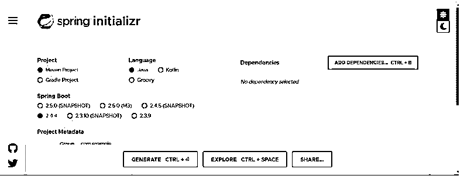

# Spring Boot 优势

> 原文：<https://www.educba.com/spring-boot-advantages/>

## Spring Boot 简介

以下文章概述了 Spring Boot 的优势。我们使用 spring boot 框架有很多优势，每个人都知道它的自动配置。在 spring boot 应用中，我们不需要做那么多的配置；它在内部处理很多事情。此外，我们支持使用 spring initializer 从头开始创建 spring boot 应用程序，我们只需提到所需的文件，基本结构已经为我们准备好了。除了自动配置，它还有很多东西，比如支持 groovy，内置服务器等等。

### Spring Boot 优势列表

正如我们所知，spring boot 有很多优点，使得开发速度更快，也有助于开发人员花费更少的时间来配置东西和设置环境。在这里，我们将看到使 spring boot 成为基于 Java 的应用程序开发的绝佳选择的主要优势；我们将一个一个地看到它们；我们还将看到 spring boot 应用程序的基本结构。

<small>网页开发、编程语言、软件测试&其他</small>

**1。内置服务器:**我们知道，spring boot 自带一个内置的构建服务器。这些在 spring boot 中被称为嵌入式服务器；这有助于我们快速进行本地开发，因为我们不需要从外部添加服务器和进行必要的配置；我们可以从头开始创建应用程序，并将主类作为 spring boot 应用程序运行，它会自动选择服务器并启动应用程序。spring boot 服务器的默认端口是 8080；我们还可以通过配置 application.properties 文件来更改这个帖子。

*   雄猫
*   码头
*   逆流

以上是 spring boot 的嵌入式服务器。要更改端口，我们可以在项目的应用程序文件中遵循下面的语法。

**举例:**

`server.port=portnumber
Let's see an practice code;
server.port=8081`

这样，我们就可以改变它。

**2。java 或 Groovy:** Spring boot 提供了对 Java 和 Groovy 的支持。这意味着我们可以根据需要在基于 java 或 groovy 的 spring boot 中开发应用程序，而不需要像 spring 那样进行繁重的配置。

**3。没有版本:**在 spring boot 中，正如我们所知道的，我们也不需要提到应用程序的版本。如果我们想要添加任何新的依赖项，它将在内部为我们管理，然后我们可以直接添加它，而不需要版本。所以像 spring 框架一样，管理所有依赖项的版本是非常困难的，因为每次应用程序失败时，版本中都会出现不匹配。我们可以将依赖关系更改为 pom.xml 或。没有版本或者不关心版本的 gradle 文件 spring boot 会为我们做到这一点。

这方面的示例:

`<dependency>
<groupId>org.springframework.boot</groupId>
<artifactId>spring-boot-starter-web</artifactId>
</dependency>
<dependency>
<groupId>com.h2database</groupId>
<artifactId>h2</artifactId>
<scope>runtime</scope>
</dependency>
<dependency>
<groupId>org.springframework.boot</groupId>
<artifactId>spring-boot-starter-test</artifactId>
<scope>test</scope>
</dependency>`

**4。更少的注释:**在 spring boot 应用中，我们需要更少的注释来配置我们的 spring 应用；在主要的 spring boot 类中，我们只使用了一个注释，它告诉编译器这是一个 spring boot 应用程序，并包含一些更多的注释，这些注释在内部起作用，正如我们在 spring framework 中看到的那样，我们必须添加如此多的注释才能运行应用程序，而在 spring boot 中却不是这样。这个注释包含@Configuration、@EnableAutoConfiguration 和@ComponentScan 所有这些，优化了配置，使代码更清晰，更容易被其他人理解，如果我们遗漏了什么也不用担心。

这个主类的语法是:

**举例:**

`@SpringBootApplication
public class DemoApplication {
public static void main(String[] args) {
SpringApplication.run(DemoApplication.class, args);
}
}`

5.正如我们所见，它删除了必要的代码，为我们提供内置服务器，使开发顺利进行；不需要在构建文件中提及版本，所有这些一起帮助开发人员和团队快速开发应用程序，因此它提高了生产率，因为我们已经看到在 spring framework 中有太多的工作要做，只是为了运行应用程序和测试我们所做的更改，所以它也节省了开发人员的时间。

6.此外，我们有一个 spring 初始化器，帮助我们非常容易地创建 spring boot 应用程序；我们只需通过点击 check cob 并提及项目名称来提供必要的配置。最后，我们可以根据需要将所需的依赖项添加到我们的项目中，只需在搜索框中键入依赖项的名称。

下面看到截图附上同样创建您的第一个应用程序在春季启动。

7.它为缓存机制提供了很好的支持，非常简单，配置也很少。我们只需要使用依赖关系，然后就可以在应用程序中使用它了。

8.我们也可以轻松地管理 spring boot 应用程序中的配置文件；我们可以为每个环境设置分析和创建应用程序文件，而不需要很多东西。

9.它为许多插件提供了很好的支持，这些插件可以在 spring boot 应用程序中使用和测试，包括 Gradle、maven 等工具中的任何版本。

10.通过使用 spring boot 框架，我们可以很容易地在我们的应用程序中实现微服务架构；它为此提供了很好的支持。此外，我们有如此多的在线文档，如果我们停留在某个地方，可以跟随它。

### 结论

就像我们已经详细了解了 spring boot 的诸多优势一样，现在我们清楚地知道了为什么它是开发应用程序的最佳选择，因为它非常简单、清晰、易于配置、支持随时随地在线使用、可读性强且不稳定、有许多关于 spring 的文档等。这些是一个框架应该具备的基本优势，可以让开发人员轻松快速地进行开发。

### 推荐文章

这是一本介绍 Spring Boot 优势的指南。这里我们分别讨论弹簧靴优点的介绍和列表。您也可以看看以下文章，了解更多信息–

1.  [Maven 资源库 Spring](https://www.educba.com/maven-repository-spring/)
2.  [Spring Boot 开发工具](https://www.educba.com/spring-boot-devtools/)
3.  [春季 AOP](https://www.educba.com/spring-aop/)
4.  [春云组件](https://www.educba.com/spring-cloud-components/)

