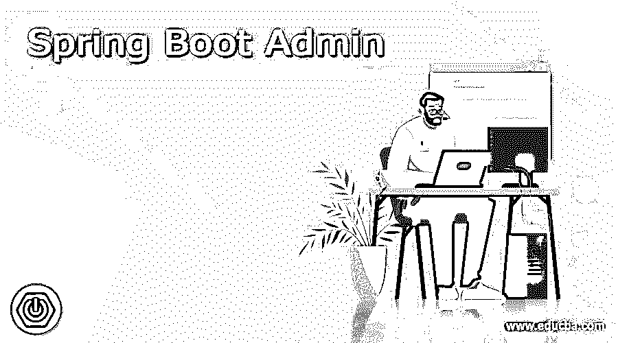
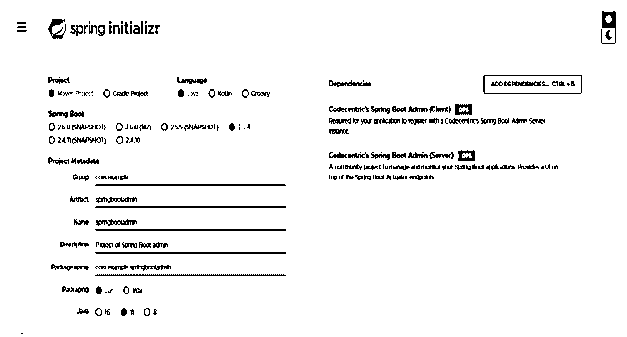
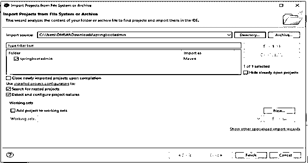
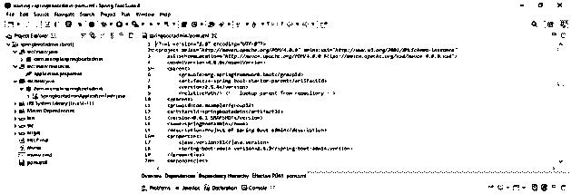
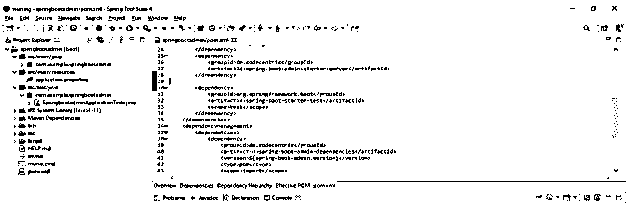
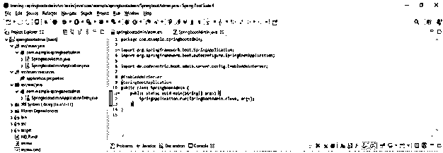
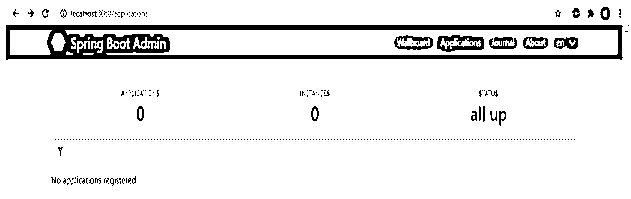
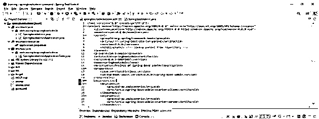
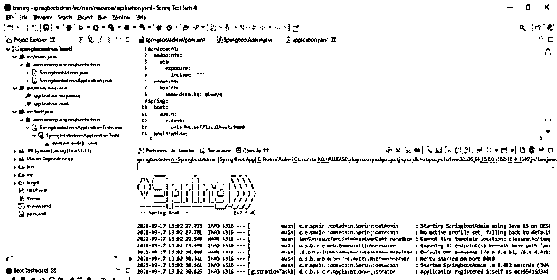
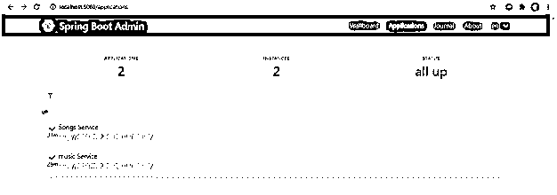

# Spring Boot 管理

> 原文：<https://www.educba.com/spring-boot-admin/>

## Spring Boot 管理简介

Spring boot admin 是用于管理和监控 web 应用程序的 web 应用程序，中的每个客户端都将被视为一个客户端，它将在管理服务器上注册。基本上，它是一个用来管理 spring boot 应用程序的社区项目，所有的应用程序都在管理员的 spring boot 客户端注册，并通过 spring cloud 发现。为了首先创建一个项目，我们需要设置我们的服务器。Spring boot 管理服务器能够运行 web flux 或 servlet 应用程序。

### 什么是 Spring Boot 管理？

*   众所周知，这是一个社区项目，用于管理基于 web 和 spring boot 的应用程序。
*   我们可以向管理服务器注册我们的客户机。为了注册客户端，每个客户端都需要 spring jars 致动器。
*   由 actuator jar 提供的端点通过使用 spring boot 的管理服务器来获取。
*   执行器监视器正在与我们的应用程序交互。Spring boot 包括端点数量，我们也可以添加自己的端点。
*   通过使用执行器端点来监控我们的应用程序是很困难的。因为我们有 N 份申请。每个应用程序都包含执行器的独立端点，因此监控会有点困难。
*   我们可以监控微服务应用程序。
*   为了使用服务器管理和监控应用程序，我们需要添加启动器依赖项，并且需要在应用程序文件的属性中指向 URI。
*   为了监控应用程序，我们需要添加微服务应用程序的 spring boot 端点的执行器。
*   Spring boot actuator 帮助管理和监控单个应用程序的 Spring boot 服务。
*   这是一个简单的 spring boot 项目。spring boot 的端点提供了许多关于应用程序的见解。
*   如果我们运行许多应用程序，那么通过点击每个端点来监控每个应用程序是非常繁琐的。为了避免这个问题，我们在应用程序中使用了服务器。
*   要创建服务器模块，我们需要在应用程序中添加 maven 依赖项。
*   要开发一个应用程序，我们需要首先设置服务器。在创建服务器之后，我们要向管理服务器添加一个客户机。
*   添加 maven 依赖项并创建管理服务器和客户机后，我们需要进行安全配置。
*   我们还可以设置从服务器收到的通知。下面是开发应用程序时可用的通知程序。

1)我们来聊聊吧 2) OpsGenie
3) Email
4)传呼机值班
5)懈怠
6)不和
7)电报
8)微软团队
9) HipChat

<small>网页开发、编程语言、软件测试&其他</small>

*   要在应用程序中使用电子邮件通知，我们需要在 pom.xml 文件中添加 mail starter 依赖项。
*   使用这个通知，在我们的客户端离线后，邮件被发送到在配置文件中配置的注册邮件地址。

### 管理服务器设置

*   下面是创建管理服务器设置的步骤。

#### 1)使用 spring initializer 创建一个新的项目模板，并为项目元数据指定以下名称。

`Group – com. example
Artifact name – springbootadmin
Name – springbootadmin
Description - Project of spring boot admin.
Package name - com. example.springbootadmin
Packaging – Jar
Java – 11`

依赖关系–同心 spring boot 管理客户端和同心 spring boot 管理服务器。

#### 2)生成项目后，提取文件并使用 spring 工具套件打开该项目

*   在这一步中，我们必须提取 zip 文件并在 spring 工具套件中打开项目。

#### 3)使用 spring 工具套件打开项目后，检查项目及其文件

*   打开项目后，我们必须检查所有的项目文件。我们需要检查 java main 和 pom.xml 文件。

#### 4)添加管理服务器依赖性–

*   打开项目后，下一步是在 pom.xml 文件中添加管理服务器依赖项。

**代码—**

`<dependency> -- Start of dependency tag.
<groupId>de.codecentric</groupId> -- Start and end of groupId tag.
<artifactId>spring-boot-admin-starter-server</artifactId> -- Start and end of groupId tag.
</dependency> -- End of dependency tag.`

#### 5)添加服务器依赖项后，启用管理服务器注释

在这一步中，我们必须启用管理服务器的注释。

**代码:**

`@EnableAdminServer -- Annotation of admin server.
@SpringBootApplication -- Annotation of spring boot application.
public class SpringbootAdmin {
public static void main /*project main method */ (String[] args) {
SpringApplication.run (SpringbootAdmin.class, args);
}
}`

#### 6)运行春季启动管理应用程序

#### 7)运行应用程序后，打开浏览器并使用默认端口号运行应用程序

`http://localhost:8080`

#### 8)添加管理服务器-客户端依赖关系–

*   打开项目后，下一步是在 pom.xml 文件中添加管理服务器-客户端依赖关系。

**代码:**

`<dependency> -- Start of dependency tag.
<groupId>de.codecentric</groupId> -- Start and end of groupId tag.
<artifactId> spring-boot-admin-starter-client</artifactId> -- Start and end of groupId tag.
</dependency> -- End of dependency tag.`

#### 9)添加管理服务器-客户端依赖关系后，下一步是创建执行器端点。在创建执行器端点时，我们必须提供管理服务器的 URL。

**代码:**

`management:
endpoints:
web:
exposure:
include: '*'
endpoint:
health:
show-details: always
spring:
boot:
admin:
client:
url: http://localhost:8080
application:
name: music Service`

#### 10)创建执行器端点后，在 spring 工具套件中运行 spring boot admin 项目。

*   在这一步中，我们在 spring 工具套件中运行我们的项目如下。

#### 11)运行 spring boot 管理应用程序后，打开浏览器并使用默认端口号运行应用程序

`http://localhost:8080`

### 推荐文章

这是 Spring Boot 管理指南。这里我们讨论定义，什么是 Spring Boot 管理？代码实现示例。您也可以看看以下文章，了解更多信息–

1.  [Spring Boot 异常处理](https://www.educba.com/spring-boot-exception-handling/)
2.  [Spring Boot 测井](https://www.educba.com/spring-boot-logging/)
3.  [Spring Boot 批次](https://www.educba.com/spring-boot-batch/)
4.  Spring Boot 赛道

