# Spring Boot 雄猫

> 原文：<https://www.educba.com/spring-boot-tomcat/>

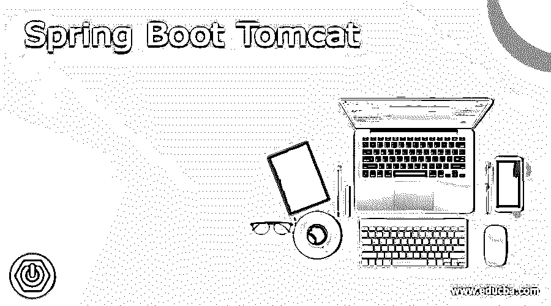

## Spring Boot 雄猫的定义

它是用于部署 java 应用程序的最流行的 servlet 容器，默认情况下，spring boot 是构建在桌面上运行的独立应用程序。将 Tomcat 安装为服务后，它将管理一个指定应用程序中的多个应用程序，这将避免为每个应用程序设置一个服务器的需要。Spring boot 是用于启动嵌入式服务器端点的主要方法，如果我们使用 maven build，它将创建一个 jar 文件，其中包含与项目相关的所有依赖项。我们可以在 tomcat 服务器上部署我们的 spring boot 应用程序。

### 什么是 Spring Boot 雄猫？

*   在实现了 spring boot 应用程序 jar 文件之后，我们可以在 apache tomcat 服务器上部署它。
*   Spring boot 在 Spring 的基础上构建他们的应用程序，它将在 spring 运行时运行。
*   在 apache tomcat 服务器上部署 spring 应用程序将涉及多个步骤，我们需要对这些步骤进行配置。
*   要在 apache tomcat 服务器上部署 spring boot 应用程序，首先我们需要在我们的服务器上安装 apache 服务器。
*   在运行 spring boot 应用程序时，spring boot 将检测到我们有一个 MVC spring 控制器，并且默认情况下需要启动一个 apache tomcat 实例。
*   在我们的 spring boot 应用程序中使用 tomcat 服务器时，我们需要更改任何配置设置，首先，我们需要为我们在应用程序中使用的 web 服务启用 HTTPS。
*   Spring boot web 应用程序在 HTTPs 上运行，它需要 SSL/TLS 证书，还需要自己的 web 服务器。
*   嵌入式 servlet 容器定制器将为 apache tomcat 的独立实例配置显式 XML 配置的大部分显式功能。
*   我们需要定义用于服务器的端口，还需要通过命令行或使用加载的属性文件来配置属性。
*   要更改 apache tomcat 服务器的监听端口，我们需要指定服务器端口，如果我们将服务器端口指定为零，如果我们将服务器端口定义为零，它将自动找出未使用的端口，并将其分配给服务器。
*   默认情况下，spring boot 应用程序使用 tomcat as 7 版本。如果我们需要使用更高版本的 tomcat，那么我们需要覆盖 maven build 属性，它将触发构建解析。

### Spring Boot 在 Tomcat 中的应用

*   要在 apache tomcat 服务器上部署 spring boot 应用程序，需要以下三个步骤。

1)第一步是设置一个 spring boot 应用程序。
2)创建 spring boot 的 spring boot 应用程序 war 文件后。
3)创建 war 后，在 tomcat 服务器上部署相同的 war。

<small>网页开发、编程语言、软件测试&其他</small>

*   spring boot apache tomcat 部署的第一步是创建一个 spring boot 应用程序。在这一步中，我们为 spring boot 创建一个新的应用程序。
*   第二步是创建我们开发的应用程序的 war 文件；我们必须使用 maven build 创建一个 war 文件。
*   第三步是在 tomcat 服务器上部署应用程序 war 文件。我们需要将其部署到 webapps 文件夹或目录中。

### tomcat 中的 Spring Boot 项目

以下示例显示了如何创建应用程序:

**1)使用 spring 初始化器创建项目模板—**

`Group – com.example
Artifact name – spring-boot-tomcat
Name – spring-boot- tomcat
Description - Project of spring-boot- tomcat
Package name - com.example.spring-boot- tomcat
Packaging – Jar
Java – 11
Dependencies – spring web.`

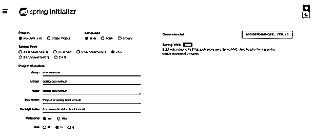

**2)生成项目后，提取文件并使用 spring 工具套件打开该项目—**

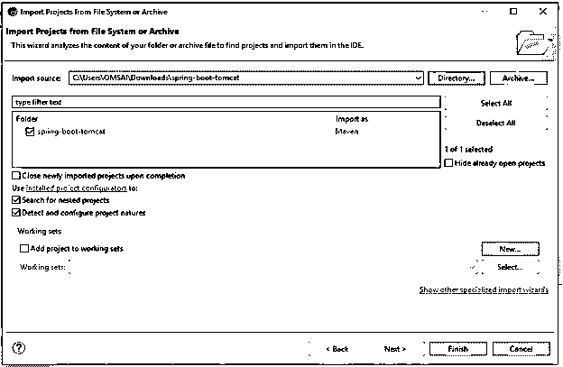

**3)使用 spring 工具套件打开项目后，检查项目及其文件—**

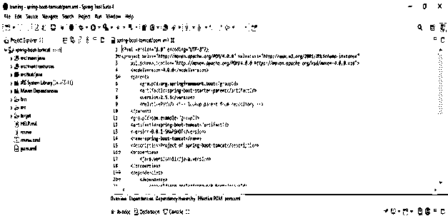

**4)添加弹簧依赖关系—**

**代码:**

`<dependency> -- Start of dependency tag.
<groupId>org.springframework.boot</groupId> -- Start and end of groupId tag.
<artifactId>spring-boot-starter-web</artifactId> -- Start and end of artifactId tag.
</dependency> -- End of dependency tag.`

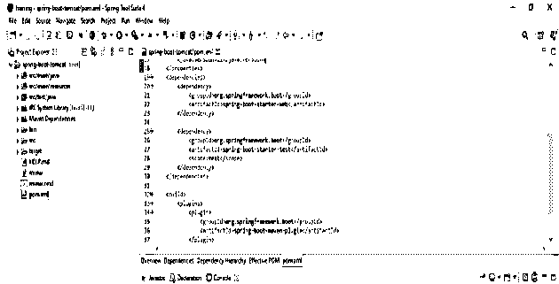

**5)为应用程序创建控制器类—**

**代码:**

`@RestController
public class TomcatController
{
@GetMapping ("/apache")
public String apache()
{
return "Apache Tomcat.";
}
}`

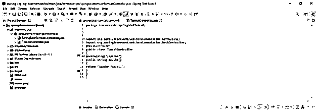

**6)运行弹簧启动应用程序—**

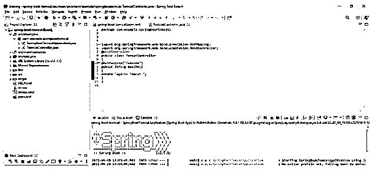

**7)在浏览器上检查应用程序的输出—**

**代码:**

`http://localhost:8080/apache`

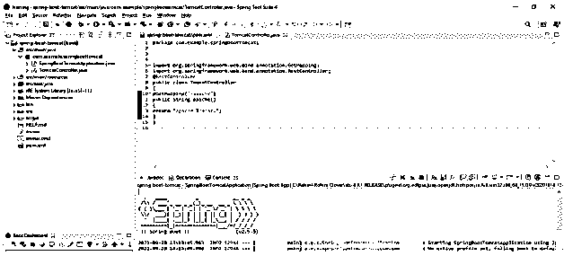

为我们的项目创建一个春季启动警告文件。

**9)添加 tomcat 服务器依赖关系—**

**代码:**

`<packaging>war</packaging> -- Start and end of packaging tag.
<dependency> -- Start of dependency tag.
<groupId>org.springframework.boot</groupId> -- Start and end of groupId tag.
<artifactId>spring-boot-starter-tomcat</artifactId> -- Start and end of artifactId tag.
</dependency> -- End of dependency tag.
<finalName>web-services</finalName> -- Start and end of finalName tag.`

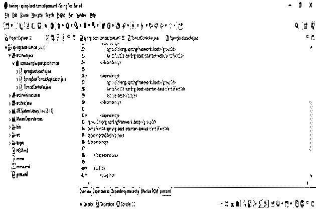

**10)创建项目的 WAR 文件—**

*   首先，使用 maven build 构建项目，然后输入目标名称作为全新安装，然后单击 apply and run。

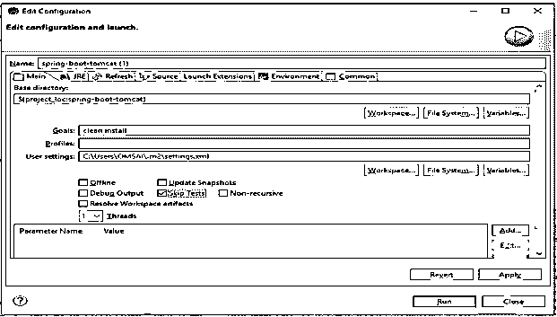

**11)检查项目的构建状态—**

*   运行 maven 构建之后，我们需要检查应用程序的构建状态。

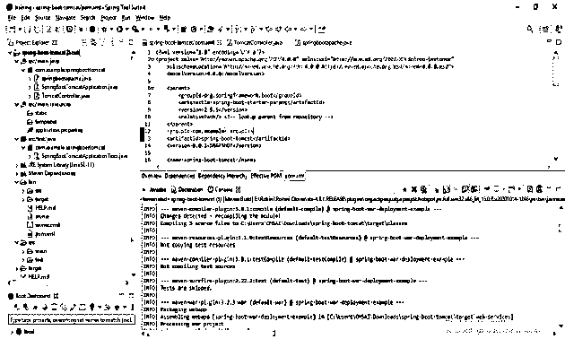

**12)检查 war 文件是否在指定位置生成—**

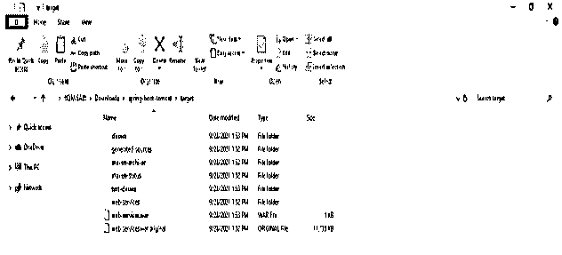

**13)安装 tomcat 服务器—**

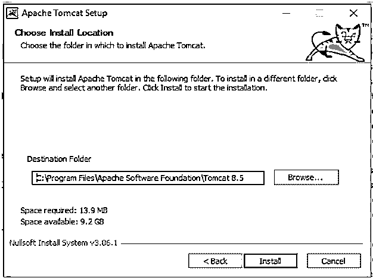

**14)复制 war 文件，并将其粘贴到 apache tomcat 的 web apps 文件夹中–**

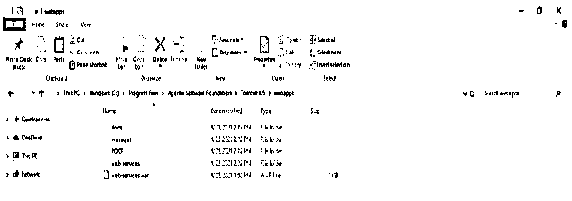

**15)打开命令提示符，运行启动命令–**

`startup`

``

 `**16)检查 war 文件是否部署成功—**

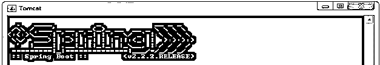

17)成功部署 war 文件后，打开 URL 检查应用程序

**代码:**

`http://localhost:8080/apache`

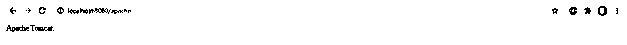

### Spring Boot 应用程序类别代码

下面的代码显示了 spring boot 应用程序类，它是我们为在 apache tomcat 服务器上部署应用程序而实现的。

**代码:**

`@SpringBootApplication
public class springbootapache extends SpringBootServletInitializer
{
@Override
protected SpringApplicationBuilder configure(SpringApplicationBuilder application)
{
return application.sources (springbootapache.class);
}
public static void main(String[] args)
{
SpringApplication.run(springbootapache.class, args);
}
}`

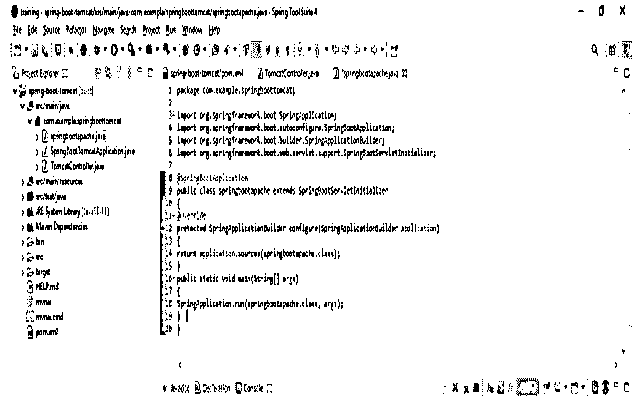

### 结论

它是用于部署 java 应用程序的最流行的 servlet 容器。要在 apache tomcat 服务器上部署 spring boot 应用程序，首先我们需要在我们的服务器上安装 apache 服务器。在 tomcat 服务器上部署 spring 应用程序将涉及多个步骤。

### 推荐文章

这是 Spring Boot 雄猫指南。这里我们讨论一下定义，什么是 Spring Boot 雄猫？代码实现示例。您也可以看看以下文章，了解更多信息–

1.  [Spring Boot 2](https://www.educba.com/spring-boot-oauth2/)
2.  Spring Boot 赛道
3.  [Spring Boot 批次](https://www.educba.com/spring-boot-batch/)
4.  Spring Boot·HTTPS

`