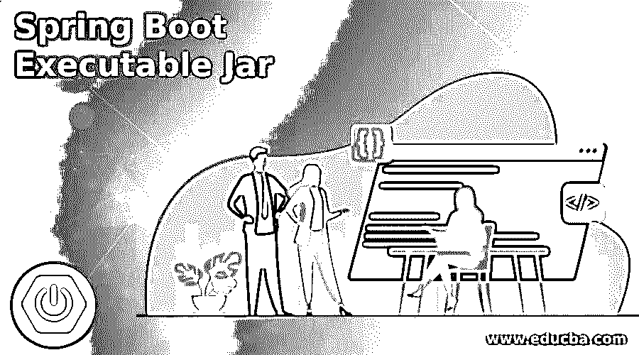
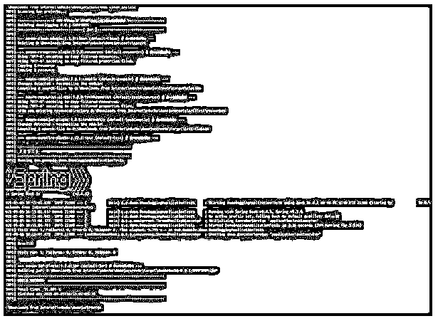
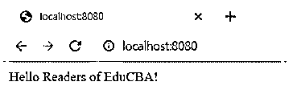

# Spring Boot 可执行 Jar

> 原文：<https://www.educba.com/spring-boot-executable-jar/>

## Spring Boot 可执行 Jar 简介

Spring boot 可执行 jar 被定义为一个类文件集合，它捆绑了为完成应用程序设计的任务而编写的不同类。作为标准实践，当应用程序有几十行代码时，应用程序被分成多个类，在分发应用程序时，使用传统格式的 Java 归档。因此，spring boot Jars 是自包含的 Jar，它拥有运行应用程序所需的所有依赖项的集合，因此由于其大小，被称为 fat Jar。

**Spring Boot 可执行 Jar 的语法**

<small>网页开发、编程语言、软件测试&其他</small>

如前所述，spring boot 可执行 jar 包含类文件，这些类文件包含了应用程序运行和执行应用程序设计任务所需的实用程序。在这里，我们将从语法的角度来看 spring boot 可执行 Jar，这样当我们看到可执行 Jar 是如何创建和使用它的所有选项时。

1.使用 Maven 构建 Jar 文件。

`mvn clean install`

2.通过命令行运行 Jar 文件。

`java -jar <Name of the JAR file>`

3.通过命令行运行 Jar 文件，即使在注销后也能保持进程活动。

`nohup java -jar < Name of the JAR file >`

4.通过命令行运行 Jar 文件，即使在注销后也能保持进程活动。

`nohup java -jar < Name of the JAR file >`

### 如何在 Spring Boot 创建和使用一个可执行的 Jar？

在这里，我们将了解如何从另一个程序启动 Spring Boot 应用程序。一句话，我们称之为一种方法，在这种方法中，整个 Spring Boot 应用程序被构建到一个可执行的 Jar 档案中，并包含所有的依赖项，打包成嵌套的 Jar。Maven 中的插件完成了所有的脏工作，并为您提供了 FAT Jar，可以使用 java -jar 命令轻松运行它。

接下来，让我们看看嵌套 jar 是如何工作的，因为这为工作奠定了基础，并且是我们在创建和使用可执行 Jar 时要记住的一个关键组件。嵌套的 Jar 什么都不是，而是打包在最终的可运行 Jar 文件中的 Jar。最终的可运行 Jar 文件需要包含平稳和成功执行 Jar 文件的依赖项。为了满足用例，阴影是我们拥有的选项之一。

在这种方法中，我们包含并重命名依赖项，然后重新定位类，从而重写受影响的字节码和资源，以便创建一个副本，然后与 Spring boot 应用程序的主类捆绑在一起。将类和资源从依赖项中解包，然后重新打包到一个可运行的 Jar 中。阴影的概念适用于简单的用例，但是在两个或更多的依赖项具有相同名称和路径的相同资源文件的情况下，可能会产生混淆，因此使用了一些高级技术。

**在 Spring Boot 创建可执行 Jar 的不同方式:**

*   **手动配置:**使用手动配置，我们需要在 pom.xml 中包含 maven-dependency 插件，并注意两个方面:第一个是复制依赖项的目标，命令 maven 将依赖项复制到设置中指定的输出文件夹。另一方面，我们将创建一个可执行的、支持类路径的 jar 文件，为此，我们需要配置清单，添加包含所有依赖项的类路径，并明确提到主类。这个过程为开发人员提供了灵活性，可以根据每个步骤的需求来执行，但是依赖关系在最终的 Jar 之外。
*   **Apache Maven 汇编插件:**这个插件使开发人员能够将项目输出和依赖项聚合到一个可运行的 Jar 文件中。尽管这种方法允许创建单个 Jar 文件，但不支持类的重定位。
*   Apache Maven Shade 插件:该插件使开发人员能够将工件打包在一个超级 jar 中，该 Jar 不仅将所有依赖项包含在一个 Jar 中，而且支持着色的概念。这个插件允许创建单个 Jar 文件，并对打包和类重定位进行高级控制，但是随之而来的是更多的复杂性。
*   **一个 Jar Maven 插件:**这为开发人员提供了一个定制的类加载器，它从 Jar 加载归档文件中的类&资源。这个方法提供了干净的委托以及对外部 jar 和本地库的支持。
*   **Spring Boot Maven 插件:**最后一个方法是使用这个插件来打包可执行的 Jar，并允许应用程序“就地”运行。这解决了其他方法的大部分问题，如高级控制，在每个可访问的位置运行等。但是这样做增加了一些不必要的 Spring 和 Spring Boot 相关的类。

添加上面的任何插件，我们在主类存在的地方运行 mvn clean install 命令，然后在目标文件夹中获取 Jar 文件。接下来，张贴创作；最后，通过运行 java -jar <name of="" the="" jar="" file="">，在任何命令提示符下后期运行 Jar 文件(将所有依赖项保存在各自的位置)。</name>

### Spring Boot 可执行 Jar 的示例

下面给出的是 Spring Boot 可执行 Jar 的例子:

**代码:**

**Logresource.java:**

`package com.example.demo;
import org.springframework.web.bind.annotation.RequestMapping;
import org.springframework.web.bind.annotation.RestController;
@RestController
public class Logresource {
@RequestMapping("/")
public String home() {
return "Hello Readers of EduCBA!";
}
}`

**DemoJarCreateApplication.java——(主班):**

`package com.example.demo;
import org.springframework.boot.SpringApplication;
import org.springframework.boot.autoconfigure.SpringBootApplication;
@SpringBootApplication
public class DemoJarCreateApplication {
public static void main(String[] args) {
SpringApplication.run(DemoJarCreateApplication.class, args);
}
}`

创建和运行 Jar 文件:

**语法:**

`mvn clean install
cd target
java -jar demoeducba-0.0.1-SNAPSHOT.jar`

**输出:**

### 结论

总之，本文为我们提供了许多创建可执行 jar 的方法。此外，我们还通过一个例子来说明这种方法。

### 推荐文章

这是一个 Spring Boot 可执行 Jar 的指南。这里我们讨论一下入门，如何在 spring boot 中创建和使用一个可执行的 jar？还有例子。您也可以看看以下文章，了解更多信息–

1.  [Maven 资源库 Spring](https://www.educba.com/maven-repository-spring/)
2.  [Spring Boot 开发工具](https://www.educba.com/spring-boot-devtools/)
3.  [春季 AOP](https://www.educba.com/spring-aop/)
4.  [春云组件](https://www.educba.com/spring-cloud-components/)

