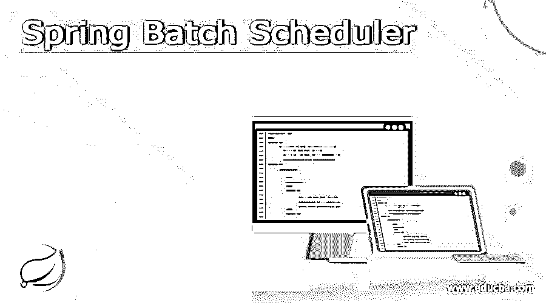
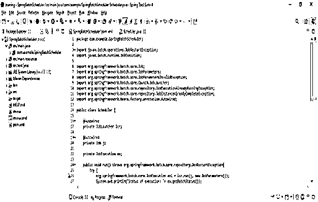
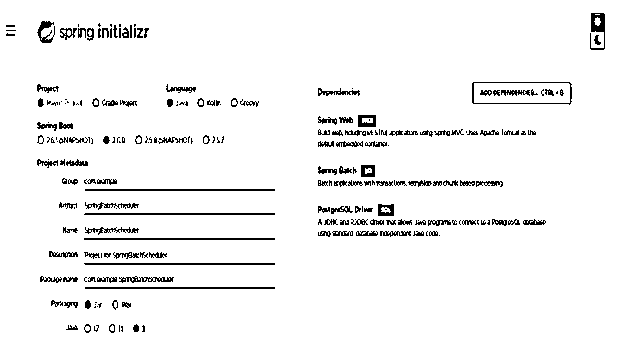
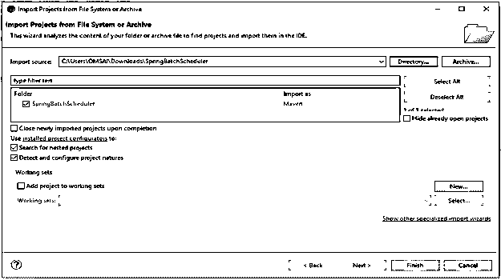
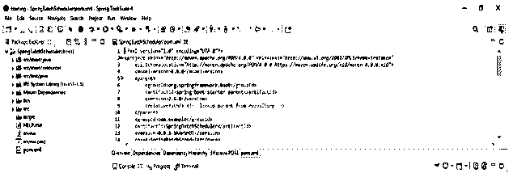
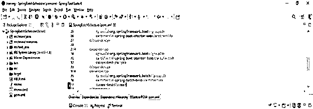
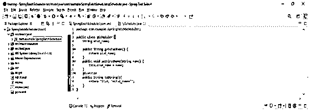
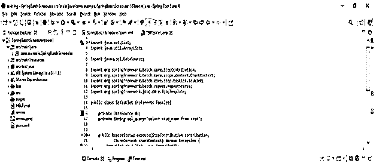
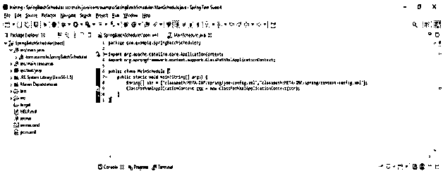
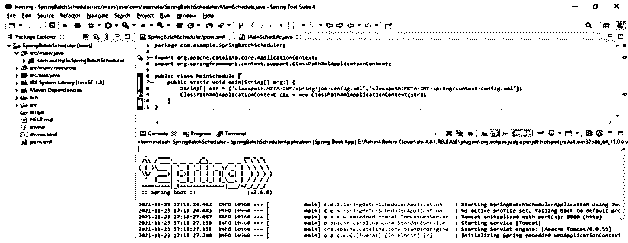

# Spring 批处理调度程序

> 原文：<https://www.educba.com/spring-batch-scheduler/>

## Spring 批处理调度程序的定义

它是 spring batch 中可用的框架，用于在特定时间运行计划的作业。Spring Batch 是开源批处理框架之一。在任何应用程序中工作时，我们可能需要经常运行 spring 批处理作业，或者按照设定的时间表运行。这是通过向 spring 任务调度器传递一个 cron 表达式来实现的。我们可以使用@EnableScheduling 注释来启用调度。

### Spring 批处理调度程序概述

*   Spring batch 已经用于从版本 3 开始启动批处理作业。在下面的例子中，我们使用一个在 PostgreSQL 数据库表上运行 select 查询的小任务来建立一个简单的作业。
*   在使用它时，微线程将定期运行。下面是相关的术语。

1)作业
2)事务管理器
3)作业存储库
4)作业启动器

<small>网页开发、编程语言、软件测试&其他</small>

*   作业由步骤组成，每个步骤可能包括一个读取器、一个写入器和一个处理器。
*   TransactionManager 是一个用于在处理事务时启动和提交事务的类。
*   使用 Spring Batch 的 JobRepository 可以实现持久性。对于 JobLauncher、Job 和 Step 实例化，它提供了 CRUD 操作。
*   JobLauncher 为使用 JobParameters 集合启动作业提供了一个简单的接口。
*   可以使用注释名@EnableScheduling 和一个用@Scheduled 注释后跟 cron 作业时间信息的方法来配置批处理作业调度，确保执行逻辑在指定的时间运行。

### 批处理作业调度需要两步来配置:-

1)注释@EnableScheduling 启用调度。

2)创建一个@Scheduled 函数，并使用 cron 作业来提供重复细节。在这个方法中，放置作业执行逻辑。

*   为了调度作业，我们需要在 pom.xml 文件中添加 spring batch core 依赖项。

### 创建 spring 批处理调度程序

*   我们已经使用项目模板名称作为 SpringBatchScheduler。
*   下面的例子展示了如何在 spring 批处理中创建调度程序。

**代码:**

`public class Scheduler {
@Autowired
private JobLauncher lcr;
@Autowired
private Job j;
private JobExecution ex;
public void run() throws org.springframework.batch.core.repository.JobRestartException {
try {
org.springframework.batch.core.JobExecution ex1 = lcr.run(j, new JobParameters());
System.out.println("Status of execution: "+ ex.getBatchStatus());
} catch (JobExecutionAlreadyRunningException e) {
e.printStackTrace();
} catch (JobRestartException e) {
e.printStackTrace();
} catch (JobInstanceAlreadyCompleteException e) {
e.printStackTrace();
} catch (JobParametersInvalidException e) {
e.printStackTrace();
}
}
public JobLauncher getLcr() {
return lcr;
}
public void setLcr (JobLauncher lcr) {
this.lcr = lcr;
}
public Job getJ() {
return j;
}
public void setJ(Job j) {
this.j = j;
}
public JobExecution getEx() {
return ex;
}`

### 计划的春季批处理作业

*   我们将创建一个简单的作业，使用一个 tasklet 在 PostgreSQL 数据库表上运行 select 查询并打印结果。
*   使用 Spring 批处理小任务调度器，小任务将定期运行。
*   spring 批处理调度程序将按照我们在应用程序中安排的时间执行。
*   我们可以使用 spring 任务调度器来调度 spring 批处理。Spring 批处理任务调度器对于在我们的应用程序中实现调度器非常重要。

### 项目设置

1)使用 spring 初始化器创建 spring 批处理小任务的项目模板

*   在下面的步骤中，我们将提供项目组名为 com.example，工件名为 SpringBatchScheduler，项目名为 SpringBatchScheduler，选择的 java 版本为 8。还有，我们已经定义了 spring boot 版本是 2.6.0，项目定义为 maven。
*   在下面的项目中，我们选择了 spring web、spring batch 和 PostgreSQL 驱动程序依赖来实现 spring batch 项目。

`Group – com. example Artifact name – SpringBatchScheduler
Name – SpringBatchScheduler Spring boot – 2.6.0
Project – Maven Java – 8
Package name - com.example.SpringBatchScheduler
Project Description - Project for SpringBatchScheduler
Dependencies – spring web, PostgreSQL driver, spring batch.`

#### 2)生成项目后，提取文件并使用 spring 工具套件打开该项目

在这一步中使用 spring 初始化器生成项目之后，我们提取 jar 文件并使用 spring 工具套件打开项目。

#### 3)使用 spring 工具套件打开项目后，检查项目及其文件

在这一步中，我们检查所有的项目模板文件。我们还需要检查 maven 依赖项和系统库。

#### 4)添加依赖包–

在这一步中，我们将在 project 中添加 spring batch 依赖项。

**代码:**

`<dependency> -- Start of dependency tag.
<groupId>org.springframework</groupId> -- Start and end of groupId tag.
<artifactId>spring-core</artifactId> -- Start and end of artifactId tag.
</dependency> -- End of dependency tag.
<dependency> -- Start of dependency tag.
<groupId>org.postgresql</groupId> -- Start and end of groupId tag.
<artifactId>postgresql</artifactId> -- Start and end of artifactId tag.
</dependency> -- End of dependency tag.`

### Spring 批处理调度器示例

我们使用 SpringBatchScheduler 模板来定义这个例子。

#### 1)设置 POJO–

**代码:**

`public class pScheduler {
String stud_name;
public String getstudName() {
return stud_name;
}
public void setFirstName (String name) {
this.stud_name = name;
}
@Override
public String toString(){
return "Stud, "+stud_name+"";
}
}`

#### 2)创建小任务–

**代码:**

`public class SBTasklet implements Tasklet{
private DataSource ds;
private String sql_query="select stud_name from stud";
public RepeatStatus execute (StepContribution contribution,
ChunkContext chunkContext) throws Exception {
ArrayList stud_list = new ArrayList();
JdbcTemplate myTemplate = new JdbcTemplate(getDataSource());
stud_list = SBTasklet.sql_query (sql_query, new studMapper ());
return RepeatStatus.FINISHED;
}
private static ArrayList sql_query(String sql_query2, studMapper studMapper) {
return null;
}
public DataSource getDataSource() {
return ds;
}
public void setDataSource (DataSource DBS) {
this.ds = DBS;
}
}`

#### 3)创建调度程序，配置作业，并运行调度程序–

我们已经创建了调度程序，因此现在我们已经运行了调度程序，因此不需要再次创建和配置它。

**代码:**

`public class MainSchedule {
public static void main(String[] args) {
String[] str = {"classpath:META-INF/spring/job-config.xml","classpath:META-INF/spring/context-config.xml"};
ClassPathXmlApplicationContext cx = new ClassPathXmlApplicationContext (str);
}
}`

#### 4)运行调度程序

### 结论

在 spring 批处理调度中，我们可以通过使用@EnableScheduling 注释来启用调度。使用 Spring Batch Scheduler 时，小任务将定期运行。Spring batch scheduler 是 Spring batch 中可用的框架，用于在特定时间运行计划的作业。

### 推荐文章

这是一个 Spring 批处理调度器的指南。这里我们讨论什么是 azure 日志分析，如何创建 Azure 日志分析，以及工具。您也可以看看以下文章，了解更多信息–

1.  [Spring Boot 的优势](https://www.educba.com/spring-boot-advantages/)
2.  [Spring Boot 的名字缩写](https://www.educba.com/spring-boot-initializr/)
3.  [Spring Boot·梅文](https://www.educba.com/spring-boot-maven/)
4.  [Spring Boot 缓存](https://www.educba.com/spring-boot-cache/)

