# 春季批次示例

> 原文：<https://www.educba.com/spring-batch-example/>

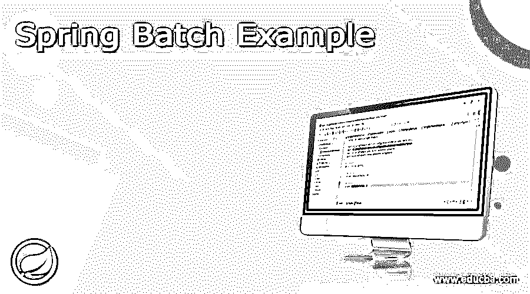

## 弹簧批次示例的定义

Spring Batch example 是一个功能丰富的框架，它使得创建可靠的批处理应用程序变得更加容易。Spring 批处理任务实现包含多个步骤，每个步骤都处理、读取和写入数据。Spring batch 是一个轻量级的一体化框架，支持创建对系统日常操作至关重要的可靠批处理应用程序。Spring batch architecture 使用一个作业存储库来调度新作业并与现有作业通信。

### 例子

以下示例显示创建 spring 批处理示例的步骤如下。

<small>网页开发、编程语言、软件测试&其他</small>

#### 1)使用 spring 初始化器创建项目模板

*   在下面的步骤中，我们将项目组名称设置为 com。example，工件名为 SpringBatchExample，项目名为 SpringBatchExample，选择的 java 版本为 8。另外，我们将 spring boot 版本定义为 2.6.0，将一个项目定义为 maven。
*   在下面的项目中，我们选择了 spring web、spring batch 和 PostgreSQL 驱动程序依赖来实现 spring batch 项目。

`Group – com. example Artifact name – SpringBatchExample
Name – SpringBatchExample Spring boot – 2.6.0
Project – Maven Java – 8
Package name - com.example.SpringBatchExample
Project Description - Project for SpringBatchExample
Dependencies – spring web, PostgreSQL driver, spring batch.`

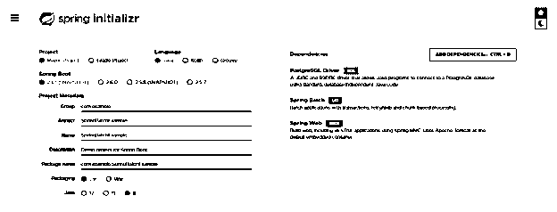

#### 2)生成项目后，提取文件并使用工具套件打开该项目

在这个步骤中使用初始化器生成项目之后，我们提取 jar 文件并使用工具套件打开项目。

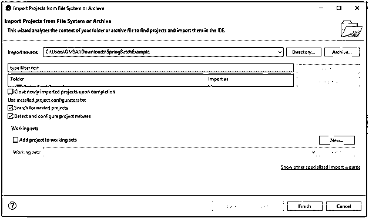

#### 3)使用工具套件打开项目后，检查项目及其文件

*   在这一步中，我们检查所有的项目模板文件。我们还需要检查 maven 依赖项和系统库。

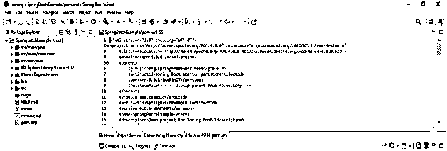

#### 4)添加依赖包–

*   在这一步中，我们将在项目中添加批处理依赖项。

代码–

`<dependency> -- Start of dependency tag.
<groupId>org.springframework.boot</groupId> -- Start and end of groupId tag.
<artifactId>spring-boot-starter-batch</artifactId> -- Start and end of artifactId tag.
</dependency> -- End of dependency tag.
<dependency> -- Start of dependency tag.
<groupId>org.springframework.batch</groupId> -- Start and end of groupId tag.
<artifactId>spring-batch-test</artifactId> -- Start and end of artifactId tag.
</dependency> -- End of dependency tag.
<dependency> -- Start of dependency tag.
<groupId>org.postgresql</groupId> -- Start and end of groupId tag.
<artifactId>postgresql</artifactId> -- Start and end of artifactId tag.
</dependency> -- End of dependency tag.`

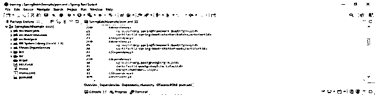

#### 5)为 spring 批处理创建 CSV 文件–

*   在这一步中，我们为批处理创建 CSV 文件。

**代码:**

`101,ABC,
202, PQR,
303, XYZ`

#### 6)为数据库和表连接创建数据库

*   在这一步中，我们为数据库连接创建数据库名 springbatchexample 和表名 stud 如下。

**代码:**

`# create database springbatchexample;
# \l+ springbatchexample
# \c springbatchexample
# create table stud (stud_id int, stud_name varchar(5));
# \d+ stud;`

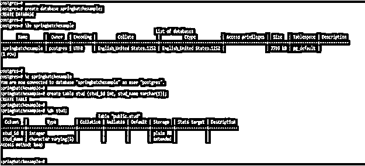

#### 7)配置应用程序.属性文件–

*   在这一步中，我们将配置 application.properties 文件。我们正在 spring 批处理示例项目中添加一个数据库连接。我们使用 PostgreSQL 数据库在 spring 批处理项目中添加连接。

**代码:**

`spring.application.name = SpringBatchExample
spring.datasource.url = jdbc:postgresql://localhost:5432/springbatchexample
spring.datasource.username = postgres
spring.datasource.password = postgres
spring.batch.initialize-schema = always`

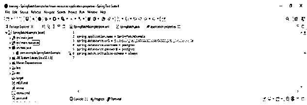

#### 8)创建一个实体类来处理数据

*   在这一步中，我们将创建 stud 实体类来处理数据。我们使用了实体名称 stud_id 和 stud_name。
*   正如我们在下面的例子中看到的，我们使用了 stud_id 和 stud_name 实体。

**代码:**

`@Data
@Entity
@Table(catalog="springbatchexample", name = "stud")
public class stud {
@Id
private long stud_id;
private String stud_name;
}`

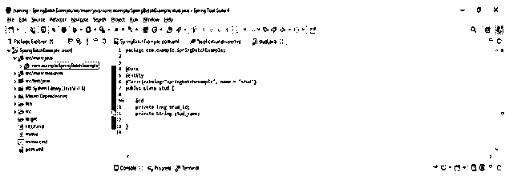

#### 9)在项目中启用批处理–

*   在这一步中，我们已经启用了 spring boot 示例项目的 spring 批处理。
*   我们使用@EnableBatchProcessing 注释来处理批处理。这个注释是我们项目中 spring 批处理的一个启用特性。

**代码:**

`@SpringBootApplication
@EnableBatchProcessing
public class EnableSpringBatch {
public static void main /* main method of spring batch example project */ (String[] args) {
SpringApplication.run (EnableSpringBatch.class, args);
}
}`

#### 10)使用 JobBuilderFactory 方法配置批处理–

*   在这一步中，我们已经通过使用 JobBuilderFactory 方法配置了 spring boot 示例项目的批处理。
*   我们已经创建了 springConfig 类来配置 spring 批处理示例项目中的批处理。

**代码:**

`@Configuration
public class springConfig {
@Autowired
private JobBuilderFactory JBF;
@Autowired
private StepBuilderFactory SBF;
}`

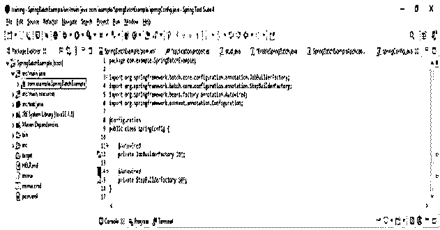

#### 11)为我们的 spring 批处理示例项目配置项目阅读器

*   在这一步中，我们为 spring 批处理示例项目配置了项目阅读器，如下所示。
*   为了配置项目读取器，我们使用 FlatFileItemReader 创建 bean，如下所示。

**代码:**

`<batch:job idc = "springbatch">
<batch:step id = "1">
<batch:tasklet>
<batch:chunk reader = "reader" writer="writer"
Processor = "processor" commit-interval = "1">
</batch:chunk>
</batch:tasklet>
</batch:step>
</batch:job>`

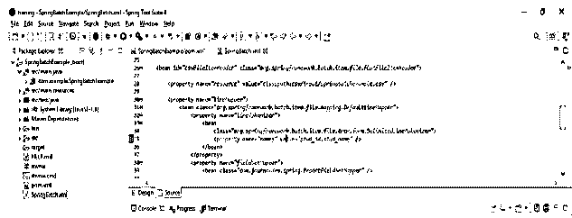

#### 12)创建 spring 批处理模型类–

*   在这一步中我们创建的 spring 批处理模型类如下。

**代码:**

`public class batchModel {
private int stud_id;
private String stud_name;
public int getstudId () {
return stud_id;
}
public void setId(int studid) {
this.stud_id = studid;
}
public void setstudName (String studname) {
this.stud_name = studname;
}
}`

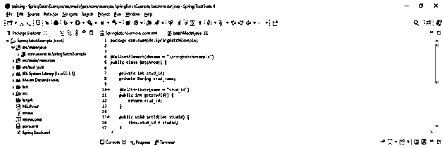

#### 13)定义 spring 批处理程序–

*   在这一步中，我们已经定义了 spring 批处理应用程序的批处理程序，如下所示。

**代码:**

`public class Processor implements ItemProcessor {
public batchModel process(batchModel stud) throws Exception {
System.out.println ("spring batch processing" + stud);
String fname = stud.stud_id ();
String lname = stud.stud_name ();
stud.setstud_id (stud_id.toUpperCase ());
stud.setstud_name (stud_name.toUpperCase ());
return stud;
}
@Override
public Object processItem(Object stud) throws Exception {
return null;
}
}`

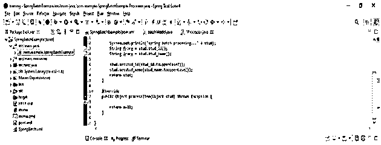

#### 14)创建 spring 批量测试程序–

*   在这一步中我们创建的 spring 批处理测试程序如下。

**代码:**

`public class springbatch {
String [] springConfig = {"springbatchexample/jobs/SpringBatch.xml" };
try {
} catch (Exception e) {
e.printStackTrace();
}
System.out.println("Completed");
context.close();
}
}`

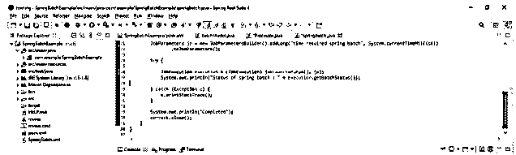

15)运行应用程序–

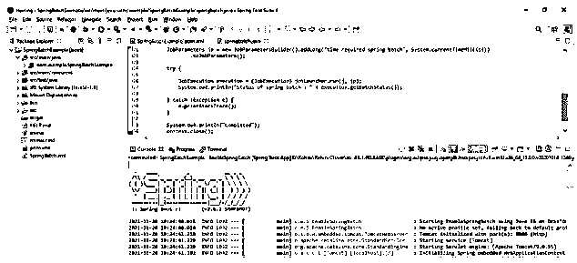

### 结论

在本文中，我们提供了 spring 批处理示例的分步实现。Spring batch 是一个轻量级的一体化框架，支持创建对系统日常操作至关重要的可靠批处理应用程序。

### 推荐文章

这是一个指导 Spring 批处理的例子。这里我们讨论 Spring 批处理示例的定义、步骤和代码实现。您也可以看看以下文章，了解更多信息–

1.  [春批架构](https://www.educba.com/spring-batch-architecture/)
2.  [春季批量面试试题](https://www.educba.com/spring-batch-interview-questions/)
3.  [Spring Boot 批次](https://www.educba.com/spring-boot-batch/)
4.  [Spring Boot 码头工人](https://www.educba.com/spring-boot-docker/)

