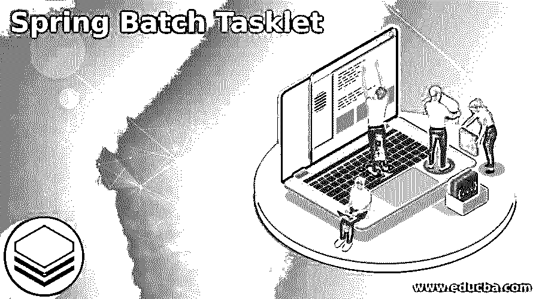
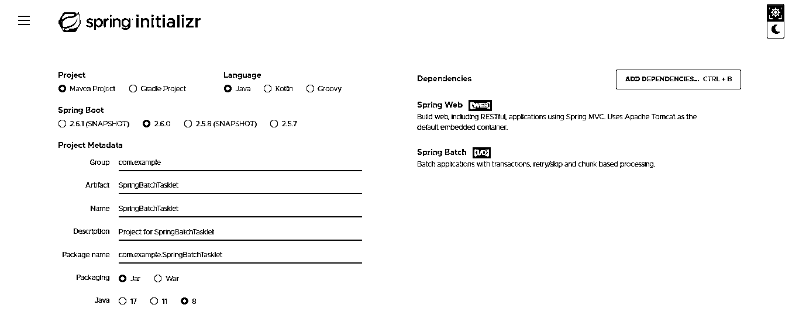
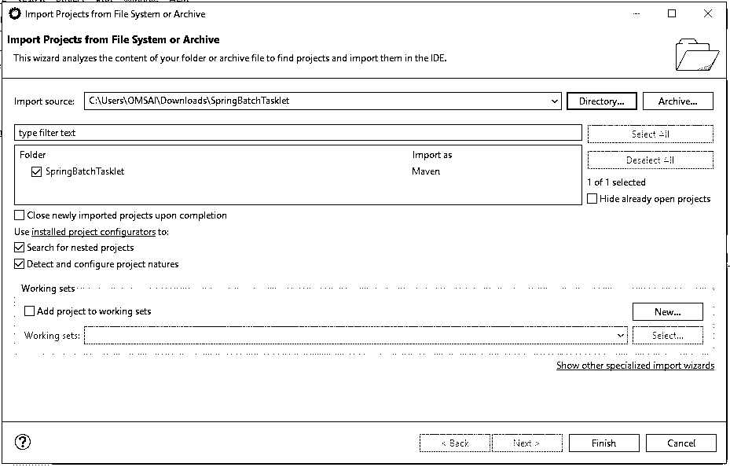
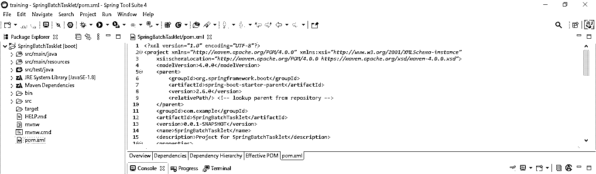
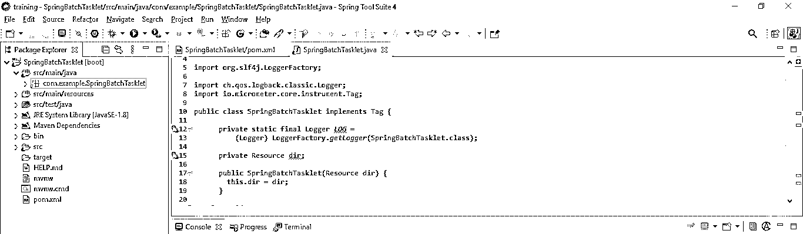
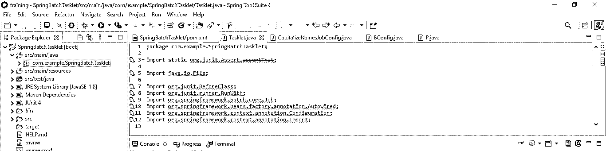
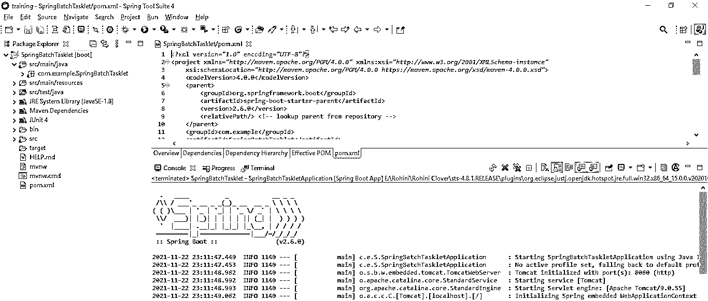

# 春季批量任务

> 原文：<https://www.educba.com/spring-batch-tasklet/>

## Spring 批处理小任务介绍

Spring batch tasklet 用于在 Spring batch 中实现作业，基本上 spring batch 提供了两种方式来实现作业，即块和小任务。为了开发这个项目，我们需要在 spring batch maven 项目中添加 spring batch 核心依赖项。在 spring batch 项目中，基本上，tasklet 是一个在一个步骤中执行单个任务的接口。我们可以实现一个调度程序。

### 什么是春批小任务？

*   它包含了在执行 spring 批处理步骤前后清除或设置资源的典型用例。
*   我们知道下面提供了 spring 批处理，实现 spring 批处理作业的两种方法如下。

*   Spring 批处理作业由单个或多个步骤组成。spring 批处理中的 Tasklet 表示在步骤中完成的工作。
*   spring boot 项目中的 Tasklet 接口将包含执行时的单个方法名。该步骤将多次调用此方法，直到它完成或返回异常。
*   Spring batch 框架包含了 tasklet 接口的实现。tasklet 的一个接口也称为面向块的处理或 tasklet。
*   在看面向块的小任务的时候，我们可以看到它将实现小任务的接口。
*   众所周知，Spring Boot 的批处理是海量数据的自动化过程，无需任何人工干预。
*   我们在 spring boot 批处理界面中使用它在一个步骤中完成一个任务。在执行 spring boot 批处理时，小任务是执行单个动作的 spring boot 任务。

### 使用 Spring 批处理小任务

*   每隔一段时间，就会执行一次 spring boot 批处理。在运行批处理时，它将创建一个调用 spring boot 批处理步骤的批处理作业。
*   在 spring boot 批处理步骤中，设置了 Tasklet 类。一个步骤包含一个或多个由小任务实现的 java 类。
*   在这个阶段，所有的小任务类对象都将按顺序运行。微线程用于一次执行一项任务。
*   我们可以在执行单粒度任务的时候使用 tasklet。
*   它只不过是一个批处理接口，用于描述一个任务或动作。
*   在实现 tasklet 接口时，会导致创建一个类。当我们运行完批处理后。tasklet 接口将包含 execute 方法。

### 项目

以下示例显示了创建项目的步骤如下。

<small>网页开发、编程语言、软件测试&其他</small>

*   **使用 spring 初始化器创建项目模板**

在下面的步骤中，我们提供了项目组名 com.example，工件名 SpringBatchTasklet，项目名 SpringBatchTasklet，选择的 java 版本为 8。还有，我们已经定义了 spring boot 版本是 2.6.0，a 定义了项目为 maven。

在下面的项目中，我们选择了 spring web、spring batch 和 PostgreSQL 驱动程序依赖来实现 spring batch 项目。

`Group – com.example                        Artifact name – SpringBatchTasklet
Name – SpringBatchTasklet                Spring boot – 2.6.0
Project – Maven                                  Java – 8
Package name - com.example.SpringBatchTasklet
Project Description - Project for SpringBatchTasklet
Dependencies – spring web, PostgreSQL driver, spring batch.`

*   **生成项目后，提取文件，使用 spring 工具套件打开该项目—**

在这一步中使用 spring 初始化器生成项目之后，我们提取 jar 文件并使用 spring 工具套件打开项目。

*   **使用 spring 工具套件打开项目后，检查项目及其文件—**

在这一步中，我们检查所有的项目模板文件。我们还需要检查 maven 依赖项和系统库。

*   **添加依赖包—**

在这一步中，我们将在 tasklet 项目中添加 spring batch 依赖项。

**代码—**

`<dependency>   -- Start of dependency tag.
<groupId>org.springframework</groupId>   -- Start and end of groupId tag.
<artifactId>spring-core</artifactId>  -- Start and end of artifactId tag.
</dependency>    -- End of dependency tag.
<dependency>   -- Start of dependency tag.
<groupId>org.springframework.batch</groupId>   -- Start and end of groupId tag.
<artifactId>spring-batch-core</artifactId>  -- Start and end of artifactId tag.
</dependency>    -- End of dependency tag.`

### 创建 Spring 批处理小任务

下面是步骤，我们使用 SpringBatchTasklet 项目示例来创建它。

**代码—**

`public class SpringBatchTasklet implements Tag {
private static final Logger LOG =
(Logger) LoggerFactory.getLogger (SpringBatchTasklet.Class);
private Resource dir;
public SpringBatchTasklet(Resource dir) {
this.dir = dir;
}
@Override
public String getKey() {
return null;
}
@Override
public String getValue() {
return null;
}
}`

### 例子

下面是例子如下。我们正在使用 SpringBatchTasklet 项目来创建一个例子。

**代码—**

`@RunWith(SpringRunner.class)
@SpringBootTest(
cls = {SpringBatchTasklet.class})
public class Tasklet {
private static P csvPath;
@Autowired
private JobLauncherTestUtils JLT;
@BeforeClass
public static void copyFiles ()
throws URISyntaxException, IOException {
csvFilesPath = P.get (new ClassPathResource("csv").getURI ());
testInputsPath = Paths.get ("target/test-inputs");
try {
Files.createDirectory (tPath);
} catch (Exception e) {
}
FileSystemUtils.copyRecursively (csvFilesPath, testInputsPath);
}
@Configuration
@Import({BConfig.class })
static class BConfig {
@Autowired
private Job j;
}
}`

*   **运行应用程序—**

### Spring 批处理小任务调度程序

*   Spring Batch 是一个免费的开源批处理框架。它提供了一个调度程序来启动批处理作业，将从版本 3.x 启动。
*   使用这个调度程序，我们将使用一个 Tasklet 创建一个简单的作业，该作业在 PostgreSQL 数据库表上运行一个 select 查询并打印结果。
*   使用这个调度程序，小任务将定期运行。
*   调度程序将按照我们在应用程序中安排的时间执行。
*   我们可以使用 spring 任务调度器来调度 spring 批处理。Spring 批处理任务调度器对于在我们的应用中实现任务调度器非常重要。

### 结论

Spring batch tasklet 包含在执行 Spring batch 步骤前后清除或设置资源的典型用例。它用于在 spring 批处理中实现作业，基本上 spring 批处理提供了两种方式来实现作业，即块和微线程。

### 推荐文章

这是一个 Spring Batch Tasklet 的指南。这里我们讨论创建 Spring Batch Tasklet 的定义和步骤，以及它的例子和代码。您也可以看看以下文章，了解更多信息–

1.  [Spring Boot 码头工人](https://www.educba.com/spring-boot-docker/)
2.  [Spring Boot 首发母公司](https://www.educba.com/spring-boot-starter-parent/)
3.  [春批架构](https://www.educba.com/spring-batch-architecture/)
4.  Spring Boot·HTTPS

