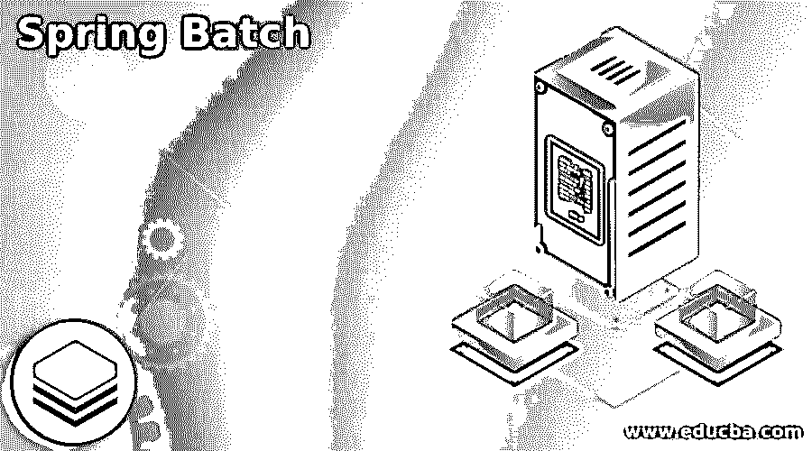
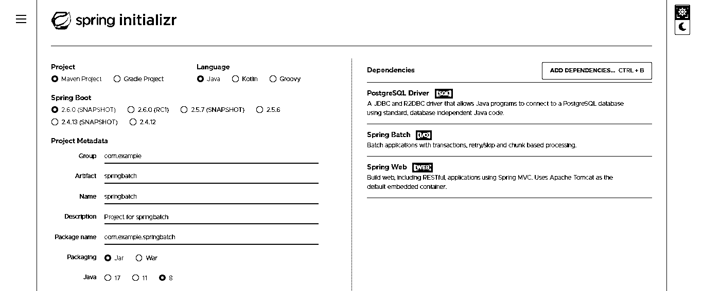
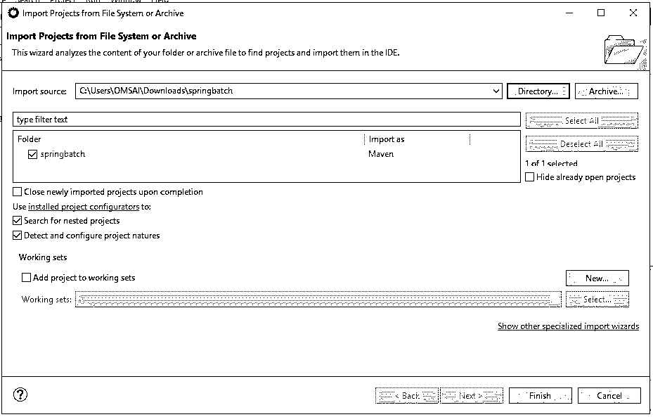
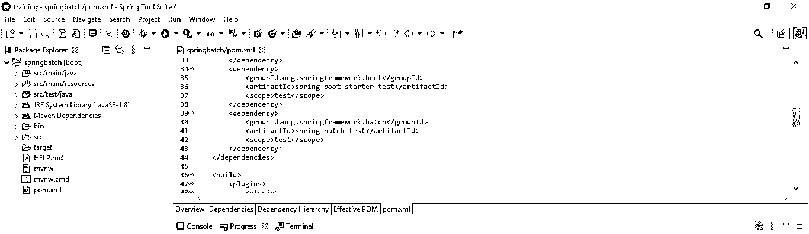
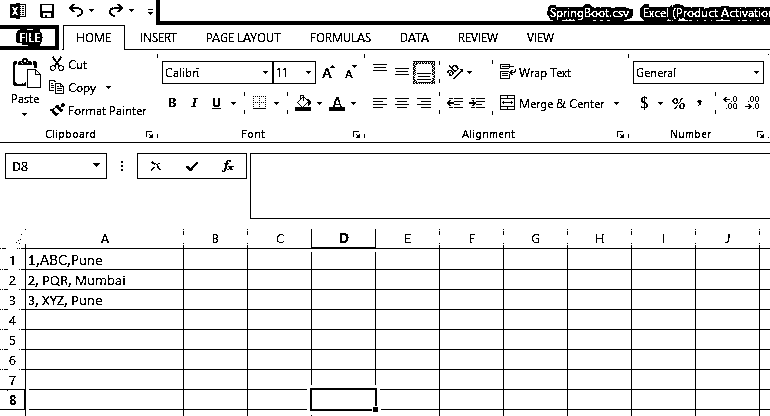
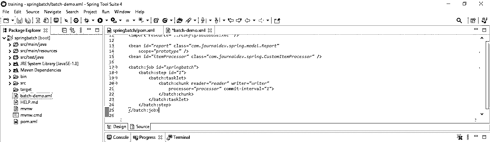
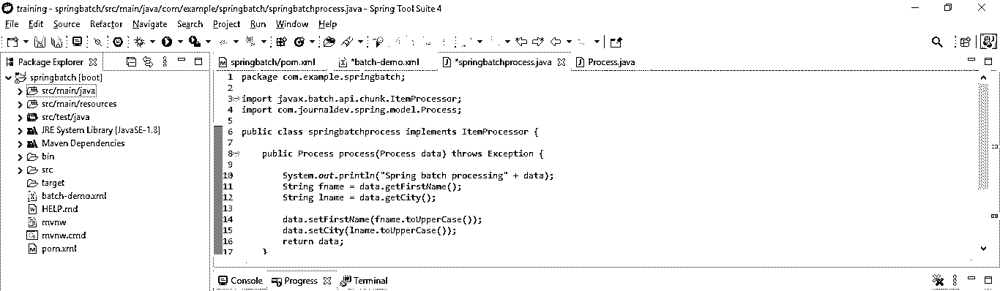
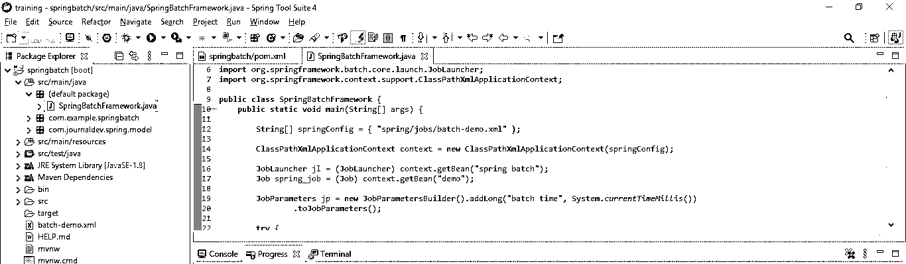
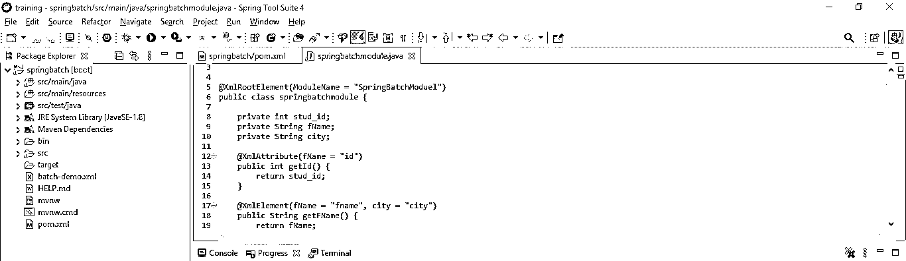
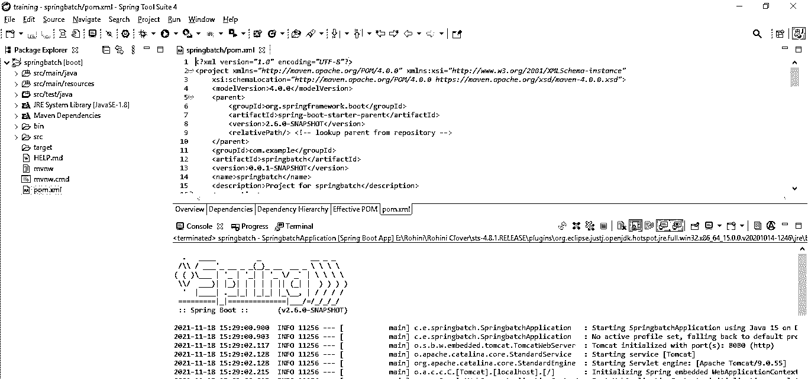

# 春季批次

> 原文：<https://www.educba.com/spring-batch/>

## 春季批次简介

*   它是一个小型框架，用于创建在企业应用程序中使用的批处理应用程序。
*   它是一个轻量级的一体化框架，支持创建对系统日常操作至关重要的可靠批处理应用程序。
*   它具有可重用的函数，用于作业处理统计、日志记录、跳转、事务管理、资源管理和任务重启，这些在处理大型条目时都很重要。

### 什么是春批？

*   它包括更先进的技术能力和服务，如分区和优化技术，允许异常高性能和大批量批处理。
*   复杂和简单的批量作业正在利用该框架来处理大量数据。
*   经典架构使用作业存储库来调度新作业和与现有作业通信。
*   这个任务实现包含多个步骤，每个步骤都处理、读取和写入数据。
*   该框架负责 SQLite 处理的大部分繁重工作。
*   它是一个功能丰富的框架，使得创建可靠的批处理应用程序更加容易。
*   通过其分区和优化方法，它还提供了更先进的技术服务和功能，支持高性能和高容量的批处理操作。
*   在这种处理中，只有一种处理方式，在这种方式下，一系列自动作业被执行，而不需要用户的任何人工干预。
*   此过程将处理大量数据，需要更多时间来完成。
*   它扩展了 Spring 框架的基于 POJO 的开发范式，这是所有开发人员都熟悉的。

### Spring 创建批处理服务

下面的示例显示了如何创建服务。

*   **使用 spring 初始化器**为服务创建项目模板

在下面的步骤中，我们将项目组名称设置为 com.example，工件名称设置为 springbatch，项目名称设置为 springbatch，选择的 java 版本设置为 8。

<small>网页开发、编程语言、软件测试&其他</small>

在下面的项目中，我们选择了 spring web、spring batch 和 PostgreSQL 驱动依赖来实现该项目。

`Group – com.example
Artifact name – springbatch
Name – springbatch
Spring boot – 2.6.0
Project – Maven
Java – 8
Dependencies – spring web, PostgreSQL driver, spring batch.
Package name - com.example.springbatch
Project Description - Project for springbatch`

*   **生成项目后，提取文件，使用 spring 工具套件打开该项目—**

在这一步中使用 spring 初始化器生成项目之后，我们提取 jar 文件并使用 spring 工具套件打开项目。

*   **使用 spring 工具套件打开项目后，检查项目及其文件—**

在这一步中，我们检查所有的项目模板文件。我们还需要检查 maven 依赖项和系统库。

*   **添加依赖包—**

在这一步中，我们将向项目添加一个依赖项。

**代码—**

`<dependency>   -- Start of dependency tag.
<groupId>org.springframework.batch</groupId>   -- Start and end of groupId tag.
<artifactId>spring-batch-test</artifactId>  -- Start and end of artifactId tag.
</dependency>    -- End of dependency tag.`

*   **创建用于处理的 CSV 文件—**

在这一步中，我们将为批处理创建一个 CSV 文件。

**代码—**

1、浦那 ABC

2、PQR、蒙拜 1、ABC、浦那

3、XYZ，浦那

*   **配置春季批次—**

在这一步，我们必须配置如下。

**代码—**

`<batch:job id="springbatch">
<batch:step id="1">
<batch:tasklet>
<batch:chunk reader="reader" writer="writer"
processor="processor" commit-interval="1">
</batch:chunk>
</batch:tasklet>
</batch:step>
</batch:job>`

### 春季批量加工

*   为了进行处理，我们使用项目名作为 spring batch。在这个项目中，我们已经配置了 XML，现在我们如下处理 spring 批处理。
*   在下面的例子中，我们创建了一个类名 springbatchprocess 来处理。

**代码—**

`public class springbatchprocess implements ItemProcessor {
public Process process(Process data) throws Exception {
System.out.println ("Spring batch processing" + data);
String fname = data.getFirstName ();
String city = data.getCity ();
data.setFirstName (fname.toUpperCase ());
data.setCity (lname.toUpperCase ());
return data;
}`

### Spring 批处理框架

*   该框架将包含以下元数据表。所有这些表都与 java 域对象非常匹配。

1.  批处理作业序列
2.  批处理 _ 步骤 _ 执行 _ 序列
3.  批处理 _ 作业 _ 执行 _ 序列
4.  批处理 _ 步骤 _ 执行 _ 上下文
5.  批处理作业执行上下文
6.  批处理 _ 步骤 _ 执行
7.  批处理作业执行参数
8.  批处理作业实例
9.  批处理 _ 鲍勃 _ 执行

*   batch_job_instance 表用于保存与作业实例相关的所有信息。batch_job_execution_params 表用于保存与参数对象相关的所有信息。
*   batch_job_execution 表用于保存与作业执行对象相关的所有信息。
*   batch_step_execution 表用于保存与步骤执行对象相关的所有信息。
*   batch_job_execution_context 表用于保存与执行上下文相关的所有数据。
*   batch_step_execution_context 表用于保存与执行的步骤上下文相关的所有数据。
*   为了开发这个框架，我们使用项目名 spring batch。在这个项目中，我们已经配置了 xml，现在我们创建如下框架。

**代码—**

`public class SpringBatchFramework {
public static void main(String[] args) {
String[] springConfig = { "spring/jobs/batch-demo.xml" };
ClassPathXmlApplicationContext context = new ClassPathXmlApplicationContext(springConfig);
JobLauncher jl = (JobLauncher) context.getBean("spring batch");
Job spring_job = (Job) context.getBean("demo");
try {
JobExecution exec = (JobExecution) jl.run (spring_job, jp);
System.out.println ("Status : " + ((org.springframework.batch.core.JobExecution) exec).getStatus ());
} catch (Exception e) {
e.printStackTrace ();
}
System.out.println ("Completed");
context.close();
}
}`

### 弹簧批处理模块

为了开发这个模块，我们使用项目名 spring batch。

*   **创建模块**

**代码—**

`@XmlRootElement (ModuleName = "SpringBatchModuel")
public class springbatchmodule {
private int stud_id;
private String fName;
@XmlAttribute (fName = "id")
public int getId() {
return stud_id;
}
@XmlElement (fName = "fname")
public String getFName () {
return fName;
}
public void setfName (String fName)
{
this.fName = fName;
}
@Override
public String toString() {
return "Report [stud_id=" + stud_id + ", first_name=" + fName + "]";
}
}`

*   **运行应用程序**

### 结论

它是一个功能丰富的框架，使得创建可靠的批处理应用程序更加容易。Spring 批处理任务实现包含多个步骤，每个步骤都处理、读取和写入数据。它是一个小型框架，用于创建在企业应用程序中使用的批处理应用程序。

### 推荐文章

这是春批指南。这里我们讨论什么是 spring batch，以及创建 Spring Batch 服务及其处理和模块的例子。您也可以看看以下文章，了解更多信息–

1.  [Spring Boot 码头工人](https://www.educba.com/spring-boot-docker/)
2.  [Spring Boot 首发母公司](https://www.educba.com/spring-boot-starter-parent/)
3.  [春批架构](https://www.educba.com/spring-batch-architecture/)
4.  Spring Boot·HTTPS

